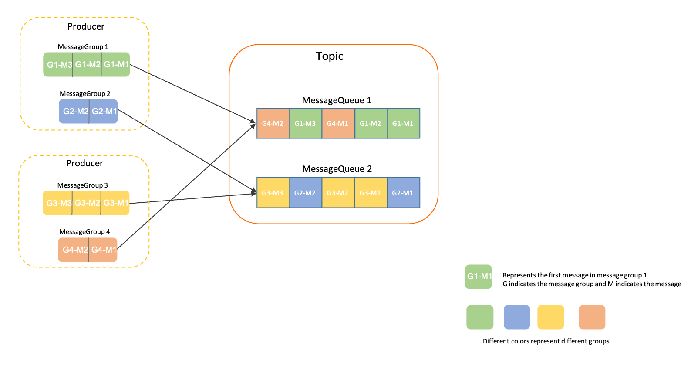

甲蛙2306项目学习笔记，中间件部分结合了黑马商城里的教学内容，中间件部分是从其他地方整理的


# 设计

## 概要

### 技术

- 后端：Springboot3（JDK17）
- 前端：Vue CLI5 + Vue3
- 高并发技术：
  - 前端：CDN分流；
  - 后端：分布式缓存；
  - 前后端两层验证码；
  - 限流技术、令牌技术、分布锁、异步削峰、排队机制、分布式事务

### 项目特点

- 特点

  - 动态库存
    - 一段路可能卖多张票

  - 选座

  - 线上和线下购买

  - 高并发设计
    - 持续刷票，没票也会有很高的并发性
    - 杜绝超卖

  - 一天多次放票，多次高峰

- 解决忙碌
  - 提高QPS/TPS
    - 硬件
    - Gemfire（一个分布式内存数据库）
    - 改进算法
  - 削峰
    - 业务
      - 验证码
      - 分时段放票
      - 排队
    - 技术
      - 限流
      - 异步


### 模型设计？

- 余票查询（原子性）

  - 记录站to站余票
    - 5个站有$C_{5}^{2} = 10$个站to站票
    - 例如ABCDE站有2张票，选了AB，再选AD就只要1张票了，如果再选DE则有2张票；注意选了AB和DE后，还可以再选AD...
    - 不能单纯地把买了之后所在的区间的库存-1，可能会导致少卖

- 座位购买（原子性）

  - 记录每个座位的销售详情
    - 例如ABCED站，4个区间，都有票则可以记为0000

  

### 核心功能


### 模块划分

- **gatway** 网关模块
  - 路由转发
  - 登录校验
- **member** 会员模块
  - 会员、乘客、已购买的车票
- **business** 业务模块
  - 所有的车次数据
  - 余票信息
- **batch** 跑批模块（定时任务模块）
  - 管理定时任务，界面启停
- web 模块
  - 会员相关界面
- admin 模块
  - 管理员相关界面

核心：余票查询，可以考虑做一个模块，为其分配更多资源（本项目没有）


### 系统架构设计

- 会员、业务、跑批分别对应一个单独的数据库

- 第三方服务（后3个都是SpringCloud Alibaba的微服务组件）
  - redis - 缓存
  - rocketmq - 异步削峰
  - nacos - 配置中心
  - seata - 分布式事务（例如同时在2个不同模块保存一段数据）
  - sentinel - 限流


### 持续秒杀高并发

- 前端
  - CDN（内容分发网络）
    - 不同用户从不同地区的结点获取资源
  - 页面静态化
  - 倒计时
    - 减少用户不断刷新页面的行为
  - Loading界面
    - 防止用户点击提交按钮后在加载过程中不断点击提交按钮
  - 验证码削峰 
    - 不同人做验证码的时间不一样
- 后端
  - 微服务-服务拆分
    - 按模块拆分
    - 热点接口做成单独服务，例如真正12306的余票查询
  - 负载均衡
    - 多个结点
  - 限流降级
    - 限制流量+后备服务方案防止某个服务不可用
  - 缓存
    - 本地缓存
    - 分布式缓存
    - 需注意“缓存击穿、缓存穿透、缓存雪崩”
  - 令牌
    - 防机器人
  - 异步处理
- 数据库
  - 分库
    - 业务分库
    - 读写分离（热点数据）
  - 分表
    - 横向分表：按地区、时间等分
    - 纵向分表：切开表
  - 冗余设计（反范式）
    - 空间换时间
  - 分布式数据库
    - 例如真正12306的Gemfire
- 其他
  - 分时段秒杀
  - 弹性扩容
  - 候补+排队


## 模块设计

### 根目录pom

项目根目录下的`pom.xml`用来管理，主要把依赖放在dependencyManagement中：

```xml
<dependencyManagement>
	<dependency>
		...
	</dependency>
</dependencyManagement>
```

不过按照教程，各模块也要引入相同的依赖，只是不需要写版本号


### common模块

将公共需要用到的依赖全放在common的pom里面，然后其他模块引入common，包括根目录的pom（不过根目录的需要加版本号，其他的不用）

```xml
<!-- 引入common模块 -->
<dependency>
    <groupId>com.criel</groupId>
    <artifactId>common</artifactId>
    <version>0.0.1-SNAPSHOT</version>
</dependency>
```

这样其他模块就可以使用common里添加的依赖，使用common里的类、配置等


### generator模块

使用mybatis官方代码生成器，连接数据库后可以自动生成CRUD方法。

- 引入依赖（是一个插件）：

  - ```xml
    <build>
        <plugins>
            <!-- mybatis generator 自动生成代码插件 -->
            <plugin>
                <groupId>org.mybatis.generator</groupId>
                <artifactId>mybatis-generator-maven-plugin</artifactId>
                <version>1.4.0</version>
                <configuration>
                    <configurationFile>src/main/resources/generator-config-member.xml</configurationFile>
                    <!--<configurationFile>src/main/resources/generator-config-batch.xml</configurationFile>-->
                    <!--<configurationFile>src/main/resources/generator-config-business.xml</configurationFile>-->
                    <overwrite>true</overwrite>
                    <verbose>true</verbose>
                </configuration>
                <dependencies>
                    <dependency>
                        <groupId>mysql</groupId>
                        <artifactId>mysql-connector-java</artifactId>
                        <version>8.0.30</version>
                    </dependency>
                </dependencies>
            </plugin>
        </plugins>
    </build>
    ```

- 创建配置文件`resources/generator-config-member.xml`
  - 在里面配置数据库连接（地址、用户名、密码等）
  - 配置类、mapper，xml文件生成的位置等....

- 启动：

  - 


## 数据库表设计
### 数据库表

部分内容做了冗余，可以方便不用一次查询多张表


约定：数据库中的序号，如站序、座位在车厢内的序号等，都是**从1开始**

- 数据库**train_member**
  - 乘车人表
    - passenger
  - 用户表
    - member
  - 购票信息（已购车票）
    - ticket
- 数据库**train_business**
  - 每日数据表
    - daily_train 每日车次
    - daily_train_carriage 每日车厢
    - daily_train_station 每日车次对应车站
    - daily_train_seat 每日座位
      - **sell**列，用0和1表示每个区间是否已经售出，例如5个站，则4个区间，若一二站区间售出了，那么就是**”1000“**
    - daily_train_ticket 每日余票
      - 记录了某日某车次，从某站到某站这个区间，某个类型还有多少余票（**区间内的余票信息**）
      - 相当于对daily_train_seat中的sell列单独做了一张表（行转列），实际上是缓存的功能，真正的12306将类似这个表的信息放在Gemfire中（相当于内存版的mysql）
      - redis做不到，所以这里就放在mysql里面了
  - 基本数据表
    - train 车次
    - station 车站 
    - train_carriage 车厢
    - train_seat 座位
    - train_station 车次对应车站
  - 订单表
    - confirm_order 用户提交的订单
      - 包含订单状态，默认未成功
      - 关联上daily_train_ticket
      - 可用于统计，统计什么时段是高峰期，什么车次买的人多等


## Quartz定时任务设计

定时任务用于生成15日后的数据，基本功能是**根据指定日期生成数据**，有以下2种情况

- 默认生成15天后的数据
- 前端指定日期生成


## 前后端选座购票

### 逻辑

选则座位位置的条件：

- 只有全部是一等座或全部是二等座才支持选座（同12306）
- 余票小于一定数量（本项目中为20）时，不允许选座

前端选座：


得到的数据如下（一等座为例）：

```javascript
{
    A1: false, C1: true, D1: false, F1: false,
    A2: false, C2: false. D2: true, F2: false
}
```

需要读取其true的部分提交给后端

最终**购票信息**提交给后端的数据如下：

```javascript
{
    passengerId: 123,
    passengerType: "1",
    passengerName: "张三",
    passengerIdCard: "12323132132",
    seatTypeCode: "1",
    seat: "C1" // 可为空
}
```

**后端**对于每个车厢，需要有形如下图的数据：


座位的`sell`字段是形如`011001`这样的，那么只需要判断用户所选的车站区间内是否有`1`，全为`0`则表示该座位可卖。确定好数据后，就遍历车厢里的座位，合适的位置选中即可。


### 代码细节

后端的遍历操作中：假设有2个座位，只需要确定2个座位之间的**偏移值**即可（每个座位有对应的序号），例如选了`A1`和`C2`，那么`C2的序号 = A1的序号 + 5`

前后端校验：前端在**订单页面**可以选择多个乘车人，若此时一等座余票为2，选了3个乘车人坐一等座，则通过**前端校验**直接弹出提示说余票不足，前端校验通过后，提交数据到后端再在**后端校验**


## 令牌大闸防刷票

创建令牌表，记录某日期，某车次的令牌余量

```sql
create table sk_token
(
    id          bigint      not null comment 'id'
        primary key,
    date        date        not null comment '日期',
    train_code  varchar(20) not null comment '车次编号',
    count       int         not null comment '令牌余量',
    create_time datetime(3) null comment '新增时间',
    update_time datetime(3) null comment '修改时间',
    constraint date_train_code_unique
        unique (date, train_code)
)
    comment '秒杀令牌';
```

生成对应的controller,service等，新增生成每日令牌的方法，然后在生成每日数据的方法中，调用生成令牌的方法；


## 防缓存击穿&穿透

自己设计的，用逻辑过期 + 布隆过滤器的方式，在用户做车票分页查询的时候使用。

首先用户发起的车票查询请求包括3个字段：**日期，出发站，到达站**，而且由于这三个数据确定后的车次数量不会超过几百，因此直接设置缓存的key为**`daily:ticket:{date}:from:{start}:to:{end}`**，虽然是分页查询，但是缓存里面缓存完整的数据，后端返回的时候再去封装`PageResp`对象。

由于数据会快速地被修改，逻辑过期时间设置为**5s**，redis数据本身不设置过期时间。

关于布隆过滤器：

- 为了保证在放票预热时和后续查询时都能使用同一个布隆过滤器，需要将布隆过滤器封装在一个 Spring 管理的 Service（例如` BloomFilterService`）中，在放票预热的类中注入该 Service，将 Key 添加进去；查询接口同样注入该 Service 调用 contains 方法来判断。
- 在使用 Redisson 的 RBloomFilter 时，其底层数据实际上存储在 Redis 中，所以只要 Redis 配置了持久化（例如 RDB 或 AOF），布隆过滤器的数据就会保存在 Redis 中，**不会因为应用重启而丢失**。但如果 Redis 数据丢失或被清空，布隆过滤器自然也会失效。

**具体流程**：

- 提前准备数据：首先程序在每天的放票阶段，需要将所有数据缓存到redis中，并初始化布隆过滤器，这些做成定时任务（项目里就写成一个在控台手动控制的方法了）

- 数据请求

  - 当数据为空时，被布隆过滤器快速拒绝，返回空的PageResp;
  - 当数据存在时，直接返回数据；

  - 当数据过期时，也直接返回数据，然后先获取分布式锁，用**线程池**提交一个任务，去查数据库并更新缓存；

- 在用户提交订单时，会更新数据库中的余票信息，更新完后要更新redis


## 排队购票

1. 前端提交购票申请，后端接收到后生成一个订单，订单状态设为`INIT初始化`并保存；

2. 接着向**MQ**传递信息，内容为：`date日期` + `trainCode车次编号`

3. **MQ**消费者接收消息，按照`date` + `trainCode`来处理订单

   - 首先消费者线程抢占**分布式锁**，`key`内容由`date` + `trainCode`构造，也就是相同日期相同车次的线程中，同一时间内只有一个线程可以进入，**它会把所有的对应日期车次的订单都处理完**；

     - 失败则直接return，成功则继续执行以下逻辑：
     - 需要查出`confirm_order`订单表中所有日期为`date`，车次编号为`trainCode`，状态为`INIT`的订单，得到`confirmOrderList`

   - 使用`while(true)`循环，每次查出一定数目的订单，例如：

     - ```java
       // 每次循环最多查询5条数据
       PageHelper.startPage(1, 5);
       List<ConfirmOrder> confirmOrderList = confirmOrderMapper.selectByExampleWithBLOBs(confirmOrderExample);
       ```

   - 针对`confirmOrderList`中的每一条数据，依次执行购票逻辑（包括校验库存，更新订单状态，更新daily_train_ticket等）

4. 前端在购票请求后，按照一定的时间间隔轮询订单状态

   - 当订单状态为`SUCCESS`、`FAILURE`、`EMPTY无票`等最终状态时结束；
   - 当订单状态为`INIT初始化`、`PENDING处理中`等中间状态时，返回当前排队人数/；

**关于分布式锁：**

- 如果不加锁，那么多个线程可能去查到相同的订单数据，对同一个订单做了买票操作，就可能出现超卖；
- 由于锁是加在同一日期同一车次上的，所以不同车次之间其实是不影响的；


# 技术相关

## 日志格式

在resources下创建logback-spring.xml，具体内容一般复制就行了

- 可以配置控制台输出日志的格式
- 可以将日志生成在指定目录下，例如`./log/模块名/`


## HttpClient

创建一个`.http`文件，内容例如：

```
GET http://localhost:8001/member/hello
Accept: application/json

###

GET http://localhost:8000/member/hello
Accept: application/json

###
```

在IDEA提供的工具中，可以直接点击所写地址发送请求（低配postman?）


## 模块管理

按照以下步骤构建maven模块层级结构：


### 最外层

`<parent>`部分引入spring-boot启动包，配置包信息

```xml
<parent>
    <groupId>org.springframework.boot</groupId>
    <artifactId>spring-boot-starter-parent</artifactId>
    <version>3.4.3</version>
    <relativePath/> <!-- lookup parent from repository -->
</parent>

<!-- 包信息 -->
<groupId>com.criel</groupId>
<artifactId>train-12306</artifactId>
<version>0.0.1-SNAPSHOT</version>
```

设置pom包管理模式：

```xml
<packaging>pom</packaging>
```

使用`<dependencyManagement>` 管理依赖，这里需要**加上版本信息**：

```xml
<dependencyManagement>
    <dependencies>
        <dependency>
            <groupId>org.springframework.cloud</groupId>
            <artifactId>spring-cloud-dependencies</artifactId>
            <version>${spring-cloud.version}</version>
            <type>pom</type>
            <scope>import</scope>
        </dependency>
	...
</dependencyManagement>
```

使用`<modules>`**引入子模块**，指明其`artifactId`，父模块和子模块都做好配置后才可以互相关联上：

```xml
<modules>
    <module>common</module>
    <module>gateway</module>
    ...
</modules>
```


### 子模块

`<parent>`部分引入父模块的包信息，配置`<artifactId>`

```xml
<parent>
    <groupId>com.criel</groupId>
    <artifactId>train-12306</artifactId>
    <version>0.0.1-SNAPSHOT</version>
</parent>

<!-- 包信息。只需要这一个 -->
<artifactId>gateway</artifactId>
```


## 配置文件的加载

如果引用了依赖，也就是别的jar包，那么其中的`application.properties`也将发挥作用，这时就有多个配置文件的优先级需要考虑：

1. `file:./config/`（外部 config 目录）
2. `file:./`（项目根目录）
3. `classpath:/config/`（即 resources/config/）
4. `classpath:/`（即 resources/）

并且有以下规则：

- 多个 `application.properties` 会被合并，而不是只取其中一个
- 相同的配置项，优先级高的会覆盖优先级低的
- 不同的配置项都会保留，最终形成完整的配置


## 配置日志级别

```properties
# 把mapper包的日志级别改成trace
logging.level.com.criel.train.business.mapper=trace
```

这个配置会使 `com.criel.train.business.mapper` 包内的所有日志记录（包括 trace、debug、info 等）中，最详细的 trace 信息都被输出，从而帮助开发人员更好地理解和调试代码执行过程。


## 通用返回对象

项目里用的是`public class CommonResp<T>`，其实就是`Result<T>`，教程里太麻烦了，改了一下，加了3个静态方法


## 异常处理

### 统一异常处理

- 创建一个类，加上`@ControllerAdvice`注解，其会拦截带有`@Controller`或`@RestController`的类里面抛出的异常；
- 用`@@ExceptionHandler(value = Exception.class)`注解处理对应的异常类

```java
@ExceptionHandler(value = Exception.class)
@ResponseBody
public CommonResp exceptionHandler(Exception e) {
    LOG.error("系统异常：", e);
    return CommonResp.error("系统出现异常，请联系管理员");
}
```


### 自定义异常

其实感觉教程里不够规范，不过先按照教程来吧

定义**业务异常**枚举类：

```java
public enum BusinessExceptionEnum {

    MOBILE_IS_EXIST("手机号已被注册");
    // 增加其他异常情况

    private String desc;

    BusinessExceptionEnum(String desc) {
        this.desc = desc;
    }

    public String getDesc() {
        return desc;
    }
}
```

定义业务异常类，用来抛出异常：

```java
@EqualsAndHashCode(callSuper = true) // 见下面的tip
@Data
public class BusinessException extends RuntimeException{

    private BusinessExceptionEnum anEnum;

    public BusinessException(BusinessExceptionEnum anEnum) {
        this.anEnum = anEnum;
    }
}
```

tip：异常类继承了 `Exception` 或 `RuntimeException`，而 `@Data` 默认会为 `equals()` 和 `hashCode()` 方法重新生成实现，但不会调用父类（`Exception`）的方法。 这样可能导致 异常对象的比较和哈希计算丢失了父类的逻辑

抛出异常：

```java
throw new BusinessException(BusinessExceptionEnum.MOBILE_IS_EXIST);
```


## 校验框架Validation

依赖：

```xml
<dependency>
    <groupId>org.springframework.boot</groupId>
    <artifactId>spring-boot-starter-validation</artifactId>
</dependency>
```

对VO类的特定字段添加注解

```java
@Data
public class MemberRegisterReq {
    @NotBlank(message = "手机号不能为空")
    String mobile;
}
```

请求参数加上注解`@Valid`（在纯 Java 环境下，可以使用 `ValidatorFactory` 与 `Validator` 来手动触发校验；而在 Spring Boot 中，通过 `@Valid` 或 `@Validated` 注解自动集成。）

```java
@PostMapping("/register")
public CommonResp<Long>  register(@Valid MemberRegisterReq req) {
    Long memberId = memberService.register(req);
    return CommonResp.success(memberId);
}
```


## 雪花算法

雪花算法由推特开源；

### 基本组成

雪花算法利用位运算将时间戳、机器标识和序列号组合成一个 64 位长整型 ID，能在**分布式环境**下高效生成全局唯一且大致有序的 ID。

- 雪花算法生成的 ID 通常由四部分组成：

  - **符号位（1 位）**
    - 固定为 0，保证生成的 ID 为正数。

  - **时间戳（41 位）**
    - 表示从某个固定起始时间（纪元）到当前时间的毫秒数。这 41 位能覆盖约 **69 年**的时间范围，同时也保证了生成的 ID 随时间单调递增。

  - **机器标识（10 位）**
    - 通常分为数据中心 ID 和机器 ID（各 5 位），这意味着可以支持最多 1024 个不同节点。通过为每台机器配置唯一的标识，保证分布式系统中各节点生成的 ID 不会冲突。

  - **序列号（12 位）**
    - 在同一毫秒内，同一节点可生成最多 4096 个不同的 ID。当同一毫秒内生成的 ID 超过最大序列数时，算法会等待到下一毫秒。

- 这种设计既保证了全局唯一性，也能在分布式环境下保持较高的生成性能与顺序性

使用**hutool**提供的方法可以直接生成：

```java
IdUtil.getSnowflake(workerId, dataCenterId).nextId()
```


### 机器ID分配

有以下一些方案：

- 写死的配置文件中
  - 其实也可以写在配置中心
- 通过IP等信息计算得出机器号

- 使用Redis动态分配机器号（常用，或者zookeeper）：
  - 在 Redis 中维护一个机器号池，应用启动时从中获取机器号，并设置过期时间；应用正常关闭时，释放机器号；应用异常退出时，Redis 会在过期后自动释放机器号。
  - 可以用`zset`预先存放很多机器ID，score可以用当前时间戳的值（表示最后一次被回收的时间，越近被使用的优先级越高）；
  - 回收方法：
    - 当机器上线时，从`zset`中获取机器ID（保存在本地的一个wokerId文件），并从中删除；同时添加进另一个`zset`，存储已经分配的ID；再同时添加一个`string`类型的数据，并设置一定的过期时间；
    - 机器每隔一定的时间向redis中的`string`数据续期；
    - 之后用单独的机器/每台机器嵌入服务，来做定期回收，检测redis中例如 `workerid:serviceA` 这样的数据是否还存在，不存在则将数据从"已分配ID"的`zset`中删除，添加到存储机器ID的`zset`；


### 时钟回拨问题

由于雪花算法是基于时间戳的，当机器发生时钟回拨时，就有可能产生重复的ID；

没有特别好的解决方法，大致有：

- 预发布ID

  - 在一个服务里预先生成很多ID，其他服务需要时再去获取，就不会出现重复问题了；
  - 可以参考美团Leaf的解决方案：https://tech.meituan.com/2019/03/07/open-source-project-leaf.html

- 逻辑时钟（保证自增）

  - ```java
    private volatile long logicalTimestamp;
    private final AtomicLong sequence = new AtomicLong(0);
    
    public long nextId() {
        long currentSystemTime = System.currentTimeMillis();
        
        // 逻辑时钟 = max(系统时间, 逻辑时钟)
        if (currentSystemTime >= logicalTimestamp) {
            logicalTimestamp = currentSystemTime;
        } else {
            logicalTimestamp++; // 时钟回拨时逻辑时钟递增
        }
        
        // 使用逻辑时钟生成ID
        return ((logicalTimestamp - START_EPOCH) << TIMESTAMP_SHIFT) |
               (workerId << WORKER_ID_SHIFT) |
               sequence.getAndIncrement();
    }
    ```

- 将机器ID的3-4位拿出来做回拨计数（不太好用，无法保证自增）

  - 每次回拨就加1，如果是3位，一共有8次；
  - 如果8次够用，可以保证新的ID不会和旧的ID重复，但是不能保证新的ID > 旧的ID


## 配置跨域请求

在gateway模块的配置文件添加如下配置即可：

```properties
# 允许请求来源（老版本叫allowedOrigin）
spring.cloud.gateway.globalcors.cors-configurations.[/**].allowedOriginPatterns=*
# 允许携带的头信息
spring.cloud.gateway.globalcors.cors-configurations.[/**].allowedHeaders=*
# 允许的请求方式
spring.cloud.gateway.globalcors.cors-configurations.[/**].allowedMethods=*
# 是否允许携带cookie
spring.cloud.gateway.globalcors.cors-configurations.[/**].allowCredentials=true
# 跨域检测的有效期（在这段时间内，浏览器不会对同一跨域请求再次发起预检请求，而是直接使用缓存的结果进行后续的请求操作）
spring.cloud.gateway.globalcors.cors-configurations.[/**].maxAge=3600
```


## JWT

JSON Web Token 简单点说JWT就是一种网络身份认证和信息交换格式。

具体讲解看https://javaguide.cn/system-design/security/jwt-intro.html

**结构：**

- `Header` 头部信息，主要声明了JWT的签名算法等信息

  - ```json
    {
      "alg": "HS256", // 签名算法
      "typ": "JWT" // 令牌类型
    }
    ```

- `Payload` 载荷信息（负载信息），主要承载了各种声明并传递明文数据
- `Signature` 签名，拥有该部分的JWT被称为JWS，也就是签了名的JWT，用于校验数据

  - 服务器通过 `Payload`、`Header` 和一个密钥`secret`，使用 Header 里面指定的签名算法（默认是 HMAC SHA256）生成

  - ```java
    HMACSHA256(
      base64UrlEncode(header) + "." +
      base64UrlEncode(payload),
      secret);
    ```


整体结构是：

```text
header.payload.signature
```

项目使用hutool提供的方法，具体看https://doc.hutool.cn/pages/jwt/#jwt%E7%94%9F%E6%88%90

创建自己的工具类`JwtUtil`，里面使用hutool的`JWTUtil`，传入map、签名、过期时间

```java
/**
 * 生成token
 * @param payload 数据，例如："id": 123
 * @param key 签名key
 * @param exp 过期时间
 * @return
 */
public static String createToken(Map<String, Object> payload, String key, int exp) {
    DateTime now = DateTime.now();
    // 过期时间
    DateTime expTime = now.offsetNew(DateField.MILLISECOND, exp);
    // 设置签发时间
    payload.put(JWTPayload.ISSUED_AT, now);
    // 设置过期时间
    payload.put(JWTPayload.EXPIRES_AT, expTime);
    // 设置生效时间
    payload.put(JWTPayload.NOT_BEFORE, now);
    String token = JWTUtil.createToken(payload, key.getBytes());
    return token;
}

/**
 * 校验token
 * @param token
 * @param key
 * @return
 */
public static boolean validate(String token, String key) {
    try {
        JWT jwt = JWTUtil.parseToken(token).setKey(key.getBytes());
        // validate包含了verify
        boolean validate = jwt.validate(0);
        return validate;
    } catch (Exception e) {
        return false;
    }
}

/**
 * 根据token获取原始内容
 * @param token
 * @param key
 * @return
 */
public static JSONObject getJSONObject(String token, String key) {
    JWT jwt = JWTUtil.parseToken(token).setKey(key.getBytes());
    JSONObject payloads = jwt.getPayloads();
    payloads.remove(JWTPayload.ISSUED_AT);
    payloads.remove(JWTPayload.EXPIRES_AT);
    payloads.remove(JWTPayload.NOT_BEFORE);
    return payloads;
}
```

使用拦截器，获取jwt中的信息，存储用户信息到ThreadLocal

```java
/**
 * 在请求处理之前进行调用：存储用户信息到ThreadLocal
 */
@Override
public boolean preHandle(HttpServletRequest request, HttpServletResponse response, Object handler) throws Exception {
    // 获取header的token参数
    String token = request.getHeader("token");
    if (StrUtil.isNotBlank(token)) {
        LOG.info("获取会员登录token：{}", token);
        
        JSONObject loginMember = JwtUtil.getJSONObject(token, jwtProperties.getMemberSecretKey());
        
        LOG.info("当前登录会员：{}", loginMember);
        
        MemberLoginResp memberLoginResp = JSONUtil.toBean(loginMember, MemberLoginResp.class);
        LoginMemberContext.setMember(memberLoginResp);
    }
    return true;
}
```

在网关创建jwt拦截器，可以从请求头中获取前端传来的token

```java
/**
 * 登录会员jwt拦截器
 */
@Component
public class LoginMemberFilter implements Ordered, GlobalFilter {

    private static final Logger LOG = LoggerFactory.getLogger(LoginMemberFilter.class);

    @Autowired
    private JwtProperties jwtProperties;

    @Override
    public Mono<Void> filter(ServerWebExchange exchange, GatewayFilterChain chain) {
        String path = exchange.getRequest().getURI().getPath();

        // 排除不需要拦截的请求：管理员、测试接口、登录接口、获取验证码接口
        if (path.contains("/admin")
                || path.contains("/test-connect")
                || path.contains("/member/member/login")
                || path.contains("/member/member/code")) {
            LOG.info("排除不需要登录验证的请求：{}", path);
            return chain.filter(exchange);
        } else {
            LOG.info("拦截到需要登录验证的请求：{}", path);
        }
        
        // 获取header的token参数
        String token = exchange.getRequest().getHeaders().getFirst("token");
        LOG.info("会员登录验证开始，token：{}", token);
        if (token == null || token.isEmpty()) {
            LOG.info("token为空，请求被拦截");
            // 返回码401：无权限
            exchange.getResponse().setStatusCode(HttpStatus.UNAUTHORIZED);
            // 中断请求
            return exchange.getResponse().setComplete();
        }

        // 校验token是否有效，包括token是否被改过，是否过期
        boolean validate = JwtUtil.validate(token, jwtProperties.getMemberSecretKey());
        if (validate) {
            LOG.info("token有效，放行该请求");
            return chain.filter(exchange);
        } else {
            LOG.warn("token无效，请求被拦截");
            // 返回码401：无权限
            exchange.getResponse().setStatusCode(HttpStatus.UNAUTHORIZED);
            return exchange.getResponse().setComplete();
        }
    }

    /**
     * 拦截器的优先级设置
     * 值越小，优先级越高
     * @return
     */
    @Override
    public int getOrder() {
        return 0;
    }
}
```


## 配置类

是学苍穹外卖的，顺便记在这里了

这样就能自动读取配置信息，然后在需要的地方用`@Autowired`引入JwtProperties，用get方法获取对应信息

```java
@Component
@Data
@ConfigurationProperties("train.jwt")
public class JwtProperties {
    private String memberSecretKey;
    private int memberTtl;
}
```

```properties
# jwt相关配置
train.jwt.member-secret-key=criel12306
# token过期时间：2小时
train.jwt.member-ttl=7200000
```


## ThreadLocal

线程上下文类，用ThreadLocal来管理用户信息（这里用MemberLoginResp，也就是VO来存，其实直接Member应该也可以）

这里跟苍穹外卖不一样，直接存了对象，而不是只存long类型的数据；在[拦截器](#拦截器HandlerInterceptor)中使用

**注意：**当一个 HTTP 请求进入 Spring Boot 应用时，服务器（如 Tomcat、Jetty 或 Undertow）会从线程池中分配一个线程来处理该请求。

- 这个线程会**依次执行拦截器、Controller、Service** 等各个组件的逻辑。
- 因此，在拦截器中调用 ThreadLocal 的 set() 方法保存的数据，后续在同一请求链中的 Controller 或 Service 调用 get() 时能够拿到数据，因为它们处于同一个线程中。

其他内容：

- **单个 ThreadLocal 实例只能存一个数据**（每个线程中）。
- **多次调用 set() 会覆盖旧值**。
- **要存多个数据，可以创建多个 ThreadLocal 实例（可以不同泛型）或者存储一个容器对象**。

```java
/**
 * 线程上下文
 * 主要用来获取ThreadLocal中的member信息
 */
public class LoginMemberContext {
    private static final Logger LOG = LoggerFactory.getLogger(LoginMemberContext.class);

    private static ThreadLocal<MemberLoginResp> member = new ThreadLocal<>();

    public static MemberLoginResp getMember() {
        return member.get();
    }

    public static void setMember(MemberLoginResp member) {
        LoginMemberContext.member.set(member);
    }

    public static Long getId() {
        try {
            return member.get().getId();
        } catch (Exception e) {
            LOG.error("获取登录会员信息异常", e);
            throw e;
        }
    }
}
```


## 拦截器HandlerInterceptor

实现HandlerInterceptor接口，重写方法，这里重写的是在请求处理之前进行调用的方法，方法里解析token，然后把用户id存到ThreadLocal里

```java
/**
 * 用户登录拦截器
 */
@Component
public class MemberInterceptor implements HandlerInterceptor {

    private static final Logger LOG = LoggerFactory.getLogger(MemberInterceptor.class);

    @Autowired
    private JwtProperties jwtProperties;

    /**
     * 在请求处理之前进行调用：存储用户信息到ThreadLocal
     */
    @Override
    public boolean preHandle(HttpServletRequest request, HttpServletResponse response, Object handler) throws Exception {
        // 获取header的token参数
        String token = request.getHeader("token");
        if (StrUtil.isNotBlank(token)) {
            LOG.info("获取会员登录token：{}", token);
            JSONObject loginMember = JwtUtil.getJSONObject(token, jwtProperties.getMemberSecretKey());
            LOG.info("当前登录会员：{}", loginMember);
            MemberLoginResp memberLoginResp = JSONUtil.toBean(loginMember, MemberLoginResp.class);
            LoginMemberContext.setMember(memberLoginResp);
        }
        return true;
    }

}
```


## 分页查询

引入PageHelper

```xml
<dependency>
    <groupId>com.github.pagehelper</groupId>
    <artifactId>pagehelper-spring-boot-starter</artifactId>
    <version>1.4.6</version>
</dependency>
```

在正常的**查询语句前面**加上`PageHelper.startPage(页码, 页大小)`，然后可以用`PageInfo`获取对应信息；

原理就是它会自动在下一条`select`语句后面加上`limit`

```java
PageHelper.startPage(passengerQueryReq.getPage(), passengerQueryReq.getSize());
List<Passenger> passengerList = passengerMapper.selectByExample(passengerExample);
PageInfo<Passenger> pageInfo = new PageInfo<>(passengerList);

LOG.info("分页查询：总条数：{}, 总页数：{}", pageInfo.getTotal(), pageInfo.getPages());
```


## Springboot内置调度

使用`@EnableScheduling`注解和`@Scheduled`注解实现

**缺点：**

- **适合单体应用，不适合集群**，其任务执行完全依赖 **Spring 容器的生命周期**，不涉及外部的任务协调机制，也 **没有任务持久化** 机制。
  - 由于 `@Scheduled` 任务是**每个实例**都独立运行的，所以**每个实例都会触发定时任务**，导致任务被**重复执行多次**，除非用分布式锁。
- 无法**实时更改**定时任务状态和定时策略
  - 例如需要临时暂停、调整等

```java
import org.springframework.scheduling.annotation.EnableScheduling;
import org.springframework.scheduling.annotation.Scheduled;
import org.springframework.stereotype.Component;

@Component
@EnableScheduling
public class MyScheduledTask {

    // 每隔5秒执行一次
    @Scheduled(fixedRate = 5000)
    public void fixedRateTask() {
        System.out.println("fixedRateTask: " + System.currentTimeMillis());
    }

    // 上一次执行完毕后等待5秒再执行
    @Scheduled(fixedDelay = 5000)
    public void fixedDelayTask() {
        System.out.println("fixedDelayTask: " + System.currentTimeMillis());
    }

    // 使用cron表达式：每天中午12点执行一次
    @Scheduled(cron = "0 0 12 * * ?")
    public void cronTask() {
        System.out.println("cronTask: " + System.currentTimeMillis());
    }
}
```


## 分布式锁

超卖问题：

在买票的代码中（具体是`ConfrimOrderService`的`confirm`方法），首先查询数据库，获取`dailyTrainTicket`的信息，通过这里面的信息查询余票是否足够，如果不足则抛出异常，然后走到下面的选座买票代码；

这个过程中。如果多个线程同时进来查询余票是否足够，就会出现超卖的情况，例如都查到余票数量为1，那么都进去选座了，就超卖了。

### synchronized锁

给`confirm`方法加上synchronized后，如果是单机的情况，可以解决超卖的问题，但是效率、TPS会变得很低；而在多节点的情况下，synchronized就没用了。

### redis分布式锁

本质上就是redis的`setnx`命令，八股里也有，这里的`setIfAbsent`方法就是这个命令，返回是否set成功

以下是一个分布式锁的基本实现（实际开发并不会这样写，仅供参考）：

```java
// 分布式锁
String lockKey = req.getTrainCode() + req.getDate();
// getLock为true则抢到锁
Boolean getLock = redisTemplate.opsForValue().setIfAbsent(lockKey, "lock", 5, TimeUnit.SECONDS);
if (!getLock) {
    // 没抢到锁
    throw new BusinessException(BusinessExceptionEnum.CONFIRM_ORDER_LOCK_FAIL);
}
```

### **Redisson**

详细内容记在*Java八股笔记*里了

```java
public void confirm(ConfirmOrderSaveReq req) {
    // 分布式锁
    String lockKey = req.getTrainCode() + req.getDate();
    RLock rLock = redissonClient.getLock(lockKey);
    boolean locked = false;
    try {
        // 自带看门狗机制，参数是（最大等待时间，单位）
        locked = rLock.tryLock(10, TimeUnit.SECONDS);
        if (!locked) {
            throw new BusinessException(BusinessExceptionEnum.CONFIRM_ORDER_LOCK_FAIL);
        }

        // 购票代码...
            
    } catch (InterruptedException e) {
        throw new RuntimeException(e);
    } finally {
        // 确保锁被当前线程持有时才释放
        if (locked && rLock.isHeldByCurrentThread()) {
            rLock.unlock();
        }
    }
}
```

其中使用hash结构，hash结构里的key是**线程标识**，value是重入次数；同一线程重入时+1，释放锁时-1，如果为0，则释放锁，发布消息唤醒被阻塞的线程（获取不到锁的线程被`Semaphore`阻塞，其实就是`AQS`，唤醒也是通过`Semaphore`来唤醒）

**注意**：线程id在不同服务器之间并不是唯一的，所以对于hash结构的可以，最好加上IP地址/MAC地址；当然Redisson自己做了处理：客户端UUID+线程ID


## 令牌大闸

校验库存 + 防脚本刷票，且天然防超卖，避免超售风险

- 数据库创建一个`sk_token`表，也就是令牌表，初始化时，令牌数为最大售票数，
- 当一个线程进来，总令牌数`-1`，然后给线程加锁，使得当前用户在一定时间内不可重复访问。
- 这里的令牌主要是限制了对**某日某车次**的访问的流量（而不是总体的流量），这让后面来的线程在**获取令牌阶段**就被踢出，但是并不能做到真正的限流、阻止访问
- 用户尝试获取令牌时，会被分布式锁限制，如果获取成功，就去redis中获取令牌，分布式锁设置为5s过期，期间重复请求都会失败，有效抑制脚本或人工高频重复请求

  - > 成功则执行后面获取令牌的代码，不成功则会被`tryLock`方法阻塞住5s，然后再执行下面的代码


前端采用loading + 验证码（每个人填写验证码的时间不同，可以做到削峰的效果）由于不是重点，**验证码就偷懒不做了**。


注意：这里是用锁的方式让用户在**一段时间内**不能重复发起请求，但是如果是要限制“**一人一单**”的话（比如一些电商项目），就需要用其他方法：

- redis中缓存**库存信息** + **用户id的set集合**
- 用户请求进来，在redis中做库存预扣减 + set集合校验用户是否已经购买过（这2步要原子性，用lua）
- 成功后直接返回给用户说“下单成功”，然后把订单信息添加到**消息队列**（这里除了做一人一单的限制，还做了异步削峰）
- 消费者读消息后再做数据库的订单处理


关于**令牌桶**：

- 令牌桶算法是一种常用的流量控制（限流）算法，其核心思想在于维护一个“令牌桶”，该桶按照**固定速率不断产生令牌**，并以预设的最大容量进行存储。
- 实现了**对请求流量的平滑控制**和突发流量的灵活处理。这种机制在高并发场景下尤为有效，它不仅**限制了系统的平均流量**，防止过载，而且能够**利用平时积累的令牌应对短时的流量高峰**，从而提升系统的整体稳定性和用户体验。
- 这里的令牌大闸不一样，项目中是**一次性生成**令牌的


# 微服务组件

## Spring Cloud Gateway

简称SCG

### 基本内容

网关主要作用：

- 路由转发
- 身份校验


常见2种网关：


#### 基于Netty

SCG 使用 `Reactor Netty` 作为底层通信框架，`Reactor Netty` 基于 Netty 实现，提供了高性能的网络通信能力；


### 基本使用

tip：在所有模块中，**仅gateway模块配置公网ip**，供外界（前端）访问，其他模块均配置在内网

不引入其他依赖，仅引入：

```xml
<dependencies>
    <dependency>
        <groupId>org.springframework.cloud</groupId>
        <artifactId>spring-cloud-starter-gateway</artifactId>
        <version>4.1.5</version>
    </dependency>
</dependencies>
```

这个依赖基于**netty**实现的，响应式编程，因此不需要引入`spring-boot-starter-web`等模块；

**配置路由转发**：

引入依赖后，仅需修改配置文件，启动Application后，即可做到路由转发：

```properties
# 配置路由转发，将形如Path的请求转发到对应模块
# 路由id
spring.cloud.gateway.routes[0].id=member 
# 目标微服务，lb是负载均衡的意思
spring.cloud.gateway.routes[0].uri=lb://member
# 路由断言/路由规则，Path表示按照路径去判断
spring.cloud.gateway.routes[0].predicates[0]=Path=/member/**
```

上述的"目标微服务"，如果没有注册中心，则写成下面这样

```properties
spring.cloud.gateway.routes[0].uri=http://localhost:8001
```

**修改JVM参数打印日志**：

在IDEA的Services界面右键GateWayApplication，选择编辑配置，添加VM Option，内容如下`-Dreactor.netty.http.server.accessLogEnabled=true`，即可在接收参数时打印日志，这个应该就是netty实现的


### 网关底层请求处理流程

1. 先经过路由映射器，做路由断言
2. 再过请求处理器，加载过滤器（除了自己写的，还有自带的很多过滤器）
3. 执行过滤器链，最后经过Netty路由过滤器，转发微服务


### 全局过滤器（GlobalFilter）

GlobalFilter不需要配置，写了就会按照优先级来生效；

以做**登录拦截**为例，需要实现一个在**PRE阶段**的过滤器；Gateway转发信息时用户信息保存在**请求头**中（前端发送的时候保存的），当服务间通过OpenFeign远程调用时，也是放在**请求头**；

做法：

实现`GlobalFilter`接口，重写其方法：

```java
@Override
public Mono<Void> filter(ServerWebExchange exchange, GatewayFilterChain chain) {
    ...
}
```

**其中：**

- `ServerWebExchange`是一个网关上下文对象，保存网关内部的一些共享数据；
- `GatewayFilterChain`过滤器链，可以一个过滤器调用下一个过滤器；
- 过滤器的代码一开始是在PRE阶段执行的，由于POST阶段也需要进入过滤器，所以网关利用`Mono`定义回调函数，实现非阻塞式编程，过滤器不需要等待；
  - 然而一般写的都是PRE阶段的内容，POST相关的很少自己写

用`exchange`可以获取请求信息：

```java
// 获取请求路径
String path = exchange.getRequest().getURI().getPath();

// 获取header的token参数
String token = exchange.getRequest().getHeaders().getFirst("token");
```

返回：

```java
// 放行
return chain.filter(exchange);
// 返回码401：无权限
exchange.getResponse().setStatusCode(HttpStatus.UNAUTHORIZED);
// 中断请求
return exchange.getResponse().setComplete();
```

**优先级配置**：实现`Ordered`接口，重写`getOrder`方法，返回优先级，**数字越小优先级越高**

```java
@Override
public int getOrder() {
    return 0;
}
```

tip：**Netty路由过滤器**的优先级是`Integer.MIN_VALUE`，就是`-21亿多`，也就是**优先级最小**，所以只需要保证自定义过滤器在它之前即可


### 自定义过滤器（GatewayFilter）

一般是编写GatewayFilter工厂，重写`apply`方法返回一个`GatewayFilter`，需要继承`AbstractGatewayFilterFactory`抽象类；

> 优先级的配置不能直接实现`Ordered` 接口，具体看 [过滤器的优先级](#过滤器的优先级)

tip：实际上我们可以像`GlobalFilter`那样，编写一个实现了`GatewayFilter`的类作为自定义过滤器；可是在配置中，却无法直接配置这样编写的类，并且参数也难以传递，只能用Java代码来配置；而**编写工厂**不仅可以直接配置，还可以很方便地用`Config`接收参数；

- **配置信息**：
  - 需要在自定义的工厂类中写上`Config`子类，作为抽象类的泛型；
- **配置参数**：
  - 重写`shortcutFieldOrder`方法，List中指明参数的顺序，然后在配置文件中用**逗号**隔开参数，如：`PrintUserHeaderWithPrefix=X-User-Id, "【用户信息】"`

```java
/**
 * 示例：获取请求头中的国家信息
 * 有2个配置参数：header名称 和 日志前缀
 */
@Component
public class PrintUserHeaderWithPrefixGatewayFilterFactory
        extends AbstractGatewayFilterFactory<PrintUserHeaderWithPrefixGatewayFilterFactory.Config> {

    private static final Logger log = LoggerFactory.getLogger(PrintUserHeaderWithPrefixGatewayFilterFactory.class);

    public PrintUserHeaderWithPrefixGatewayFilterFactory() {
        super(Config.class);
    }

    @Override
    public List<String> shortcutFieldOrder() {
        // 参数顺序：先 header 名称，再日志前缀
        return Arrays.asList("userHeaderName", "logPrefix");
    }

    @Override
    public GatewayFilter apply(Config config) {
        // 这里返回一个lambda表达式，是下面的简写，实际上是返回一个GatewayFilter的实现类
        // return new GatewayFilter() {
        //    @Override
        //    public Mono<Void> filter(ServerWebExchange exchange, GatewayFilterChain chain) {
        //      ....
        //    }
        // };
        return (exchange, chain) -> {
            ServerHttpRequest request = exchange.getRequest();

            String headerValue = request.getHeaders().getFirst(config.getUserHeaderName());
            log.info("{}请求头 [{}] 的值：{}", config.getLogPrefix(), config.getUserHeaderName(), headerValue);

            return chain.filter(exchange).then(Mono.fromRunnable(() ->
                    log.info("{}处理完毕", config.getLogPrefix())
            ));
        };
    }

    public static class Config {
        private String userHeaderName;
        private String logPrefix;

        public String getUserHeaderName() {
            return userHeaderName;
        }

        public void setUserHeaderName(String userHeaderName) {
            this.userHeaderName = userHeaderName;
        }

        public String getLogPrefix() {
            return logPrefix;
        }

        public void setLogPrefix(String logPrefix) {
            this.logPrefix = logPrefix;
        }
    }
}
```

配置示例：

```yaml
spring:
  cloud:
    gateway:
      routes:
        - id: route-print-header-with-prefix
          uri: http://example-service
          predicates:
            - Path=/api/** 
          filters:
          	# filters 中第一个参数是 header 名，第二个是前缀
            - PrintUserHeaderWithPrefix=X-User-Id, "【用户信息】" 
```

或

```properties
spring.cloud.gateway.routes[0].id=route-print-header-with-prefix
spring.cloud.gateway.routes[0].uri=http://example-service
spring.cloud.gateway.routes[0].predicates[0]=Path=/api/**
# filters 中第一个参数是 header 名，第二个是前缀
spring.cloud.gateway.routes[0].filters[0]=PrintUserHeaderWithPrefix=X-User-Id, 【用户信息】
```

> 对于网关的配置，yaml看着更舒服一些


### 过滤器的优先级

#### GlobalFIlter的优先级

- 对于`GlobalFilter`，可以直接实现`Ordered`接口或加上`Order`注解来设定优先级；
- 如果没有，则我们可以认为其值被设置为了 `Integer.MAX_VALUE`，即优先级最小；
  - 实际上不会显式指明，具体可以看[优先级源码分析](#优先级源码分析)

#### GatewayFilter的优先级

- 对于`GatewayFilter`，由于我们编写的是`GatewayFilter`的工厂，再重写方法返回出去一个对象，而不是直接编写过滤器对象，这样一来，我们必须修改`apply`方法的内容来指定`GatewayFilter`的优先级，具体原因后面分析一下源码；
  - 具体来说，就是将返回的`GatewayFilter`对象再包一层`OrderedGatewayFilter`，其构造方法的第一个参数就是`GatewayFilter`对象，第二个参数是优先级值；

```java
@Override
public GatewayFilter apply(Config config) {

    @Override
    public GatewayFilter apply(Config config) {
        return new OrderedGatewayFilter((exchange, chain) -> {
            ...
        }, 1);
    }
}
```

- 如果不返回 `OrderedGatewayFilter`，则会按照配置来赋予优先级，第i个的优先级值是i

```yaml
spring:
  cloud:
    gateway:
      routes:
        - id: route-print-header-with-prefix
          uri: http://example-service
          predicates:
            - Path=/api/** 
          filters:
            - MyFilter1 # order = 1
            - MyFilter2 # order = 2 
            - MyFilter3 # order = 3
```


#### 优先级源码分析

##### OrderedGatewayFilter

所有的过滤器最终都是封装一个**带有顺序的过滤器**，即`OrderedGatewayFilter`；

这个`OrderedGatewayFilter`是`GatewayFilter`接口和`Ordered`接口的一个实现类：

```java
public class OrderedGatewayFilter implements GatewayFilter, Ordered {
    ... //省略其他内容
        
    private final int order;

    public int getOrder() {
        return this.order;
    }

}
```


##### 设置GlobalFilter的优先级

在上面的网关示意图中，有一个请求处理器`FilteringWebHandler`，它有一个处理`GlobalFilter` 的方法，具体是将实现了 `Ordered` 接口的 `GatewayFilter` 重新返回成一个`OrderedGatewayFilter`

**注意**：如果没有写优先级，则这里不会做处理；

> `FilteringWebHandler`源码地址：[地址](https://github.com/spring-cloud/spring-cloud-gateway/blob/main/spring-cloud-gateway-server-webflux/src/main/java/org/springframework/cloud/gateway/handler/FilteringWebHandler.java)

类中设置优先级的代码如下，简单好懂：

```java
// 这个方法在构造方法中使用，处理拿到的filters集合
//（这里的filters都是GlobalFilter，不过不知道从哪里拿到的）
private static List<GatewayFilter> loadFilters(List<GlobalFilter> filters) {
    return filters.stream().map(filter -> {
        GatewayFilterAdapter gatewayFilter = new GatewayFilterAdapter(filter);
        // 如果filter实现了Ordered接口
        if (filter instanceof Ordered ordered) { 
            // 手动拿到order值
            int order = ordered.getOrder(); 
            // 手动返回一个OrderedGatewayFilter对象
            return new OrderedGatewayFilter(gatewayFilter, order); 
        }
        // 如果filter加上了Order注解
        else {
            Order order = AnnotationUtils.findAnnotation(filter.getClass(), Order.class);
            if (order != null) {
                // 手动返回一个OrderedGatewayFilter对象
                return new OrderedGatewayFilter(gatewayFilter, order.value()); 
            }
        }
        // 都没有则返回本身
        return gatewayFilter;
    }).collect(Collectors.toList());
}
```


##### 设置GatewayFilter的优先级

当我们在配置中配置 `GatewayFilter` 时，会封装成一个 `List`，然后在 `OrderedGatewayFilter` 类中处理，下面是处理的方法；

将没有设置优先级的Filter，根据配置文件中的位置，第i个赋予优先值为i

```java
List<GatewayFilter> loadGatewayFilters(String id, List<FilterDefinition> filterDefinitions) {
    ArrayList<GatewayFilter> ordered = new ArrayList<>(filterDefinitions.size());
    for (int i = 0; i < filterDefinitions.size(); i++) {
        ... // 省略其他内容

        GatewayFilter gatewayFilter = factory.apply(configuration);
        // 如果封装成了 OrderedGatewayFilter，即实现了Ordered，就直接添加进去
        if (gatewayFilter instanceof Ordered) {
            ordered.add(gatewayFilter);
        }
        // 否则设置优先级为 i + 1，i从0开始，所以第几个的优先级就是几
        else {
            ordered.add(new OrderedGatewayFilter(gatewayFilter, i + 1));
        }
    }

    return ordered;
}
```


##### 合并2种Filter

同样是在请求处理器`FilteringWebHandler` 中处理；

```java
// 核心处理方法handle
@Override
public Mono<Void> handle(ServerWebExchange exchange) {
    Route route = exchange.getRequiredAttribute(GATEWAY_ROUTE_ATTR);
    List<GatewayFilter> combined = getCombinedFilters(route);

    if (logger.isDebugEnabled()) {
        logger.debug("Sorted gatewayFilterFactories: " + combined);
    }

    return new DefaultGatewayFilterChain(combined).filter(exchange);
}

// 处理route缓存
protected List<GatewayFilter> getCombinedFilters(Route route) {
    // 如果缓存了，就用computeIfAbsent方法修改map里的值，调用getAllFilters方法
    if (this.routeFilterCacheEnabled) {
        return routeFilterMap.computeIfAbsent(route, this::getAllFilters);
    }
    // 如果没缓存，则也是调用getAllFilters方法
    else {
        return getAllFilters(route);
    }
}

// 排序的关键方法
protected List<GatewayFilter> getAllFilters(Route route) {
    List<GatewayFilter> gatewayFilters = route.getFilters();
    List<GatewayFilter> combined = new ArrayList<>(this.globalFilters);
    // 把2个List简单粗暴加在一起，后面再排序
    combined.addAll(gatewayFilters);
    // 使用AnnotationAwareOrderComparator做排序
    AnnotationAwareOrderComparator.sort(combined);
    return combined;
}
```

`AnnotationAwareOrderComparator` 是 Spring 的一个比较器（`Comparator<Object>`），专用于确定 bean 或对象的执行顺序。它继承自 `OrderComparator`，并在其基础上扩展了对 `@Order` 与 `@Priority` 注解的支持，同时仍然遵循 `Ordered` 接口与 `PriorityOrdered` 标记接口的优先级规则；

> 来自 `org.springframework.core.annotation` 包，是一个类，不是接口

类中的`sort`方法遵循的逻辑是：

- 尝试获取优先级，优先级小的在前面；
- 在获取优先级的方法里，如果获取不到优先级，就返回一个 `Integer.MAX_VALUE`；

所以我们可以认为，如果代码里没有指定 `GlobalFilter` 的优先级，则其优先级为最低；


#### 优先级设置流程图

> mermaid绘制的，可能有点丑，能看懂就行；


#### 查看框架中的过滤器的优先级

实习中，我需要编写一个过滤器，根据用户的国家信息，路由到不同的uri，也就是直接覆盖掉配置中的uri；然而，我发现我重写的uri中的host部分总会被替换为配置中的host部分；

后来阅读源码可以发现一个框架自带的**GlobalFilter**： `RouteToRequestUrlFilter`，它用来解析配置文件里的uri，修改里面的host信息等，还有识别'"lb"字符串做负载均衡；

> `RouteToRequestUrlFilter`源码地址：[地址](https://github.com/spring-cloud/spring-cloud-gateway/blob/main/spring-cloud-gateway-server-webflux/src/main/java/org/springframework/cloud/gateway/filter/RouteToRequestUrlFilter.java)

可以看到其中写到：

```java
/**
 * Order of Route to URL.
 */
public static final int ROUTE_TO_URL_FILTER_ORDER = 10000;
```

> 优先级直接写死在了代码中....🤔 也没有文档可以看，感觉有点屎山

总之，我需要使我的自定义Filter的优先级 >= 10000，保证在 `RouteToRequestUrlFilter` 之后执行，这样我的uri才会覆盖这个自带的GlobalFilter里设定的uri；


### 路由属性

配置最终都是由java类去读取的，网关路由对应的Java类型是`RouteDefinition`，其中常见的属性有:

- id：路由唯一标示
- uri：路由目标地址
- predicates：路由断言，判断请求是否符合当前路由。
- filters：路由过滤器，对请求或响应做特殊处理

**路由断言：**一共有12种


**路由过滤器**：一共有33种


此外有`default-filters`配置，它的层级是跟`routes`同一级，所有路由都生效：


## Quartz

调度框架

- 统计报表
  - 深夜资源使用率不高时进行统计
- 功能补偿
  - 部分流程因意外失败，还未完成的，将其完成
- 不紧急的大批量任务

本项目中，需要每天去生成15天后的车次数据

### 基本使用

引入依赖：

```xml
<dependency>
    <groupId>org.springframework.boot</groupId>
    <artifactId>spring-boot-starter-quartz</artifactId>
</dependency>
```

Quartz中的任务需要实现`org.quartz.Job`接口，重写`execute`方法

```java
@DisallowConcurrentExecution // 禁用并发（防止上一个任务没执行完就开始下一个任务，默认是可以并发的）
@Component
public class MyJob implements Job {

    @Override
    public void execute(JobExecutionContext context) throws JobExecutionException {
        System.out.println("任务执行时间：" + LocalDateTime.now());
    }
}
```

配置类

```java
@Configuration
public class QuartzConfig {

    // 定义JobDetail，绑定具体的任务类
    @Bean
    public JobDetail myJobDetail() {
        return JobBuilder.newJob(MyJob.class)
                .withIdentity("myJob")       // 任务名称
                .storeDurably()              // 即使没有Trigger关联也不会被删除
                .build();
    }

    // 定义Trigger，指定执行的时间规则（此处采用简单调度）
    @Bean
    public Trigger myJobTrigger(JobDetail myJobDetail) {
        SimpleScheduleBuilder scheduleBuilder = SimpleScheduleBuilder.simpleSchedule()
                .withIntervalInSeconds(10)   // 每10秒执行一次
                .repeatForever();

        return TriggerBuilder.newTrigger()
                .forJob(myJobDetail)
                .withIdentity("myJobTrigger")
                .withSchedule(scheduleBuilder)
                .build();
    }
}
```

支持使用**Cron表达式**进行更复杂的调度，需使用`CronScheduleBuilder`

```java
@Bean
public Trigger cronJobTrigger(JobDetail myJobDetail) {
    return TriggerBuilder.newTrigger()
            .forJob(myJobDetail)
            .withIdentity("cronJobTrigger")
            .withSchedule(CronScheduleBuilder.cronSchedule("0/10 * * * * ?"))
            .build();
}
```

### 使用数据库配置调度任务

创建12张表（官方提供）

```
QRTZ_FIRED_TRIGGERS;
QRTZ_PAUSED_TRIGGER_GRPS;
QRTZ_SCHEDULER_STATE;
QRTZ_LOCKS;
QRTZ_SIMPLE_TRIGGERS;
QRTZ_SIMPROP_TRIGGERS;
QRTZ_CRON_TRIGGERS;
QRTZ_BLOB_TRIGGERS;
QRTZ_TRIGGERS;
QRTZ_JOB_DETAILS;
QRTZ_CALENDARS;
```

配置数据库连接，留意一下这里是`datasource`

```properties
# 配置数据库连接
spring.datasource.url=jdbc:mysql://localhost:3306/train_batch?characterEncoding=utf8&autoReconnect=true&serverTimezone=Asia/Shanghai
spring.datasource.username=train_batch_user
spring.datasource.password=123456
spring.datasource.driver-class-name=com.mysql.cj.jdbc.Driver
```

自定义工厂，在重写的 `createJobInstance` 方法中，先调用父类方法创建 Job 实例，然后利用 `AutowireCapableBeanFactory` 对这个实例进行自动装配。这一步确保了即使 Job 是由 Quartz 创建的，也能自动注入 Spring 管理的 Bean。

```java
import org.springframework.scheduling.quartz.SpringBeanJobFactory;
import ...

@Component
public class MyJobFactory extends SpringBeanJobFactory {

    @Resource
    private AutowireCapableBeanFactory beanFactory;

    /**
     * 重写createJobInstance方法，对其创建出来的类再进行autowire。
     */
    @Override
    protected Object createJobInstance(TriggerFiredBundle bundle) throws Exception {
        Object jobInstance = super.createJobInstance(bundle);
        beanFactory.autowireBean(jobInstance);
        return jobInstance;
    }
}
```

配置类`SchedulerConfig`，用`@Qualifier`读取`dataSource`，即读取数据库配置

```java
import org.springframework.scheduling.quartz.SchedulerFactoryBean;
import ...
    
@Configuration
public class SchedulerConfig {

    @Resource
    private MyJobFactory myJobFactory;

    @Bean
    public SchedulerFactoryBean schedulerFactoryBean(@Qualifier("dataSource") DataSource dataSource) throws IOException {
        SchedulerFactoryBean factory = new SchedulerFactoryBean();
        factory.setDataSource(dataSource); // 读取dataSource配置
        factory.setJobFactory(myJobFactory);
        factory.setStartupDelay(2); // 启动后的2s后开始执行
        return factory;
    }
}
```

接口需要传入下列参数

```java
@Data
public class CronJobReq {
    // 任务分组
    private String group;

    // 任务名称(全限类名)
    private String name;

    // 任务描述
    private String description;

    // cron表达式
    private String cronExpression;
}
```

在`Controller`中调用不同的操作

```java
@Autowired
private SchedulerFactoryBean schedulerFactoryBean;

// 一、强制执行任务
schedulerFactoryBean.getScheduler().triggerJob(JobKey.jobKey(jobClassName, jobGroupName));

// 二、添加新任务
try {
    // 通过SchedulerFactory获取一个调度器实例
    Scheduler sched = schedulerFactoryBean.getScheduler();
    // 启动调度器
    sched.start();
    // 构建job信息
    JobDetail jobDetail = JobBuilder
        .newJob((Class<? extends Job>) Class.forName(jobClassName))
        .withIdentity(jobClassName, jobGroupName)
        .build();
    // 表达式调度构建器(即任务执行的时间)
    CronScheduleBuilder scheduleBuilder = CronScheduleBuilder.cronSchedule(cronExpression);
    // 按新的cronExpression表达式构建一个新的trigger
    CronTrigger trigger = TriggerBuilder
        .newTrigger()
        .withIdentity(jobClassName, jobGroupName)
        .withDescription(description)
        .withSchedule(scheduleBuilder)
        .build();
    
    sched.scheduleJob(jobDetail, trigger);
} catch (SchedulerException e) {
    return CommonResp.error("创建定时任务失败:调度异常");
} catch (ClassNotFoundException e) {
    return CommonResp.error("创建定时任务失败：任务类不存在");
}

// 三、暂停任务
try {
    schedulerFactoryBean.getScheduler().pauseJob(JobKey.jobKey(jobClassName, jobGroupName));
} catch (SchedulerException e) {
    return CommonResp.error("暂停定时任务失败:调度异常");
}

// 四、重启任务
try {
    schedulerFactoryBean.getScheduler().resumeJob(JobKey.jobKey(jobClassName, jobGroupName));
} catch (SchedulerException e) {
    return CommonResp.error("重启定时任务失败:调度异常");
}

// 五、重置/更新任务
try {
    Scheduler scheduler = schedulerFactoryBean.getScheduler();
    TriggerKey triggerKey = TriggerKey.triggerKey(jobClassName, jobGroupName);
    // 表达式调度构建器
    CronScheduleBuilder scheduleBuilder = CronScheduleBuilder.cronSchedule(cronExpression);
    CronTriggerImpl trigger1 = (CronTriggerImpl) scheduler.getTrigger(triggerKey);
    trigger1.setStartTime(new Date()); // 重新设置开始时间
    CronTrigger trigger = trigger1;
    // 按新的cronExpression表达式重新构建trigger
    trigger = trigger
        .getTriggerBuilder()
        .withIdentity(triggerKey)
        .withDescription(description)
        .withSchedule(scheduleBuilder)
        .build();
    // 按新的trigger重新设置job执行
    scheduler.rescheduleJob(triggerKey, trigger);
} catch (Exception e) {
    LOG.error("更新定时任务失败:" + e);
    return CommonResp.error("更新定时任务失败:调度异常");
}

// 六、删除任务
try {
    Scheduler scheduler = schedulerFactoryBean.getScheduler();
    scheduler.pauseTrigger(TriggerKey.triggerKey(jobClassName, jobGroupName));
    scheduler.unscheduleJob(TriggerKey.triggerKey(jobClassName, jobGroupName));
    scheduler.deleteJob(JobKey.jobKey(jobClassName, jobGroupName));
} catch (SchedulerException e) {
    return CommonResp.error("删除定时任务失败:调度异常");
}
```


## OpenFeign

远程调用

### 基本使用

该方法不是最佳方案，如果多个服务要使用，那每个服务里面都要做编写接口等，比较麻烦；看[最佳实践](#最佳实践)

**调用方添加依赖：**

```xml
<dependency>
    <groupId>org.springframework.cloud</groupId>
    <artifactId>spring-cloud-starter-openfeign</artifactId>
</dependency>
<!-- openfeign默认使用loadBalance的负载均衡器 -->
<dependency>
    <groupId>org.springframework.cloud</groupId>
    <artifactId>spring-cloud-loadbalancer</artifactId>
</dependency>
```

**编写feign接口：**

- 例子是在**batch模块**调用**business模块**
  - 这里通过注解告诉了OpenFeign很多信息：服务名称business、请求方式GET、请求地址，请求参数，返回值等

  - OpenFeign会自动做负载均衡，选择business的某个实例

- 这里的`@FeignClient`注解参数的应用名称，需要配置在**注册中心**，可以实现负载均衡
- 如果还没做注册中心，可以先直接用ip来调用
  - `@FeignClient(name = "business", url = "http://localhost:8002/business")`
- 还有一个`fallback`参数，指定调用的服务名称，如果服务不可用则调用 fallback 类 `XxxFallback`
  - `@FeignClient(name = "user-service", fallback = XxxFallback.class)`
  - fallback类即**实现了feign接口**的类，需要加上`@Component`，重写对应的方法（例如下面的`testConnect()`方法）即可

```java
@FeignClient("business")
public interface BusinessFeign {
    @GetMapping("/test-connect")
    String testConnect();
}
```

**配置启动类：**

需要在`BatchApplication`启动类上加上注解，识别对应的包

```java
@EnableFeignClients("com.criel.train.batch.feign")
```

**编写Controller：**

business模块中的Controller：

- 正常编写即可

```java
@RestController
public class TestController {
    @GetMapping("/test-connect")
    public String testConnect(@RequestParam("str") String str) {
        return "business test success" + str;
    }
}
```

batch模块中的Controller：

- 注入feign接口，然后调用相应方法即可

```java
@RestController
public class TestController {

    private static final Logger LOG = LoggerFactory.getLogger(BatchApplication.class);

    @Autowired
    private BusinessFeign businessFeign;

    @GetMapping("/test-connect")
    public String testConnect() {
        String feignRes = businessFeign.testConnect();
        LOG.info("feignRes: {}", feignRes);
        return "batch test success ";
    }
}
```


### 底层原理

默认实现（HttpURLConnection）：

1. 首先注入的接口就会变成一个**代理对象**，底层去`invoke`调用写的方法；

2. 通过`RequestTemplate`获得请求类型&请求参数，例如`GET /test-connect?str=abc123 HTTP...`（这个是`RequestTemplate`对象的数据）；

3. 通过请求类型和参数构建`Request`对象，例如`GET http://business/test-connect?str=abc123`，此时路径里还是**服务名称；**

4. 通过`Request`对象获取`serverId`，即服务名称；

5. 通过**负载均衡**拉取实例`ServiceInstance`，`instance`对象包含服务的信息：`serverId`服务名称, `host`服务地址, `port`服务端口等；

   - ```java
     ServiceInstance instance = loadBalancerclient.choose(serviceId,lbRequest);
     ```

6. 获取服务的信息后就可以重构地址，获得完整地址，例如`http://192.168.150.1:8081/test-connect?str=abc123`

7. 最后通过`HttpURLConnection`（JDK自带的）来发送请求，代码中手动去建立连接，利用io流做读写操作**（效率不高）**

发起http请求的框架有以下3种：

- **HttpURLConnection**：默认实现，不支持连接池
- **Apache HttpClient**：支持连接池
- **OKHttp**：支持连接池

为了提高效率，可以**改用连接池**，具体配置步骤如下，以OKHttp为例：

引入依赖：

```xml
<dependency>
    <groupId>io.github.openfeign</groupId>
    <artifactId>feign-okhttp</artifactId>
</dependency>
```

开启连接池：

```properties
feign.okhttp.enabled=true
```


### 最佳实践

以黑马商城里的3个服务为例：业务、购物车、订单

- 方案一：
  - 在业务模块新增3个子模块，一个存放feign需要用到的dto，一个存放feign接口，一个就是原本的业务模块
  - 其他服务需要在pom中引入前2个子模块
  - 特点：耦合度较低，feign由一个服务的团队来维护
  - 

- 方案二：
  - 新建api模块，里面同样去编写dto，feign接口
  - 其他服务直接在pom中引用该模块
  - 特点：耦合度较高，但不会破坏原本的项目结构
  - 


### 日志级别

引入`feign.Logger`，编写一个`Bean`，设置对应的日志级别，以`FULL`为例：

```java
import feign.Logger;
import org.springframework.context.annotation.Bean;

public class DefaultFeignconfig {
    @Bean
    public Logger.Level feignLoggerLevel(){
        return Logger.Level.FULL;
    }
}
```

加在启动的注解上：

```java
@EnableFeignClients(
    basePackages="com.criel.train.batch.feign",
    defaultConfiguration=DefaultFeignconfig.class
)
```


### 用户信息传递

12306里是把用户信息当请求参数了，而黑马商城是从**请求头**获取用户信息；

思考：实际上12306里，在路由转发与接收里也有把用户信息放请求头（网关其实就是把前端的请求头原原本本地发给微服务），但是**远程调用时没有**，虽然每个微服务都引入了`common`里的拦截器方法，但是发送远程调用的时候并没有发送原本的用户信息；

黑马商城的请求流程如下；与12306不同的是，其在网关解析jwt后，将用户信息保存到请求头，发给微服务，其他微服务不需要去解析jwt了，而且服务间传递也一样用请求头，只需要把ThreadLocal里面的用户信息取出来放请求头就好了


实现OpenFeign提供的拦截器接口，可以直接写在上面写过的配置类里，通过`template`可以对发出的请求参数做处理：

```java
import feign.Logger;
import org.springframework.context.annotation.Bean;

public class DefaultFeignconfig {
    @Bean
    public Logger.Level feignLoggerLevel() {
        return Logger.Level.FULL;
    }

    @Bean
    public RequestInterceptor userInfoRequestInterceptor() {
        return new RequestInterceptor() {
            @0verride
            public void apply(RequestTemplate template) {
                Long userId = UserContext.getUser();
                if(userId != null){
                    template.header("user-info",userId.tostring());
                }
            }
        };
    }
}
```


## Nacos

注册中心与配置中心nacos

### 基本内容

官网说：Nacos `/nɑ:kəʊs/` 是 Dynamic Naming and Configuration Service的首字母简称（这根本没有对应上好吗）

**注册中心：**

- 健康检测
  - 检测是否有节点挂了
  - 控制节点的上下线
- 路由转发
  - springcloud的gateway是根据ip去路由转发，不适合动态扩容、多节点等情况
  - nacos中只需要知道模块的名字即可转发，结合配置做转发
- 远程调用
  - 根据名字去路由转发

**配置中心：**

- 动态修改线上的配置，不需要重启项目
- 配置开关项、阈值（例如超时时间）、枚举项扩展等


以下内容来自GPT：

#### 一致性模式

在集群部署中，Nacos 服务端会通过内部数据同步协议来保持各个节点的数据一致性，同时支持 AP 与 CP 两种一致性模式：

- **AP 模式**：针对临时实例（服务端仅在内存中维护数据），侧重高可用与快速响应。
- **CP 模式**：针对永久实例（数据会持久化到磁盘），采用基于 Raft（或 JRaft）的一致性算法，确保数据强一致性。

#### 客户端注册流程

- **1.x 版本**
   客户端通过 HTTP 接口调用 Nacos Server，将自身信息（IP、端口、服务名等）注册到服务端。注册时会立即将实例信息写入内存注册表，同时启动心跳定时任务，每 5 秒上报一次；服务端定时检查心跳时间，若超过 15 秒标记为不健康，超过 30 秒则剔除。
- **2.x 版本**
   为了提高性能，Nacos 将客户端与服务端的通信协议由 HTTP 改为 gRPC 长连接。客户端启动时建立长连接，所有注册、订阅、心跳等通信均基于此长连接进行；此外还引入了 **Redo 机制**，在网络异常或连接断开后，会自动重做注册和订阅操作，确保数据最终一致。

在 2.x 中，为提升注册性能，Nacos 采用了**异步注册**设计：

客户端在启动时通过 Spring Boot 的自动配置机制（例如 NacosAutoServiceRegistration）自动触发注册流程，将注册任务提交到内部的阻塞队列中，由专门的异步线程处理，这样可以大幅降低服务启动时的延迟。

#### 注册流程关键步骤

1. **实例信息组装**
   - 客户端将注册时的各项信息封装为 Instance 对象，设置 IP、端口、权重、集群名、元数据以及临时或永久标识。
2. **连接节点选择**
   - 在集群环境中，客户端会随机从 Nacos 集群中选择一个节点建立连接，从而实现负载均衡和高可用。
3. **服务注册 API 调用**
   - 调用 Nacos 提供的注册 API（例如 `/nacos/v1/ns/instance`），服务端解析请求后将实例信息写入内存注册表（AP 模式）或写入持久化存储（CP 模式）。
4. **心跳与健康检查**
   - 客户端注册成功后启动心跳任务；服务端则通过心跳和主动健康检查（如 TCP、HTTP 或特定数据库检测）来判断实例健康。
5. **异步同步与事件推送**
   - 在服务端，实例注册更新操作会将数据同步到集群中（AP 架构下通过自研 Distro 协议），同时通过异步任务和通知机制（利用阻塞队列）推送更新给订阅该服务的客户端。

#### 配置中心实现原理

Nacos 同时提供了动态配置管理功能，其主要流程如下：

1. **客户端拉取与缓存**
   - 应用启动时，通过 SDK 调用配置 API（例如 `getConfig`），首先尝试从本地缓存加载配置；若缓存为空，则通过 HTTP 请求从服务端获取。
2. **配置发布与监听**
   - 用户或系统通过配置中心 API 发布配置。服务端接收到更新后，会持久化到数据库或磁盘，并将变更通知推送给所有订阅该配置的客户端。客户端通过 `@NacosValue` 等注解自动刷新配置，完成无缝热更新。
3. **多租户与分组管理**
   - 配置数据同样按照 Namespace、Group 和 DataId 进行组织，支持多环境、分层管理，满足企业级场景要求。


### 运行nacos

进入nacos的安装目录下的`conf/application.properties`配置文件，修改`nacos.core.auth.plugin.nacos.token.secret.key`字段，这里的key是一个**32位的Base64编码**，自己定义，我这里就随便写了个

```properties
### worked when nacos.core.auth.system.type=nacos
### The token expiration in seconds:
nacos.core.auth.plugin.nacos.token.cache.enable=false
nacos.core.auth.plugin.nacos.token.expire.seconds=18000
### The default token (Base64 String):
nacos.core.auth.plugin.nacos.token.secret.key=MzJiaXRzY29kZTEyMzQ1Njc4OTAxMjM0NTY3ODkwMTE=
```

打开cmd，cd到nacos的安装目录下的`bin/`路径下，启动命令（standalone代表着单机模式运行，非集群模式）：

```cmd
startup.cmd -m standalone
```

启动后进入`http://localhost:8848/nacos`网页就可以访问前端控台了，在控台中需要创建项目中对应的配置。

关于**命名空间**：一般用于做项目隔离，一个项目的配置文件放在一个命名空间中


### 基本使用

在父模块引入SpringCloudAlibaba依赖：

```xml
<properties>
    <java.version>17</java.version>
    <spring-cloud.version>2024.0.0</spring-cloud.version>
    <spring-cloud-alibaba.version>2022.0.0.0</spring-cloud-alibaba.version>
</properties>

<dependencyManagement>
    <dependencies>
		...
        <dependency>
            <groupId>com.alibaba.cloud</groupId>
            <artifactId>spring-cloud-alibaba-dependencies</artifactId>
            <version>${spring-cloud-alibaba.version}</version>
            <type>pom</type>
            <scope>import</scope>
        </dependency>
        ...
    </dependencies>
</dependencyManagement>
```

子模块引入nacos：

```xml
<!-- Nacos 服务发现（注册中心） -->
<dependency>
    <groupId>com.alibaba.cloud</groupId>
    <artifactId>spring-cloud-starter-alibaba-nacos-discovery</artifactId>
</dependency>
<!-- Nacos 配置中心 -->
<dependency>
    <groupId>com.alibaba.cloud</groupId>
    <artifactId>spring-cloud-starter-alibaba-nacos-config</artifactId>
</dependency>
```

子模块添加`bootstrap.properties`，读取该配置前需要添加如下依赖：

```xml
<dependency>
    <groupId>org.springframework.cloud</groupId>
    <artifactId>spring-cloud-starter-bootstrap</artifactId>
</dependency>
```

配置文件如下：

```properties
# 该文件用于读springcloud配置

# 应用名称
spring.application.name=member
# 启动环境
spring.profiles.active=dev
# nacos server（配置中心）的地址
spring.cloud.nacos.config.server-addr=127.0.0.1:8848
# 配置中心文件后缀
spring.cloud.nacos.config.file-extension=properties
# nacos中的命名空间
spring.cloud.nacos.config.namespace=02521b8e-52fa-430e-abe7-b73a7d68574e
# 根据以上配置，会读取到nacos的DataId：member-dev.properties

# nacos server（注册中心）的地址
spring.cloud.nacos.discovery.server-addr=127.0.0.1:8848
```

在nacos中做对应的配置，DataId形如`member-dev.properties`，其内容的格式和`application.properties`一样，在java代码中就可以去读取。

- **服务注册：**配置好注册中心地址后，项目就会根据应用名称，自动注册到nacos，可以在控台的“服务列表”查看
- **动态读取配置**：需要在类上加上`@RefreshScope`注解，可以实时在nacos中修改配置，java代码就可以读取到，不需要重启项目


### 多环境配置

还是以上面的member模块为例，现在需要配置一个生产环境。

首先在nacos新建配置，DataId为`member-envName.properties`

然后在Springboot项目的启动配置中，添加JVM参数：`-Dspring.profiles.active=envName`，即可使得该启动实例对应上相应的配置文件

上面的`envName`是环境名称，一般可以是`dev`, `prod`等


### 路由转发

gateway网关的`application.properties`配置如下：

其中`lb`是`LoadBalance`负载均衡，后面跟上应用名称；注释掉的内容是使用nacos之前需要配置的

```properties
# 配置路由转发，将形如Path的请求转发到对应模块
spring.cloud.gateway.routes[0].id=member
#spring.cloud.gateway.routes[0].uri=http://localhost:8001
spring.cloud.gateway.routes[0].uri=lb://member
spring.cloud.gateway.routes[0].predicates[0]=Path=/member/**

spring.cloud.gateway.routes[1].id=business
#spring.cloud.gateway.routes[1].uri=http://localhost:8002
spring.cloud.gateway.routes[1].uri=lb://business
spring.cloud.gateway.routes[1].predicates[0]=Path=/business/**

spring.cloud.gateway.routes[2].id=batch
#spring.cloud.gateway.routes[2].uri=http://localhost:8003
spring.cloud.gateway.routes[2].uri=lb://batch
spring.cloud.gateway.routes[2].predicates[0]=Path=/batch/**
```

gateway模块也需要配置nacos，同样新增`bootstrap.properties`文件，内容和上面类似，修改应用名称，然后不需要配置中心的配置，只需要注册中心的配置

还需要引入**nacos注册中心**依赖和**负载均衡**依赖：

```xml
<!-- Nacos 服务发现（注册中心） -->
<dependency>
    <groupId>com.alibaba.cloud</groupId>
    <artifactId>spring-cloud-starter-alibaba-nacos-discovery</artifactId>
</dependency>
<!-- loadBalance负载均衡器 -->
<dependency>
    <groupId>org.springframework.cloud</groupId>
    <artifactId>spring-cloud-loadbalancer</artifactId>
</dependency>
```


### Nacos挂了会怎么样

如果nacos一开始的启动的，后面挂了，其实并不会影响路由转发，因为各个应用已经从nacos获取到对应的ip信息等信息，可以正常工作，只不过如果有变化就同步不到了。具体如下：

- **本地缓存的作用**
  - Nacos 客户端在启动时会将从 Nacos Server 拉取到的服务实例和配置信息缓存到本地内存中。这些缓存数据可以让应用在短时间内继续使用上一次注册时获取到的信息，即使 Nacos Server 不可用，客户端仍然可以从本地缓存中查询到所需数据。

- **自我保护机制**
  - 为了防止因网络抖动或短暂故障导致大量服务实例被错误剔除，Nacos 设计了自我保护机制。在这种机制下，即使心跳异常或短期内无法联系到 Nacos Server，注册中心也不会立即剔除服务实例，从而保证了系统的稳定性。


## Seata

### 离谱BUG

首先基本配置是：存储模式为`db`，然后创建`seata`数据库，里面创建4张官方提供的表并初始化；

假设就这样直接启动，那么在**seata的服务端**会出现启动日志：

```cmd
19:49:13.799 ERROR --- [main] [lock.DataBaseDistributedLocker] [<init>] [] : The distribute lock table is not config, please create the target table and config it
```

也就是找不到`distribute_lock`这个数据库，似乎是因为默认情况下只识别另外3个数据库，需要手动设置。下面的nacos里的`seataServer.properties`里的相关配置。

```properties
store.db.globalTable=global_table
store.db.branchTable=branch_table
store.db.distributedLockTable=distributed_lock
store.db.lockTable=lock_table
```

这样就解决了第一个问题，第二个问题就更严重了。

在执行`@GlobalTransactional`方法里的持久层方法时，会报错，大致如下：

项目中如下，首先是空指针异常`java.lang.ArrayIndexOutOfBoundsException`，这里应该是请求seata服务端时服务端报错了，请求失败导致访问一个空数据（猜的）

```cmd
2025-04-05 22:52:25.272 ERROR io.seata.core.rpc.netty.AbstractNettyRemoting     :309  NettyClientSelector_RMROLE_1_1                    0104
java.lang.ArrayIndexOutOfBoundsException: Index 0 out of bounds for length 0
	at io.seata.core.rpc.processor.client.ClientOnResponseProcessor.process(ClientOnResponseProcessor.java:103)
	at 
	...
```

然后有：

```cmd
Caused by: io.seata.core.exception.RmTransactionException: branch register timeout, xid:10.252.112.107:8091:7125331517838327809
	at
	...
Caused by: java.util.concurrent.TimeoutException: null ,cost: 15000 ms
	at
	...
```

这段应该就是**连接超时**导致的各种异常。

而在项目这边连接超时的同时，seata服务端的报错信息如下：

```cmd
20:27:35.348 ERROR --- [rverHandlerThread_1_7_500] [pc.netty.AbstractNettyRemoting] [bda$processMessage$2]  [10.252.112.107:8091:7845907508262154241] : 0104
==>
java.lang.NoClassDefFoundError: Could not initialize class io.seata.server.cluster.raft.RaftServerFactory$SingletonHandler
        at 
        ...
```

注意这里的`raft`，明明配置的是`db`模式，却出现了`raft`，强制禁用也没用，一定会出现这个错误。

**猜测**是seata服务端在并行处理时，会尝试初始化Raft，使用其来保证分布式一致性，然而我们没有相关配置，导致出错。

上述一切问题的**解决方法**是：

​	在nacos里的`seataServer.properties`里添加如下配置：

```properties
server.enableParallelRequestHandle=false
```

也就是从原本的：

```
客户端请求 ──→ Seata服务器
                  │
                  ├─→ 请求1 (并行处理线程1)
                  ├─→ 请求2 (并行处理线程2)
                  └─→ 请求3 (并行处理线程3)
```

变成了：

```
客户端请求 ──→ Seata服务器
                  │
                  └─→ 请求1 → 请求2 → 请求3 (单线程串行处理)
```

这样就不会尝试去初始化Raft了，就解决了。

这条配置具体的作用是**禁用并行请求处理**，从而避免了在不需要 Raft 的场景下触发其初始化。也就是说，当你的应用场景中并不需要 Raft 来做一致性保证时，关闭并行请求处理可以有效规避由于未配置 Raft 而导致的异常问题。

**如果需要raft，可能需要做什么配置，我也不懂...实在不行就更换版本**


### 基本介绍

Seata 是一款开源的分布式事务解决方案，致力于提供高性能和简单易用的分布式事务服务。Seata 为用户提供了 AT、TCC、SAGA 和 XA 事务模式。（默认为**AT**）


**SQL限制：**Seata 事务目前支持 INSERT、UPDATE、DELETE 三类 DML 语法的部分功能（下面复制自官网）

https://seata.apache.org/zh-cn/docs/user/sqlreference/sql-restrictions

- 不支持 SQL 嵌套
- 不支持多表复杂 SQL(自1.6.0版本，MySQL支持UPDATE JOIN语句，[详情请看](https://seata.apache.org/zh-cn/docs/user/sqlreference/dml) )
- 不支持存储过程、触发器
- 部分数据库不支持批量更新


**三大术语：**

- **TC** (Transaction Coordinator) - 事务协调者 
  - 维护全局和分支事务的状态，驱动全局事务提交或回滚。
- **TM** (Transaction Manager) - 事务管理器
  - 定义全局事务的范围：**开始**全局事务、**提交或回滚**全局事务。
- **RM** (Resource Manager) - 资源管理器
  - 可以理解为**某一个微服务/分支事务**
  - 管理分支事务处理的资源，与TC交谈以注册分支事务和报告分支事务的状态，并驱动分支事务提交或回滚。


### 4种事务模式

**AT 模式（Automatic Transaction）**（CAP中的AP）

仅需增加undo_log表，其余的由seata自动完成

- **基本原理：**
   AT 模式基于数据库的**二阶段提交**和**undo log（回滚日志）**实现。系统在执行本地事务时，会自动生成对应的 undo log，在事务提交前备份数据变更，发生异常时可自动回滚到初始状态。
- **执行流程：**（底层看[AT模式的执行流程](#AT模式的执行流程)）
   1. TM 开启全局事务，然后调用 RM，RM 向 TC 注册分支事务，然后执行SQL操作
   2. RM 记录执行前后的数据（保存在`undo_log`表中），执行完报告事务状态，然后**直接提交/回滚**
   3. TM 准备提交/回滚事务，TC 检查分布式事务的状态，如果需要回滚，则根据`undo_log`生成回滚的SQL

- **实现机制：**
  - 利用**代理技术**拦截 SQL 执行，在 SQL 执行前后分别记录数据变化信息。
  - 全局事务启动时生成全局事务ID，各个参与服务在执行本地事务时注册为分支事务。
- **适用场景：**
  - 数据库支持良好（如 MySQL、Oracle 等）。
  - 开发者希望尽量少地侵入业务代码，自动管理分布式事务。
- **优缺点：**
  - **优点：** 开发门槛低，无需修改太多业务逻辑。
  - **缺点：** 对于复杂 SQL 或某些特殊数据库操作可能不太适用，undo log 可能会对性能产生一定影响。


**XA 模式**（CAP中的CP）

和AT类似，由seata自动完成

- **基本原理：**
   XA 模式遵循分布式事务标准（XA 协议），由事务管理器协调各个资源管理器（如数据库）执行二阶段提交，从而实现分布式事务的一致性。
- **执行流程**：
   1. TM 开启全局事务，然后调用 RM，RM 向 TC 注册分支事务，然后执行SQL操作
   3. RM 执行完报告事务状态**（不提交/回滚）**
   4. TM 准备提交/回滚事务，TC 检查分布式事务的状态，通知RM去提交/回滚
- **实现机制：**
  - 全局事务由协调器管理，各个参与数据库在接收到全局事务指令后执行准备（Prepare）和提交（Commit）或回滚（Rollback）操作。
  - **事务之间需要相互等待**
  - 依赖数据库本身对 XA 协议的支持。
- **适用场景：**
  - 环境中各参与系统都支持 XA 协议，且事务操作较少、频率不高。
  - 对事务一致性要求极高的场景。
- **优缺点：**
  - **优点：** 标准协议，适用范围广，能确保严格的一致性。
  - **缺点：** 性能开销较大，对数据库资源锁定时间较长，扩展性较差，不适合高并发场景。


**TCC 模式（Try-Confirm-Cancel）**（CAP中的AP）

需要手动实现3个阶段的代码

- **基本原理：**
   TCC 模式将一个分布式事务划分为三个明确的阶段：Try（尝试）、Confirm（确认）和 Cancel（取消）。每个业务方法都需要开发者自行实现这三个阶段的逻辑，确保资源在整个事务过程中的一致性。
- **执行流程**：
   1. 基本和AT相同，但是RM首先做资源预留，不更新数据库
   2. 每个分支事务预留成功后则提交，失败则撤销预留操作

- **实现机制：**
  - **Try 阶段：** 预留资源或执行业务预处理，但不做最终确认。
  - **Confirm 阶段：** 当所有子事务的 Try 阶段执行成功后，执行实际提交操作。
  - **Cancel 阶段：** 某个子事务失败时，执行补偿操作，撤销先前的 Try 阶段操作。
- **适用场景：**
  - 业务操作比较复杂，且每个操作都可以定义明确的补偿逻辑。
  - 对数据一致性要求较高，需要精细控制事务状态。
- **优缺点：**
  - **优点：** 灵活性高，可以适应多种业务场景，尤其是跨系统调用。
  - **缺点：** 开发工作量较大，必须编写对应的确认和取消逻辑；设计不当容易引入补偿失败问题。


**Saga 模式**

- **基本原理：**
   Saga 模式采用**长事务**的思想，将一个全局事务拆分为一系列有序的本地事务，每个本地事务都有对应的补偿事务。当某个步骤失败时，通过执行后续的补偿事务来达到数据的一致性。
- **实现机制：**
  - 每个本地事务独立提交，且通过消息队列或状态机协调各个事务间的执行顺序。
  - 当局部事务成功后，记录事务状态；若后续事务失败，则触发补偿操作。
- **适用场景：**
  - 业务流程较长，各个事务之间松耦合，适合异步执行。
  - 不需要严格的全局锁，允许部分不一致，最终通过补偿达到一致性。
- **优缺点：**
  - **优点：** 能处理长事务场景，适合微服务架构中跨服务的业务流程。
  - **缺点：** 补偿逻辑较为复杂，对业务建模要求高，可能存在数据短暂不一致的风险。


### AT模式的执行流程

项目中使用AT模式，这里按照官网的例子给出其**执行流程**：

- 有一个业务表：`product`

| Field | Type         | Key  |
| ----- | ------------ | ---- |
| id    | bigint(20)   | PRI  |
| name  | varchar(100) |      |
| since | varchar(100) |      |

- 执行如下语句

  - ```sql
    update product set name = 'GTS' where name = 'TXC';
    ```

- **一阶段：**

  1. **解析 SQL**：得到 SQL 的类型（UPDATE），表（product），条件（where name = 'TXC'）等相关的信息。

  2. **查询前镜像**：根据解析得到的条件信息，生成**查询语句**，定位数据。（假设查询到的id）

     - ```sql
       select id, name, since from product where name = 'TXC';
       ```

  3. **执行业务 SQL**：更新这条记录的 name 为 'GTS'。

  4. **查询后镜像**：根据前镜像的结果，通过 **主键** 定位数据。

     - ```sql
       select id, name, since from product where id = 1;
       ```

  5. **插入回滚日志**：把前后镜像数据以及业务 SQL 相关的信息组成一条回滚日志记录，插入到 `UNDO_LOG` 表中。

     - ```json
       {
           "branchId": 641789253,
           "undoItems": [{
               "afterImage": {
                   "rows": [{
                       "fields": [{
                           "name": "id",
                           "type": 4,
                           "value": 1
                       }, {
                           "name": "name",
                           "type": 12,
                           "value": "GTS"
                       }, {
                           "name": "since",
                           "type": 12,
                           "value": "2014"
                       }]
                   }],
                   "tableName": "product"
               },
               "beforeImage": {
                   "rows": [{
                       "fields": [{
                           "name": "id",
                           "type": 4,
                           "value": 1
                       }, {
                           "name": "name",
                           "type": 12,
                           "value": "TXC"
                       }, {
                           "name": "since",
                           "type": 12,
                           "value": "2014"
                       }]
                   }],
                   "tableName": "product"
               },
               "sqlType": "UPDATE"
           }],
           "xid": "xid:xxx"
       }
       ```

  6. **提交前，向 TC 注册分支**：申请 `product` 表中，主键值等于 1 的记录的 **全局锁** 。

  7. **本地事务提交**：业务数据的更新和前面步骤中生成的 **UNDO LOG** 一并提交。

  8. 将本地事务提交的结果**上报**给 TC。

- **二阶段—回滚：**

  1. 收到 TC 的分支回滚请求，**开启一个本地事务**，执行如下操作。

  2. 通过 `XID` 和` Branch ID` 查找到相应的 UNDO LOG 记录。

  3. **数据校验**：拿 **UNDO LOG** 中的后镜像与当前数据进行比较，如果有不同，说明数据被当前全局事务之外的动作做了修改。这种情况，需要根据配置策略来做处理，详细的说明在另外的文档中介绍。

  4. 根据 UNDO LOG 中的前镜像和业务 SQL 的相关信息生成并执行回滚的语句：

     - ```sql
       update product set name = 'TXC' where id = 1;
       ```

  5. 提交本地事务。并把本地事务的执行结果（即分支事务回滚的结果）上报给 TC。

- **二阶段—提交**：

  1. 收到 TC 的分支提交请求，把请求放入一个**异步任务的队列**中，马上返回提交成功的结果给 TC。
  2. 异步任务阶段的分支提交请求将异步和批量地**删除相应 UNDO LOG 记录**。

  

### 使用

启动：双击seata根目录下`/bin/seata-server.bat`即可启动

本项目中，在处理订单的步骤最后，需要在**business**远程调用**member**模块，操作会员购票信息ticket表，这里就需要使用分布式事务。

项目中使用Seata的**AT模式**，需要在用到Seata的微服务模块中创建`undo_log`表：

```sql
CREATE TABLE `undo_log`
(
    `id`            bigint(20)   NOT NULL AUTO_INCREMENT,
    `branch_id`     bigint(20)   NOT NULL,
    `xid`           varchar(100) NOT NULL,
    `context`       varchar(128) NOT NULL,
    `rollback_info` longblob     NOT NULL,
    `log_status`    int(11)      NOT NULL,
    `log_created`   datetime     NOT NULL,
    `log_modified`  datetime     NOT NULL,
    `ext`           varchar(100) DEFAULT NULL,
    PRIMARY KEY (`id`),
    UNIQUE KEY `ux_undo_log` (`xid`, `branch_id`)
) ENGINE = InnoDB
  AUTO_INCREMENT = 1
  DEFAULT CHARSET = utf8;
```

引入seata依赖：

```xml
<!-- Seata 分布式事务 -->
<dependency>
    <groupId>com.alibaba.cloud</groupId>
    <artifactId>spring-cloud-starter-alibaba-seata</artifactId>
</dependency>
```

在`bootstrap.properties`中新增配置，两个模块都要

```properties
# seata事务组名称
seata.tx-service-group=train-group
# 事务组和seata集群做关联，default是集群名
seata.service.vgroup-mapping.train-group=default
# seata集群的地址
seata.service.grouplist.default=127.0.0.1:8091
```

同时需要修改**异常拦截器**，不抛出的话，有异常也会返回200，也算是返回成功

```java
/**
 * 所有异常统一处理
 * @param e
 * @return
 */
@ExceptionHandler(value = Exception.class)
@ResponseBody
public CommonResp exceptionHandler(Exception e) throws Exception{
    LOG.error("系统异常：", e);
    
    // 如果是在一次全局事务里出异常了，就不要包装返回值，将异常抛给调用方，让调用方回滚事务
    if (StrUtil.isNotBlank(RootContext.getXID())) {
        throw e;
    }
    
    return CommonResp.error("系统出现异常，请联系管理员");
}
```

接着只需要在需要方法上加上`@GlobalTransactional`注解即可生效。

### 配置

#### 配置nacos

修改配置文件`/conf/application.yml`

```yaml
seata:
  config:
    # support: nacos, consul, apollo, zk, etcd3
    type: nacos
    nacos:
      server-addr: 127.0.0.1:8848
      group: SEATA_GROUP
      namespace: 02521b8e-52fa-430e-abe7-b73a7d68574e
      dataId: seataServer.properties
      # nacos没开启鉴权，下面的2个就不用加
      #username: nacos
      #password: nacos
  registry:
    # support: nacos, eureka, redis, zk, consul, etcd3, sofa
    type: nacos
    nacos:
      application: seata-server
      server-addr: 127.0.0.1:8848
      group: SEATA_GROUP
      namespace: 02521b8e-52fa-430e-abe7-b73a7d68574e
      # nacos没开启鉴权，下面的2个就不用加
      #username: nacos
      #password: nacos
```

nacos中添加对应的配置`seataServer.properties`

nacos配置完后，`bootstrap.properties`就可以改为如下：

```properties
# seata事务组名称
seata.tx-service-group=train-group
# 事务组和seata集群做关联，default是集群名
#seata.service.vgroupMapping.train-group=default  -> 这个改为配置到nacos里
# seata集群的地址
#seata.service.grouplist.default=127.0.0.1:8091  -> 这个改为配置到nacos里

# seata配置nacos，要和seata的application.yml里的配置一样
seata.registry.type=nacos
seata.registry.nacos.application=seata-server
seata.registry.nacos.server-addr=127.0.0.1:8848
seata.registry.nacos.group=SEATA_GROUP
seata.registry.nacos.namespace=02521b8e-52fa-430e-abe7-b73a7d68574e
# nacos没开启鉴权，下面的2个就不用加
#seata.registry.nacos.username=nacos
#seata.registry.nacos.password=nacos

seata.config.type=nacos
seata.config.nacos.server-addr=127.0.0.1:8848
seata.config.nacos.group=SEATA_GROUP
seata.config.nacos.namespace=02521b8e-52fa-430e-abe7-b73a7d68574e
seata.config.nacos.data-id=seataServer.properties
# nacos没开启鉴权，下面的2个就不用加
#seata.config.nacos.username=nacos
#seata.config.nacos.password=nacos
```


#### 配置数据库

修改配置文件`/conf/application.yml`或修改nacos里的配置

```properties
store.mode=db
store.db.datasource=druid
store.db.dbType=mysql
store.db.driverClassName=com.mysql.jdbc.Driver
store.db.url=jdbc:mysql://127.0.0.1:3306/seata?useUnicode=true&rewriteBatchedStatements=true
store.db.user=seata_user
store.db.password=123456
```

在配置的数据库中，执行seata提供的语句，路径是`/script/server/db/mysql.sql`


## Sentinel

Sentinel 是面向分布式、多语言异构化服务架构的流量治理组件，主要以流量为切入点，从流量路由、流量控制、流量整形、熔断降级、系统自适应过载保护、热点流量防护等多个维度来帮助开发者保障微服务的稳定性

### 基本概念

- **资源**

  - 资源是 Sentinel 的关键概念。它可以是 Java 应用程序中的任何内容，例如，由应用程序提供的服务，或由应用程序调用的其它应用提供的服务，甚至可以是一段代码。在接下来的文档中，我们都会用资源来描述代码块。

  - 只要通过 Sentinel API 定义的代码，就是资源，能够被 Sentinel 保护起来。大部分情况下，可以使用方法签名，URL，甚至服务名称作为资源名来标示资源。

- **规则**
  - 围绕资源的实时状态设定的规则，可以包括流量控制规则、熔断降级规则以及系统保护规则。所有规则可以动态实时调整。

### 常见限流算法

1. **固定窗口算法（Fixed Window）**

   - **原理：**

     - 将时间划分为固定长度的窗口（比如每分钟、每秒）。

     - 在每个时间窗口内允许固定数量的请求。当请求数量超过设定值时，后续请求将被拒绝或等待到下一个窗口重新计数。

   - **优点：**
     - 实现简单，适用于流量波动不大的场景。

   - **缺点：**
     - 窗口边界处可能出现流量突增的问题（“突刺”问题），例如在两个相邻窗口交替之间同时允许大量请求。

2. **滑动窗口算法（Sliding Window）**

   - **原理：**

     - 在固定窗口基础上进行改进，记录每个请求的时间戳，动态计算过去一段时间内的请求数。

     - 根据最近一段时间（例如过去60秒）的请求总数进行限流判断，保证限流更平滑。

   - **优点：**
     - 能够更平滑地控制请求数量，避免固定窗口在边界时出现的突刺问题。

   - **缺点：**
     - 实现上比固定窗口复杂，存储和计算开销较大。

3. **令牌桶算法（Token Bucket）**

   - **原理：**

     - 系统按照固定速率往桶中加入令牌，同时桶有容量上限。

     - 每个请求需要消耗一个令牌。如果桶中有令牌，则允许请求；如果没有令牌，则拒绝请求或等待令牌补充。

     - 可以支持突发流量，因为令牌桶中可能存有多个令牌，允许在短时间内处理较多请求。

   - **优点：**
     - 对突发流量友好，平滑地处理流量。

   - **缺点：**
     - 需要精确计时以及合理配置令牌生成速率和桶的容量。

4. **滴水/漏桶算法（Leaky Bucket）**
   - **原理：**
   
     - 请求进入一个队列（桶），以固定速率从队列中“滴出”请求进行处理。
       - 当请求涌入时，队列会暂存一定数量的请求，若队列已满则后续请求将被丢弃。
   
     - **优点：**
       - 流量出站速率稳定，可以平滑突发流量，防止流量暴增对系统造成冲击。
   
   - **缺点：**
     - 对突发流量的处理能力相对令牌桶稍弱，因为一旦队列满就会直接丢弃请求。
   
5. **滑动日志算法**

   - 每个请求的时间戳都会被记录下来，每次请求到来时，都遍历日志，将时间超过窗口长度的记录剔除，然后统计剩余请求数。这样做非常精确，但当请求量很大时，内存开销较高。

   - **原理：**

     - 每次请求记录时间戳，实时计算在过去一段时间内的请求总数。

     - 判断该时间段内的请求数是否超过预设阈值，从而决定是否允许当前请求。

   - **优点：**
     - 实现原理直观，实时性强。

   - **缺点：**
     - 对于高并发场景下需要存储大量日志记录，内存和计算开销较高。

### 限流使用

引入依赖

```xml
<dependency>
    <groupId>com.alibaba.cloud</groupId>
    <artifactId>spring-cloud-starter-alibaba-sentinel</artifactId>
</dependency>
```

使用`@SentinelResource`注解**定义资源**，指定名称还有拦截的方法（被拦截后去执行的方法）

```java
@SentinelResource(value = "confirm", blockHandler = "confirmBlockHandler")
public void confirm(ConfirmOrderSaveReq req) {
	...
}
```

定义降级方法，参数是**原方法的参数**加上一个`BlockException`，返回值要和原方法一致

```java
private void confirmBlockHandler(ConfirmOrderSaveReq req, BlockException e) {
    LOG.info("请求被限流:{}",req);
    throw new BusinessException(BusinessExceptionEnum.CONFIRM_ORDER_FLOW_EXCEPTION);
    // 可以做其他处理
}
```

在**启动类**中定义`initFlowRules`方法，并在main方法中调用

```java
public static void main(String[] args) {
    SpringApplication app = new SpringApplication(BusinessApplication.class);
    
    Environment env = app.run(args).getEnvironment();
    LOG.info("member启动成功...");
    LOG.info("member地址:http://127.0.0.1:{}", env.getProperty("server.port"));
    
    initFlowRules();
}

// Sentinel
private static void initFlowRules(){
    List<FlowRule> rules = new ArrayList<>();
    FlowRule rule = new FlowRule();
    rule.setResource("confirm"); // 名称要和注解里的对应上
    rule.setGrade(RuleConstant.FLOW_GRADE_QPS); // 指定级别
    rule.setCount(20); // 限制QPS为每秒20
    rules.add(rule);
    FlowRuleManager.loadRules(rules);
}
```

使用控制台：下载jar包后，直接运行：

```cmd
java -Dserver.port=18080 -Dcsp.sentinel.dashboard.server=localhost:18080 -Dproject.name=sentinel-dashboard -jar sentinel-dashboard-1.8.8.jar
```

然后访问`localhost:18080`即可，端口是自己定义的

项目中，在`application.properties`中配置下列内容，`8719`端口是固定的，`18080`是自己定义的控制台端口，和上面的要匹配

```properties
# 配置sentinel控台
spring.cloud.sentinel.transport.port=8719
spring.cloud.sentinel.transport.dashboard=localhost:18080
```

在控制台就可以直接配置，而**不用写上面的`initFlowRules`方法**了，不过直接配置的信息的在内存中的，无法持久化，需要配合nacos

**配合nacos的步骤如下：**

引入依赖：

```xml
<!-- sentinel + nacos -->
<dependency>
    <groupId>com.alibaba.csp</groupId>
    <artifactId>sentinel-datasource-nacos</artifactId>
</dependency>
```

配置文件中，最后的`ruleType`参数有`flow`限流，`degrade`降级/熔断...等几种；

`spring.cloud.sentinel.datasource.flow.nacos`里的`flow`是**自定义的名称**；

```properties
# 配置sentinel + nacos
spring.cloud.sentinel.datasource.flow.nacos.serverAddr=localhost:8848
spring.cloud.sentinel.datasource.flow.nacos.namespace=02521b8e-52fa-430e-abe7-b73a7d68574e
spring.cloud.sentinel.datasource.flow.nacos.groupId=TRAIN_GROUP
spring.cloud.sentinel.datasource.flow.nacos.dataId=sentinel-business-flow
spring.cloud.sentinel.datasource.flow.nacos.ruleType=flow
```

在nacos中创建对应的配置文件`sentinel-business-flow`，格式是json

字段有：

- resource 资源名称
- limitApp 针对来源（应用名称）
- grade 阈值类型（0是QPS，1是并发线程数）
- count 阈值
- strategy 流控模式（0直接，1关联，2链路）
  - 关联模式下，需要设置关联的资源，只有关联的资源被限流了，当前资源才会开启限流
  - 链路模式就是对接口做限流
- controlBehavior 流控效果（0快速失败，1预热warm up，2排队等待）
  - 预热模式下，一开始只给设置的count的1/3的流量，后续慢慢增长，需要设置预热时长（适合启动阶段）
  - 排队等待需要设置超时时间，超过这个时间的就拒绝了（适合短时高峰）
- clusterMode 是否集群

```json
[
    {
        "resource":"confirm",
        "limitApp":"default",
        "grade":1,
        "count":100,
        "strategy":0,
        "controlBehavior":0,
        "clusterMode":false
    }
]
```

### 熔断使用

这里使用sentinel + feign，需要手动开启

```properties
# 配置sentinel控台
spring.cloud.sentinel.transport.port=8719
spring.cloud.sentinel.transport.dashboard=localhost:18080

# 配置sentinel + nacos
spring.cloud.sentinel.datasource.degrade.nacos.serverAddr=localhost:8848
spring.cloud.sentinel.datasource.degrade.nacos.namespace=02521b8e-52fa-430e-abe7-b73a7d68574e
spring.cloud.sentinel.datasource.degrade.nacos.groupId=TRAIN_GROUP
spring.cloud.sentinel.datasource.degrade.nacos.dataId=sentinel-batch-degrade
spring.cloud.sentinel.datasource.degrade.nacos.ruleType=degrade

# 启用sentinel监控feign
feign.sentinel.enabled=true
# 启用feign懒加载（否则上面启动后可能出现注入失败）
spring.cloud.openfeign.lazy-attributes-resolution=true
```

配置文件`sentinel-batch-degrade`

字段有：

- grade 熔断策略 （0慢调用比例，1异常比例，2异常数）
  - 慢调用模式下，在statIntervalMs时间内，有slowRatioThreshold比例达到了响应时间count，则触发熔断
  - 异常比例模式下，count
- count 不同模式下表示的信息不同
  - 慢调用：最大响应时间
  - 异常比例：异常的比例，取值是[0.0, 1.0]
  - 异常数：即异常数
- statIntervalMs 统计时长
- tieWindow 熔断时长
- minRequestAmount 最小请求数
  - statIntervalMs 时间内的请求数超过minRequestAmount 才会计算其他值去判断是否熔断

```json
[
    {
        "resource":"GET:http://business/business/test-connect",
        "grade":0,
        "count":10,
        "tieWindow":10,
        "minRequestAmount":6,
        "statIntervalMs":1000,
        "slowRatioThreshold":0.3
    }
]
```

**降级策略：**

- 编写feign接口的实现类，实现各个方法，在原接口上加上falback参数`@FeignClient(name = "user-service", fallback = XxxFallback.class)`，在[OpenFeign](#OpenFeign)中有说到
- 当被熔断，或者被调用方出现异常，都会走到降级的方法


## RocketMQ

理论知识看的图灵课堂的视频：https://www.bilibili.com/video/BV11B2zYVEDd/?p=6&share_source=copy_web&vd_source=184246d521185707999f94e18a91519f


用于实现对请求流量的异步削峰填谷；

- 将令牌获取和购票放到不同的流程，可以先快速响应提示，例如“正在购票中，请稍后”，而不是原来的一直loading；无法减少排队时间，但是可以给用户及时的反馈；
- 前端收到快速的响应后，等待一定时间后就通过**轮询查询**，查询是否购买成功，直到后端处理完购票流程，前端就查询到数据；轮询查询可以放在别的模块例如member，减少business模块的压力;

### MQ对比

关于MQ，黑马商城的课程里有个MQ对比图：


### 基本使用

#### 快速使用

下载的rocketmq版本是`5.3.2`；

配置环境变量（系统变量）

```
NAMESRV_ADDR = localhost:9876
ROCKETMQ_HOME = C:\TOOL1\rocketmq\rocketmq-all-5.3.2-bin-release
```

windows：启动`bin`下的2个服务（直接双击），第一个是`mqnamesrv.cmd`，第二个是`mqbroker.cmd`，可以编辑里面的内容，修改所需的内存大小等信息；

linux：命令示例：`nohup bin/mqbroker -c 配置文件xxx.properties &`

引入依赖（先在父pom中引入并指定版本，这里用最新版`2.3.3`）

```xml
<dependency>
    <groupId>org.apache.rocketmq</groupId>
    <artifactId>rocketmq-spring-boot-starter</artifactId>
</dependency>
```

可能又是经典的阿里版本不兼容，我只引入上面的依赖会启动失败报错，需要额外引入一个（下面是父pom中的，版本为`5.3.2`），最好同时用`<exclusions>`把上面的依赖中的`rocketmq-client`去掉；

```xml
<dependency>
    <groupId>org.apache.rocketmq</groupId>
    <artifactId>rocketmq-client</artifactId>
    <version>5.3.2</version>
</dependency>
```

增加配置

```properties
# nameServer地址
rocketmq.name-server=http://localhost:9876
# 生产者组
rocketmq.producer.group=default
```

用`RocketMQTemplate`发送消息：

```java
@Autowired
private RocketMQTemplate rocketMQTemplate;

// 发送请求参数，参数(topic,msg)
// convertAndSend就是帮你将字符串转成一个RocketMQ里的Message对象
rocketMQTemplate.convertAndSend("confirm_order", JSON.toJSONString(req));
```

创建**消费者类**，实现`RocketMQListener`接口，加上`@RocketMQMessageListener`注解（指定生产者组和Topic），重写`onMessage`方法

tip：消费者和生产者一般不放在同一个模块中，但是这里为了方便就全部放在`business`模块中了

```java
@Service
@RocketMQMessageListener(consumerGroup = "default", topic = "confirm_order")
public class ConfirmOrderConsumer implements RocketMQListener<MessageExt> {
    
    @Override
    public void onMessage(MessageExt messageExt) {
        byte[] body = messageExt.getBody();
        ....
    }
}
```


#### 拉模式

`rocketMQTemplate`有`receive()`方法，即消费者的**PULL模式**，使用这个方法需要额外配置上topic和消费者组

```properties
rocketmq.pull-consumer.topic=xxx
rocketmq.pull-consumer.group=xxxx
```

注意：版本有变动，可能不一样，最好去**看源码**（按住ctrl点击配置文件，可以跳转到配置类，然后IDEA左边定位文件位置）里的条件注解里的内容，例如看到里面：

```java
@Bean({"defaultLitePullConsumer"})
@ConditionalOnMissingBean({DefaultLitePullConsumer.class})
@ConditionalOnProperty(
    prefix = "rocketmq",
    value = {"name-server", "pull-consumer.group", "pull-consumer.topic"}
)
public DefaultLitePullConsumer defaultLitePullConsumer(
    RocketMQProperties rocketMQProperties) throws MQClientException {
    ...
}
```

也就是说需要配置**"name-server", "pull-consumer.group", "pull-consumer.topic"** 这3项内容


#### 事务消息

关于**事务消息的监听**，不是在类中写2个方法，而是通过依赖注入的方式，写一个监听器类，实现`RocketMQLocalTransactionListener`接口；

```java
public class Listener implements RocketMQLocalTransactionListener {
    @Override
    public RocketMQLocalTransactionState executeLocalTransaction(Message message, Object o) {
        return null;
    }

    @Override
    public RocketMQLocalTransactionState checkLocalTransaction(Message message) {
        return null;
    }
}
```

消费者需要实现注解，如果需要多个监听器，需要多个template，通过继承`RocketMQTemplate`创建自己的template，类里不需要写代码；然后注解可以指定template类的bean名称，默认是`rocketMQTemplate`

```java
@RocketMQTransactionListener(rocketMQTemplateBeanName = "myRocketMQTemplate")
```


### 概念

#### 重要概念

- **生产者**
  - 负责生产消息，一般由业务系统负责生产消息。一个消息生产者会把业务应用系统里产生的消息发送到broker服务器。RocketMQ提供多种发送方式，同步发送、异步发送、顺序发送、单向发送。（下面的方法名的原生API的，和Springboot的不太一样）
    - **单向发送** `sendOneWay(...)`
      - 方法的返回值是`void`，将消息发给broker，之后就不关心了，不管有没有成功；
      - 简单，性能高，不安全，消息可能丢失；
      - ```java
        rocketMQTemplate.sendOneWay("topic:tag", payload);
        ```
    - **同步发送** `send(...)`
      - 方法的返回值是`SendResult`，可以获得消息的发送状态、发送到的消息队列信息、offset消费位点等，就是获取一些上下文
      - 安全，但是可能产生阻塞，影响性能；
      - ```java
        SendResult result = rocketMQTemplate.syncSend("topic:tag", payload);
        ```
    - **异步发送** `send(msg, new SendCallBack(){重写方法})`
      - 方法的返回值是`void`，用lambda重写`onSuccess`和`onException`方法，根据成功/失败触发对应逻辑；
      - 性能中等，`producer对象`不能立即shutdown，需要sleep一段时间，浪费服务器性能
      - ```java
        rocketMQTemplate.asyncSend(
            "topic:tag",
            payload,
            new SendCallback() {
                @Override public void onSuccess(SendResult sendResult) { /* 成功逻辑 */ }
                @Override public void onException(Throwable e) { /* 异常重试等 */ }
            }
        );
        ```
- **消费者**
  - 负责消费消息，一般是后台系统负责异步消费。一个消息消费者会从Broker服务器拉取消息、并将其提供给应用程序。从用户应用的角度而言提供了两种消费形式：拉取式消费、推动式消费。
  - 2种消费模式
    - **集群消费模式**（默认）
      - 当使用集群消费模式时，RocketMQ 认为任意一条消息只需要被**消费组内**的任意**一个**消费者处理即可。
    - **广播消费模式**
      - 当使用广播消费模式时，RocketMQ 会将每条消息推送给**消费组所有**的消费者，保证消息至少被每个消费者消费一次。
      - 广播模式下，**消费位点由客户端管理**，而不由服务端管理，默认保存在客户端的user目录下；所以在服务端，或者说dashboard中，看不到消费者消费到哪里了；
        - 保存的文件名形如`192.168.2.1@DEFAULT`，这个文件名的windows下无法保存...
      - **无法返回消息处理状态，无法触发重试**；
  - 推拉
    - **Push**
      - 服务端主动推送消息给客户端，优点是及时性较好，但如果客户端没有做好流控，一旦服务端推送大量消息到客户端时，就会导致客户端消息堆积甚至崩溃。**（一般用推模式）**
      - 消费者订阅某一个Topic，**消息监听器**去等服务端推送，然后执行自己写的业务代码；
      - 监听器返回一个枚举，成功/重试等，如果是返回重试，broker会重新投递一次消息；
    - **Pull**
      - 客户端需要主动到服务端取数据，优点是客户端可以依据自己的消费能力进行消费，但拉取的频率也需要用户自己控制，拉取频繁容易造成服务端和客户端的压力，拉取间隔长又容易造成消费不及时。
- **主题**
  - 表示一类消息的集合，每个主题包含若干条消息，每条消息只能属于一个主题，是RocketMQ进行消息订阅的**基本单位**。
  - RocketMQ 部署安装包默认开启了 **autoCreateTopicEnable** 配置，会自动为发送的消息创建 Topic，但该特性仅推荐在初期测试时使用。
    - 官网：**生产环境强烈建议管理所有主题的生命周期，关闭自动创建参数**，以避免生产集群出现大量无效主题，无法管理和回收，造成集群注册压力增大，影响生产集群的稳定性。


#### 消息

**消息构成**：

- **topic**，表示要发送的消息的主题。
- **body** 表示消息的存储内容
- **properties** 表示消息属性
- **transactionId** 会在事务消息中使用。

**消息类型：**

- 普通消息
- 顺序消息

  - ```java
    rocketMQTemplate.syncSendOrderly(
        "orderly-topic", 
        MessageBuilder.withPayload(order).build(), 
        order.getUserId().toString()  // 相同 key 确保发往同一队列
    );
    ```

- 延迟消息

  - ```java
    rocketMQTemplate.syncSend("topic:tag", msg, timeout, delayLevel);
    ```

- 批量消息
- 事务消息

  - ```java
    Message<String> msg = MessageBuilder.withPayload("事务消息").build();
    rocketMQTemplate.sendMessageInTransaction(
        "tx-producer-group", 
        "tx-topic:tag", 
        msg, 
        bizArg  // 业务参数，可在回查时使用
    );
    ```


#### 运行架构

- NameServer
  - 类似注册中心，Producer & Consumer 去 NameServer 获取到 Broker 服务的地址信息，然后发送/接收消息；
- Broker
  - 核心，负责消息存储、传递、查询等；
- Producer & Consumer


#### 消息模型

- Producer / Consumer 在 发送消息 / 监听消息时，都需要指定 **Topic**；
- Topic 下的 MessageQueue 队列才是真正存储消息的；


- 在消息队列中，**消费位点(offset)**很关键
  - RocketMQ 定义队列中最早一条消息的位点为最小消息位点（MinOffset）；最新一条消息的位点为最大消息位点（MaxOffset）。
  - 虽然消息队列逻辑上是无限存储，但由于服务端物理节点的存储空间有限， RocketMQ 会滚动删除队列中存储最早的消息。因此，消息的最小消费位点和最大消费位点会一直递增变化。
  - 
  - 其中，用**消费位点**来记录某个**消费者组**消费到哪里；
    - 发布订阅模式中，每个主题的队列都可以被多个消费者分组订阅。若某条消息被某个消费者消费后直接被删除，则其他订阅了该主题的消费者将无法消费该消息。
    - 因此 RocketMQ 通过**消费位点**管理消息的消费进度。每条消息被某个消费者消费完成后不会立即在队列中删除，会**基于每个消费者分组**维护一份消费记录，该记录指定消费者分组消费某一个队列时，消费过的最新一条消息的位点，即消费位点。
    - 当消费者客户端离线，又再次**重新上线**时，会严格按照服务端保存的消费进度继续处理消息。如果服务端保存的历史位点信息已过期被删除，此时消费位点向前移动至服务端存储的最小位点。
  - 


### 集群

#### 普通集群

- 固定配置主从，Master负责读写，Slave只负责备份；
- 由于是固定配置，Master挂了后Slave并不会自动变为Master；


#### Dledger高可用集群

- 不指定Master，而是自动选举；改名叫做 Leader 和 Follower；
- 注意这种集群只有半数以上的节点正常工作才会生效，如果半数以上挂了，就不行了，例如**3台**机器，挂了1台，会自动选举新的Leader，再挂1台剩下1台，就不会把自己选举为Leader，失效了；
  - 这样想来，一般搭建奇数台机器，因为例如5和6台，都是容忍2台宕机；
- 保证了强一致性，但是性能较差，所以不常用；


下载下来的包中有**配置示例**，例如`2m-2s`就是两主两从，dledger目录下也是一些相关的配置，改一改就可以用了；


#### 主备自动切换模式部署

- 其实就是对第一种集群的增强，可以自动切换主从，需要额外的组件

- https://rocketmq.apache.org/zh/docs/deploymentOperations/03autofailover/


### 消息过滤

#### Tag过滤

- 生产者生产时除了指定`topic`，还可以指定`tag`，消费者订阅时也可以指定`tag`
- 

```java
// 消费者的注解参数
@RocketMQMessageListener(
    topic = "filter-topic",
    consumerGroup = "consumer06-group",
    selectorType = SelectorType.TAG,
    selectorExpression = "tag1 || tag2 || tag3"
)
```


#### SQL过滤

- 注意：需要修改broker里的配置文件，设置`enablePropertyFilter=true`

- 用sql语句来过滤消息，注意并不是操作数据库，只是以sql的形式来写，底层使用**ANTLR**框架解析SQL

- 可以实现例如`price > 30`，用Tag过滤就无法这样过滤；

- ```java
  // 发送：
  Message message = messageBuilder.setTopic("topic")
  // 设置消息索引键，可根据关键字精确查找某条消息。
  .setKeys("messageKey")
  // 设置消息Tag，用于消费端根据指定Tag过滤消息。
  .setTag("messageTag")
  // 消息也可以设置自定义的分类属性，例如环境标签、地域、逻辑分支。
  // 该示例表示为消息自定义一个属性，该属性为地域，属性值为杭州。
  .addProperty("Region", "Hangzhou")
  // 消息体。
  .setBody("messageBody".getBytes())
  .build();
  
  // 接收：只订阅地域属性为杭州且价格属性大于30的消息。
  FilterExpression filterExpression = new FilterExpression("Region IS NOT NULL AND price IS NOT NULL AND Region = 'Hangzhou' AND price > 30", FilterExpressionType.SQL92);
  simpleConsumer.subscribe(topic, filterExpression);
  ```

springboot使用：

```java
@RocketMQMessageListener(
    topic = "sql-filter-topic",
    consumerGroup = "sql-consumer-group",
    selectorType = SelectorType.SQL92,
    selectorExpression = "age > 30 AND status = 'active'"
)
```


| 对比项   | Tag标签过滤                                             | SQL属性过滤                                                  |
| -------- | ------------------------------------------------------- | ------------------------------------------------------------ |
| 过滤目标 | 消息的Tag标签。                                         | 消息的属性，包括用户自定义属性以及系统属性（Tag是一种系统属性）。 |
| 过滤能力 | 精准匹配，只能精确地指定要哪些Tag，如`Tag1||Tag2||Tag3` | SQL语法匹配。                                                |
| 适用场景 | 简单过滤场景、计算逻辑简单轻量（性能更高）              | 复杂过滤场景、计算逻辑较复杂。（性能较低）                   |


### 顺序消息

RocketMQ 顺序消息的顺序关系通过**消息组**（MessageGroup）判定和识别，发送顺序消息时需要为每条消息设置归属的消息组，相同消息组的多条消息之间遵循先进先出的顺序关系，不同消息组、无消息组的消息之间不涉及顺序性，即保证**局部有序**（业务上，其实并不需要保证全局有序，没意义）

**tip：**消息组这个概念在实际代码中并没有，需要手动实现，可以通过别的方式，例如用hash映射某组消息发送到某个队列；可能后续会更新？**总之就是保证都发到同一个队列里**

顺序消息的实现需要生产者和消费者相互配合。

对于**生产者**，有以下规则：

- **相同消息组**的消息按照先后顺序被存储在**同一个队列**。
- 不同消息组的消息可以混合在同一个队列中，且不保证连续。

**eg**：1笔订单有3个步骤，假设10个订单，这10个订单的接收顺序不一定是1-1, 1-2, 1-3, 2-1, 2-2, 2-3, 3-1,......但是对于每笔订单，一定是先i-1，然后可能穿插其他订单的消息，然后i-2....i-3；



对于**消费者**：有以下规则：

- 不能一次拉取多个队列的多条消息，一次只能拉一个队列的消息；
- 同时，原本是可以多线程拉取同一个队列，现在需要改为**单线程**，或者说加上**队列锁**；
- 失败重试时要**阻塞整个队列**一段时间
  - 顺序消息投递仅在重试次数限定范围内，即一条消息如果一直重试失败，超过最大重试次数后将不再重试，跳过这条消息消费，不会一直阻塞后续消息处理。


#### 使用建议

- **串行消费，避免批量消费导致乱序**

  - 消息消费建议串行处理，避免一次消费多条消息，否则可能出现乱序情况。

  - 例如：发送顺序为1->2->3->4，消费时批量消费，消费顺序为1->23（批量处理，失败）->23（重试处理）->4，此时可能由于消息3的失败导致消息2被重复处理，最后导致消息消费乱序。

- **消息组尽可能打散，避免集中导致热点**
  - RocketMQ 保证相同消息组的消息存储在同一个队列中，如果不同业务场景的消息都集中在少量或一个消息组中，则这些消息存储压力都会集中到服务端的少量队列或一个队列中。容易导致性能热点，且不利于扩展。（不能充分分担每个队列的压力）
  - 一般建议消息组设计采用订单ID、用户ID作为顺序参考，即同一个终端用户的消息保证顺序，不同用户的消息无需保证顺序。建议将业务以消息组粒度进行拆分，例如，将订单ID、用户ID作为消息组关键字，可实现同一终端用户的消息按照顺序处理，不同用户的消息无需保证顺序。


### 定时/延迟消息

生产者给定时间戳 ，即指定时间点，提交任务后会在设定的时间点推送给消费者；

底层基于时间轮；

tip：定时消息的实现逻辑需要先经过定时存储等待触发，定时时间到达后才会被投递给消费者。因此，如果将大量定时消息的定时时间设置为同一时刻，则到达该时刻后会有大量消息同时需要被处理，会造成系统压力过大，导致消息分发延迟，影响定时精度。


### 事务消息

基于RocketMQ实现的分布式事务消息功能，在普通消息基础上，支持**二阶段**的提交能力。将二阶段提交和本地事务绑定，实现全局提交结果的一致性。注意事务消息是针对**生产者**的，在消费者看来和普通消息一样；

思想：保证了**生产者的事务**和**向MQ发送消息**同时成功或失败，而消费者主要是通过本身带有的**重试机制**来变相地保证其成功，实现一种基本实现分布式事务的流程（弱化版分布式事务）

#### 事务流程


1. 生产者将消息发送至RocketMQ服务端。
2. RocketMQ服务端将消息持久化成功之后，向生产者返回**Ack**确认消息已经发送成功，此时消息被标记为"暂不能投递"，这种状态下的消息即为**半事务消息**（底层是将这些消息保存到一些系统的TOPIC的队列中）
3. 生产者开始执行本地事务逻辑。
4. 生产者根据本地事务执行结果向服务端提交二次确认结果（**Commit**或是**Rollback**），服务端收到确认结果后处理逻辑如下：
   - 二次确认结果为**Commit**：服务端将半事务消息标记为可投递，并**投递**给消费者。
   - 二次确认结果为**Rollback**：服务端将**回滚**事务，不会将半事务消息投递给消费者。
5. 在断网或者是生产者应用重启的特殊情况下，若服务端未收到发送者提交的二次确认结果，或服务端收到的二次确认结果为**Unknown**未知状态，经过固定时间后，服务端将对消息生产者即生产者集群中任一生产者实例发起消息**回查**（如果查之后还是**Unknown**，就继续等待一段时间，再会查）

综上，生产者需要实现2个方法：

- **检查本地事务方法 `executeLocalTransaction(Message msg, Object arg)` **
- **回查方法 `checkLocalTransactionState(MessageExt msg)`**


#### 业务例子

不通过延迟任务去实现延时：下单然后交给微信/支付宝，然后提交半消息并返回Unknown；MQ回查时调用生产者的方法，里面去检查支付系统中是否支付，没支付则还是返回Unknown，有支付就返回Commit就可以提交事务消息，到消费者去执行下游服务；MQ回查有一定的次数限制，回查一定次数后就结束；


### 常见面试题

#### MQ如何保证消息不丢失

容易丢消息的阶段：

- **生产者发送（跨网络）**

  - RocketMQ的**单向发送**不管发送结果；

  - 可以使用**同步发送**，获取返回结果，失败会重试（好像可以配置最大重试次数），但性能较低；

    - ```java
      // 参数：消息 + 最大等待时间
      SendResult res = producer.send(msg, 20 * 1000);
      ```

  - 可以使用**异步发送**，即重写`onSuccess`和`onException`方法，可以在`onException`方法中写重试，性能较高；

    - 但是回调是通过开一个**子线程**，占用高；而且如果主线程在子线程收到回调前就停了，那子线程也停了，收不到回调信息；

  - 使用**事务消息**也可以

  - > 拓展：在RabbitMQ中，有个**生产者确认机制**，发送后先阻塞等待Broker响应，拿到响应后再执行后续操作；同时，它也可以有异步调用，设置成功/失败2种回调；

- **消费者拉取（跨网络）**

  - 有**重试**机制，一般丢失的可能性较小
  - Consumer收到消息会**给Broker响应**，响应完才更新offset，如果没响应，会重新推送，或推送到其他Consumer

- **Broker主从同步**

  - 如果是**普通集群**（固定主从角色），降低了高可用性的情况下，提高了一定的安全性，Master不会切换为slave导致可能同步后丢失数据（类似Redis的**脑裂**后的情况）
  - 用**Dledger集群**除非脑裂，否则是比较安全的，使用了RAFT

- **持久化过程宕机/断电**

  - 消息一开始先写到缓存中（内存），然后过一段时间再刷盘，而在中间过程如果宕机/断电，就会丢失消息；
  - RocketMQ中有配置项`flushDiskType`，选项有：
    - **同步刷盘`SYNC_FLUSH`**（理论上是一条消息刷一次盘，但是...）
    - **异步刷盘`ASYNC_FLUSH`**（默认200ms间隔）
  - 在RocketMQ中，就算是同步刷盘，其实也并不是真的写一次消息就剧盘一次，这在海量消息的场最下，操作系统是撑不住的。所以RockeMQ的同步刷盘的实现方式其实也是以**10毫秒**的间隔去调用刷盘操作。从理论上来说，也还是会有非正常断电造成消息丢失的可能，但是可能性很低了；

- **MQ全挂了**
  
  - 考虑使用降级，比如先直接存数据库，后续再拿出数据库的记录，往MQ发消息


#### MQ如何保证消息幂等性

消息幂等性：生产者发送的消息和消费者消费的消息要一一匹配，也就是生产者发送1条消息，消费者能正确地消费，不多不少；

**生产者**：

- 生产者发送消息失败，有重试机制，而Broker会在这个过程自动做幂等性的检查
- Broker会为每条消息分配一个唯一ID，可以根据ID检查是否重复发送；
  - 可以在消费者消费的`MessageExt`对象中，看到`msgId`属性
  - 生产者发出去的`Message`对象中是没有的，也就是ID是在Broker生成的

**消费者**

- 消费者的逻辑一般需要自己来写，关键是找到**唯一性指标**，来标识每个消息
- 实际上RocketMQ保证了在大多数情况下，消息不会重复，除非遇到较特殊的网络波动情况；
- 自己编写可以通过获取到`msgId`，缓存到本地自己做幂等性控制
  - 甚至可以用布隆过滤器，处理过的消息直接拒绝
- 如果为了保证万无一失，可以自己的消息里添加上自己的唯一ID，也可以在`Key`上添加上这个唯一ID


#### MQ如何快速处理积压的消息

一般消息积压就是**消费者处理速度太慢**导致的；

##### MQ本身

RocketMQ本身消息积压能力就强，因为消息都是存在磁盘，消费者按照不同的消费进度，即offset，从队列中拉取消息；Kafka也类似；

但是，需要尽量避免消息的**长期积压**；

RocketMQ具有**消息清理策略**

- 在 broker 级别统一管理**存储时长**，与消费状态无关，时间一到即清理，不管消息是否被消费过；存储时长可配置；
- 当本地磁盘空间不足，为保证服务稳定，Broker 会**强制从物理文件中滚动删除最早消息**，直至空间恢复；

> 对于RabbitMQ的 Classic经典队列 和 Quorum仲裁队列，如果消息积压过多，会导致性能下降；不过有一些特殊的队列不会，比如流式队列；


##### 手动处理

> 对于RabbitMQ，如果积压过多，可以直接选择增加消费者；而RocketMQ和Kafka就没法这么简单；

RocketMQ 中对于**同一个消费者组**，1个*MessageQueue*只能由1个消费者消费，不过1个消费者可以消费多个*MessageQueue*；注意：**不同消费者组**的消费者可以消费同一个*MessageQueue*，具体看[消息模型](#消息模型)的图；

这种机制是因为1个`offset`在一个*MessageQueue*中，是代表1个**消费者组**的消费进度，如果同个消费者组中的不同消费者同时消费1个*MessageQueue*，那`offset`的计算/提交会出现竞争，影响性能；

综上，如果增加消费者，最多也就加到和*MessageQueue*的数量一样多；再增加的话也没用，不会工作；Kafka也是类似的；

所以需要转换思路，**增加MessageQueue的数量**：

- 不建议直接扩充原本Topic里的*MessageQueue*，会导致消息重新分配，出现分配不均匀等问题；
- 建议**新建一个Topic**，设置更多的*MessageQueue*，然后建一个新的线程，把老Topic上的消息转发到新Topic（转发操作没有过多的动作，速度很快，是可以处理过来的）；可以使用RocketMQ自带的**Connect组件**做消息转移；
  - 这种操作不建议长期使用，因为增加了消息链路，不确定性更高了；
  - 可以在比如促销活动的时候用，临时做上面的处理，活动结束恢复成原来的；
