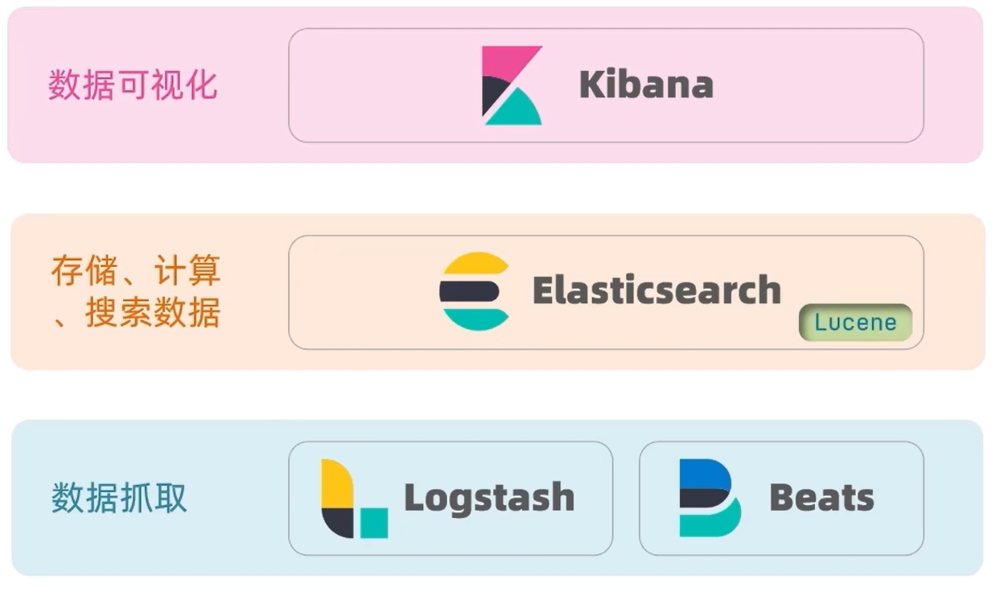
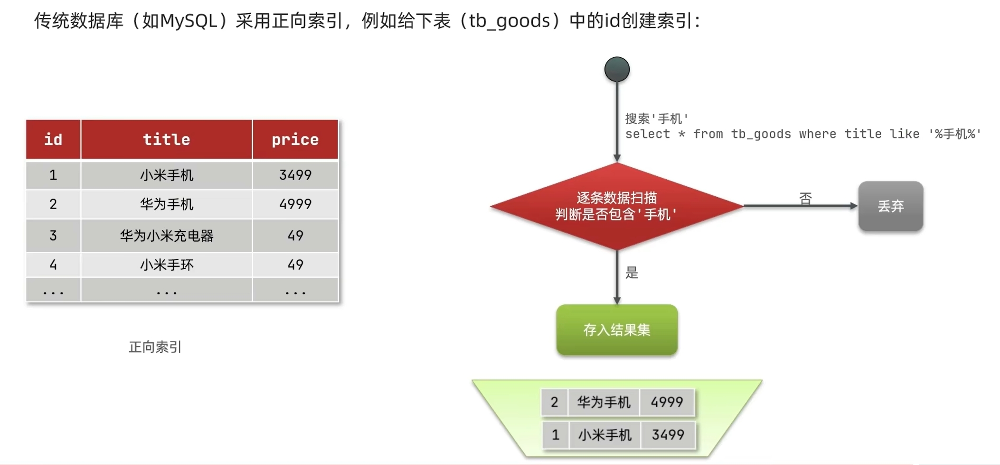
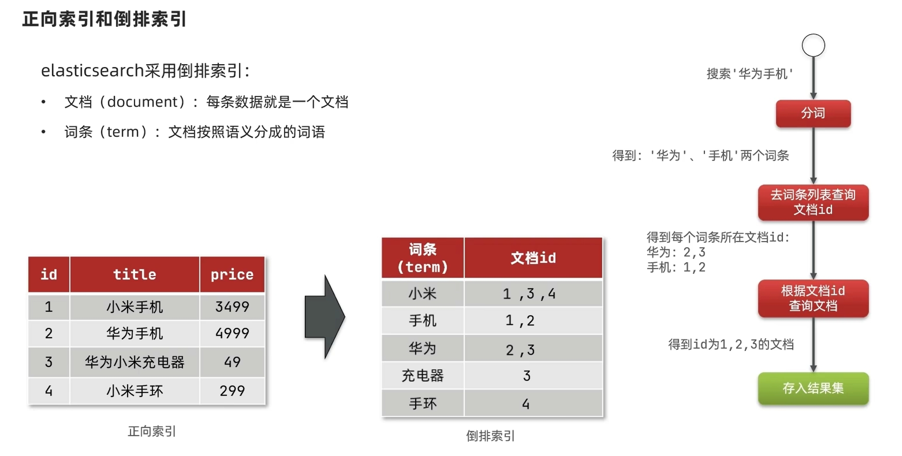
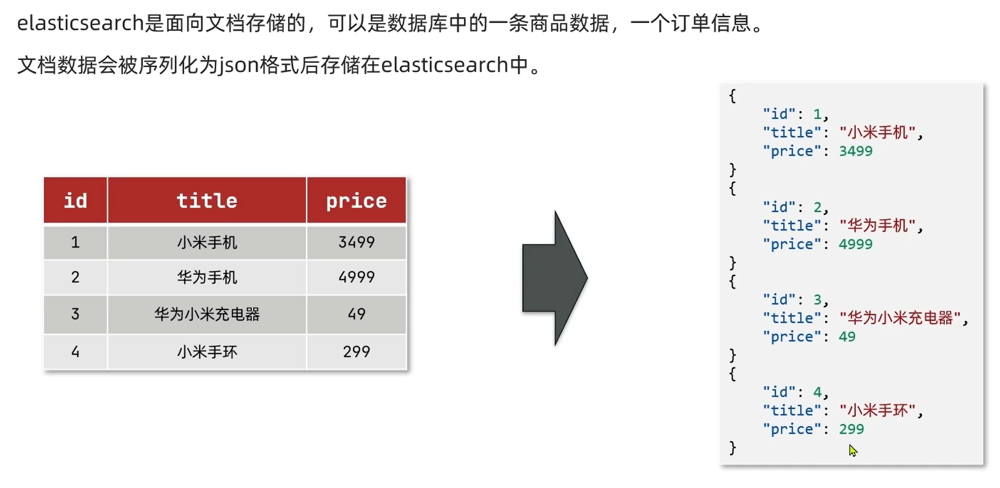
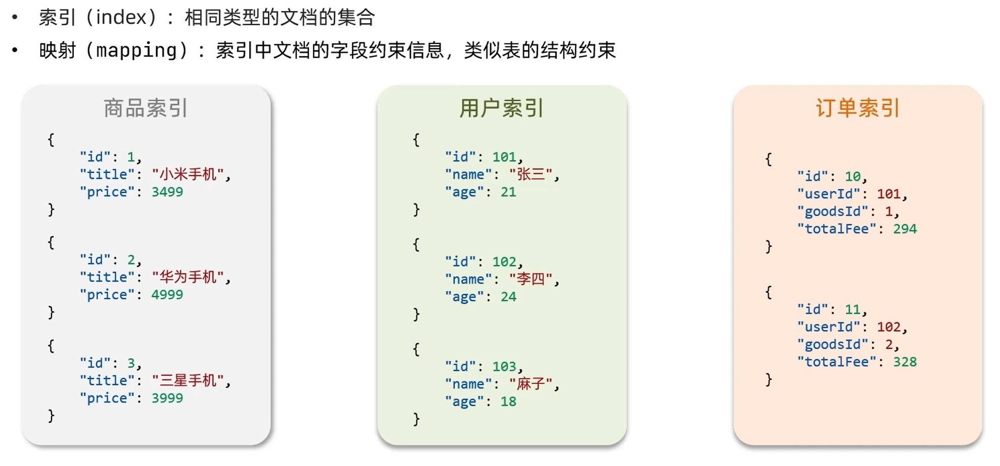
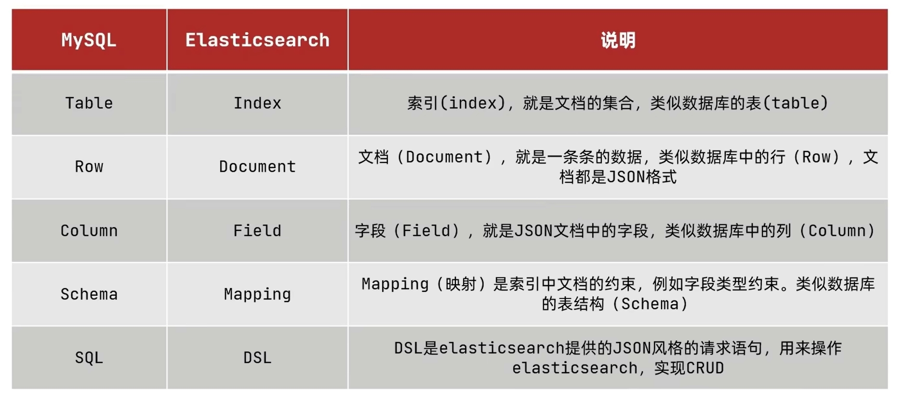
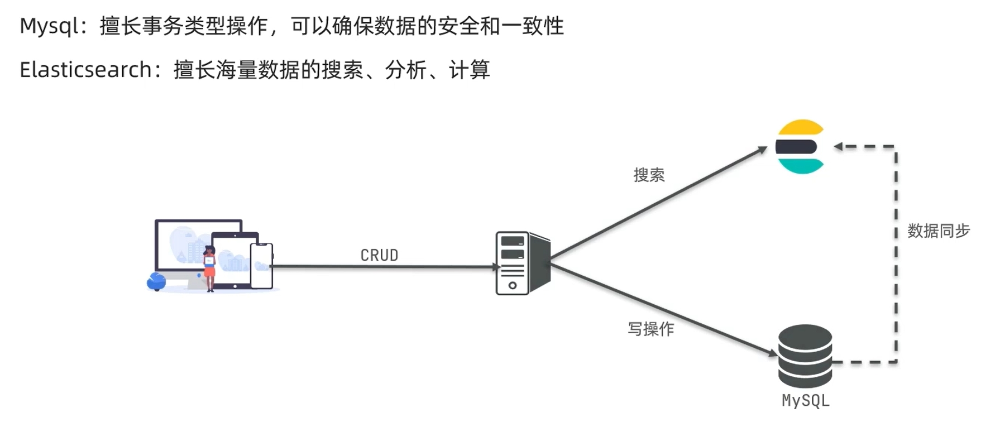

# ElasticSearch学习笔记

主要学习自黑马的教程：

【黑马Elasticsearch全套教程，含DSL查询语法、数据聚合、ES集合，最后配有黑马旅游网案例】 https://www.bilibili.com/video/BV1b8411Z7w5/?p=2&share_source=copy_web&vd_source=184246d521185707999f94e18a91519f

视频里是es7，可能会与新版有部分内容不同；


## 基本概念

### ES介绍

elasticsearch是一款非常强大的开源搜索引擎，可以帮助我们从海量数据中快速找到需要的内容；

elasticsearch结合kibana、Logstash、Beats，也就是**elastic stack(ELK)**，被广泛应用在日志数据分析、实时监控等领域；



ES底层基于**Lucene**，Lucene是一个**Java**语言的搜索引擎类库（jar包），是Apache公司的顶级项目，由DougCutting于1999年研发，主要是实现**倒排索引**功能；

相比与lucene，elasticsearch具备下列优势:

- 支持分布式，可水平扩展
- 提供Restful接口，可被任何语言调用


### 倒排索引

**正向索引**：遇到这种部分文本查询，可能需要全盘扫描



**倒排索引**：经历2次查询：根据词条查文档id → 根据文档id查文档内容，但都经过索引，总体性能很高




### 文档

ES存的数据叫做“**文档**”，实际上1个文档就相当于mysql里的1条数据，而ES中的格式是**JSON**




### 索引

基本可以当作mysql中的**表**




### MySQL与ES概念对比



二者相互协作：

> tip：ES不支持事务




## 安装部署

这里就不多记录了，大概记一些内容，视频里是直接用Docker安装部署的；

### ES

- ES访问端口是`9200`，还有一个在集群模式下相互访问的端口`9300`；
  - windows下，通过`elasticsearch.bat`运行


### Kibana

- Kibana端口是`5601`，安装时要与ES的版本匹配，并且配置好ES的地址；
  - windows下，通过`kibana.bat`运行
  - Kibana的 Dev Tools 可以很方便地发送DSL语句


### 分词器

- IK分词器
  - 原版分词器对中文的支持很烂，需要安装额外插件

#### 原版分词器

请求：

```http
POST _analyze
{
  "analyzer": "standard",
  "text": "我是广东人。I am from Guangdong Province."
}
```

响应：

```json
{
  "tokens": [
    {
      "token": "我",
      "start_offset": 0,
      "end_offset": 1,
      "type": "<IDEOGRAPHIC>",
      "position": 0
    },
    {
      "token": "是",
      "start_offset": 1,
      "end_offset": 2,
      "type": "<IDEOGRAPHIC>",
      "position": 1
    },
    {
      "token": "广",
      "start_offset": 2,
      "end_offset": 3,
      "type": "<IDEOGRAPHIC>",
      "position": 2
    },
    {
      "token": "东",
      "start_offset": 3,
      "end_offset": 4,
      "type": "<IDEOGRAPHIC>",
      "position": 3
    },
    {
      "token": "人",
      "start_offset": 4,
      "end_offset": 5,
      "type": "<IDEOGRAPHIC>",
      "position": 4
    },
    {
      "token": "i",
      "start_offset": 6,
      "end_offset": 7,
      "type": "<ALPHANUM>",
      "position": 5
    },
    {
      "token": "am",
      "start_offset": 8,
      "end_offset": 10,
      "type": "<ALPHANUM>",
      "position": 6
    },
    {
      "token": "from",
      "start_offset": 11,
      "end_offset": 15,
      "type": "<ALPHANUM>",
      "position": 7
    },
    {
      "token": "guangdong",
      "start_offset": 16,
      "end_offset": 25,
      "type": "<ALPHANUM>",
      "position": 8
    },
    {
      "token": "province",
      "start_offset": 26,
      "end_offset": 34,
      "type": "<ALPHANUM>",
      "position": 9
    }
  ]
}
```


#### IK分词器

ik分词器还分为不同的种类：

- `ik_smart` 最少分，粗粒度（分最大的组合）
- `ik_max_word` 最细分，细粒度（会从大到小分）

在配置文件 `IKAnalyzer.cfg.xml` 中，可以指定字典，扩展字典、排除字典等等；

> 看了一下`.dict`文件，里面就是一堆词的纯文本，一行一个词，几十万行；

> 没想到配置文件居然自带中文注释

```xml
<?xml version="1.0" encoding="UTF-8"?>
<!DOCTYPE properties SYSTEM "http://java.sun.com/dtd/properties.dtd">
<properties>
	<comment>IK Analyzer 扩展配置</comment>
	<!--用户可以在这里配置自己的扩展字典 -->
	<entry key="ext_dict"></entry>
	 <!--用户可以在这里配置自己的扩展停止词字典-->
	<entry key="ext_stopwords"></entry>
	<!--用户可以在这里配置远程扩展字典 -->
	<!-- <entry key="remote_ext_dict">words_location</entry> -->
	<!--用户可以在这里配置远程扩展停止词字典-->
	<!-- <entry key="remote_ext_stopwords">words_location</entry> -->
</properties>
```


ik_smart 请求：

```http
POST _analyze
{
  "analyzer": "ik_smart",
  "text": "我是广东人。"
}
```

ik_smart 响应：

```json
{
  "tokens": [
    {
      "token": "我",
      "start_offset": 0,
      "end_offset": 1,
      "type": "CN_CHAR",
      "position": 0
    },
    {
      "token": "是",
      "start_offset": 1,
      "end_offset": 2,
      "type": "CN_CHAR",
      "position": 1
    },
    {
      "token": "广东人",
      "start_offset": 2,
      "end_offset": 5,
      "type": "CN_WORD",
      "position": 2
    },
    {
      "token": "i",
      "start_offset": 6,
      "end_offset": 7,
      "type": "ENGLISH",
      "position": 3
    },
    {
      "token": "am",
      "start_offset": 8,
      "end_offset": 10,
      "type": "ENGLISH",
      "position": 4
    },
    {
      "token": "from",
      "start_offset": 11,
      "end_offset": 15,
      "type": "ENGLISH",
      "position": 5
    },
    {
      "token": "guangdong",
      "start_offset": 16,
      "end_offset": 25,
      "type": "ENGLISH",
      "position": 6
    },
    {
      "token": "province.",
      "start_offset": 26,
      "end_offset": 35,
      "type": "LETTER",
      "position": 7
    }
  ]
}
```


ik_max_word 请求：

```http
POST _analyze
{
  "analyzer": "ik_max_word",
  "text": "我是广东人。"
}
```


ik_max_word 响应：

```json
{
  "tokens": [
    {
      "token": "我",
      "start_offset": 0,
      "end_offset": 1,
      "type": "CN_CHAR",
      "position": 0
    },
    {
      "token": "是",
      "start_offset": 1,
      "end_offset": 2,
      "type": "CN_CHAR",
      "position": 1
    },
    {
      "token": "广东人",
      "start_offset": 2,
      "end_offset": 5,
      "type": "CN_WORD",
      "position": 2
    },
    {
      "token": "广东",
      "start_offset": 2,
      "end_offset": 4,
      "type": "CN_WORD",
      "position": 3
    },
    {
      "token": "人",
      "start_offset": 4,
      "end_offset": 5,
      "type": "CN_CHAR",
      "position": 4
    }
  ]
}
```


