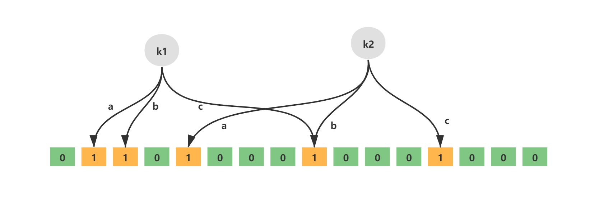
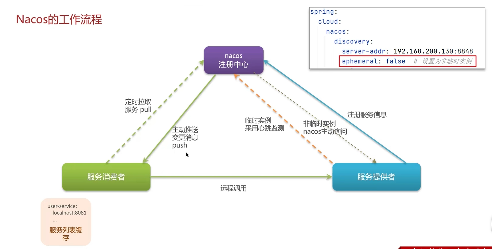
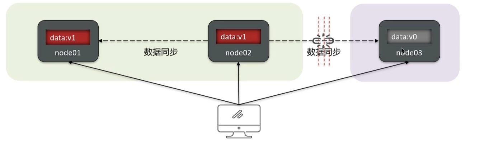
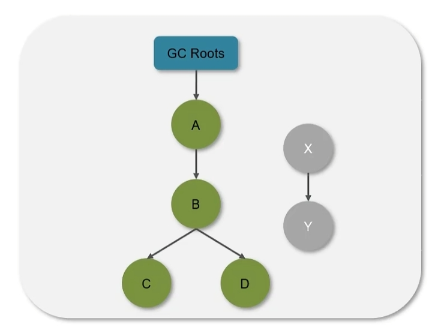
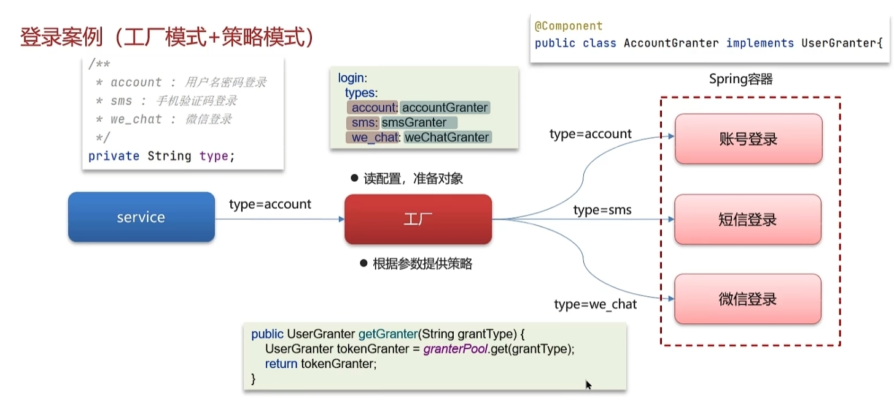
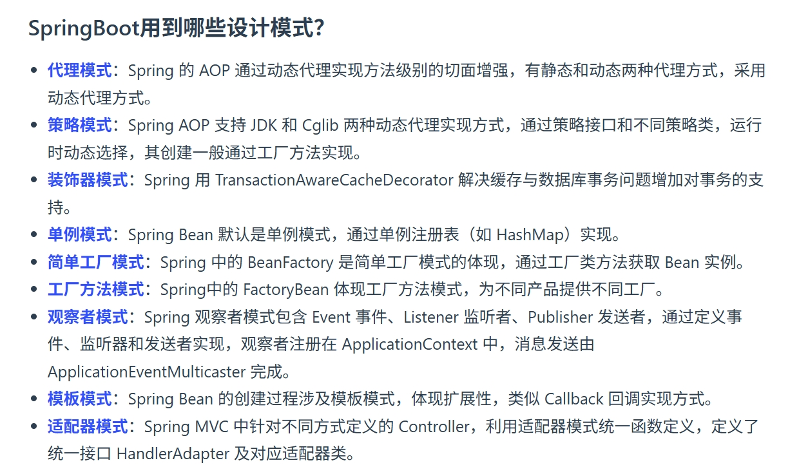

# Java八股

笔记内容来自[黑马Java八股](https://www.bilibili.com/video/BV1yT411H7YK/?share_source=copy_web&vd_source=184246d521185707999f94e18a91519f)，[JavaGuide](https://javaguide.cn/)，[小林coding](https://xiaolincoding.com/)，GPT等；


面试回答要结合项目场景；准备的时候可以不断深入发问：缓存穿透怎么解决？布隆过滤器 → 布隆过滤器底层是什么？位数组、哈希 → 哈希相关的问题.....

一些中间件写在 [12306笔记](..\12306项目笔记\12306笔记-部分中间件.md) 里面，例如Seata, Sentinel, OpenFeign等；


## 杂项

### LRU和LFU

- LRU - Least Recently Used - 最近最少使用
- LFU - Least frequently used - 最少频率使用


### 上下文切换

CPU从一个线程或进程切换到另一个线程或进程时，需要**保存当前任务的状态**，包括寄存器内容、程序计数器、堆栈指针、状态寄存器等。每次切换都会保存和恢复这些信息


### 单线程事件循环

单线程事件循环是一种编程模型，主要特点是只有一个线程负责处理所有任务。任务通常以事件（例如网络请求、定时器事件、用户输入等）的形式存在，通过一个不断循环的事件队列来调度和处理。


### 用户态和内核态

操作系统中，内核态和用户态描述的是 **CPU 的运行模式**

**用户态与内核态**的切换是**操作系统提供**的基本机制，与JVM的实现无关，JVM只是利用这些机制来实现线程同步和调度。

操作涉及的线程状态变更（从运行到阻塞，再从阻塞恢复到运行）都需要**操作系统**的干预

- **用户态**
  - 用户态是程序正常执行的状态。**大部分Java代码、JVM运行的逻辑都处在用户态**。
- **内核态**
  - 内核态是操作系统处理系统调用、设备驱动和硬件交互时的状态。

在重量级锁的实现中，线程**由用户态转为内核态**，主要发生在以下两个阶段：

- **挂起线程时**
  - 当JVM检测到锁竞争激烈时，会调用系统调用将线程挂起。这一调用会导致当前线程从用户态切换到内核态，操作系统内核将该线程标记为阻塞状态，并将其从运行队列中移除。
- **唤醒线程时**
  - 当锁释放后，JVM调用操作系统接口来唤醒一个或多个阻塞线程。这时，操作系统内核将阻塞线程重新放回到就绪队列中，等待调度器分配CPU时间，线程再从内核态返回到用户态执行。


### 用户空间和内核空间

在操作系统中，**内存**通常被分为**内核空间（Kernel Space）**和**用户空间（User Space）**两大部分：

- **内核空间**：这是操作系统内核运行的区域，包含了内核代码、设备驱动、以及核心系统数据结构。内核具有最高权限，可以直接访问硬件资源和内存。在这个区域内执行的代码不受太多限制，但同时任何错误都可能导致系统崩溃。
- **用户空间**：这是普通应用程序（用户进程）运行的区域。用户空间中的程序只能**通过操作系统提供的系统调用接口**来请求内核服务（例如文件操作、网络通信等），而不能直接操作硬件或内核数据结构。这样设计的目的是为了提高系统的稳定性和安全性，防止应用程序之间相互干扰或意外破坏系统内核。


### IO多路复用

>  具体看小林https://xiaolincoding.com/backend_interview/internet_medium/xiaohongshu.html#%E8%AE%B2%E4%B8%80%E4%B8%8Bio%E5%A4%9A%E8%B7%AF%E5%A4%8D%E7%94%A8

是指利用**单个线程**来同时**监听多个Socket**，并在某个Socket可读/可写时得到通知，从而避免无效的等待，**充分利用CPU资源**。

#### select

> 固定长度，需要2次遍历、2次拷贝

使用固定长度的 BitsMap，表示文件描述符集合，Linux 系统中，集合的大小由内核中的 FD_SETSIZE 限制， 默认最大值为1024；

1. 首先**用户线程**将已连接的 Socket 都放到一个**文件描述符集合**，然后调用 select 函数将文件描述符集合**拷贝**到内核里，让内核来检查是否有网络事件产生；
2. **内核**需要去**遍历**文件描述符集合，当检查到有事件产生后，将此 Socket 标记为可读或可写， 接着再把整个文件描述符集合**拷贝**回用户空间里；
3. 用户线程还需要再通过**遍历**的方法找到可读或可写的 Socket，然后再对其处理；

#### poll

> 动态长度，需要2次遍历、2次拷贝

不再用定长的数组、而是用**链表**来存储文件描述符，但是工作方式没有变化，仍然需要拷贝、遍历；

#### epoll

> 红黑树 + 就绪链表，无需遍历

epoll的数据结构：


通过代码可以详细看出其工作原理：

```c
#include <sys/epoll.h>
#include <sys/socket.h>
#include <netinet/in.h>
#include <unistd.h>
#include <fcntl.h>
#include <stdio.h>

#define MAX_EVENTS 10
#define PORT 8080

// 设置非阻塞
void set_nonblocking(int fd) {
    fcntl(fd, F_SETFL, fcntl(fd, F_GETFL, 0) | O_NONBLOCK);
}

int main() {
    int listen_fd = socket(AF_INET, SOCK_STREAM, 0); // 指向 socket 的 fd
    struct sockaddr_in addr = { .sin_family=AF_INET, .sin_port=htons(PORT), .sin_addr.s_addr=INADDR_ANY };
    bind(listen_fd, (struct sockaddr*)&addr, sizeof(addr)); // 绑定该 socket 到服务器的 IP 和端口
    listen(listen_fd, 5); // 将其转换为“被动”状态，即成为监听 socket; 同时设置 accept 队列的最大长度

    int epfd = epoll_create1(0);  // 创建 epoll，flags=0 无特殊标志
    // 这个 epfd 指向内核为该 epoll 实例创建的数据结构（红黑树 + 就绪链表）
    // 其是后续所有 epoll_ctl 和 epoll_wait 的操作句柄。
    
    if (epfd < 0) { perror("epoll_create1"); return 1; } // 异常检查

    struct epoll_event ev, events[MAX_EVENTS]; 
    // ev是感兴趣的事件，后续随fd添加进红黑树中
    // events是事件数组，epoll_wait会将就绪链表中的fd拷贝到events数组中

    ev.events = EPOLLIN; // 关注可读事件（水平触发）
    ev.data.fd = listen_fd; // fd赋值为监听socket的fd
    epoll_ctl(epfd, EPOLL_CTL_ADD, listen_fd, &ev);  // 将fd添加进红黑树
    // epoll_ctl(epoll数据结构, 操作类型：添加, 需要添加的fd, 感兴趣的事件)

    while (1) {
        int n = epoll_wait(epfd, events, MAX_EVENTS, -1); // 阻塞等待事件
        // 会将就绪链表中的fd拷贝到events中，并返回数量
        
        for (int i = 0; i < n; i++) { // 遍历events
            int fd = events[i].data.fd; // 获取fd
            if (fd == listen_fd) {
                // 如果是监听 socket 可读，意味着有新的连接到来
                int client = accept(listen_fd, NULL, NULL); // 客户端连接的 socket 的 fd
                set_nonblocking(client);
                ev.events = EPOLLIN | EPOLLET; // 添加客户端套接字（ET模式）
                ev.data.fd = client;
                epoll_ctl(epfd, EPOLL_CTL_ADD, client, &ev); // 将客户端连接的fd添加进红黑树
            } else {
                char buf[512];
                int len = read(fd, buf, sizeof(buf));
                if (len <= 0) {
                    close(fd);  // 客户端关闭或出错
                } else {
                    write(fd, buf, len);  // 简单 echo
                }
            }
        }
    }

    close(epfd);
    return 0;
}
```

主要工作流程：

1. 用户程序一开始先通过`epoll_create`创建epoll实例，包括红黑树和就绪链表；
2. 在网络 IO 场景下，首先用户程序会创建socket监听网络连接，使用`epoll_ctl`将该**监听socket**的fd放入红黑树；
3. 当网络连接或事件发生时，内核会检查红黑树中的监听项（即`log(n)`搜索），将触发的 fd 存入就绪链表，并在 `epoll_wait` 被调用时，将这些就绪 fd 拷贝到用户空间的 `events` 数组。
4. 用户程序用`epoll_wait`等待就绪链表中的数据：
   - 如果是监听socket 的 fd，则 `accept()` 出客户端 fd 并注册到 epoll（即将**客户端连接的fd**放入红黑树）；
   - 如果是 client fd，则处理其 I/O;

> tip：1个程序通常只有**1个epoll实例**，有**1个监听socket**和**多个客户端连接socket**

用mermaid画个流程图：


##### 水平触发与边缘触发

epoll 支持两种事件触发模式，分别是边缘触发（edge-triggered，ET）和水平触发（level-triggered，LT）

- 边缘触发
  - 仅在文件描述符的状态发生变化时（如从不可读变为可读）才通知应用程序。每个事件仅通知一次，应用程序必须在通知时尽可能多地处理数据，否则可能错过后续通知；
    - 也就是就绪链表里从无fd到有fd时，会通知一次，如果没处理，新的fd加入时不会再通知
  - 适合**高并发场景**；
- 水平触发
  - 只要文件描述符（fd）处于就绪状态（如可读或可写），`epoll` 就会持续通知应用程序。即使应用程序未完全处理数据，`epoll` 仍会在下一次调用时再次通知；
    - 也就是只要就绪链表里新来了fd，就会通知一次，每次都会；


### 常见动态代理

- **JDK 动态代理**：只对**实现了接口的类**有效，在运行时为目标对象生成代理对象，通过 `InvocationHandler` 拦截方法调用。
- **CGLIB 代理**：基于**字节码技术**为目标类生成子类代理，即使目标类没有实现接口也能进行代理。


### 代理对象

在 Spring 框架中，**代理对象**通常指的是通过**动态代理**或基于字节码操作（如 **CGLIB**）生成的一个对象，该对象“**包装**”了目标对象，并在调用目标方法时，可以插入额外的逻辑处理（例如日志、事务、安全检查等）

当使用**AOP**（比如`@Transactional`、`@Aspect`等）时，被增强的bean在Spring容器中会被**包装成代理对象**，这样在调用方法时能够先执行切面逻辑，再执行目标方法。

在使用 AOP 进行增强时，Spring 并不是直接在原始类的字节码上“注入”增强逻辑，而是生成一个新的代理类，该代理类内部会包含对目标对象的引用，并在调用目标方法时执行增强逻辑。具体来说：

- **CGLIB 代理：**
   如果目标类**没有实现接口**，Spring 会使用 CGLIB 生成一个目标类的子类。这个代理类会重写目标类的方法，在方法开始和结束时执行增强（例如事务、日志等），然后调用父类的实现。生成的字节码其实就是一个新的类文件，其逻辑相当于把增强内容封装在重写的方法中，再调用原有逻辑。
- **JDK 动态代理：**
   如果目标类**实现了接口**，Spring 默认会采用 JDK 动态代理生成代理对象。此时生成的代理类实现了目标接口，代理类内部持有目标对象的引用，并在代理方法中执行增强逻辑后调用目标对象的对应方法。生成的字节码并不直接包含目标类的实现，而是通过反射调用目标方法。

因此，生成的代理类并不是简单地在原始类上“插入”增强代码，而是**生成了一个新类**，它通过代理模式将增强逻辑和目标业务逻辑分离开来。这样既保证了原始类的纯净性，也使得增强逻辑可以以解耦的方式在运行时动态加入。


### 对象工厂

Spring中，对象工厂（ObjectFactory）是一个回调接口，其主要作用是延迟创建或获取 bean 的引用，通常用于**暴露一个“早期引用”**，也就是**提供对象的半成品**

- **延迟获取 bean 实例**：
  - 对象工厂封装了获取 bean 实例的逻辑，在需要时才生成最终的 bean 实例或者它的代理版本。这对于解决循环依赖非常关键，因为在 bean 初始化过程中可能需要提前暴露 bean 的引用
- 对象工厂确保最终注入的是**包含增强逻辑的代理对象**


### mybatis级联映射

**级联映射**或**关联映射**

定义在`resultMap`中

`<result property="username" column="user_name" />`中的`property`对应的是Java的属性，`column`对应的是数据库里的属性

#### 一对一关联映射（association）

当一个对象中包含另一个对象（例如 User 包含 Address 对象）时，可以使用 `<association>` 标签。例如：

```xml
<resultMap id="userResultMap" type="com.example.User">
    <id property="id" column="user_id" />
    <result property="username" column="user_name" />
    <!-- 一对一关联，映射 Address 对象 -->
    <association property="address" javaType="com.example.Address">
        <id property="id" column="addr_id" />
        <result property="street" column="street" />
        <result property="city" column="city" />
    </association>
</resultMap>
```

这里，`association` 的 **property** 表示 User 对象中 address 属性，**javaType** 指定关联对象的类型。

#### 一对多关联映射（collection）

当一个对象包含一个集合（例如 Department 包含多个 Employee）时，可以使用 `<collection>` 标签。例如：

```xml
<resultMap id="deptResultMap" type="com.example.Department">
    <id property="id" column="dept_id" />
    <result property="name" column="dept_name" />
    <!-- 一对多关联 -->
    <collection property="employees" ofType="com.example.Employee">
        <id property="id" column="emp_id" />
        <result property="name" column="emp_name" />
        <result property="position" column="position" />
    </collection>
</resultMap>
```

- **property**：Department 中对应集合属性的名称
- **ofType**：集合中元素的类型


### lambda表达式的闭包特性

**Lambda 表达式**提供了一种简洁的写法，可以直接捕获外围作用域中的变量（前提是它们是 final 或 effectively final），减少了样板代码的数量。也就是可以直接把**主方法中的不可变变量**传递给lambda表达式使用：

```java
public class CountDownLatchExample {
    public static void main(String[] args) {
        CountDownLatch latch1 = new CountDownLatch(1);

        Thread t1 = new Thread(() -> {
            System.out.println("线程 t1 执行");
            latch1.countDown(); // 直接把latch1传进来使用
        });
        
        ...
    }
}
```


### Java对象的内存结构

对象存储在**堆**中，在**HotSpot虚拟机**中，其由三部分组成：

- **对象头 Header**
  - 包含MarkWord 和 类指针（Klass Pointer或Klass Word）
  - 包括了关于堆对象的布局、类型、GC状态、**同步状态**和标识哈希码的基本信息
- **实例数据 Instance Data**
  - 主要是存放类的数据信息，父类的信息，对象字段属性信息
- **对齐填充**


### Java对象头中的MarkWord


对象头中的**MarkWord**存储了对象运行时的数据，如哈希码、GC年龄以及锁相关的信息；

其内容会**根据对象所处的状态而变化**，主要有以下几种状态：

- **无锁状态（Normal状态）**

  - 在对象刚创建、未经过同步操作时，MarkWord存储了对象的哈希码（如果被计算过）、GC年龄和一些标记位。这时的MarkWord格式一般为：

    - 部分位用于存储哈希码
    - 部分位用于存储分代年龄（GC年龄）

    - 标志位指示当前处于无锁状态

- **偏向锁状态（Biased Locking）**

  - 为了减少**无竞争情况下的同步开销**，HotSpot引入了偏向锁。在这种状态下，MarkWord记录了**持有偏向锁的线程ID**（通常是线程的指针）以及一个偏向模式的标志位。这样，在进入同步块时，如果是同一个线程多次获取锁，就不需要再进行CAS操作，极大地降低了同步成本。

- **轻量级锁状态（轻量锁）**

  - 当多个线程竞争同一把锁时，JVM会先尝试通过CAS操作将MarkWord更新为指向一个锁记录（Lock Record）的指针。这个锁记录通常在当前线程的栈帧中分配，用来保存原始的MarkWord值。若CAS操作成功，表示线程获取了轻量级锁，此时MarkWord中存储的信息就变成了指向该锁记录的指针。

- **重量级锁状态（重量锁/膨胀锁）**

  - 如果锁竞争激烈或者发生线程阻塞，轻量级锁就会膨胀为重量级锁。在这种状态下，MarkWord中存储的内容变为**指向一个对象监视器（Monitor）的指针**。Monitor是一个更复杂的数据结构，用于管理等待队列、唤醒通知等同步机制。


### 乐观锁

**乐观锁（Optimistic Locking）** 是一种假设并发冲突较少的锁策略，是**无锁（lock-free）编程**，它不会在数据操作前加锁，而是在**提交更新时检查**数据是否被其他线程修改。如果数据没有被更改，则更新成功；否则，执行重试机制（可能回滚或重新获取数据）。

这种方式适用于**读操作较多、写操作较少**的场景，可以避免不必要的锁竞争，提高系统吞吐量。

在数据库和Java并发编程中，乐观锁的实现通常依赖于 **版本号（Versioning）或CAS（Compare-And-Swap）机制**

```java
// CAS方式实现乐观锁
public class CASExample {
    private static AtomicInteger count = new AtomicInteger(0);

    public static void main(String[] args) {
        int oldValue, newValue;
        do {
            oldValue = count.get();
            newValue = oldValue + 1;
        } while (!count.compareAndSet(oldValue, newValue));  // CAS 更新
        
        System.out.println("Updated value: " + count.get());
    }
}
```


### 公平锁与非公平锁

- 非公平锁：新的线程与等待队列中的线程共同来抢资源
- 公平锁：新的线程到等待队列中等待，只让等待队列中的head线程获取锁


### mysql的3种JOIN

假设数据

**students 表：**

| student_id | name    |
| ---------- | ------- |
| 1          | Alice   |
| 2          | Bob     |
| 3          | Charlie |

**scores 表：**

| score_id | student_id | score |
| -------- | ---------- | ----- |
| 101      | 1          | 85    |
| 102      | 2          | 90    |
| 103      | 4          | 75    |

注意：在 scores 表中，`student_id=4` 没有在 students 表中出现。


#### INNER JOIN

**SQL 语句：**

```mysql
SELECT s.student_id, s.name, sc.score
FROM students s
INNER JOIN scores sc ON s.student_id = sc.student_id;
```

**返回结果：**

| student_id | name  | score |
| ---------- | ----- | ----- |
| 1          | Alice | 85    |
| 2          | Bob   | 90    |

**说明：**
 仅返回满足 `students.student_id = scores.student_id` 的记录，因此只包含 student_id 为 1 和 2 的数据。


#### LEFT JOIN 查询返回结果

**SQL 语句：**

```mysql
SELECT s.student_id, s.name, sc.score
FROM students s
LEFT JOIN scores sc ON s.student_id = sc.student_id;
```

**返回结果：**

| student_id | name    | score |
| ---------- | ------- | ----- |
| 1          | Alice   | 85    |
| 2          | Bob     | 90    |
| 3          | Charlie | NULL  |

**说明：**
 以 students 表为基准，返回所有学生记录。当某个学生在 scores 表中无匹配（例如 student_id=3），对应的 score 显示为 NULL。


#### RIGHT JOIN 查询返回结果

**SQL 语句：**

```mysql
SELECT s.student_id, s.name, sc.score
FROM students s
RIGHT JOIN scores sc ON s.student_id = sc.student_id;
```

**返回结果：**

| student_id | name  | score |
| ---------- | ----- | ----- |
| 1          | Alice | 85    |
| 2          | Bob   | 90    |
| NULL       | NULL  | 75    |

**说明：**
 以 scores 表为基准，返回所有分数记录。当 scores 表中存在的 student_id（例如 4）在 students 表中无对应记录，则 students 表的字段显示为 NULL。


### 连接池

连接池是一种用于管理和复用已建立连接（如TCP或数据库连接）的机制，它在系统启动时或首次请求时预先创建一定数量的连接，供后续请求重复使用，避免了每次请求时重复建立和断开连接的开销。

**提高性能的方法**：

- 复用现有的连接，跳过每次新建连接所需的TCP握手和SSL握手过程，降低延时。
- 统一管理连接资源，通过限制最大连接数和回收空闲连接，减少系统资源浪费，提高并发处理能力。

**底层基本原理**：

- 预先创建和初始化连接，维护一个连接对象的池子。
- 根据请求条件分配空闲连接，确保线程安全。
- 定期检测连接状态，对失效或长时间空闲的连接进行回收和重建，保证连接的健康状态。


## 少见面试题

磁盘中有21亿个整型数据，如何排序？

归并排序；

如果这些数据没有重复，这么在O(n)复杂度下排序？

桶排序，bitmap；


## Redis

### 常见数据结构

数据结构及其应用场景：

- **String** 类型的应用场景：缓存对象、常规计数、分布式锁、共享 session 信息等。
- **List** 类型的应用场景：消息队列（但是有两个问题：1. 生产者需要自行实现全局唯一 ID；2. 不能以消费组形式消费数据）等。
- **Hash** 类型：缓存对象、购物车等。
- **Set** 类型：聚合计算（并集、交集、差集）场景，比如点赞、共同关注、抽奖活动等。
- **Zset** 类型：排序场景，比如排行榜、电话和姓名排序等。

Redis 后续版本又支持四种数据类型，它们的应用场景如下：

- **BitMap**（2.2 版新增）：二值状态统计的场景，比如签到、判断用户登陆状态、连续签到用户总数等；
- **HyperLogLog**（2.8 版新增）：海量数据基数统计的场景，比如百万级网页 UV 计数等；
- **GEO**（3.2 版新增）：存储地理位置信息的场景，比如滴滴叫车；
- **Stream**（5.0 版新增）：消息队列，相比于基于 List 类型实现的消息队列，有这两个特有的特性：自动生成全局唯一消息ID，支持以消费组形式消费数据。

具体看小林：[redis数据结构](https://xiaolincoding.com/interview/redis.html#%E6%95%B0%E6%8D%AE%E7%BB%93%E6%9E%84)


### 缓存三大问题

#### 缓存穿透

**定义：**

- 查询一个不存在的数据，mysql查询不到数据也不会直接写入缓存，就会导致每次请求都查数据库
  - 总结：查不存在→查找mysql→mysql中不存在→返回且没有数据缓存到redis

**解决方案：**

- 缓存空数据
  - 这样查询一个不存在的数据时就会返回缓存里的空数据，不会查数据库了
  - **缺点**：
    - 设置过多 (key: null)，消耗内存；
    - 数据不一致：可能出现数据库中添加上了原本不存在的数据，而缓存中还是null 
- **布隆过滤器 Bloom Filter**
  - 底层是一个大型的二进制数组，为每个存在的key做多个hash，如图
  - 
  - 请求经过过滤器，先做那几个hash，如果位置全为1，就是存在，否则则不通过
  - 有可能哈希冲突，存在误判的可能，误判率与数组的大小、哈希算法等有关；增加数组大小以减少误判率则会以内存消耗为代价
  - **特点**：相比缓存空数据，内存占用少；但是存在误判


#### 缓存击穿

**定义：**

- 给某一个key设置了过期时间，当key过期的时候，恰好这时间点对这个key有大量的并发请求过来，这些并发的请求可能会瞬间把DB压垮
  - 总结：key过期→新请求→读mysql→存储到redis→**读mysql到存好redis的时间内有大量请求**→全部请求到mysql

**解决方案：**

- 互斥锁
  - 过期后，第1个线程进来时，获取互斥锁，等查询完数据库+缓存进redis后，再释放锁让其他线程进来
  - **特点**：强一致，性能差
- 逻辑过期
  - 过期后，第1个线程进来时，获取互斥锁，并开启1个新线程，而后返回过期了的数据；
  - 开启的新线程去查数据库+缓存进redis，而后释放互斥锁；
  - 上一条操作完成前，其他线程获取互斥锁失败，直接返回过期数据
  - **特点**：高可用，性能优，不能保证数据绝对一致


#### 缓存雪崩

**定义：**

- 缓存雪崩是指在同一时段**大量的缓存key同时失效**或者**Redis服务容机**，导致大量请求到达数据库，带来巨大压力。

**解决方案:**

- 给不同的Key的**TTL添加随机值**
- 利用**Redis集群**提高服务的可用性
- 给缓存业务添加**降级限流**策略
  - 降级可做为系统的保底策略，适用于穿透、击穿、雪崩
- 给业务添加多级缓存


### 双写一致性

**定义：**

- 当修改了数据库的数据也要同时更新缓存的数据，缓存和数据库的数据要保持一致

**解决方案：**

- **延迟双删**
  - 删除缓存 → 修改数据库 → 延时 + 删除缓存
  - 特点：
    - 必须删除2次，不然在多线程情况下很容易发生读脏数据
      - （删缓存后修改数据库前，被另一个线程读了数据库，添加旧数据到缓存中；或删数据库后修改缓存前，另一个线程读取了缓存中的信息）
    - 延时是为了适应数据库的主从模式，因为读写分离，从master主数据库同步到slave从数据库需要时间
    - 由于延时时间不确定，延迟双删还是**有读脏数据的风险**，无法保证数据的强一致性（但准确率已经很高了）
- **共享锁 + 排他锁**
  - 其实就是**读者写者问题**，修改数据时别人不能读，使用redisson提供对应的锁，直接用就行了:
    - `redisson.getReadWriteLock("ITEM_READ_WRITE_LOCK")`
  - 共享锁：读锁，readLock，加锁之后，其他线程可以共享读操作，不能写
  - 排他锁：或叫独占锁，writeLock，加锁之后，阻塞其他线程读写操作（修改数据库的时候加上）
  - 特点：
    - 强一致性
    - 性能较低

**以上2种是需要保证数据的强一致性的，后面2种是允许短暂的不一致出现（更常见）**

- 异步通知保证数据的最终一致性
  - 将数据发给消息队列，再延迟更新缓存
  - 

- Canal异步通知
  - Canal是阿里的一个中间件，伪装成slave数据库，获取BinLog，将数据的变更情况通知缓存，然后更新缓存
  - 
  - 特点：
    - 几乎没有代码侵入，中间件直接搞定


### redis持久化

实现方法：

- **RDB**
  - 概念：
    - RDB全称Redis Database Backup file(Redis数据备份文件)，也被叫做Redis数据快照。
    - 简单来说就是把内存中的所有数据都记录到磁盘中。当Redis实例故障重启后，从磁盘读取快照文件，恢复数据
  - 使用：
    - `save`命令：由Redis主进程来执行RDB，会阻塞所有命令
    - `bgsave` 命令：开启子进程执行RDB，避免主进程受到影响
    - 配置文件`redis.conf`：`save 900 1`（在900s内有1个key被修改则执行bgsave）
  - 原理：
    - 主进程将页表直接复制给子进程，然后子进程根据页表就可以获取内存中的数据，写入磁盘
    - 子进程执行时，将内存中的数据设置为read-only，主进程这段时间写的数据存在一个复制出来的备份中
  - 
- **AOF**
  - 概念：
    - AOF全称为Append Only File(追加文件)。
    - Redis处理的每一个写命令都会记录在AOF文件，可以看做是命令日志文件。
  - 使用：
    - 在配置文件`redis.conf`中开启：`appendonly yes`
    - 配置 命令记录的频率`appendonly always/everysec/no`——同步刷盘/每秒刷盘/操作系统控制，可靠性递减
    - 
  - 特点：
    - 会有**重写命令**的机制来缩短log，例如`set num 123; set name jack; set num 66`优化成一行`mset name jack num 666`
    - 可以配置文件大小比上次增长超过一定百分比/体积达到一定值，才触发重写
    - 不会很大的CPU压力，主要是磁盘IO（日志文件在磁盘中）

- Redis 4.0 对于持久化机制做了什么优化？（**混合**）

  - 由于 RDB 和 AOF 各有优势，于是，Redis 4.0 开始支持 RDB 和 AOF 的混合持久化（默认关闭，可以通过配置项 `aof-use-rdb-preamble` 开启）。

    如果把混合持久化打开，AOF 重写的时候就直接把 RDB 的内容写到 AOF 文件开头。这样做的好处是可以结合 RDB 和 AOF 的优点, 快速加载同时避免丢失过多的数据。当然缺点也是有的， AOF 里面的 RDB 部分是压缩格式不再是 AOF 格式，可读性较差。


对比如下图，一般2种配合使用


### 数据过期策略

下面2种配合使用：

- 惰性删除
  - 访问key的时候判断是否过期，如果过期，则删除
- 定期删除
  - 定期检查一定量的key是否过期
  - SLOW模式
    - 频率默认10hz，每次耗时不超过25ms
  - FAST模式
    - 频率不固定，但间隔不低于2ms，每次耗时不超过1ms


### 数据淘汰策略

- Redis提供了8种不同的数据淘汰策略，默认是noeviction不删除任何数据，内存不足直接报错
- 配置在配置的文件的`maxmemory-policy `选项下
  - noeviction：不淘汰任何key，但是内存满时不允许写入新数据，默认就是这种策略
  - volatile-ttl：对设置了TTL的key，比较key的剩余TTL值，TTL越小越先被淘汰
  - allkeys-random：对全体key，随机进行淘汰
  - volatile-random：对设置了TTL的key，随机进行淘汰
  - allkeys-lru：对全体key，基于LRU算法进行淘汰
  - volatile-lru：对设置了TTL的key，基于LRU算法进行淘汰
  - allkeys-lfu：对全体key，基于[LFU](#LRU和LFU)算法进行淘汰
  - volatile-lfu：对设置了TTL的key，基于LFU算法进行淘汰
- 使用：
  - 常用allkeys-lru
  - 有置顶数据，用volatile-lru
  - 短时高频访问，用lfu


### Redis分布式锁

#### 基本实现

**基本：**

- synchronized只是属于jvm的，多台集群服务器多个jvm，其只能解决同一个jvm下线程的互斥
- 分布式锁其实就是可以让不同服务器的线程被同一个锁锁住

**实现：**

- redis主要利用`setnx` (SET IF NOT Exist) 命令来实现

  - 其实就是设置一个锁，如果锁不存在（没被其他线程获取过），则创建这个锁；其他线程执行的话发现锁存在，则直接返回

  - ```
    > setnx key1 val1
    > expire key1 10
    ```

  - 需要2步：获得锁 + 设置锁的过期时间。因此**不具备原子性**，不安全

  - 在redis**2.6.12**后，可以变成一个命令（如下，最后一个参数是过期时间，EX单位为秒，以10s为例；或者用PX，单位为毫秒）

  - ```
    > SET lockKey lockValue NX EX 10
    > DEL lockKey
    ```

  - 或者使用**lua脚本**做到原子性

##### 缺陷

- 主从一致性
  - 由于**锁只存在于一个节点**，如果锁在的那个redis节点崩了，启用哨兵模式，让1个从节点变为主节点，这样就是去读新的主节点就存在读脏数据的情况
  - 可以使用**RedLock红锁**解决，其每次创建**(n / 2 + 1)**个锁，例如有5个主节点，则去3个节点获取锁，若有另外的线程来了，只能最多获取2个节点的锁；但是红锁实现复杂、性能差、运维繁琐，很少使用；
  - 一定要保证主从一致性，那么推荐使用**zookeeper**而不是redis


#### ZooKeeper分布式锁

ZooKeeper分布式锁的性能比RedLock还差些，但是可以保证**强一致**

**基本流程**：

1. **创建一个锁目录**，比如 `/locks`，通常是持久节点。
2. **客户端想获取锁时**，在 `/locks` 下创建一个 **临时顺序节点**，如 `/locks/lock-000000001`、`/locks/lock-000000002`。ZooKeeper 根据创建顺序自动编号。
3. **客户端获取当前目录下所有子节点**，并排序：
   - 如果自己创建的节点是序号最小的——成功获取锁；
   - 如果不是，监听序号比自己小的前一个节点的删除事件（注册 watcher），等它消失后再检测是否轮到自己。
4. **释放锁**：完成业务后，客户端手动删除自己对应的临时节点。此时下一个等待的客户端（监听者）会收到通知，尝试获取锁。
5. **容错机制**：如果客户端意外挂掉或网络断开，会话过期后 ZooKeeper **自动删除**对应的临时节点，锁也随之释放，不会造成死锁。


#### Redisson实现分布式锁

redisson实现的分布式锁是**可重入锁**，利用hash结构存储：

- key 是：自定义键值；
- hash 结构` (value, field) `是：` (线程唯一标识, 重入次数)`

- **加锁过程：**
  - 当一个线程尝试获取锁时，Redisson 会向 Redis 发送一个 `SET key value NX PX expireTime` 命令，其中：
  - **NX** 保证仅在 key 不存在时才能设置成功，确保互斥性。
  - **PX expireTime** 设置一个超时时间，用来防止由于异常情况导致锁永远占用的死锁问题。
- **存储线程唯一标识：**
  - 锁对应的 Redis 键的值不只是简单的线程 ID，而是一个全局唯一的标识符（Redisson中是**客户端UUID + 线程ID**）：
  - **Redisson 客户端标识或 JVM 实例标识：** 这部分保证了每个 Redisson 客户端（甚至是不同的 JVM 实例）都有不同的前缀。
    - **（在并发场景下，多台服务器的线程ID有可能相同，因此不能只使用线程ID）**
  - **当前线程 ID：** 结合客户端标识一起，生成一个全局唯一的标识符，用于指明是哪台机器上的哪个线程获得了这把锁。
- 抢不到锁的话，底层是基于`Semaphore`，就是juc包下的那个”信号量“，底层基于AQS；被阻塞，然后等待唤醒？
- **释放锁时的原子性保证：**
  - 为了确保只有持锁的线程能够释放锁，Redisson 使用 Lua 脚本检查 Redis 键中的标识符是否和当前线程的标识一致，然后再删除该键。这一操作在 Redis 中是原子执行的，避免了竞态条件。


基本使用模板：

```java
// 分布式锁
String lockKey = "lockKey";
RLock rLock = redissonClient.getLock(lockKey);
boolean locked = false;

try {
    // 自带看门狗机制，参数是（最大等待时间，单位）
    locked = rLock.tryLock(10, TimeUnit.SECONDS);
    if (locked) {
        // 业务代码...
    } else {
        // 可以抛出自定义异常...
    }
} catch (InterruptedException e) {
    throw new RuntimeException(e);
} finally {
    // 获得了锁且锁被当前线程持有，才能释放
    if (locked && rLock.isHeldByCurrentThread()) {
        rLock.unlock();
    }
}
```


#### 看门狗机制

- 问题：
  - 如果业务时间超过锁的过期时间，就会出问题；如果锁设置无限期，那如果释放锁前redis崩溃了，会造成死锁；

- **看门狗机制（Watch Dog）**：
  - 线程获得分布式锁后，（例如）Redisson会创建一个看门狗线程，它会定期检查、延长锁的过期时间（如图，默认releaseTime = 30s，所以默认每隔10s会续期一次）
  - 锁被释放后，看门狗线程就会自动停止
  - 
  - redisson中，当其他线程来的时候，如果获取锁失败，会不断**while循环**，重复一定次数；由于一般几十ms就完成一个小业务，这样的做法可以**在高并发的情况下，增加分布式锁的性能**

**代码：**

- ```java
  RLock lock = redissonClient.getLock("myLock");
  // 参数：获取锁最大的等待时间 + 单位
  boolean isLock = lock.tryLock(10, TimeUnit.SECONDS); 
  
  // 重载方法，参数：获取锁最大的等待时间 + 锁的失效时间 + 单位
  // 用了这个就不启用看门狗机制
  boolean isLock = lock.tryLock(10, 30, TimeUnit.SECONDS);
  ```


### redis集群

主从：解决高并发**读**问题

哨兵：解决**高可用**问题

分片：解决海量数据存储问题 & 高并发**写**问题

#### **主从同步**

- 读写分离，主节点负责写操作，从节点负责读操作（因为一般读多写少）
- 主要发送的参数的`replid`和`offset`，slave请求同步时，master根据`offset`判断是否是第一次同步，是则采用全量同步，否则采用增量同步；
  - 具体是这样的，master中有一个**环形缓冲区**，如果`offset`在缓冲区中，则增量同步；如果不在，则说明是太久没同步或者是第一次同步，则采用全量同步
  - 

- **全量同步**
  - 适用情况：从服务器首次连接主服务器/数据丢失后/长时间未同步
  - 过程：建立链接（同步版本信息） → 主服务器发送RDB → 主服务器发送“发送RDB”期间发生的命令日志文件
  - 
- **增量同步**
  - 从断点处同步（有个offset偏移量）
  - 过程：恢复连接（获取offset） → 主服务器发送命令日志（offset之后的数据）
  - 


#### **哨兵模式**

- 哨兵 (Sentinel)也是redis节点，通常也是一个集群 
  - 其保证redis集群的高可用性，实现**自动故障恢复**
- 功能
  - 监控（心跳检测）
    - ，哨兵向节点发送ping，不断检查master和slave是否正常工作
  - 选主（自动故障恢复）
    - master故障后，选择一个slave提为master
  - 服务变更通知
    - 故障转移后，通知redis客户端去连接新的主节点
  - 
- **选择新的master**
  - 条件
    - 哨兵每隔1s向集群每个节点发送ping命令（心跳检测）
    - 超过一定数量（一般是一半以上）的哨兵认为一个节点下线，则认为其“客观下线”
  - 选主规则
    - 排除与master断开时间过长的slave
    - 根据设置好的节点的slave-priority优先级值，选择更小的
    - **优先级相同，根据offset值，选择更大的**
    - 否则随便选，选择更id小的
- **”脑裂“**
  - 就是出现**2个master**
  - master没有挂，但是master的网络与哨兵断开 → 哨兵以为master挂了 → 选择新的master → 客户端依旧在原本的master写数据 → 网络恢复 → 合并后，旧master被认为是slave，数据被删除覆盖 → 数据丢失
  - 
  - 解决：
    - 配置**最少从节点数量**`min-slaves-to-write 1; min-slaves-max-lag 10`：表示当主节点至少有 1 个从节点延迟在 10 秒以内时，才允许写操作
    - 缩短主从数据同步延迟，减少数据丢失
    - 配置`redis.conf`的节点超时时间，不会过早判定节点失效`cluster-node-timeout 15000`
    - **全覆盖检测**`cluster-require-full-coverage yes`，确保整个集群在所有哈希槽都分布到对应节点时才能正常提供写操作

#### **分片集群**

- 利用**哈希槽**，集群有**16384**（$2^{14}$）个哈希槽，将不同的范围分配到不同的master结点中
  - hash值计算：`set name itheima` → **CRC16**校验得值`x` → `x % 16384`得到应该放在哪一个master中
    - tip：CRC16 计算出的哈希值是 16 位，即范围在 **[0,65535]**，16位和14位是倍数关系，这样取模可以分配均匀；而且16位方便计算机运算
  - 可以指定放在哪个master中：`set {aaa}name itheima`，这样计算hash值就会使用"aaa"而不是“name”
  - 客户端**可以访问集群的任意节点**，会通过上面的路由规则，正确地将请求转发到对应结点
- 多个master，加起来存储空间就增大了；每个master一样有多个slave，实现读写分离
- master之间通过ping**互相监测彼此**的健康状态，不需要哨兵，每个master都是哨兵：如果某个master被其他master认为下线了，就会触发和哨兵模式一样的主从切换
- 


### 单线程但速度快的原因

tip：真正影响性能的是IO，redis这里一般就是指**网络IO**；

在redis6.0后引入了**多线程**，为了提高网络 IO 读写性能，默认情况下 IO 多线程只针对发送响应数据（write clientsocket），并不会以多线程的方式处理读请求(read client socket)。要想开启多线程处理客户端读请求就需要把 `Redis.conf` 配置文件:

```
// 读请求也使用io多线程
io-threads-do-reads yes
```

多线程**只用于网络读写和协议解析**，核心的数据结构访问和命令执行仍然由**主线程单线程**完成，所以开启 `io-threads-do-reads yes` 之后，**并不会引入多线程并发读写命令的风险**；


本质原因：

- 单线程编程容易并且更容易维护；
- Redis 的**性能瓶颈**不在 CPU，主要在内存和网络；
- 多线程就会存在死锁、线程上下文切换等问题，甚至会影响性能。

具体原因：

- 内存操作，本来执行速度就快

- 简化设计，避免竞争
  - 避免了多线程环境下的锁竞争、[上下文切换](#上下文切换)、同步问题（死锁、饥饿等）
- 单线程的事件循环
  - Redis采用[单线程事件循环](#单线程事件循环)（event loop）机制来处理请求，避免了多线程环境下的线程切换和同步开销
- [IO多路复用](#IO多路复用)
  - 1个线程同时监听多个网络连接socket，而不需要为每个连接单独创建线程或进程
  - 以 Redis 的 I/0 多路复用程序 epol 函数为例。多个客户端连接服务端时，Redis 会将客户端 socket 对应的 文件描述符fd 注册进 epoll，然后 epoll 同时监听多个 fd 是否有数据到来，如果有数据来了就通知事件处理器赶紧处理，这样就不会存在服务端一直等待某个客户端给数据的情形。


## MySQL

### 架构

线程处理、语法解析器、执行计划（优化器）、执行器（操作引擎） + 存储引擎层


**查询缓存**在MySQL 8.0 已弃用，因为对缓存的读写都需获取全局互斥锁，**锁竞争**影响性能；而且查询缓存对比的是 SQL 文本的**字节哈希**，任何额外的空格、注释、大小写差异，都被视为不同查询，导致缓存命中率大幅降低；


### 三大范式

#### 第一范式（1NF）：确保字段的原子性

**定义**：每一列的数据都是不可再分的原子值。

**举例**：

| 学号 | 姓名 | 电话号码                 |
| ---- | ---- | ------------------------ |
| 001  | 张三 | 13800000000, 13900000000 |

上述“电话号码”字段包含多个值，违反了 1NF。应拆分为：

| 学号 | 姓名 | 电话号码    |
| ---- | ---- | ----------- |
| 001  | 张三 | 13800000000 |
| 001  | 张三 | 13900000000 |


#### 第二范式（2NF）：消除部分依赖

**定义**：在满足 1NF 的基础上，所有**非主属性必须完全依赖于主键**。

**举例**：

| 学号 | 课程编号 | 课程名称 |
| ---- | -------- | -------- |
| 001  | C01      | 数学     |
| 001  | C02      | 英语     |

如果主键为（学号，课程编号），但“课程名称”只依赖于“课程编号”，则存在部分依赖。应将课程信息单独成表：

**学生课程表**：

| 学号 | 课程编号 |
| ---- | -------- |
| 001  | C01      |
| 001  | C02      |

**课程表**：

| 课程编号 | 课程名称 |
| -------- | -------- |
| C01      | 数学     |
| C02      | 英语     |


####  第三范式（3NF）：消除传递依赖

**定义**：在满足 2NF 的基础上，**非主属性不依赖于其他非主属性**。

**举例**：

| 学号 | 姓名 | 系别编号 | 系别名称 |
| ---- | ---- | -------- | -------- |
| 001  | 张三 | D01      | 计算机系 |
| 002  | 李四 | D02      | 数学系   |

“系别名称”依赖于“系别编号”，而“系别编号”依赖于“学号”，形成传递依赖。应将系别信息单独成表：

**学生表**：

| 学号 | 姓名 | 系别编号 |
| ---- | ---- | -------- |
| 001  | 张三 | D01      |
| 002  | 李四 | D02      |

**系别表**：

| 系别编号 | 系别名称 |
| -------- | -------- |
| D01      | 计算机系 |
| D02      | 数学系   |


### 慢查询

#### 定位慢查询

- 开源工具

  - 调试工具：Arthas

  - 运维工具：Prometheus、Skywalking
    - 例如**Skywalking**，可以定位到每个接口，能具体到sql的耗时

- mysql自带的**慢日志**功能

  - 慢查询日志记录了所有执行时间超过指定参数（long_query_time，单位:秒，默认10秒）的所有SQL语句的日志；如果要开启慢查询日志，需要在MySQL的配置文件(/etc/my.cnf)中配置如下信息:

    - ```properties
      # 开启MySQL慢日志查询开关
      slow_query_log=1
      # 设置慢日志的时间为2秒，SQL语句执行时间超过2秒，就会视为慢查询，记录查询目志
      long_query_time=2
      ```

  - 配置完毕之后，重新启动MVSQL服务器进行测试，查看慢日志文件中记录的信息`/var/lib/mysql/localhost-slow.log`，可以**知道具体的sql语句**，如图：
    - 

#### 优化慢查询

慢查询的原因和可能的解决方案：

- **聚合查询**
  
  - 可以建立一个**临时表**；在数据量很大时，group by语句会很消耗性能，可以先查询出部分数据
  
  - ```mysql
    # 假设你有一个订单数据量非常庞大的订单表 orders，其中包含成千上万的订单记录。如果你需要统计 2023 年每个月的订单数量和总销售额，直接在 orders 表上进行如下查询可能会很慢：
    SELECT DATE_FORMAT(order_date, '%Y-%m') AS order_month, COUNT(*) AS order_count, SUM(amount) AS total_amount
    FROM orders
    WHERE order_date BETWEEN '2023-01-01' AND '2023-12-31'
    GROUP BY order_month;
    
    # 创建临时表（临时表只在当前会话中存在）—— 先查年份
    CREATE TEMPORARY TABLE tmp_orders AS
    SELECT order_date, amount
    FROM orders
    WHERE order_date BETWEEN '2023-01-01' AND '2023-12-31';
    
    # 可以在临时表上建立索引
    ALTER TABLE tmp_orders ADD INDEX idx_order_date (order_date);
    
    # 有了筛选后的数据后，我们可以在临时表上进行聚合操作 —— 再聚合月份
    SELECT order_date, SUM(amount) AS total_amount
    FROM tmp_orders
    GROUP BY order_date;
    ```
- **多表查询**
  
  - 优化sql语句
- **表数据量过大**
  
  - 添加索引
- **查询深度分页查询**
  
  - [覆盖索引](#“覆盖索引”) + 子查询（即分页查询排序id，再用筛选出来的id去查数据）

- 其他：

  - 尽量不要用`select *`，只查询真正需要的列

  - 联表查询最好要以小表驱动大表（小表在外层），字段要有索引

    - **小表驱动大表**：先把小表整个加载到内存（或者加载必要的数据），然后每次查找大表（一般3-4次io）
  
    - **大表驱动小表**：难以将整个大表加载到内存，需要很多次，每次循环都需要重新读取一次，频繁IO，而查找小表的io次数和查找大表的io次数又相差不大
  
    - ```sql
      # 假设有customer小表，orders大表
      
      SELECT c.customer_id,
             c.customer_name,
             o.order_id,
             o.order_amount
      FROM customers c
      JOIN orders o ON c.customer_id = o.customer_id;
      ```
  
  - 不过最好通过冗余字段的设计，避免联表查询


#### explain执行计划

分析语句信息：**explain**或**desc**加上正常的select语句，查看**执行计划**，如图：


关键字段：

- possible_key

  - 当前sql可能会使用到的索引
- key

  - 当前sql实际命中的索引
- key_len

  - 索引占用的大小（如果是**联合索引**，使用了第一个，和使用了更多个的长度不一样）
- Extra

  - 额外的优化建议
  - **"Using Index；Using where; "：**查找使用了索引，需要的数据都在索引列中能找到，不需要回表查询数据
  - **"Using index condition"：**查找使用了索引，但是需要回表查询数据
  - **"Using filesort"**：当查询语句中包含 `group by` 操作，而且无法利用索引完成排序操作的时候， 这时不得不选择相应的排序算法进行，甚至可能会通过文件排序，效率是很低的，所以要避免这种问题的出现。
  - **"Using temporary"**：使了用临时表保存中间结果，MySQL 在对查询结果排序时使用临时表，常见于排序order by 和分组查询 group by。效率低，要避免这种问题的出现。
- type

  - 这条sql的连接的类型，性能由好到差为NULL、system、const、eq_ref、ref、range、index、all（至少要在range级别）

    - NULL：查询没用到表
    - system：查询系统中的表

    - const：结果只有一条的主键或唯一索引扫描
      - **const 是与常量进行比较，查询效率会更快，而 eq_ref 通常用于多表联查中**。
    
    - eq_ref：主键索引扫描或唯一索引扫描（对于每个索引键，表中只对应一行数据，常见于主键）
      - 通常使用在多表联查中：比如，对两张表进行联查，关联条件是两张表的 user_id 相等，且 user_id 是唯一索引，那么使用EXPLAIN 进行执行计划查看的时候，type 就会显示 eq_ref。

    - ref：非唯一索引扫描，对于每个索引键，表中可能对应多行数据

    - range：索引范围扫描

    - index：索引树扫描
    
    - all：全盘扫描


#### mysql优化

- 表设计
- 索引
- sql语句
- 主从复制、读写分离
- 分库分表


### 索引

#### 关于NULL

- **主键索引**不可以为`NULL`
- **唯一索引**可以为`NULL`
- **2个`NULL`之间是不相等的**，在 MySQL 内部，`NULL` 并不是一个具体的值，而是一种标志，表示该字段的值“缺失”或“不存在”
  - `NULL` 的存在使得 SQL 中的比较操作（如 `=`、`<>`）具有三值逻辑（TRUE、FALSE、UNKNOWN）。在比较时，任何与 NULL 的比较结果都是 **UNKNOWN**，而不是 TRUE 或 FALSE；


#### 使用

```mysql
# 建表时创建
CREATE TABLE students (
  	id INT PRIMARY KEY,
  	name VARCHAR(50),
  	age INT,
  	INDEX idx_age (age), # 普通索引
    CONSTRAINT unique_id_name UNIQUE (id, name), # 唯一键
);

# 修改表结构
ALTER TABLE students ADD INDEX idx_name (name);
ALTER TABLE students ADD INDEX idx_id_name (id, name);

# 创建索引
CREATE INDEX idx_name ON students (name);
```


#### 索引概念

- MySQL索引是提高数据库**查询性能**的重要机制，通过建立数据的有序数据结构，使得数据检索速度大幅提升
- mysql默认存储引擎是innoDB，其用**B+树**实现索引结构
  - 深度低，磁盘IO次数少
    - > 红黑树或其他二叉平衡树</strong>是二叉结构，每个节点只有两个子节点，所以在数据量大时，树的深度会比较大。较深的树意味着在查找过程中需要访问更多的节点（磁盘 IO 次数增加），对数据库这种需要频繁磁盘访问的场景来说，会显得效率不如 B+树。
  - 非叶子节点只存储键和指针
    - > 相比<strong>B树</strong>，对于同样的空间，非叶子节点能存储更多指针，使得B+树更加矮胖，层数更少
  - 叶子节点双向链表
    - > B+树的叶子节点通过<strong>双向链表</strong>连接，支持高效的范围查询和顺序扫描，红黑树虽然可以支持范围查询，但由于没有这种顺序链表结构，性能相对较低。
  - 由于 B+树的节点设计通常与**磁盘块**大小相匹配（例如一个节点32位），可以使得每次磁盘读取都尽可能多地获取有用数据，降低磁盘访问次数和数据碎片化问题。
- B+树
  - 非叶子节点只存储指针，叶子节点存储数据；叶子节点是一个**双向链表**，便于扫库和区间查询
  - 
  - 维持平衡的操作：分裂，上提，旋转（如果索引是自增的，那么就不会有分裂操作，吗？）


#### 索引分类

- 
- **聚集索引（聚簇索引）**
  - 一定有，且只有一个
  - 将数据存储与索引保存在一起，叶子保存的是**行数据**（数据库表中的一整行）
  - 选取规则
    - 如果存在主键，**主键索引**就是聚集索引
    - 如果不存在主键，将使用第一个不包含`NULL`值的**唯一索引(UNIQUE)**作为聚集索引
    - 如果表没有主键，或没有合适的唯一索引，则InnoDB会将**rowid**作为隐藏的聚集索引
      - （rowid是创建表时就存在的，只不过没用主键的话，rowid不会隐藏，才可以用select rowid查出来）
- **二级索引（非聚簇索引）**
  - 可存在多个
  - 将数据存储与索引分开，叶子保存对应的**主键**
  - 例如下图的语句，用name索引能找到对应的id，而如果需要查询name、id以外的值，则需要**回表查询**
  - 
- **回表查询**
  - 通过二级索引找到对应的主键值，再到聚集索引中查找整行数据


#### “覆盖索引”

- 覆盖索引是指：查询使用了索引，并且需要返回的列在该索引中已经全部能够找到，**不用回表查询**

- 例如有表(id, name, gender)，其中id为主键，name设置为普通索引，以下语句是否是覆盖索引：

  - `select * from tb user whereid=1`
    - **是**覆盖索引，聚集索引可以查到所有数据
  - `select id, name from tb user where name= 'Arm'`
    - **是**覆盖索引，查询name的索引可以查找name和id
  - `select id, name, gender from tb user where name = 'Arm'` 
    - **不是**覆盖索引，查询name的索引得到name和id，还需要回表查询查找gender数据

- 覆盖索引处理**超大分页**

  - 对于以下语句，需要依次查询9000000 + 10条数据，效率很低

    - ```sql
      SELECT * FROM tb LIMIT 9000000, 10;
      ```

  - 使用**覆盖索引 + 子查询**

    - ```sql
      SELECT tb.*
      FROM tb,
           (SELECT id FROM tb ORDER BY id LIMIT 9000000, 10) a
      WHERE tb.id = a.id;
      ```

    - 通过子查询`(SELECT id FROM tb ORDER BY id LIMIT 9000000, 10)`在聚集索引就查找到需要的10个id，这样速度就会很快；

      - **也就是说现在本来要查询行的所有数据，但是我们先查出了对应的行的id，再根据这些查出来的id去查询**
    
    - 一定要添加`ORDER BY id`，否则性能还不如原来的，而且每次查询结果还可能会改变，添加了就是查询第9000000到9000009的数据
    
    - tip：以上2种sql语句查询的结果**不一定相同**，因为第2个加了`ORDER BY id`，如果原本表中的数据不是按id排序，则结果会不同


#### 索引创建原则

- 针对于**数据量较大**，且查询比较频繁的表建立索引。（例如单表超过10w）
- 主键尽量自增，不然插入的时候效率低；
- 针对于**常作为**查询条件(where)、排序(order by)、分组(group by)操作的字段建立索引。
- 尽量选择**区分度高的列**作为索引，尽量建立唯一索引；值的区分度越高（重复值少），使用索引的效率越高。
  - tip：多个重复值并不会导致每个值都进行一次完整的树查找，实际只是一次查找加上连续的遍历（在链表上顺序扫描）
- 如果是字符串类型的字段，**字段的长度较长**，可以针付于字段的特点，建立**前缀索引**。

  - ```sql
    # 对users表中的email字段，创建前10个字符的前缀索引：
    CREATE INDEX idx_email ON users(email(10));
    ```

- 尽量使用**联合索引**，减少单列索引，查询时，联合索引很多时候可以覆盖索引，节省存储空间，避免回表，提高查询效率。维护索引结构的代价也就越大，会影响增删改的效率
- 要**控制索引的数量**，索引并不是多多益善，索引越多，维护索引结构的代价也就越大，会影响**增删改**的效率。
- 如果索引列不能存储NULL值，请在**创建表时使用NOT NULL约束**它。当优化器知道每列是否包含NULL值时，它可以更好地确定哪个索引最有效地用于查询。


#### 索引失效

- 违反**最左前缀法则**（且无覆盖索引）
  - 若有联合索引`idx(name, age, address)`，查询的时候，**右边可以省，左边不能省，中间也不能省**
  - `select * from tb where name = 'xiaoming'`可以利用到name索引
  - `select * from tb where name = 'xiaoming' and age = 10`可以利用到name和age索引
  - `select * from tb where name = 'xiaoming' and address = 'addr1'`只能利用到索引name，而address的索引会**失效**
  - `select * from tb where age = 10`索引都**失效**
  - **tip：**实践了一下，如果查询的是覆盖索引，则索引不会失效，且mysql会使用**三个字段合起来的索引**，例如`select name from testindex where address = 'oneadd';`

- 对联合索引中的一个列使用了**范围查询**，该联合索引中该列右边的列索引失效
  - 原理：联合索引实际上是按照多列的顺序排好序的一种数据结构。假设有一个联合索引定义为 `(col1, col2, col3)`，这代表：
    - **首先按照 col1 排序。**
    - **对于相同的 col1 值，再按照 col2 排序。**
    - **对于 col1 和 col2 都相同的，再按照 col3 排序。**
  - 一旦遇到范围查询，比如条件为 `col2 > 10`，优化器就无法再精确匹配该索引中的后续列了
  - 例子：
    - 同样用上面的索引`idx(name, age, address)`
    - `select * from tb where name = 'xiaoming' and age > 10 and address = 'add1'` 这里的age用了开区间范围查询，会导致address的索引失效
    - **tip：**实践了一下，如果**改成`>=`就不会失效**；gpt说：当使用 `>` 操作符时，隐式转换可能导致数据库在比较时必须对每一行数据进行转换，进而无法利用预先建立的索引范围；而 `>=` 在某些情况下，优化器能将其视作一个明确的范围边界，从而能直接定位到相应的记录范围。（？）
  
- 在 `where`子句中，如果在 `or` 前的条件列是索引列，而在 `or`后的条件列不是索引列，那么索引会失效。
- 在索引列上进行**运算操作/函数**
  - 例如`select * from tb where substring(name, 3, 2) = 'xx'`，直接变成全盘扫描，这是因为索引存储的是列的原始值，而经过函数处理后的值与索引中的数据不一致，优化器因此无法利用索引进行快速查找。
  - 对于`count`，`sum`之类的操作，如果使用的字段是索引，则不会因此导致失效
- 出现**类型转换**
  - 例如字符串**不加单引号**，会出现**类型转换**，类型转换会使得索引失效
  - tip：并非所有类型转换都必然导致索引失效，关键在于转换后是否还能利用索引的有序结构来快速定位数据。如果转换后的比较仍然是“可搜索”的，有时索引仍能部分发挥作用。

- 模糊查询使用**头部模糊匹配**
  - 例如`where name like '%ming'`或`where name like '%ming%'`
  - 如果是**尾部模糊**匹配，则不会失效


#### 索引下推

（是MySQL5.6开始有的优化技术）

索引下推将部分 WHERE 条件的判断提前到存储引擎层，在扫描索引时就进行过滤，从而减少回表次数，提高查询效率；

假设有表：

```mysql
CREATE TABLE users (
  id INT,
  age INT,
  birthday DATE,
  INDEX idx_age_birthday (age, birthday)
);
```

查询：

```mysql
SELECT * FROM users WHERE age > 20 AND birthday = '2000-01-01';
```

- 如果**没有索引下推**：**存储引擎**通过索引找到 `age > 20` 的记录主键，然后回表获取完整数据，再由**服务器层**过滤 `birthday = '2000-01-01'` 的条件（先根据索引定位记录，再根据where过滤）

- 如果**有索引下推**：**存储引擎**在扫描索引时同时应用 `age > 20` 和 `birthday = '2000-01-01'` 的条件，提前过滤不符合的记录，减少回表次数（只用于二级索引，不用于主键索引）


#### 补充：哈希索引

在使用**Memory引擎**时默认使用到哈希索引，也可以显式指定使用B+树索引；

下面的表都是存储在内存中的，**数据**不会写入磁盘，一旦 MySQL 服务重启、崩溃或断电，这些数据就会全部清空，但表的结构依然存在，只是空的；

哈希索引也是存在内存中的；

```mysql
-- 使用 HASH 索引
CREATE TABLE mem_h (
  id INT PRIMARY KEY,
  val VARCHAR(50),
  INDEX USING HASH (val)
) ENGINE=MEMORY;

-- 使用 BTREE 索引
CREATE TABLE mem_b (
  id INT PRIMARY KEY,
  val VARCHAR(50),
  INDEX USING BTREE (val)
) ENGINE=MEMORY;
```

哈希索引形成**键值对**的结构，适合 `=` 和 `IN` 等值查询，但对范围、排序、ORDER BY、GROUP BY 或 LIKE 均无支持能力

```mysql
EXPLAIN SELECT * FROM mem_h WHERE val = 'abc';  -- 使用 HASH 索引
EXPLAIN SELECT * FROM mem_h WHERE val > 'abc';  -- 无法用 HASH，需全表扫描
EXPLAIN SELECT * FROM mem_b WHERE val > 'abc';  -- 使用 BTREE 索引可做范围查询
```

可以用来当高速缓存，例如：

```mysql
CREATE TABLE session_cache (
  sid CHAR(32) PRIMARY KEY,
  user_id INT,
  expire_ts TIMESTAMP,
  INDEX USING HASH (sid)
) ENGINE=MEMORY;
```

> 然而，在现代的Springboot项目中，一般直接使用redis来充当缓存，而不是在 mysql内部建立 memory表


#### 补充：Memory引擎和TempTable引擎

创建**临时表**时，临时表存储在**内存**中，mysql使用Memory引擎（<=5.7）或TempTable引擎（>=8.0）；

其中，TempTable默认使用B+树索引，而Memory引擎默认使用哈希索引

> tip：mysql5.7的下一个正式版就是mysql8.0

```mysql
-- 创建临时表（不指定 ENGINE）
CREATE TEMPORARY TABLE temp_sales (
  product_id INT,
  sale_amount DECIMAL(10,2),
  INDEX (product_id)         -- 创建默认索引，不指定 HASH/BTREE
);
```


### 事务

#### 事务的特性

ACID：（结合具体使用过的业务去说明）

- **原子性(Atomicity)：**事务是不可分割的最小操作单元，要么全部成功，要么全部失败。

- **一致性(Consistency)：**事务完成时，必须使所有的数据都保持一致状态（A扣了20，B要加上20）。
- **隔离性(lsolation)：**数据库系统提供的隔离机制，保证事务在不受外部并发操作影响的独立环境下运行。
- **持久性(Durability)：**事务一旦提交或回滚，它对数据库中的数据的改变就是永久的。

如何保证：

- 原子性是通过 undo log（回滚日志） 来保证的；
- 一致性则是通过 持久性+原子性+隔离性 来保证；
- 隔离性是通过 MVCC（多版本并发控制） 或锁机制来保证的；
- 持久性是通过 redo log （重做日志）来保证的；


#### 并发事务

##### 并发事务问题

- **脏读**
  - 一个事务读取到了其他事务**修改了的但未提交**的数据
  - eg：事务 A 修改某条记录，但未提交；事务 B 随后读取这条记录并使用该数据。若 A 回滚，则 B 得到的数据并非最终一致值。
- **不可重复读**
  - <span style="color:grey">解决了脏读的情况下：</span>
  - 在一个事务内，多次读取同一数据得到不同的结果（读到其他事务**修改了并提交了**的数据）
  - eg：事务 A 开始读取某个用户余额为 100 元，事务 B 修改余额为 80 元并提交。随后，如果事务 A 再次读取时余额变为 80 元，这样同一事务中数据发生了变化。
  
- **幻读**
  - <span style="color:grey">解决了不可重复读的情况下：</span>
  - 一个事务按照条件**查询**数据时，没有对应的数据行，但是在**插入**数据时，又发现这行数据已经存在，好像出现了”幻影”。
  - eg：
    - 对于`select * from tb where id = 5 for update`，注意这里加了锁，是当前读；
    - **锁可以解决的幻读（不确定?）**：事务 A 查询`id = 5`数据，发现数据**存在**，这时事务`B`修改了数据并提交，事务`A`再查发现数据变了（其实有点奇怪，这不是读已提交吗...）
    - **MVCC和锁一起用都解决不了的幻读**：事务 A 查询`id = 5`数据，发现数据**不存在**，这时事务 B 插入了这条数据并提交，然后事务A对做了`update xx where id = 5`操作（数据不存在，却可以更新，很神奇..），然后再查询`id = 5`数据，就可以查找事务B提交的数据了；（这是因为事务A的更新操作修改了`TRX_ID`）
  
- **丢失更新**
  - 两个事务同时读取同一数据，并基于读取结果做出修改，后提交的事务覆盖了先提交事务的更新，导致先前的修改丢失。
  - eg：事务 A 和事务 B 同时读取某账户余额为 100 元，两人都打算扣除 20 元。A 修改后提交余额为 80，B 随后修改也以 100 为基础，提交后余额为 80，而正确结果应为 60。

##### 隔离级别

- 解决方式是设置**隔离级别**（图中的`√`或`×`表示该级别下是否可能发生对应的情况）

- 

- **注意：**在”**可重复读**“隔离级别下，如果是普通的`select`，每次都读同一个视图，是没有幻读问题的；但是如果加了锁，例如`for update`，就会变成当前读，读取最新的数据，这时就可能产生幻读，不过通过临键锁+间隙锁是可以解决部分幻读；

  - 如果查询已有的数据，加锁可以解决幻读；

  - 如果查询原本没有的数据，就算加了锁，也会发生上面幻读的例子中的情况；

- > tip：上图中的**串行化**可以解决所有问题，但是性能较低，一般使用默认的可重复读；不同的隔离级别用于解决不同的并发事务问题，而“丢失更新”只能通过**加锁**来解决；

- **每个连接到 MySQL 的客户端可以单独设置事务的隔离级别**，MySQL 可以使用以下 SQL 设置当前连接（客户端）的事务隔离级别：

  - ```mysql
    set session transaction isolation level 事务隔离级别;
    ```

    

#### redo log 和 undo log

事务提交**之前**发生了崩溃，重启后会通过 **undo log** 回滚事务，事务提交**之后**发生了崩溃，重启后会通过**redo log** 恢复事务；

- 前置概念
  - **缓冲池(buffer pool)：**主内存中的一个区域，里面可以缓存磁盘上经常操作的真实数据，在执行增删改査操作时，先操作缓冲池中的数据(若缓冲池没有数据，则从磁盘加载并缓存)，以一定频率刷新到磁盘，从而减少磁盘IO，加快处理速度
  - **数据页(page)：**是InnoD8 存储引擎磁盘管理的最小单元，每个页的大小默认为 16KB。页中存储的是行数据

- **redo log**

  - Redo log 的作用是记录数据页的**物理修改**，而非 SQL 命令。
    - **在事务提交时**，这些物理修改先被写入 redo log 文件，然后在后台通过**批量刷盘**将内存中的脏页同步到磁盘上。
    - **当发生故障时**，InnoDB 会读取 redo log 文件，将其中的修改重新应用到数据页上，从而完成数据恢复。
  - `binlog`才是类似[AOF](#redis持久化)，记录了命令（DDL和DML）

  - 记录的是数据页的物理变化，服务宕机可用来同步数据（保证**持久性**）：顺序写入redolog + 批量刷盘
    - **减少磁盘 I/O**：事务提交时，数据并不会立即写入磁盘，而是先写入 Redo Log，然后后台线程批量刷新数据到磁盘。
      - 写入 redo log 的方式使用了追加操作，所以磁盘操作是**顺序写**，而直接写入数据需要先找到写入位置，然后才写到磁盘，所以磁盘操作是**随机写**。
    - **崩溃恢复**：当 MySQL **异常崩溃**或**宕机**后，MySQL 启动时会读取 Redo Log 并**重做**未完成的修改，恢复数据库状态。
    - **提高并发性能**：事务提交时，只需将 Redo Log **顺序写入磁盘**，比随机写入数据页的方式**更快**。（也就是事务提交的是Redo Log，后面再批量刷盘）
  - 

- **undo log**
  - 记录的是逻辑日志，当事务回滚时，通过**逆操作**恢复原来的数据（保证**原子性和一致性**）
  - 
  - 在insert、update、delete的时候，便会产生产生便于数据回滚的日志。
    - 当**insert**的时候，产生的undo log日志只在回滚时需要，在事务提交后，**可被立即删除**。
      - （因为insert操作引入的是新数据，不存在历史版本问题）
    - 而**update、delete**的时候，产生的undo log日志不仅在回滚时需要，**mvcc**版本控制也需要，**不会立即被删除**。


#### MVCC

概念：全称Multi - Version Concurrency Control，**多版本并发控制**，用于维护一个数据的多个版本，保证读写没有冲突

- **基本原理**：
  - 每个事务在启动时都会获取一个**“快照”（ReadView）**，在这个快照下的数据是一致的，即使其他事务修改了数据，当前事务也只能看到快照中的数据版本。这样就能实现读写并发不互相阻塞。
- **实现**：
  - MySQL InnoDB存储引擎默认采用**REPEATABLE READ（可重复读）**隔离级别，通过MVCC来保证同一事务中多次读取结果一致。同时，结合锁机制（如行锁）来处理写操作（解决幻读），确保数据一致性和完整性。
- **3个关键点！**
  - **隐藏列**
  - **Undo Log和版本链**
  - **读视图机制**
  - （非阻塞读）
    - 由于读操作只依赖快照和undo log的版本信息，读操作**不需要加锁**，实现了**非阻塞读**，提高了系统的并发性能。

##### 隐藏字段

- InnoDB在**每一行数据**中都隐式地维护了三个隐藏列：
  - **DB_TRX_ID**：记录最后一次修改该行数据的事务ID。**（记录最后修改事务）**
  - **DB_ROLL_PTR**：指向该行数据在undo log中的位置，undo log记录了数据的上一个旧版本信息。**（指向undo log的指针）**
  - **DB_ROW_ID**：内部自增的行ID，用于定位数据。
- 这些隐藏列帮助InnoDB实现MVCC，通过undo log维护了数据的历史版本，形成所谓的**版本链**。

##### 版本链

- **版本链**是指在对**一行数据**进行修改时，原来的数据版本不会立即丢弃，而是保留在undo log中，并通过**DB_ROLL_PTR**形成链表结构，指向前一次修改的版本。这样：
  - 当前数据行的最新版本存储在表中。
  
  - 历史版本存储在undo log中，形成一个链式结构（版本链）。
  - 当事务需要根据快照读取数据时，会沿着版本链查找出符合事务快照条件的版本。
  - 

##### ReadView

每个事务在开始读取数据时会生成一个**读视图 ReadView**。读视图中记录了当前活跃的事务ID范围，根据这些信息，决定哪些版本是“可见”的：

- 就是事务来了创建视图，而对于MVCC中的每一行，根据行的`trx_id`，比较视图里的4个字段，判断这个行是否可读；
- 具体记录的字段如下：
  - 


这保证了事务读取到的是**一致性**的数据快照。下图是“读已提交”的隔离级别下的读视图情况：（通过各个条件的判断，找到版本链中可以读的那个版本）

**tip：**在RC级别下，每次读创建一个新视图；而RR级别下，会复用第一个读视图


上图中右下角的判断，是记录中的trx_id对比readview中的字段，还可以参照下图（**图有点问题，`max_trx_id`并不是`m_ids`的最大值**）

（在可重复读下，其实就是只有行的事务id是“已提交事务”，则是可见的，其他都是不可见的）


上面最后一点，`trx_id >= min_trx_id` ，但是又不在`m_ids`中，说明其在快照创建前就提交了


### 锁

按照粒度从大到小：

#### **全局锁**

- 锁定数据库中所有的表，可能在**数据备份**过程中使用
- **由 MySQL 服务器提供**

#### **表级锁**

- 在 MySQL 的 **MyISAM 存储引擎**中，锁粒度较粗，主要采用表级锁。当一个事务对表进行写操作时，整个表会被锁住，从而阻塞其他对该表的任何操作。这种方式开销小，但并发性较低。

- 按照粒度分类

  - **表锁**：锁住整张表

    - ```mysql
      lock tables 表名1, ... read; # 共享读锁
      lock tables 表名1, ... write; # 独占写锁
      ```

  - **元数据锁**：隐式加的锁（自动），防止DDL（`alter..`）和DML（`update...`）冲突（InnoDB）

    - 对表做CRUD操作，加读锁

    - 对表结构做操作，加写锁
  
  - **意向锁**：隐式加的锁（自动）
  
    -  如果对表中某行做了`for update`锁，那会自动给表加上**意向锁**，其他事务想要添加表级锁的时候，就可以直接知道这个表或表中的行是否有加锁了，而不需要遍历表中的数据看每一行是否被加锁；

#### **行级锁**

- 在 InnoDB 存储引擎中，**锁粒度较细**，采用**行级锁**。事务只会锁定涉及的行，从而提高并发性。不过行级锁的管理开销相对较大。

- 行级锁**要写在事物里面**；

- 按照是否独占分为2种：

     - **共享锁 (S Lock)**：允许事务读取数据，但不允许修改数据。多个事务可以同时获得共享锁。**读读兼容；读写不兼容**

       - ```mysql
         select ... lock in share mod;
         ```
     - **独占锁 (X Lock)**：锁定数据行，其他事务不能读取或修改被锁定的数据行。**都不兼容**

       - ```mysql
         select ... for update;
         insert ... for update;
         update ... for update;
         delete ... for update;
         ```

- 按照粒度分为3种

     - **Record Lock 行锁/记录锁**：就是仅仅把一条记录锁上（一行）

          - 记录锁有 S 锁和 X 锁之分
          - RC 和 RR 都支持
          - tip：在执行`update`和`delete`时会自动加上**Record Lock**
     
     - **Gap Lock 间隙锁**：锁定一个范围，给记录之间的一个间隙加锁，但是不包含记录本身；
     
       - 只存在于**RR 可重复读**隔离级别，目的是**为了解决**可重复读隔离级别下**幻读**的现象
       - 间隙锁虽然存在 X 型间隙锁和 S 型间隙锁，但是并没有什么区别，间隙锁之间是兼容的，即**两个事务可以同时持有**包含共同间隙范围的间隙锁，并不存在互斥关系，因为间隙锁的目的是防止插入幻影记录而提出的
       - 
     
     - **Next-Key Lock 临键锁**：Record Lock + Gap Lock 的组合，锁定一个范围，给记录之间的一个间隙加锁，并且锁定记录本身。
     
       - 即能保护该记录，又能阻止其他事务将新纪录插入到被保护记录前面的间隙中，同样是**为了解决幻读**；
       - 在**串行化**的隔离级别下，普通的`select`语句就会加上临键锁，在其他隔离级别下，需要手动加上`for update`
       - 

     - 后面2个都是为了防止幻读，例子如下：

          - 假设有一张商品表(products)
     
          - ```mysql
               CREATE TABLE products (
                   id INT PRIMARY KEY,
                   name VARCHAR(50),
                   price DECIMAL(10,2),
                   INDEX idx_price (price) 
                   # 注意上面为price建立普通索引，即使原数据不是有序的，索引本身也是有序的，也可以找到对于的范围间隙
               );
               
               INSERT INTO products VALUES 
               (1, 'A', 10),
               (4, 'B', 20),
               (7, 'C', 30),
               (10, 'D', 40);
               ```

          - **示例1：等值查询加锁分析**
     
               - ```mysql
                    -- Session 1
                    BEGIN;
                    SELECT * FROM products WHERE price = 20 FOR UPDATE;
                    ```

               - 这个查询会产生以下锁：
     
                    - 对price=20的记录加记录锁
                    - 对(10,20)之间的间隙加间隙锁
                    - 对(20,30)之间的间隙加间隙锁 最终形成的是临键锁范围：**(10,20]** 和 **(20,30)**
     
               - 此时以下操作会被阻塞：
     
                    ```mysql
                    -- Session 2 (被阻塞)
                    INSERT INTO products VALUES (2, 'X', 15);  -- 阻塞，因为15在(10,20)间隙内
                    INSERT INTO products VALUES (5, 'Y', 25);  -- 阻塞，因为25在(20,30)间隙内
                    UPDATE products SET price = 20 WHERE id = 4;  -- 阻塞，因为20被记录锁锁住
                    ```
     
               - **对于等值查询：**
     
                   - 如果是唯一索引：只加记录锁
                   - 如果是非唯一索引：加临键锁（记录锁+间隙锁）
     
          - **示例2：范围查询加锁分析**
     
               - ```mysql
                    -- Session 1
                    BEGIN;
                    SELECT * FROM products WHERE price > 20 AND price < 40 FOR UPDATE;
                    ```
     
               - 这个查询会产生以下锁：
     
                    - 对price=30的记录加记录锁
     
                    - 对(20,30)之间的间隙加间隙锁
     
                    - 对(30,40)之间的间隙加间隙锁 最终形成的临键锁范围：**(20,30]** 和 **(30,40)**
     
               - **对于范围查询:**
     
                    - 会对范围内的所有记录加记录锁
                    - 对范围内的所有间隙加间隙锁
                    - 形成连续的临键锁范围
     
          - **示例3：插入意向锁与间隙锁的互斥**
     
               - ```mysql
                    -- Session 1
                    BEGIN;
                    SELECT * FROM products WHERE price = 25 FOR UPDATE;
                    -- 这会在(20,30)之间加间隙锁
                    
                    -- Session 2 (会被阻塞)
                    INSERT INTO products VALUES (3, 'Z', 25);
                    -- 插入操作需要获取插入意向锁，但与间隙锁互斥
                    ```
     
     - tip：在主键为`id`的条件下，2条`update`语句，一条`where id < 10`，另一条`where id > 15`，由于锁住的范围分别是**(-∞, 10)，（15， +∞)**，因此**不会发生阻塞**；如果不是主键，不是索引，则会全盘扫描，此时2条语句会阻塞；


#### 不同存储引擎中的锁对比

| 存储引擎        | 全局锁                                                | 表级锁                   | 行级锁                   | 锁细分说明                               | 备注                                     |
| --------------- | ----------------------------------------------------- | ------------------------ | ------------------------ | ---------------------------------------- | ---------------------------------------- |
| **InnoDB**      | 由 MySQL 服务器提供（如 FLUSH TABLES WITH READ LOCK） | DDL 操作及元数据锁       | 支持行锁                 | 记录锁、间隙锁、下一键锁、意向锁         | 支持事务，保证高并发及数据一致性         |
| **MyISAM**      | 同样受全局锁影响                                      | **仅支持表级锁**         | 不支持行锁               | 无进一步细分                             | 适合只读或低写入场景（不支持事务）       |
| **MEMORY**      | 受 MySQL 全局锁机制影响                               | **仅支持表级锁**         | 不支持行锁               | 无                                       | 适合高速缓存数据，但并发写入较低         |
| **NDB Cluster** | 受全局锁控制（集群操作中有集群级别的协调机制）        | 在部分操作中会使用表级锁 | 支持行级锁               | 实现细粒度行锁，用于保证集群中数据一致性 | 适用于高可用性和分布式部署               |
| **Archive**     | 同样受全局锁影响                                      | **仅支持表级锁**         | 不支持行锁               | 无                                       | 专为归档场景设计，读写操作较为简单       |
| **Federated**   | 取决于远程数据源的全局锁机制                          | 取决于远程数据源的表级锁 | 取决于远程数据源的行级锁 | 具体细分依赖远程所使用的存储引擎         | 用于访问远程数据库，因此锁机制由远端确定 |


#### 锁自动添加时机

不确定，比较怪

| 锁类型              | 自动添加时机                                    | 自动添加条件 / 触发情况                                      | 隔离级别                                                     | 主要作用                                                     |
| ------------------- | ----------------------------------------------- | ------------------------------------------------------------ | ------------------------------------------------------------ | ------------------------------------------------------------ |
| **记录锁**          | `update, delete` 等 DML 操作                    | 针对 WHERE 条件匹配的具体记录自动加锁                        | 各隔离级别均适用（REPEATABLE READ 和 READ COMMITTED）        | 防止其他事务同时修改相同记录                                 |
| **间隙锁**          | 范围查询时（特别是在 REPEATABLE READ 下）       | 执行范围查询（如 `>`, `<`, `BETWEEN` 等）时自动锁定索引中记录间的间隙 | 主要在 REPEATABLE READ 下自动加锁，READ COMMITTED 通常不加   | 阻止其他事务在锁定范围内插入新记录，防止幻读                 |
| **临键锁**          | `select .. for update / lock in share mod`操作  | 对索引条件进行范围查找时，同时锁定匹配记录和相邻间隙（结合行锁与间隙锁） | 主要在 REPEATABLE READ 中（在 READ COMMITTED 下可能只加记录锁） | 确保范围内数据一致性，防止幻读                               |
|                     | 普通的`select ...`                              |                                                              | 在串行化下相当于自动写上`for update`（?）                    |                                                              |
| **意向锁**          | INSERT 操作                                     | 在向索引空隙中插入新记录时自动加锁，以便多个事务可以协同插入 | 与 REPEATABLE READ 下的间隙锁配合使用，READ COMMITTED 下影响较小 | 协调并发插入操作，降低锁冲突风险                             |
| **自增锁**          | INSERT 操作涉及自增字段时                       | 在生成新自增值时自动加锁                                     | 与隔离级别无关，均自动加锁                                   | 保证自增字段的唯一性和顺序性                                 |
| **元数据锁（MDL）** | DDL 操作（ALTER, DROP, TRUNCATE 等）            | 在访问或修改表结构时自动加锁                                 | 与隔离级别无关，均自动加锁                                   | 保护表的结构信息，防止 DDL 与 DML 操作冲突                   |
| **表锁**            | 使用 MyISAM 存储引擎或显式使用 LOCK TABLES 命令 | 非 InnoDB 引擎默认行为，或应用显式调用 LOCK TABLES           | 与隔离级别无关（主要依赖于存储引擎）                         | 锁定整张表，适合不支持行级锁的存储引擎或特殊业务需求，但降低并发性能 |


使用行级锁的sql示例：


```mysql
-- 创建一个使用 InnoDB 存储引擎的示例表
CREATE TABLE users (
    id INT AUTO_INCREMENT PRIMARY KEY,
    name VARCHAR(50)
) ENGINE=InnoDB;

-- 插入一些示例数据
INSERT INTO users (name) VALUES ('Alice'), ('Bob');

-- 事务1：使用 SELECT ... FOR UPDATE 加锁（写锁/排他锁）
START TRANSACTION;
SELECT * FROM users WHERE id = 1 FOR UPDATE;
-- 此时 id=1 的记录被加上排他锁，其他事务不能修改或再次加锁该记录

-- 模拟一些业务操作，例如更新数据
UPDATE users SET name = 'Alice_updated' WHERE id = 1;
-- 事务1 未提交时，其他事务对 id=1 的记录将被阻塞

COMMIT;

-- 事务2：使用 SELECT ... LOCK IN SHARE MODE 加锁（读锁/共享锁）
START TRANSACTION;
SELECT * FROM users WHERE id = 2 LOCK IN SHARE MODE;
-- 共享锁允许其他事务也以共享模式读取数据，但不能修改

COMMIT;
```


### 主从同步

#### binlog 和 relaylog

binlog：

- 二进制日志 `BINLOG` 记录了所有的 **DDL** (数据定义语言) 语句 和 **DML** (数据操纵语言) 语句，但不包括数据**查询**(SELECT、SHOW)语句。
- binlog是server层的，不依赖存储引擎

#### 同步过程

1. Master 主库在事务提交时，会把数据变更记录在**二进制日志文件 Binlog** 中
2. 从库读取主库的二进制日志文件 Binlog ，写入到从库的**中继日志 Relay Log**
3. slave重做中继日志中的事件，将改变反映它自己的数据。


### 分库分表

单表数据1000w或20G、或遇到IO瓶颈等，可能就需要考虑分库分表；

关于垂直/水平，把表头放在表中最左边的一列，然后手撕拆分；

- **垂直分库**
  - 拆分库中的表：一个数据库中的多个表，按业务分到多个数据库中
  - **特点：按业务对数据分级管理、维护、扩展等；高并发情况下，提高磁盘IO**
  - eg：SpringCloud里，一个业务模块一个库
- **垂直分表**
  - 拆分表中的字段：，不同字段拆成多个表，一般拆出不常用的、大文本的
    - （假设表头是最左边一列，往右存数据，那么横着砍一刀）
  - **特点：冷热数据分离，减少IO争抢，2张表互不影响**
  - eg：将商品描述字段拆出来，做一个单独的表
- **水平分库**
  - 拆分库中的数据：库中的数据拆分到多个库中
  - 类似redis的[分片集群](#分片集群)，可以对id取模决定放在哪个库中
  - **特点：优化单库数据量过大时的性能问题**
- **水平分表**
  - 拆分表中的数据，可以在一个库中，也可以在多个库中
    - （假设表头是最左边一列，往右存数据，那么竖着砍一刀）
  - **特点：优化单表数据量过大时的性能问题**

tip：利用**中间件**可以实现一些业务难题，例如：分布式事务一致性问题、跨节点关联查询跨节点分页、排序函数、主键避重等；中间件有**Mycat、Apache ShardingSphere**等


### B+树计算题

做题前，记住2个数据：

- mysql中1个**页大小**为`16KB`
- mysql中1个**指针大小**为`6B`（这里是二进制：`1K = 1024B`）

假设主键索引是`BigInt`，是`8B`，一行数据假设大小为`1KB`

- 对于**非叶子节点**，1个节点可以存`16KB / (8B + 6B)`条索引，大约是 $1170$；
- 对于**叶子节点**，1个节点可以存`16KB / 1KB = 16`行数据；
- 所以，如果高度是`n`层，则有$(1170)^{n - 1}$个叶子节点，再乘16就是能存的行数了
  - 大致估算
    - 高度3层，则有大约 $1170^2 = 136'8900$ 的叶子节点，大约存：$2000多万(行)$
    - 高度4层，则有大约 $1170^3 = 16'0161'3000$ 的叶子节点，大约存：$250多亿(行)$


如果已知行数，可以先求`叶子节点数 = 行数 / 16`，再去看看哪一层能有这么多叶子节点


### MySQL与MariaDB

- mariadb是开源社区驱动的项目（完全开源），而mysql由Oracle公司控制（企业版需要商业许可）；

- 高并发场景下，mariadb可以处理更多并发连接，tps（事务）更高，因为其**线程池**调度策略之类的更好；此外，mysql只有企业版才有**线程池**，连接数也比不上mariadb；
  - 总体性能其实差不太多，mysql功能多一点，只不过企业版要钱；
- 小区别：
  - json：mariadb用字符串，mysql用原生json数据类型


## Netty

### 基本概念

Netty 是一个高性能、异步事件驱动的网络应用程序框架，基于 [Java NIO](#NIO零拷贝) 构建，和 [epoll](#epoll) 配合；

- **底层实现**：Netty 使用 Java NIO 的 `Selector` 实现多路复用，但在 Linux 系统中，`Selector` 会使用 `epoll` 来提高性能。
- **性能优化**：Netty 提供了更高层次的抽象和优化，支持边缘触发（ET）模式，减少了重复通知的开销。
- **零拷贝支持**：Netty 支持 Java NIO 的零拷贝机制，通过 `FileChannel` 和 `SocketChannel` 的 `transferTo` 方法，做到磁盘to网卡的零拷贝，提供了高效的文件传输能力；

Netty 是**多线程**的，多个线程共享同一个 `epoll` 实例：Netty 使用 `EpollEventLoopGroup` 来管理多个 `EpollEventLoop` 实例，每个 `EpollEventLoop` 运行在独立的线程中，共享同一个 `epoll` 实例；

Netty 中由主线程调用  `epoll_wait`，方法返回后，遍历就绪的文件描述符，并将相应的任务分发给其他线程处理；


## Spring

Spring两大核心：**IOC（控制反转）和AOP（面向切面编程）**


### Spring出于什么考虑设计IOC

很怪哦

首先**对象不再主动创建其依赖对象**，而是由外部容器负责提供所需组件，这就是所谓的“控制反转”；

经典的好处描述是：编写代码方便，解耦，生命周期统一管理，单例；

> 思考：
>
> 在Spring在早期版本，还不能直接依赖注入，而是需要配置复杂的xml才可以做到依赖注入，比直接new还要复杂，但是还是做了这样的设计，为什么？
>
> 另外，我们也可以直接使用经典的单例模式，也不需要用Spring的配置就可以实现单例Bean，为什么还要设计IOC？
>
> Spring Framework设计IoC 容器并非仅仅为“方便程序员编码”，其核心动机源自架构级别的设计原则和实用性需求。

**依赖倒置**原则（Dependency Inversion Principle，简称 DIP）：高层模块不应依赖低层模块，两者都应依赖于抽象；抽象不应依赖细节，细节应依赖抽象；

例如我们注入一个Service接口，业务流程类（高层）和具体实现类（低层）都通过相同的抽象（即接口）进行交互，而非直接引用彼此；

也就是说2个类之间不相互感知，而是都去感知接口；

如果直接注入类，那类的变化可以感知，但是如果注入的是接口，那么类的变化的不可以感知的；在注入的类中的使用的都是固定的接口规定好的固定的方法；


### Spring中的Bean线程安全问题

Spring框架中的`@Scope`注解，默认的值就是**singleton**，使得Bean默认是单例的。总结：**一个Bean只创建一个实例，并且这个实例会被多个线程共享**

- 如果这个Bean是**无状态**（stateless）的，即它不维护任何可变的状态，那么它通常是线程安全的
- 如果在bean中**定义了可修改的成员变量**，是要考虑线程安全问题的，可以使用多例/加锁来解决
  - 或者采用多例`@Scope("prototype")`


### AOP

AOP称为**面向切面编程**，用于将那些与业务无关，但却对**多个对象**产生影响的公共行为和逻辑，抽取并封装为一个可重用的模块，这个模块被命名为“切面”(Aspect)；

- 减少系统中的重复代码，降低了模块间的耦合度，同时提高了系统的可维护性。
- 使用最多的就是**事务**：事务底层是**AOP**，AOP底层是**动态代理**
  - 实现接口的类用 *JDK Proxy* 创建代理对象（通过接口实现）
  - 没实现的用 *cglib* 创建代理对象（通过继承实现）
  - Java的动态代理是一种在**运行时动态创建代理对象**的机制，主要用于在不修改原始类的情况下对方法调用进行**拦截和增强**。


常见使用场景：

- 定义切点与使用

  - ```java
    // 定位到方法
    @Pointcut("execution(public * com.criel..*Controller.*(..))")
    public void controllerPointcut() {
    }
    
    @Before("controllerPointcut()")
    public void doBefore(JoinPoint joinPoint) {
        ....
    }
    
    // 还可以定位到注解（不要换行，这里是方便展示在笔记中）
    @Pointcut("execution(* com.sky.mapper.*.*(..)) 
              && @annotation(com.sky.annotation.AutoFill)")
    public void autoFillPointCut(){
    }
    ```

- 记录操作日志

  - 获取方法上的注解

    - `getSignature()`获取签名 → `(MethodSignature)`转为方法签名 → `getMethod()`获取方法 → `getAnnotation(注解类.class)`获取注解

    - ```java
      // 获取被增强类和方法的信息
      Signature signature = joinPoint.getSignature();
      MethodSignature methodSignature = (MethodSignature) signature;
      // 获取被增强的方法对象
      Method method = methodSignature.getMethod():
      // 从方法中解析注解
      if(method != null){
          Log logAnnotation = method.getAnnotation(Log.class);
          System.out.println(logAnnotation.name());
      }
      ```

  - 获取请求参数

    - ```java
      // 通过工具类获取Request对象
      RequestAttributes rega = RequestContextHolder.getRequestAttributes();
      ServletRequestAttributes sra = (ServletRequestAttributes)rega;
      HttpServletRequest request = sra.getRequest();
      // 访问的url
      String url = request.getRequestURI().toString();
      System.out.println(url);
      // 请求方式
      String methodName = request.getMethod();
      System.out.println(methodName);
      ```

- 缓存处理

- Spring中内置的事务处理

  - 声明式事务管理：声明式事务管理建立在AOP之上的。其本质是通过AOP功能，**对方法前后进行拦截**，将事务处理的功能编织到拦截的方法中，也就是在目标方法开始之前加入一个事务，在执行完目标方法之后根据执行情况提交或者回滚事务。
  - 事务相关的参数会保存在ThreadLocal中，因此如果在事务内开启异步任务，不会传播事务；
  - 事务是通过AOP动态代理实现的，类中一个非事务方法调用事务方法会事务失效的；


### Spring事务

#### Spring事务传播

**事务传播（Propagation）**：当一个被事务管理的方法调用另一个方法时，被调用的方法是否需要加入到当前事务中，或者开启一个新的事务，这就是事务传播行为所决定的。Spring 通过 `@Transactional` 注解的 `propagation` 属性来设置这些行为。

```java
@Transactional(propagation = Propagation.REQUIRED)
public void method() {
    ...
}
```


具体：

1. **Propagation.REQUIRED（默认行为）**

   - **作用**：如果当前存在事务，则加入该事务；如果不存在，则创建一个新的事务。

   - **场景**：大部分业务逻辑中都适用这种场景，它确保所有操作在同一事务中完成，以保证数据一致性。

2. **Propagation.SUPPORTS**

   - **作用**：如果当前存在事务，则加入该事务；如果不存在事务，则以**非事务方式**执行。

   - **场景**：适用于一些对事务要求不严格，但需要兼容事务上下文的方法。

3. **Propagation.MANDATORY**

   - **作用**：强制必须在一个已经存在的事务中运行，如果没有事务则抛出异常。

   - **场景**：适用于必须有事务支持的操作，确保调用链上层已经开启了事务。

4. **Propagation.REQUIRES_NEW**
   - **作用**：总是开启一个新的事务，如果当前存在事务，则**先将其挂起**，新的事务独立执行，执行完成后再恢复之前的事务。
   
   - **场景**：适用于某些特殊业务场景，比如记录审计日志、发送消息等，要求与主事务相互独立。
   
5. **Propagation.NOT_SUPPORTED**

   - **作用**：以非事务方式执行操作，如果当前存在事务，则将其挂起，待方法执行完毕后恢复事务。

   - **场景**：适用于不希望参与事务管理的操作，比如一些只读操作或者操作中调用了外部系统需要避免事务影响。

6. **Propagation.NEVER**

   - **作用**：必须以非事务方式执行，如果当前存在事务，则抛出异常。

   - **场景**：用于严格要求方法不能在事务中运行的场景。

7. **Propagation.NESTED**

   - **作用**：如果当前存在事务，则在嵌套事务中执行。嵌套事务与主事务之间有独立的提交和回滚规则（利用保存点技术）。如果没有事务，则行为类似于 `PROPAGATION_REQUIRED`。

   - **场景**：适用于需要部分回滚（即只回滚子事务而不影响整个事务）的复杂业务逻辑，但注意，并不是所有的底层数据源都支持嵌套事务。


#### Spring事务失效

关于Spring事务：

- @Transactional注解定义在Spring Framework的**spring-tx**模块中，属于`org.springframework.transaction.annotation`包，是**Spring Framework**的注解
  - （Spring Framework 是一个功能全面且灵活的框架，旨在降低企业级 Java 应用开发的复杂度，Spring Boot 则是在 Spring Framework 基础上进一步封装和扩展，提供自动配置、快速开发和内嵌服务器等功能）

- Spring的回滚行为是对数据库事务接口的调用，而数据库如何实现回滚（如使用undolog）则由数据库管理系统决定

事务失效：

- **异常捕获处理**

  - 出现情况：在加了事务注解的方法中，使用`try-catch`自行捕获了异常，并且没有抛出异常

    - ```java
      @Transactional
      public void update(Integer from, Integer to, Double money) {
          try {
              // 转账的用户不能为空
              Account fromAccount = accountDao.selectById(from)；
              // 判断用户的钱是否够转账
              if (fromAccount.getMoney() - money >= 0 {
                  fromAccount.setMoney(fromAccount.getMoney() - money);
                  accountDao.updateById(fromAccount);
      
                  // 异常
                  int a= 1/0;
      
                  // 被转账的用户
                  Account toAccount= accountDao.selectById(to);
                  toAccount.setMoney(toAccount.getMoney() + money);
                  accountDao.updateById(toAccount);
              }
          } catch(Exception e) {
              // 捕获异常，自行处理，未抛出
          	e.printStackTrace();
          }
      }
      ```

  - 原因：事务通知只有捉到了目标抛出的异常，才能进行后续的回滚处理，如果目标自己**处理掉异常**，事务通知无法知悉

  - 解決：在catch块添加`throw new RuntimeException(e)`抛出

- **抛出检查异常**

  - 出现情况如下：抛出`FileNotFoundException`异常

    - ```java
      @Transactional
      public void update(Integer from, Integer to, Double money) throws FileNotFoundException{
          // 转账的用户不能为空
          Account fromAccount = accountDao.selectById(from)；
          // 判断用户的钱是否够转账
          if (fromAccount.getMoney() - money >= 0 {
              fromAccount.setMoney(fromAccount.getMoney() - money);
              accountDao.updateById(fromAccount);
      
              // 异常
              new FileInputStream("abcd");
      
              // 被转账的用户
              Account toAccount= accountDao.selectById(to);
              toAccount.setMoney(toAccount.getMoney() + money);
              accountDao.updateById(toAccount);
          }
      }
      ```

  - 原因：Spring事务默认只回滚**非检查异常**，即**RuntimeException 和 Error**

  - 解决：添加注解参数`rollbackFor`

    - ```java
      @Transactional(rollbackFor = Exception.class)
      public void update(...)...
      ```

- **非public方法**

  - 字面意思：

    - ```java
      @Transactional(rollbackFor = Exception.class)
      void update(...)...
      ```

  - 原因：Spring 为方法创建代理、添加事务通知、前提条件都是**该方法是 public 的**

- 还有其他情况：

  - **没有通过代理对象的方法调用**：在 Spring Boot 中，如果在同一个类内部，由**非事务方法直接调用事务方法**，或者**用`this.`来调用事务方法**，事务通常不会生效。
    - 原因在于 Spring 的事务管理基于 AOP（面向切面编程）的代理机制，代理对象是在外部调用时才会拦截调用，而内部的调用实际上直接调用的是目标方法，不会触发事务拦截器，也就无法启动事务增强逻辑。
  - **异步事务**：如果A方法中开启一个线程B去执行另一个事务，B抛异常回滚，但是A并不会回滚；重点在于**不同线程**，因为事务的管理是放在`TreadLocal`中的


### Bean生命周期

大致上是：**构造方法 → 初始化 → 使用 → 销毁**

具体如下：

1. **通过BeanDefinition获取bean的定义信息**
   - 在 Spring 容器启动时，首先会读取应用程序的配置（XML、Java Config 或注解扫描），将所有 **bean 的配置信息**解析成一个个的 **BeanDefinition** 对象，整合不同的配置方式；
     - XML 文件在传统 Spring 项目中常见，通过 `<bean>` 标签来描述每个 bean 的定义。
     - Spring Boot 的自动配置模块会扫描类路径下的配置文件或配置类，并自动注册 BeanDefinition
2. **调用构造函数实例化bean**
   - 当 Spring 容器启动时，根据配置或注解（如 `@Component`）创建 bean 实例，通常根据对应的 **BeanDefinition** 中记录的类名、构造函数参数、依赖注入等信息，使用**反射**机制调用构造函数。
3. **bean的依赖注入**（属性填充）
   - 在实例化后，Spring 对 bean 进行依赖注入，将 XML 配置或注解中定义的属性值设置进去
4. **处理Aware接囗(BeanNameAware、BeanFactoryAware、ApplicationContextAware)**
   - 如果 Bean 实现了 Aware 接口的各种子接口，Bean 可以在初始化过程中**获取到特定的环境信息（上下文信息）**，例如：
     - **实现 BeanNameAware**：允许 Bean 得到其在容器中的名称，Spring将Bean的ID传给`setBeanName()`方法；
     - **实现 BeanFactoryAware**：使 Bean 获得对创建它的 BeanFactory 的引用，从而可以进行依赖查找等操作，同样通过set方法，将容器的的实例传入；

5. **BeanPostProcessor 处理 - 初始化前**
   
   - 容器会调用所有实现了 `BeanPostProcessor` 接口的类中的 `postProcessBeforeInitialization` 方法，这一步允许在 bean 初始化之前对 bean 进行加工处理（就是实现了就处理实现的方法里写的代码，没实现就不用了）
   
   - ```java
     @Component
     public class CustomBeanPostProcessor implements BeanPostProcessor {
     
         // 初始化前处理：这里可以添加一些前置处理逻辑
         @Override
         public Object postProcessBeforeInitialization(Object bean, String beanName) throws BeansException {
             // 假设要处理某个bean
             if (bean instanceof MyBean) {
                 ... // 执行处理逻辑
             }
             return bean;
         }
     
         // 初始化后处理：这里可以添加一些后置处理逻辑
         @Override
         public Object postProcessAfterInitialization(Object bean, String beanName) throws BeansException {
             // 此处可根据需要添加处理逻辑
             return bean;
         }
     }
     ```
6. **初始化方法(InitializingBean、init-method)**
   
   - 如果 bean 实现了 `InitializingBean` 接口，则会调用其 `afterPropertiesSet()` 方法。
   - 如果在配置中指定了 `init-method`，则会调用对应的方法（**自定义初始化方法**）。
   - 还可以使用注解 `@PostConstruct` 标注初始化方法。使用策略模式时，会常用；
   
     - ```java
       @Component
       public class MyStrategyBean {
           
           // 用于存储不同策略
           private Map<String, String> strategyMap = new HashMap<>();
           
           // @PostConstruct注解确保依赖注入完成后执行此方法初始化Map
           @PostConstruct
           public void init() {
               strategyMap.put("key1", "策略1执行");
               strategyMap.put("key2", "策略2执行");
               System.out.println("【MyStrategyBean】@PostConstruct方法初始化Map完成");
           }
           
       	...
       }
       ```
   - （这一阶段主要用于完成 bean 的最终初始化工作，比如资源准备等）
7. **BeanPostProcessor 处理 - 初始化后**
   - 调用 `BeanPostProcessor` 中的 `postProcessAfterInitialization` 方法，此时 bean 已经完全初始化，可以进行**代理包装**等操作（AOP等）
8. **使用bean**
   - Bean 被初始化后就可以被容器或应用程序使用
9. **销毁bean**
   - 如果实现了 `DisposableBean` 接口，则会调用其 `destroy()` 方法。
   - 如果配置了 `destroy-method` 或使用了 `@PreDestroy` 注解标记**销毁方法**，则也会被调用。
   - （这一步主要用于释放资源，如关闭连接、清理缓存等）


非单例和单例是不同的，具体如下：

- 非单例模式下，Spring创建Bean后交给使用者，不会再管理后续的生命周期（容器不管理销毁）


### 循环依赖

#### 循环依赖的产生

- 例如`A`中用`@Autowired`注入`B`，同时`B`中也用`@Autowired`注入`A`
- 

#### Spring三级缓存

Spring Boot **2.6+** 默认**禁止循环依赖**，即 `spring.main.allow-circular-references=false`（默认值）

- 三级缓存：解决**初始化**过程的循环依赖（不能解决**构造函数/多例模式**的循环依赖，只能解决**单例模式**）

  - **一级缓存（singletonObjects）：** 存放完全初始化好的 bean 实例。

    **二级缓存（earlySingletonObjects）：** 存放提前暴露的 bean 实例，通常还**未完成**所有初始化步骤（半成品）

    **三级缓存（singletonFactories）：** 存放对象工厂，用于创建 bean 的“早期引用”。当遇到循环依赖时，如果当前 bean 正在创建中，Spring 会通过对象工厂从三级缓存中获取一个早期引用，从而完成依赖注入。

  - 

- **一二级缓存**一起用，可以解决**一般对象**的循环依赖，不能解决[代理对象](#代理对象)的循环依赖

  - 
  - 总之就是先注入半成品

- 使用**三级缓存**，解决**代理对象和一般对象**的循环依赖
  - 需要使用[对象工厂](#对象工厂)，如果完全不使用对象工厂，那么在循环依赖场景下就没有办法提前暴露 bean 的引用，从而导致循环依赖无法被正常解决。
  - 
  - 也是先注入半成品，只不过是用对象工厂生成半成品

#### 需要手动解决的循环依赖问题

构造方法导致的循环依赖：Bean在实例化阶段就需要依赖对象，此时依赖的**Bean可能未被创建**，三级缓存失效。

```java
@Service
public class ServiceA {
    private final ServiceB serviceB;

    @Autowired // 构造方法也可以加上@Autowired注解
    public ServiceA(@Lazy ServiceB serviceB) { // 使用@Lazy延迟注入ServiceB
        this.serviceB = serviceB;
    }
}

@Service
public class ServiceB {
    private final ServiceA serviceA;

    @Autowired
    public ServiceB(ServiceA serviceA) {
        this.serviceA = serviceA;
    }
}
```

- **未加@Lazy时**：启动失败，抛出`BeanCurrentlyInCreationException`，因为构造器注入导致循环依赖。
- **添加@Lazy后**：
  1. Spring创建`ServiceA`时，`ServiceB`被替换为代理对象。
  2. `ServiceA`初始化完成，加入容器。
  3. 当`ServiceB`**被首次调用时，代理触发其初始化**，此时`ServiceA`已存在，注入成功。


### SpringMVC 执行流程

- **视图阶段**
  - **前端控制器：**接收请求 
  - → **处理器映射器：**找到对应的类-方法 
  - → **处理器适配器：**处理参数-请求-处理返回值 
  - → **视图解析器：**解析ModelAndView - 返回View
    1. 用户发送出请求到**前端控制器DispatcherServlet**
    2. DispatcherServlet收到请求调用**HandlerMapping(处理器映射器)**
    3. HandlerMapping找到具体的处理器，生成**处理器对象**及**处理器拦截器**(如果有)，再一起返回给DispatcherServlet
    4. DispatcherServlet调用**HandlerAdapter(处理器适配器)**
    5. HandlerAdapter经过适配调用具体的**处理器(Handler/Controller)**
    6. Controller执行完成返回**ModelAndView对象**
    7. HandlerAdapter将Controller执行结果ModelAndView返回给DispatcherServlet
    8. DispatcherServlet将ModelAndView传给**ViewReslover(视图解析器)**
    9. ViewReslover解析后返回具体**View(视图)**
    10. DispatcherServet根据View进行渲染视图(即将模型数据填充至视图中)
    11. DispatcherServlet响应用户
  - 
- **前后端分离阶段**
  - 前步和上面一样，找到Controller后：
    1. 方法上添加了**@ResponseBody**
    2. 通过**HttpMessageConverter(Http信息转换器)**来返回结果转换为JSON并响应
  - 


### Springboot自动配置原理

**总结：**

1. 通过 `@SpringBootApplication`开启自动配置。
   - 内含有 `@EnableAutoConfiguration`注解，并且还会通过`@Import`注解引入**`AutoConfigurationImportSelector`**

2. **`AutoConfigurationImportSelector`** 调用 **SpringFactoriesLoader** 从所有 **jar 包**中扫描 `META-INF/spring.factories` 文件（spring 2.x），或`META-INF/spring/org.springframework.boot.autoconfigure.AutoConfiguration.imports`（Spring 3.x）获取候选自动配置类。
3. 候选配置类经过**条件注解**（如`@ConditionalOnClass`）的筛选后，最终被**导入到 Spring 容器**中。

**具体如下：**

- **`@SpringBootApplication`**
  - 在Spring Boot项目中的引导类上有一个注解**@SpringBootApplication**，这个注解是对三个注解进行了封装，分别是:
    - **@SpringBootConfiguration**：里面是 `@Configuration`，标识该类为**配置类**。
    - **@EnableAutoConfiguration**：**开启自动配置**功能，是自动配置的**核心注解**。
      - 通过两个关键机制实现自动配置：
        - **@AutoConfigurationPackage**：自动将主配置类所在的包（及其子包）注册到 Spring 容器中，保证应用内自定义的组件能被扫描到。
        - **@Import(AutoConfigurationImportSelector.class)**：导入了一个特殊的 **ImportSelector**，用于根据条件决定哪些自动配置类需要生效。
    - **@ComponentScan**：**自动扫描**主配置类所在包及其子包下的所有组件。

- **`AutoConfigurationImportSelector`** （自动配置导入选择器）
  - **AutoConfigurationImportSelector** 实现了 **DeferredImportSelector** 接口，其主要功能是在 Spring 容器刷新前，返回一系列需要导入的自动配置类的**全限定名**。其工作过程可以分为以下几个步骤：
    - **判断开关是否开启**
      - 根据环境属性（默认 `spring.boot.enableautoconfiguration=true`）判断是否允许自动配置。
    - **获取候选配置类**
      - 调用 `getCandidateConfigurations()` 方法，通过调用 **SpringFactoriesLoader** 加载所有 jar 包中 `META-INF/spring.factories` 文件下以 `org.springframework.boot.autoconfigure.EnableAutoConfiguration` 为 key 的值。这些值就是候选的自动配置类列表。
    - **条件筛选**（条件注解）
      - 对候选的自动配置类会依次应用各类**条件注解**（如 `@ConditionalOnClass`、`@ConditionalOnMissingBean`、`@ConditionalOnProperty` 等）。只有在所有条件均满足的情况下，该配置类才会被最终导入。
    - **返回最终配置列表**
      - 最终符合条件的自动配置类的全限定名数组会被返回，并由 Spring 容器在刷新时加载进来。

- **`SpringFactoriesLoader `** （Spring工厂加载器）
  - 自动配置类的信息存放在各个依赖的 jar 包中的 `META-INF/spring.factories` 文件中（spring 2.x）。文件格式为标准的 Properties 格式，其中 key 为接口或抽象类的全限定名（这里为 `org.springframework.boot.autoconfigure.EnableAutoConfiguration`），value 为以逗号分隔的自动配置类全限定名列表。
  - **SpringFactoriesLoader** 会扫描类路径下所有 jar 包的 `META-INF/spring.factories` 文件，并将所有匹配 key 的值合并后返回。这一机制使得各个 Starter 模块都可以轻松地将自己的自动配置类注册到 Spring Boot 的自动配置体系中。
  - （tip：在 **Spring Boot 3** 中，自动配置机制做了一项重要调整：[自动配置类的加载文件](#自动配置类加载文件)从原来的 `META-INF/spring.factories` 改为 **`META-INF/spring/org.springframework.boot.autoconfigure.AutoConfiguration.imports`**。）
    - 

- **starter模块**
  - Spring Boot 的 Starter 模块**将各种自动配置类打包**在一起，开发者只需要引入相应的 Starter 依赖即可启用对应的自动配置。例如，`spring-boot-starter-web` 就包含了与 Spring MVC、嵌入式服务器等相关的自动配置类。
  
  - 同时，开发者也可以自定义 Starter 模块：
  
    1. 编写自己的自动配置类，并使用条件注解控制其生效条件。
    2. 在自己的 jar 包中创建 `META-INF/spring.factories` 文件，并以 key `org.springframework.boot.autoconfigure.EnableAutoConfiguration` 注册自己的自动配置类。
       - （springboot3后，开发者在编写自定义 Starter 或自动配置模块时，只需在 jar 包内的新路径下提供一个文本文件，按行列出自动配置类名称，无需再维护键值对格式）
    3. 引入自定义 Starter 后，Spring Boot 会自动加载并执行自定义的自动配置逻辑。


#### 自动配置类加载文件

- **Spring Boot 2.x 及以前**
  -  自动配置类的信息存放在 `META-INF/spring.factories` 文件中。
  -  该文件采用标准的 Properties 格式，格式大致如下：

```properties
org.springframework.boot.autoconfigure.EnableAutoConfiguration=\
com.example.autoconfig.MyAutoConfiguration,\
com.example.autoconfig.OtherAutoConfiguration
```

即以 `org.springframework.boot.autoconfigure.EnableAutoConfiguration` 作为 key，值为自动配置类全限定类名的逗号分隔列表。

- **Spring Boot 3.x 及以后**
  -  自动配置的注册机制调整为使用新的文件：
  -  `META-INF/spring/org.springframework.boot.autoconfigure.AutoConfiguration.imports`
  -  文件内容为简单的纯文本，每一行就是一个自动配置类的全限定名，不再使用 Properties 格式。例如：

```
com.example.autoconfig.MyAutoConfiguration
com.example.autoconfig.OtherAutoConfiguration
```

这种格式更简单、直观，减少了解析过程的复杂性，同时也降低了出错的可能性。


### SpringBoot比Spring好在哪里

> 回答：“我认为 Spring Boot 比 Spring 的主要优势在于它大幅**简化了配置**和项目启动过程。传统 Spring 开发需要大量的 XML 或 Java 配置，而 Spring Boot 的自动化配置、Starter 依赖和内嵌服务器使得开发和部署更加轻便、快速。此外，Spring Boot 还在应用监控、健康检查以及微服务架构的支持上表现优秀，这使得整个应用从开发到运维都更加高效与现代化。总的来说，它使得我们能**更专注于业务逻辑**，而无需在繁琐配置上浪费过多时间。”

#### 1. **简化配置和自动化部署**

- **自动配置（Autoconfiguration）**
   Spring Boot 引入了自动配置机制，可以根据项目依赖、环境和配置文件自动初始化大部分 Bean，无需编写大量的 XML 或 Java 配置代码。这样可以大大减少初期开发工作量，加速项目启动和配置过程。
- **Starter 依赖**
   Spring Boot 提供了一系列 Starter（例如 spring-boot-starter-web、spring-boot-starter-data-jpa 等），将相关依赖打包成一整套解决方案，开发者只需选择相应 Starter，就可以迅速集成所需模块，极大地降低了版本冲突和依赖管理的复杂度。
- **内置服务器**
   Spring Boot 提供嵌入式 Tomcat、Jetty 或 Undertow，使得开发者无需额外部署和配置独立的 Web 服务器。这对于快速验证、开发和测试都是非常有利的，尤其在微服务架构中更显优势。

#### 2. **开发效率和项目构建**

- **快速开发与验证**
   借助 Spring Boot 的约定优于配置（Convention over Configuration）理念，开发者可以专注于业务逻辑开发而不是在繁琐的环境搭建上耗费过多精力。快速启动器和内置的服务器特性让应用启动和测试时间大幅降低，从而提高开发效率。
- **命令行工具与监控支持**
   Spring Boot 提供命令行工具（Spring Boot CLI）和 Actuator 模块，后者内置丰富的监控、健康检查、指标监控等特性，可以帮助开发者更好地管理和监控生产环境中的应用状态，提升运维效率。


#### 3. **面向微服务的架构支持**

- **微服务友好**
   现代应用往往采用微服务架构，而 Spring Boot 无论是在独立部署、容器化部署上，还是与 Spring Cloud 配合时，都能很好地满足微服务需要。简洁的配置和快速响应使得每个服务独立可控，同时便于集成服务注册与发现、配置中心等组件。
- **社区和生态系统**
   Spring Boot 拥有庞大的社区支持和丰富的第三方集成方案，文档和示例非常丰富，遇到问题时可以快速获得社区的帮助和解决方案。这对于面试中展示自己对新技术快速上手和问题解决能力也能起到加分作用。


### Spring依赖注入

#### `@Autowired`三种注入方式

**字段注入**：

- **实现**：通过反射直接设置字段值，不经过 setter 方法。
- **使用场景**：快速注入简单依赖，但可能牺牲封装性与测试性。

**Setter 注入**：

- **实现**：通过反射调用 setter 方法，使用 Java Bean 属性访问器模式。
- **使用场景**：需要灵活地修改依赖，或者依赖不是必需的（可选注入）。

**构造器注入**：

- **实现**：通过反射调用构造器，在 bean 实例化时注入所有依赖。
- **使用场景**：依赖必需的情况，且需要保证 bean 的完整性和不可变性。


#### 为什么Spring推荐用构造方法注入

**构造方法注入作用与好处：**

- 使用字段注入违反了面向对象  编程中的**封装性**，因为直接暴露了类的内部实现。

当你**将 `@Autowired` 标注在构造函数上**，Spring 将调用该构造函数来创建 bean 实例，并自动把所需的依赖作为参数传入。这种方式有以下优点：

- **不可变性：**

  - 构造器注入可以将依赖声明为 `final`，确保在实例创建时所有必需的依赖都已经配置好，从而保证 bean 创建后处于完全初始化的状态。

- **避免空指针问题（关键）：**

  - 与字段注入相比，构造器注入保证了在 bean 被构造时，其依赖已存在，避免了在构造方法中引用尚未注入的字段时出现 `NullPointerException` 的问题。

  - ```java
    // 可以这样表明可以为null
    @Autowired(required = false)
    private TrainService trainService;
    ```

#### IoC与DI

- **控制反转（IoC）**：指的是对象的创建、管理和销毁的责任由容器管理，而不是由程序员手动new。开发者只需要定义好各个组件之间的依赖关系；使用容器帮我们实例化的对象，可**降低对象之间的耦合度**；
- **依赖注入（DI）**：DI是IOC的实现方式，在 IoC 的基础上，Spring 会在容器启动时自动将所需的依赖（Bean）注入到目标对象中，常用方式有构造器注入、Setter 注入和字段注入（通过 `@Autowired`、`@Inject` 或 `@Resource` 注解）。

#### 自动装配工作流程

1. **组件扫描**：Spring 启动时，会根据配置的包路径扫描所有被 `@Component`、`@Service`、`@Repository`、`@Controller` 等注解标记的类，并将它们注册为 Spring Bean。
2. **Bean 注册**：扫描到的类被实例化并注册到 Spring 容器中。
3. **依赖解析**：在 Bean 创建过程中，容器会检查 Bean 内部声明的依赖（如字段、构造器参数等），并自动查找容器中与之匹配的 Bean。
4. **自动注入**：如果找到符合条件的 Bean，容器会自动将这些 Bean 注入到目标对象中，完成依赖的自动装配。
5. **后置处理器**：Spring 中的 `AutowiredAnnotationBeanPostProcessor` 会在 Bean 实例化之后，对那些使用了自动装配注解的成员进行处理，最终实现依赖注入。


### 三个框架及其常用注解

#### 关于三个框架

- **Spring 核心注解** 主要关注**对象管理**、**依赖注入**和**配置**。
- **Spring MVC 注解** 专注于**Web 层请求处理**。
- **Spring Boot 注解** 则主要用于**快速启动与自动配置**整个应用，整合 Spring 生态。


#### Spring注解

- **@Component**
   标识普通的 Spring Bean，主要用于组件扫描，告诉 Spring 将此类纳入 IoC 容器中管理。
- **@Service**
   用于标注业务层组件。与 @Component 功能类似，但语义上更明确表示业务逻辑。
- **@Repository**
   标注数据访问层组件，Spring 在使用它时还会做异常转换，将底层异常转换为 Spring 统一的 DataAccessException。
- **@Configuration**
   标记配置类，类似于 XML 配置文件。该类中通常会定义 @Bean 方法，用于创建和配置 Spring 容器中的对象。
- **@Bean**
   用于在 @Configuration 类中定义一个 Bean，通过方法返回对象，交由 Spring 容器管理。
- **@Autowired**
   自动装配依赖对象，Spring 根据类型（或结合 @Qualifier 指定）自动注入需要的 Bean。
- **@Qualifier**
   在多个候选 Bean 存在时，结合 @Autowired 指定需要注入哪个 Bean。
- **@Value**
   用于注入配置文件中的属性值或者表达式计算结果到 Bean 的属性中。


#### Spring MVC 注解

- **@Controller**
   标识控制器组件，用于处理 Web 请求。它属于 Spring MVC（尽管它本身也被视为一个特殊的 @Component）。
- **@RestController**
   是 @Controller 和 @ResponseBody 的组合注解，常用于构建 RESTful API，返回的数据直接作为 HTTP 响应体输出。
- **@RequestMapping**
   用于映射请求 URL 到具体的控制器或处理方法上，支持设置请求路径、方法、参数等匹配条件。
- **@GetMapping、@PostMapping、@PutMapping、@DeleteMapping、@PatchMapping**
   这些是 @RequestMapping 的快捷方式，分别用于处理 GET、POST、PUT、DELETE、PATCH 请求，语义更明确。
- **@RequestParam**
   将请求参数绑定到方法参数上，例如 URL 中的 query 参数或表单数据。
- **@PathVariable**
   用于将 URL 中的动态部分绑定到方法参数上，适合 RESTful 风格的 URL 路径参数。
- **@RequestBody**
   将 HTTP 请求体内容转换成对象，常用于处理 JSON、XML 等格式的数据。
- **@ResponseBody**
   将方法返回值直接写入 HTTP 响应体中，通常与 REST 接口结合使用（在 @RestController 中已隐式包含）。
- **@ModelAttribute**
   既可以标记方法，用于在执行请求处理方法前准备模型数据，也可以标记方法参数，将请求参数绑定到模型对象上。
- **@InitBinder**
   用于初始化 WebDataBinder，可以用来自定义请求数据绑定、格式化和校验。


#### Spring Boot 注解

- **@SpringBootApplication**
   是 Spring Boot 的核心注解，组合了以下三个注解：
  - @SpringBootConfiguration
  - @EnableAutoConfiguration
  - @ComponentScan
     用于快速启动一个 Spring Boot 应用。
- **@EnableAutoConfiguration**
   根据应用所添加的依赖，自动配置 Spring 应用环境，减少手动配置工作。
- **@ComponentScan**
   告诉 Spring 在指定包及其子包下扫描被 @Component（以及 @Service、@Repository、@Controller 等）标注的组件，自动装配到容器中。
- **@ConfigurationProperties**
   将配置文件（如 application.properties 或 application.yml）中的属性值映射到 Java Bean 上，便于统一管理配置。
- **@SpringBootTest**
   用于集成测试，加载完整的 Spring Boot 应用上下文，适合进行端到端的测试。


### MyBatis

#### mybatis执行流程

简要流程：

- 配置文件加载环境 → 创建`SqlSessionFactory` → 创建`SqlSession` 
- 解析`mapper.xml`为每个标签生成`MappedStatement`对象，保存映射信息到`Configuration`（即mybatis的配置类）中；
- 调用`mapper`接口的方法，即调用代理对象的方法 → 在`Configuration`中查找`MappedStatement` → 调用`Executor`执行器执行；

具体流程：

1. 读取MyBatis**配置文件**：`mybatis-config.xml`，加载运行环境和映射文件
2. 构造会话工厂**SqlSessionFactory**
   - 全局1个，生产SqlSession
3. 会话工厂创建**SqlSession**对象
   - 有多个，包含了执行SQL语句的所有方法
   - SqlSession 并不直接操作数据库，而是将真正的执行工作委托给 **Executor**
4. 操作数据库的接口**Executor执行器**，同时负责查询**缓存的维护**
   - 真正执行数据库的接口
5. Executor接口的执行方法中有一个**MappedStatement**类型的参数，封装了映射信息
   - **mapper.xml 与 MappedStatement**
     - 当 MyBatis 解析 mapper.xml 文件时，会为每个 `<select>`、`<insert>`、`<update>`、`<delete>` 标签生成一个对应的 MappedStatement 对象。这些对象被存储在 MyBatis 的 **Configuration** 中，供 Executor 在执行时查找使用。

   - **Mapper 接口与 MappedStatement**
     - Mapper 接口定义了数据操作的方法，而方法名和参数类型通常与 mapper.xml 中配置的 SQL 对应。当**调用 Mapper 接口的方法**时，MyBatis 会根据方法名、参数等信息**在 Configuration 中查找**相应的 MappedStatement，然后**通过 Executor 执行**对应的 **SQL**。

6. 输入参数映射
7. 输出结果映射


####  SpringBoot 与 MyBatis 的整合

每个 SqlSession 默认是开启一个事务的，通过 `commit()` 方法可以提交事务，而通过 `rollback()` 方法可以进行事务回滚。使用完 SqlSession 后必须关闭，以释放资源。而 **MyBatis-Spring 框架**负责自动创建、绑定、提交/回滚和关闭 SqlSession。

- **自动注入 Mapper**
   在 Spring Boot 中，通过配置和扫描 Mapper 接口（通常使用 `@Mapper` 注解或 XML 映射配置），MyBatis-Spring 会自动生成这些接口的代理实现。直接调用这些代理方法时，底层实际上是通过 SqlSession 来执行 SQL 语句。
- **SqlSession 的生命周期管理**
   MyBatis-Spring 会在每次请求或每个事务中，自动创建一个 SqlSession（通常使用线程绑定机制），并在操作完成后自动关闭。这样，不需要在代码中显式地获取和关闭 SqlSession，保证了资源的合理管理和事务的一致性。
- **事务支持**
   在 Spring Boot 应用中，事务管理通常由 Spring 的声明式事务（`@Transactional`）来控制。事务开始时，MyBatis-Spring 会创建一个新的 SqlSession，并绑定到当前线程；事务结束后（无论提交还是回滚），SqlSession 会自动关闭。


#### mybatis延迟加载

mybatis支持延迟加载，但**默认没有开启**

**延迟加载：**

​	允许在查询主对象时不立即加载所有**关联数据**，而是在真正**访问关联属性**时**再发起数据库查询**，从而提高性能、降低初始加载数据量

​	也就是：执行`User user = userMapper.selectById(id)`的时候，不查询`orderList`，等到执行`user,getOrderList()`的时候，再去查询`orderList`


**原理：**

​	其实就是用**CGLIB**创建一个**代理对象**，再调用get方法的时候，判断对应值是否为null，再去执行sql


**使用：**

- **全局配置**

  - 在 MyBatis 的全局配置文件（如 *mybatis-config.xml*）中，可以设置**`lazy-loading-enabled`延迟加载**相关参数。例如：

    - ```xml
      <configuration>
        <settings>
          <!-- 开启延迟加载 -->
          <setting name="lazyLoadingEnabled" value="true"/>
          <!-- 是否在多次查询中返回同一对象引用 -->
          <setting name="aggressiveLazyLoading" value="false"/>
        </settings>
      </configuration>
      ```

    - **lazyLoadingEnabled**：设置为 `true` 时，启用延迟加载。

    - **aggressiveLazyLoading**：默认为 `true`，表示当查询其中一个延迟加载属性时，会立即加载所有延迟加载的属性。设置为 `false` 可使得每个延迟加载属性单独加载，这对于控制查询粒度较为有利。
    
    - springboot中则配置：
    
    - ```properties
      # 启用延迟加载
      mybatis.configuration.lazy-loading-enabled=true
      # 关闭激进的延迟加载，每个属性单独加载
      mybatis.configuration.aggressive-lazy-loading=false
      ```
    
      

- **映射配置**

  - 在映射文件中，需要在`resultMap`的关联映射（[级联映射](#mybatis级联映射)）（如 `<association>` （一对一）或 `<collection>`（一对多））上**配置** `fetchType="lazy"`。

  - 例如，假设有 `User` 和 `Address` 的一对一关系，可以这样配置：

    - ```xml
      <resultMap id="userResultMap" type="com.example.domain.User">
        <id property="id" column="id"/>
        <result property="username" column="username"/>
        <!-- 延迟加载关联对象 -->
        <association property="address" column="address_id" 
                     javaType="com.example.domain.Address" 
                     fetchType="lazy"/>
      </resultMap>
      ```

  - 类似的，对于一对多关系的 `<collection>` 也可配置 `fetchType="lazy"`。


#### mybatis一二级缓存

**springboot中，同一个方法调用多次mapper的同一方法，一级缓存并不会生效，只有加上了`@Transational`注解后，一级缓存才会生效**：没有使用事务时，每次调用 Mapper 方法通常都会开启并关闭一个新的 SqlSession，因此每次查询都不会复用之前查询的缓存数据。而加上了事务注解后，所有的数据库操作会被绑定在**同一个事务以及对应的 SqlSession 中**，从而使得一级缓存得以生效。

实际**很少使用二级缓存**，在**多节点**部署的情况下，MyBatis 的二级缓存默认是基于本地内存实现的，每个节点都有自己独立的缓存。如果两个节点都执行了读操作，各自维护一份缓存，而只有其中一个节点执行了写操作，这个节点会清空它对应的二级缓存，但其他节点的缓存不会自动失效，从而可能导致**数据不一致的问题**。为了解决这种问题，通常的做法是使用分布式缓存（如 Redis）来替代 MyBatis 的二级缓存；

- **总述：**

  - 一二级缓存都是保存到`HashMap`中

  - 只有完全相同的 SQL 语句和参数才能命中缓存，如果参数或查询条件有所不同，缓存则不会生效

  - **一级缓存默认开启**，且无法关闭；只要在**同一 SqlSession 内**（一般在同一事务或同一请求中）使用相同的查询条件，多次查询时会直接从缓存中获取数据，而不是每次都访问数据库。

    - 在**Springboot**中可以配置一级缓存，参数可以是session或statement，如果配置成statement，缓存级别是sql语句，每次执行sql后都会清空缓存，相当于关闭了一级缓存
  
    - ```properties
      mybatis.configuration.local-cache-scope=statement
      ```
  
  - **二级缓存默认不开启**
  
    - **全局配置：**
      在 MyBatis 的全局配置文件（例如 `mybatis-config.xml`）中：

      ```xml
      <settings>
          <setting name="cacheEnabled" value="true"/>
      </settings>
      ```
  
      如果需要关闭二级缓存，可以将 `cacheEnabled` 设置为 `false`。
  
    - SpringBoot中配置：
    
      ```properties
      # 开启mybatis的二级缓存
      mybatis.configuration.cache-enabled=true
      ```
    
    - **Mapper 级别配置：**
      要让某个 Mapper 启用二级缓存，需要在对应的 Mapper XML 文件中添加 `<cache/>` 标签。示例：
    
      ```xml
      <?xml version="1.0" encoding="UTF-8" ?>
      <!DOCTYPE mapper
          PUBLIC "-//mybatis.org//DTD Mapper 3.0//EN"
          "http://mybatis.org/dtd/mybatis-3-mapper.dtd">
      <mapper namespace="com.example.MyMapper">
          <!-- 启用二级缓存 -->
          <cache/>
      
          <!-- 其他 SQL 映射配置 -->
          <select id="selectExample" resultType="com.example.Example">
              SELECT * FROM example_table WHERE id = #{id}
          </select>
      </mapper>
      ```
    
    - 通过 `<cache>` 标签，MyBatis 会自动为该 Mapper 创建一个二级缓存区，这个缓存可以被多个 SqlSession 共享。
    
    - 还可以对 `<cache>` 标签进行更详细的配置：
    
      ```xml
      <cache eviction="LRU" flushInterval="60000" size="512" readOnly="true"/>
      ```
    
      - **eviction**：缓存淘汰策略（如 LRU、FIFO、SOFT、WEAK 等）。
      - **flushInterval**：刷新间隔（单位毫秒），在该时间间隔后缓存会自动刷新。
      - **size**：缓存可以存储的对象数量上限。
      - **readOnly**：缓存是否只读，设为 `true` 可提高缓存性能，但只能用于查询操作。


**一级缓存（Session 级缓存）:**

- **作用域：SqlSession 内部**
   一级缓存与当前的 SqlSession 对象绑定。当你在同一个 SqlSession 内执行多次相同查询时，第一次查询后，查询结果会存储在一级缓存中，后续的查询如果条件相同，则直接从缓存中取数据，而不必重新发起数据库查询。

- **生命周期**
   当 SqlSession 关闭后，其一级缓存也会被清空。这意味着不同的 SqlSession 之间并不会共享一级缓存数据。
- 例子如下（注意是同一个`sqlSession`查询的才可以）
  - 
  - 关于getMapper:
    - 用 `getMapper` 时，MyBatis 利用动态代理生成 **Mapper 接口的代理对象**。代理对象在调用方法时，会查找对应的 MappedStatement，并委托给 SqlSession（进一步通过 Executor）来执行 SQL，最后将结果返回给用户。

**二级缓存（Namespace/Mapper 级缓存）:**

- **作用域：Mapper/Namespace 内部**
   二级缓存是针对整个 Mapper（或说某个 namespace）的缓存，即它可以跨越多个 SqlSession。只要是使用同一 Mapper 的多个 SqlSession，都能共享二级缓存的数据。

- **独立于 SqlSession**
   二级缓存与具体的 SqlSession 无关，换句话说，即使一个 SqlSession 结束，缓存中保存的数据仍然存在于 Mapper 级别中，可以被其他 SqlSession 重用。
   
- 例子：
   - 只要不同的 SqlSession 获取的是同一 Mapper 的实例，并且该 Mapper 的查询条件一致，同时前一个 SqlSession 已经提交或关闭，后续的 SqlSession 执行相同查询时就会命中二级缓存，获取缓存的数据。


**注意事项**：

- 对于缓存数据更新机制，当某一个作用域(一级缓存 Session/二级缓存Namespaces)进行了**新增、修改、删除**操作后，默认该作用域下所有 select 中的缓存将被 **clear**
- 二级缓存需要缓存的数据实现**Serializable接口**
- 只有会话提交或者关闭以后，一级缓存中的数据才会转移到二级缓存中


### SpringCloud

一些中间件写在 [12306笔记.md](..\12306项目笔记\12306笔记.md) 里面，例如Seata, Sentinel, OpenFeign等

#### 五大组件

- **网关**
  - 网关作为所有外部请求的入口，负责请求路由、认证、权限校验、流量控制以及统一日志和监控等。它可以在第一时间对外部请求进行预处理，并将请求分发到具体的微服务中。
  - 常用技术
    - **Spring Cloud Gateway：** 基于响应式编程，支持非阻塞请求处理，性能优秀且扩展性好。
    - **Zuul 2：** Zuul 1已逐步被替换，Zuul 2在性能和扩展性上有所提升，不过应用较少。
    - **Nginx/Traefik：** 作为独立的反向代理服务器，也常用于构建API网关。
  
- **注册中心**

  - 注册中心负责维护所有微服务的实例信息，使得各个服务可以相互发现并进行通信。服务实例启动后会向注册中心注册，并定期发送心跳，确保服务状态的实时性。

  - 常用技术：

    - **Eureka：** Netflix OSS 提供的服务注册与发现组件，比较成熟，但目前部分社区建议结合其他工具使用。

    - **Consul：** HashiCorp 提供的分布式服务发现和配置管理工具，具有健康检查和键值存储功能。

    - **Nacos：** 阿里巴巴提供的一站式微服务解决方案，既支持服务注册与发现，也支持配置管理。

    - **Zookeeper：** 虽然最初为分布式协调工具，但也常被用于服务注册场景。

- **负载均衡**

  - 负载均衡在多个服务实例之间分摊流量，保证每个实例的负载均衡，提升系统的整体可用性和扩展性。通常在客户端就进行负载均衡的决策。

  - 常用技术：

    - **Ribbon：** Netflix OSS 提供的客户端负载均衡器，虽然使用较广，但官方已建议逐步迁移。

    - **Spring Cloud LoadBalancer：** 作为Ribbon的替代品，更轻量、易于扩展，逐渐成为首选。

- **远程调用**

  - 远程调用用于服务之间的通信，可以是基于HTTP的REST调用，也可以是RPC调用。它简化了服务间调用的复杂性，提供了声明式调用的方式。

  - 常用技术：

    - **Spring Cloud OpenFeign：** 基于Feign的声明式REST客户端，能够让开发者以接口的方式调用服务。
    - **RestTemplate：** 传统的HTTP调用方式，虽然灵活但编码量较大，逐步被OpenFeign等更高层的封装所取代。

    - **Dubbo：** 阿里巴巴提供的一款RPC框架，适用于对性能要求较高的场景，支持多种协议和序列化方式。
    - **Feign：**特别适合基于 HTTP/REST 方式的通信。由于其声明式的编程方式，代码更加简洁，易于维护，同时也降低了服务间调用的复杂度。

- **服务熔断**

  - 服务熔断用于在服务调用链中引入容错机制，当某个服务异常或响应过慢时，自动切断调用，防止故障扩散，保护整个系统的稳定性。
  - 常用技术：
    - **Hystrix：** Netflix OSS 的经典断路器，虽然功能强大，但目前已进入维护状态。
    - **Sentinel：** 阿里巴巴推出的流量控制和容错组件，支持熔断、限流、降级等功能，尤其适用于复杂业务场景。
    - **Resilience4j：** 作为Hystrix的现代替代品，设计轻量、集成简单，是目前较推荐的解决方案。


其他：**配置中心**、消息总线与事件驱动、分布式跟踪等


#### 注册中心

允许各个服务在启动时将自身信息（例如服务名、IP、端口等）**注册**到注册中心，同时其他服务可以通过查询注册中心来动态**获取**可用的服务实例列表，从而实现**动态负载均衡与调用**，而不必手动维护每个服务的地址信息。

- **服务注册**
  - 服务提供者在**启动**时，会将自己的基本信息（如服务名、IP、端口、健康状态等）**注册**到注册中心。这样，当服务实例上线、下线或变更时，注册中心可以实时更新这些信息。

- **服务发现**
  - 服务消费者在**调用其他服务**时，会向注册中心**查询**目标服务的所有实例信息。结合负载均衡策略（如轮询、随机等），服务消费者可以选择一个可用的实例进行调用，从而提高系统的灵活性与可扩展性。

以nacos为例：

- **服务提供者**注册服务信息
  - 分为**临时实例**和**非临时实例**，分别采用**心跳检测**和**主动询问**
  - 默认是`true`，临时实例；
- **服务消费者**拉取服务
- **nacos**推送变更消息




- Nacos与eureka的共同点
  - 都支持服务注册和服务拉取
  - 都支持服务提供者心跳方式做健康检测
- Nacos与Eureka的区别
  - Nacos支持服务端主动检测提供者状态
  - 临时实例采用心跳模式，非临时实例采用主动检测模式临时实例心跳不正常会被剔除，非临时实例则不会被剔除
  - Nacos支持服务列表变更的消息推送模式，服务列表更新更及时
  - Nacos集群默认采用AP方式，当集群中存在非临时实例时，采用CP模式;Eureka采用AP方式
  - Nacos还**支持了配置中心**，eureka则只有注册中心，也是选择使用nacos的一个重要原因


#### 负载均衡

当一个服务需要调用另一个服务时，通常会使用**客户端负载均衡器**（如 Ribbon 或 Spring Cloud LoadBalancer）。这个负载均衡器会从注册中心获取目标服务的所有**可用实例列表**，然后根据特定的算法（例如轮询、随机、权重等）选择一个实例进行调用。

tip：从 Spring Cloud 2020 版本开始，Spring Cloud 已经逐步将 Ribbon 的功能转移到 Spring Cloud LoadBalancer 上，作为默认的客户端负载均衡器，只需要引入 `spring-cloud-loadbalancer` 依赖。

流程以**Ribbon**为例：


Ribbon的**负载均衡策略**：（轮询、权重、随机、区域）

- **RoundRobinRule:** 简单**轮询**服务列表来选择服务器
- **WeightedResponseTimeRule:** 按照**权重**来选择服务器**响应时间**越长，权重越小
- **RandomRule:** **随机**选择一个可用的服务器
- BestAvailableRule: 忽略那些短路的服务器，并选择并发数较低的服务器
- RetryRule: 重试机制的选择逻辑
- AvailabilityFilteringRule: 可用性敏感策略，先过滤非健康的，再选择连接数较小的实例
- **ZoneAvoidanceRule:** 以**区域**可用的服务器为基础进行服务器的选择。使用Zone对服务器进行分类，这个Zone可以理解为一个机房、一个机架等。而后再对Zone内的多个服务做**轮询**

选择负载均衡策略的方法：


#### 熔断降级

用Sentinel，看12306笔记；


#### 微服务监控

- 问题定位
- 性能分析
- 服务关系
- 服务告警

常用工具：

- Springboot-admin
- prometheus + Grafana
- zipkin
- **skywalking**
  - 常用，用于链路追踪，总之用这个就可以做到监控追踪


### 微服务业务

#### 限流

主要实现方式：

- Tomcat设置最大连接数
  - 适用于单体项目
- 自定义拦截器
- **Nginx**
  - 控制并发连接数
    - 可以配置单个IP最多持有多少个连接、某个服务的最大并发连接数
  - 漏桶算法
    - 可以在Nginx中配置限流对象、存储区空间、桶大小、最大请求处理速率，快速处理/丢弃
    - 
- **网关**
  - 配置局部过滤器**RequestRateLimiter**，底层使用令牌桶算法
    - 配置例子：
    - 


#### CAP

CAP 定理（Consistency、Availability、Partition tolerance）由 Eric Brewer 教授提出，并由 Gilbert 和 Lynch 从理论上证明，其核心主张是：**一个分布式系统最多只能同时满足一致性、可用性、分区容错性三个特性中的两项。**


- **Consistency 一致性** 
  - 所有节点在同一时刻看到的数据是相同的；
  - 不同节点间需要数据同步；
  
-  **Availability可用性** 
  - 每个请求都会在有限时间内得到响应（成功或失败），即系统在任何时候都能对外提供服务；

- **Partition Tolerance 分区容错性** 
  - 即使系统中的部分节点因网络故障而无法通信，整体系统仍能运行；
  - 

当因为网络故障出现分区时，以上图为例，用户访问node01和node03数据不一致，可以等待网络恢复来保证**一致性**，也可以直接返回来保证**可用性**，二者不可得兼；上述2种情况即**CP**和**AP**，在网络的环境下，**P必然有可能出现**，所有一般就是上面的2种情况了；

tip：Seata的AT模式就是AP思想，先全部提交了，保证可用，有失败了，再对成功的那些做反向操作；而XA模式就是CP的思想；


#### BASE

BASE 理论是CAP的一种解决思路，可以看作是对 CAP 定理中“一致性”要求的放宽，从而换取高可用性和扩展性。BASE 由三个部分构成：

- **Basically Available（基本可用）**
  - 分布式系统在出现故障时，允许损失部分可用性，即保证核心可用；
- **Soft state（软状态）**
  - 在一定时间内，允许出现中间状态，比如**临时的不一致状态**；
- **Eventually consistent（最终一致性）**
  - 虽然无法保证强一致性，但是在软状态结束后，最终达到数据一致；


#### 接口幂等性

主要讨论分布式事务的**接口**幂等性

幂等性：多次调用方法或者接口不会改变业务状态，可以保证重复调用的结果和单次调用的结果一致；

常见场景：

- 用户重复点击(网络波动)
- MQ消息重复
- 应用使用失败或超时的重试机制


常见解决方案

- **数据库唯一索引**
  - 解决新增操作
- **token + redis**
  - 解决新增、修改操作
  - 思考：一样是token + redis，但是和12306项目里的令牌大闸不太一样，那个是限制了一定时间内用户的重复提交，这个应该更好一点
  - **基本流程：**服务端在用户创建订单时创建并返回token，提交订单时接收token，验证token是否存在并处理业务；如果接收的token不存在，说明业务已经在处理了，不重复操作
  - 
- **分布式锁**
  - 解决新增、修改操作
  - 视频里讲的不太清楚...还是记上面那个就好了


#### 分布式任务调度

常见技术：

- **Quartz**
  -  一款成熟且功能强大的开源任务调度框架，支持简单的定时任务以及复杂的调度需求。
  - Quartz 既可以单机部署，也可**通过数据库支持实现集群模式**（多个节点中的 Quartz 调度器需要共享调度数据，以防止重复执行任务），适用于要求灵活性和高扩展性的场景。
  - 特点：
    - **Quartz** 强调的是**灵活性**与**丰富调度策略**，适用于需要**内嵌**调度逻辑且具备自主管理调度细节的场景。但在分布式和微服务环境下，运维和监控需要额外处理，集群部署配置也较为复杂。
    - 直接作为一个 Java 库引入到应用中
    - 不提供 Web 可视化控制台

- **XXL-Job**
  -  一种轻量级的分布式任务调度平台，专注于微服务、云原生环境下的任务调度。它提供了可视化的管理平台、任务监控、报警等功能，便于运维人员进行任务管理和异常排查。
  - 特点：
    - **XXL-Job** 则更适合于**分布式任务调度**的场景，尤其在 Spring Cloud 微服务架构中，它通过**独立**的调度平台和可视化监控，实现了任务的统一调度、动态管理和高可用性，是降低分布式调度运维难度的一个优秀选择。
    - 直接提供 Web 可视化控制台
    - 类似nacos有一个服务端**（调度中心）**，同时需要创建**执行器**，可以是单独的一个模块，也可以写在某个模块里；调度中心配置好任务的各自参数即可（cron表达式、路由策略，失败策略等）
  - **路由策略**：
    - 任务如何选择实例：假设有**2台**调度平台的实例，还有**10个**任务
    - **轮询：**10个任务轮询使用，任务1找实例1，任务2找实例2，任务3找实例1
    - **固定/哈希：**固定选择某一台，或计算哈希后固定选择某一台，做到任务均匀分布在不同的实例
    - **故障/忙碌转移：**按顺序做心跳检测，找到正常运行的实例/比较空闲的实例
    - LRU,LFU
    - **分片广播：**广播触发对应集群中**所有机器执行一次任务**，同时系统自动传递分片参数;可根据分片参数开发分片任务
  - **失败策略：**
    - 故障转移
    - 设定重试次数
    - 邮件告警：设定接收的邮件，发送邮件及时同时管理员（项目中还需要配置发送方的邮箱信息）

上述2个都可以实现：

- 解决集群任务的重复执行问题

XXL-Job还能：

- cron表达式定义灵活（不是定义在代码里的，是在独立的平台上）

- 定时任务失败后，重试和统计（故障转移、邮件告警）
- 任务量大，分片执行


## Java基础

### 静态代理

静态代理其实没什么用，功能和动态代理一样，但是代码却十分复杂，每个类都需要写单独的代理代码，修改起来也麻烦；

原理很简单，就是代理对象持有原始对象，调用代理对象的方法，里面在执行原始对象的方法时，在前后先执行代理对象的逻辑；

```java
// 定义一个服务接口
public interface Service {
    void execute(); // 执行某个操作
}

// 真实服务类，实现 Service 接口
public class RealService implements Service {
    @Override
    public void execute() {
        System.out.println("真实服务正在执行...");
    }
}

// 静态代理类，也实现 Service 接口
public class ServiceProxy implements Service {
    // 持有真实服务对象
    private RealService realService;

    // 构造方法，传入真实服务对象
    public ServiceProxy(RealService realService) {
        this.realService = realService;
    }

    @Override
    public void execute() {
        // 调用真实方法前的额外逻辑
        before();
        // 转发调用给真实对象
        realService.execute();
        // 调用真实方法后的额外逻辑
        after();
    }

    // 执行真实方法之前的处理
    private void before() {
        System.out.println("代理：开始记录日志（before）");
    }

    // 执行真实方法之后的处理
    private void after() {
        System.out.println("代理：结束记录日志（after）");
    }
}

// 客户端测试
public class Client {
    public static void main(String[] args) {
        // 创建真实服务对象
        RealService realService = new RealService();
        // 创建代理对象，传入真实服务
        Service proxy = new ServiceProxy(realService);

        // 通过代理调用方法
        proxy.execute();
    }
}
```


### 动态代理

#### JDK动态代理

关键是`Proxy`类提供的`newProxyInstance`方法，通过反射获取到接口的构造方法，返回代理对象；

`newProxyInstance`方法有3个参数：

- 类加载器（一般直接用工具类的类加载器）
- 接口的Class数组
- `InvocationHandler`接口对象（重写`invoke`方法）

`invoke`方法是回调方法，在调用代理对象的任意方法时，会走到`invoke`方法中来，有3个参数，可以获取各种信息：

- 当前代理对象
- 当前调用的方法
- 当前调用方法的参数

创建出的**代理对象中的方法**如下，其实就是都去调用`InvocationHandler`对象的`invoke`方法，传入不同的参数；

```java
// 代理对象class文件示意
public void sing() {
    try {
        h.invoke(this, methods[0], null);
    } catch (Throwable t) {
        throw new UndeclaredThrowableException(t);
    }
}
```

完整动态代理代码：

```java
import java.lang.reflect.InvocationHandler;
import java.lang.reflect.Method;
import java.lang.reflect.Proxy;

public class TestProxy {
    public static void main(String[] args) {
        // 创建原始对象
        IdolTrainee idolTrainee = new IdolTrainee("蔡徐坤");
        // 创建代理对象
        Star proxyStar = ProxyUtil.createProxy(idolTrainee);

        proxyStar.sing();
        proxyStar.dance();

    }
}

interface Star {
    void sing();

    void dance();
}

/**
 * 偶像练习生类，实现Star接口
 */
class IdolTrainee implements Star {

    private String name;

    public IdolTrainee(String name) {
        this.name = name;
    }

    @Override
    public void sing() {
        System.out.println(this.name + "唱歌");
    }

    @Override
    public void dance() {
        System.out.println(this.name + "跳舞");
    }
}

class ProxyUtil {

    /**
     * createProxy方法：传入原始对象，返回代理对象
     *
     * @param idolTrainee 原始对象
     * @return 返回代理对象
     */
    public static Star createProxy(IdolTrainee idolTrainee) {
        
        // Proxy.newProxyInstance方法：底层通过反射获取Star接口的构造方法
        Star starProxy = (Star) Proxy.newProxyInstance(

                // 参数1：类加载器
                ProxyUtil.class.getClassLoader(),

                // 参数2：Class数组
                new Class[]{Star.class},

                // 参数3：InvocationHandler接口对象
                new InvocationHandler() {
                    /**
                     * 回调方法，当调用代理的对象的任意方法时，会走到这个方法
                     *
                     * @param proxy 当前代理对象
                     * @param method 当前调用的方法
                     * @param args 当前调用方法的参数
                     * @return
                     */
                    @Override
                    public Object invoke(Object proxy, Method method, Object[] args) throws Throwable {
                        // 判断调用哪个方法
                        if (method.getName().equals("sing")) {
                            System.out.println("准备话筒");
                        } else if (method.getName().equals("dance")) {
                            System.out.println("准备场地");
                        }
                        // 调用原方法
                        return method.invoke(idolTrainee, args);
                    }
                }
        );
        return starProxy;
    }

}
```

如果方法很多，if-else太多了，可以用`Map<String, Runnable>`来存储，然后用`run()`方法执行

```java
public class ProxyUtil {
    public static Star createProxy(Star target) {
        Map<String, Runnable> beforeMap = Map.of(
            "sing", () -> System.out.println("准备话筒"),
            "dance", () -> System.out.println("准备场地")
        );
        return (Star) Proxy.newProxyInstance(
            ProxyUtil.class.getClassLoader(),
            new Class[]{Star.class},
            (proxy, method, args) -> {
                Runnable before = beforeMap.get(method.getName());
                if (before != null) before.run();
                return method.invoke(target, args);
            }
        );
    }
}
```


### IO

#### 用IO流写文件的底层原理

对于下面这样一个Java代码，这里给出大致的底层原理

```java
FileOutputStream fos = new FileOutputStream("file.txt");
fos.write("HelloWorld".getBytes());
fos.close();
```

1. Java 中的 `write`方法经由 **JNI** 调用`C`标准库中的 `write()`库函数；
2. `write()`再底层就是一个写文件的**系统调用**，此时，**CPU从用户态切换到内核态**；
3. CPU将内存中**用户空间**的缓冲区数据**拷贝到内核空间**；
4. 接着文件系统做**地址映射**（逻辑块号到物理块号）等操作，然后调用**磁盘驱动**；
5. 驱动程序通过**DMA**方式，将数据从内存的内核空间直接拷贝到磁盘中；


#### NIO零拷贝

传统拷贝：

- 读：DMA从网卡/磁盘到内核空间 → CPU将数据内核空间拷贝到用户空间
- 写：CPU将数据用户空间拷贝到内核空间 → DMA从内核空间到网卡/磁盘

零拷贝：

- `sendfile`方式

  - 传统IO中，数据从磁盘到网络，需要经过：$磁盘 \stackrel{DMA}{\longrightarrow} 内核空间 \stackrel{拷贝}{\longrightarrow} 用户空间 \stackrel{拷贝}{\longrightarrow} 内核空间 \stackrel{DMA}{\longrightarrow} 网卡$

  - 而使用了`sendfile`方式后，在内核空间**直接将文件数据从磁盘缓冲区复制到网络缓冲区**，即上面的2个”拷贝“都没有了

    - 这里的网络缓冲区指的是内核空间中的一块区域，其实就是socket缓冲区`sk_buff`

  - > tip：`java.nio`包下的`FileChannel`类的`transferTo()/transferFrom()`就是基于`sendfile`，也就是底层调用了 Linux 内核的 `sendfile`系统调用

- `mmap`方式

  - 具体过程：

    1. 首先将一个文件或者文件的一部分映射到内存中，即通过 DMA 从磁盘读到内核空间的页缓存
    2. `mmap`为用户进程建立一个页表的映射
    3. 这样一来，用户态和内核态访问的都是同一块物理内存，不需要拷贝

  - `mmap`方式在第一次访问时会触发一次**缺页中断**，CPU需要从用户态切换到内核态

  - > tip：`java.nio`包下的`MappedByteBuffer`类就是基于`mmap`，也就是底层调用了 Linux 内核的 `mmap` 系统调用


### stream流

#### map与flatMap

map一般用于处理**一对一**映射：

```java
List<String> words = Arrays.asList("apple", "banana", "cherry");
List<String> upperWords = words.stream()
    .map(String::toUpperCase)
    .collect(Collectors.toList());
System.out.println(upperWords); // 输出: [APPLE, BANANA, CHERRY]
```

flatMap一般用于处理**一对多**映射，并扁平输出：

```java
List<String> upperWords = words.stream()
    .flatMap(word -> Stream.of(word.toUpperCase()))
    .collect(Collectors.toList());
System.out.println(upperWords); // 输出: [APPLE, BANANA, CHERRY]
```

如果上面的代码的flatMap换成map则会输出：

```java
// 输出: [Stream[hello, world], Stream[java, stream], Stream[flat, map]]
```


## 集合

### ArrayList

#### 数组

创建一个数组时，在**栈内存**有指向**堆内存**中的首地址的指针；

索引从0开始，寻址公式：`a[i] = baseAddress + i * dataTypeSize`， 如果从1开始，就要多一步**减一**操作

ArrayList中的元素就保存于：`transient Object[] elementData;`


#### 构造方法

- 基本属性

  - ```java
    private static final int DEFAULT_CAPACITY = 10; // 默认初始化容量
    
    private static final Object[] EMPTY_ELEMENTDATA = {}; // 空数组
    
    private static final Object[] DEFAULTCAPACITY_EMPTY_ELEMENTDATA = {}; // 默认容量空数组
    
    transient Object[] elementData; // 保存数据
    
    private int size; // 当前大小
    ```

- **空参构造**
  - 直接**默认容量空数组**属性
  - `this.elementData = DEFAULTCAPACITY_EMPTY_ELEMENTDATA;`
- **给定容量**
  - 为0则用空数组属性
    - `this.elementData = EMPTY_ELEMENTDATA;`
  - **大于0**则new出对应容量的空间
    - `this.elementData = new Object[initialCapacity];`
  - 小于0则抛异常
- **给定Collection**
  - 先做`Object[] a = c.toArray();`
  - 如果类型为ArrayList，则直接赋值
    - `elementData = a;`
  - 如果是其他类型，则用copyOf方法
    - `elementData = Arrays.copyOf(a, size, Object[].class);`


#### 扩容

每次扩容完后用`Arrays.copyOf(T[] original, int newLength)`**拷贝数组**

- 创建时容量为0，**首次添加数据**时才会扩容，默认扩容**10**；新增元素会存在当前`size`的位置上

  -  `private static final int DEFAULT_CAPACITY = 10;`

- 如果添加数据超过当前容量，则会触发扩容，默认扩容为原来的**1.5倍**

  - 代码中的扩容量是`oldCapacity >> 1`

- 如果扩容1.5倍还无法满足（例如使用`addAll`批量添加），则会扩容到**刚好需要的容量**（实际上和上一步是一起完成的）

  - 即取`max(所需容量, 原容量的1.5倍)`

  - 代码如下：
  
  - ```java
    // ArrayList中：
    // 空参
    private Object[] grow() {
        return grow(size + 1);
    }
    // 有参
    private Object[] grow(int minCapacity) {
        int oldCapacity = elementData.length; // 原容量
        if (oldCapacity > 0 || elementData != DEFAULTCAPACITY_EMPTY_ELEMENTDATA) {
            int newCapacity = ArraysSupport.newLength(oldCapacity,
                    minCapacity - oldCapacity, /* 最小扩容值 */
                    oldCapacity >> 1           /* 最佳扩容值 */);
            return elementData = Arrays.copyOf(elementData, newCapacity);
        } else {
            return elementData = new Object[Math.max(DEFAULT_CAPACITY, minCapacity)];
        }
    }
    
    // ArraysSupport中：
    public static int newLength(int oldLength, int minGrowth, int prefGrowth) {
    	int prefLength = oldLength + Math.max(minGrowth, prefGrowth);
        if (0 < prefLength && prefLength <= SOFT_MAX_ARRAY_LENGTH) {
            return prefLength;
        } else {
            return hugeLength(oldLength, minGrowth);
        }
    }
    ```
  


#### Arrays.asList()和List.of()

List和数组相互转换：

```java
List<Integer> list = new ArrayList<>();
Integer[] arr = new Integer[10];
// 转换
List<Integer> list1 = Arrays.asList(arr);
List<Integer> list2 = List.of(arr);
Object[] arr1 = list.toArray();

// 注意：如果数组是int类型，List.of就没啥用了..
int[] arr2 = new int[]{1, 2, 3, 4, 5, 6};
List<int[]> list2 = List.of(arr2); // 泛型是int[]
```

tip：用**asList是浅拷贝**，直接赋值地址，**其他的都是深拷贝**；下面输出把第一个元素修改为100后的情况

```
原本的list：
0 1 2 3 4 5 6 7 8 9 

修改list前 list1:
0 1 2 3 4 5 6 7 8 9 
修改list前 list2:
0 1 2 3 4 5 6 7 8 9 
修改list前 arr1:
0 1 2 3 4 5 6 7 8 9 

现在，修改list为：
100 1 2 3 4 5 6 7 8 9 

修改list后 list1:
100 1 2 3 4 5 6 7 8 9 
修改list后 list2:
0 1 2 3 4 5 6 7 8 9 
修改list后 arr1:
0 1 2 3 4 5 6 7 8 9 
```

比较离谱的是：`Arrays.asList(arr)` 返回的 **固定大小（不可变结构）** 的 `List`，同时`List.of()` 是 Java 9 引入的工厂方法，专门用于创建 **完全不可变** 的列表；而 `ArrayList` 是支持动态扩容的。虽然都实现了 `List` 接口，但底层实现不同。

`asList`创建的`List`可以用`set`方法，会和原数组一起改变；而`List.of`创建的`List`就完全不可变了；

`List.of`是java9+，低版本还是用`asList`

想**转换成可变**的得用下面的方法：

```java
List<Integer> list1 = new ArrayList<>(Arrays.asList(arr)); // 可变的 List
```


#### ArrayList和LinkedList区别

- 底层**数据结构**

  - ArrayList 是**动态数组**的数据结构实现
  - LinkedList 是**双向链表**的数据结构实现

- **时间复杂度**

  - 如下表
  - tip：如果ArrayList**尾部添加**时需要扩容，则复杂度为**O(n)**（扩容的需要拷贝数组）

  | 操作                    | ArrayList 时间复杂度   | LinkedList 时间复杂度           |
  | ----------------------- | ---------------------- | ------------------------------- |
  | **随机访问（get/set）** | O(1)                   | O(n)                            |
  | **尾部添加**            | O(1) / O(n)            | O(1)                            |
  | **中间插入/删除**       | O(n)（需要元素移动）   | O(n)（需要遍历到插入/删除位置） |
  | **头部添加/删除**       | O(n)（需移动所有元素） | O(1)                            |

- **线程安全**

  - 都不是线程安全的，解决：

    - 在**方法内使用**，局部变量没有线程安全的问题

    - 使用`synchronizedList`，如下

    - ```java
      List<Object> syncArrayList = Collections.synchronizedList(new ArrayList<>());
      List<Object> syncLinkedList = Collections.synchronizedList(new LinkedList<>());
      ```


### SynchronizedList

通过`Collections`类创建线程安全的 List 集合：

```java
List<Integer> list1 = Collections.synchronizedList(new ArrayList<>());
List<Integer> list2 = Collections.synchronizedList(new LinkedList<>());
```

过`Collections`类中：

```java
public static <T> List<T> synchronizedList(List<T> list) {
    return (list instanceof RandomAccess ?
            new SynchronizedRandomAccessList<>(list) :
            new SynchronizedList<>(list));
}
```

其中 `SynchronizedRandomAccessList` 继承自 `SynchronizedList`；

`SynchronizedList` 本身实现线程安全的方法也十分简单粗暴：

- `SynchronizedCollection` 类里有一个`final`修饰的的 `Object` 属性
- 在`SynchronizedList` 中，常用方法前加上锁 `synchronized (mutex)` 

```java
public class Collections {
    static class SynchronizedCollection<E> implements Collection<E>, Serializable {
        ...
        final Object mutex; // Object on which to synchronize
        ...
    }
    ...
    static class SynchronizedList<E>
        extends SynchronizedCollection<E>
        implements List<E> {
        ...
        public int hashCode() {
            synchronized (mutex) {return list.hashCode();}
        }

        public E get(int index) {
            synchronized (mutex) {return list.get(index);}
        }
        public E set(int index, E element) {
            synchronized (mutex) {return list.set(index, element);}
        }
        public void add(int index, E element) {
            synchronized (mutex) {list.add(index, element);}
        }
        ...
    }
    ...
}
```


### HashMap

#### 红黑树

tip：红黑树节点中包含一个指向父节点的属性，用来旋转操作


- 基本特性

  - **每个节点只有两种颜色：红色或黑色**

  - **根节点为黑色**

  - **所有叶子节点（NIL节点）为黑色**

  - **红色节点的子节点必须为黑色**（没有相邻的红色）

  - **从任一节点到其所有后代叶节点的简单路径上，均包含相同数目的黑色节点**

- 复杂度
  - 插入、查找、删除都是**O(logn)**
  - 旋转是**O(1)**
- 添加节点规则
  - 添加的节点**默认是红色**的
  - 


#### 底层原理

- 数据结构

  - 数组 + 链表 + 红黑树

    - tip：**JDK1.8之前**没有红黑树，只有链表，采用**头插法**；在**JDK1.8之后**，改为**尾插法**，避免了[多线程情况下的死循环](#JDK1.7多线程死循环)问题（然而多线程情况下并不会使用普通的`HashMap`）

  - 主要属性

    - ```java
      static final int DEFAULT_INITIAL_CAPACITY = 1 << 4; // aka 16
      static final float DEFAULT_LOAD_FACTOR = 0.75f; // 扩容因子
      transient Node<K,V>[] table;
      transient int size;
      ```

- 链表和红黑树的转换

  - 满足**链表长度 >= 8** 且 **数组长度 >= 64**，则会从链表变成红黑树
  - 如果当前 HashMap 的容量还较小（例如小于 64），则链表长度过长时，会优先通过**扩容（resize）**来减少冲突，而不是直接进行树化。
  - 如果红黑树**节点数 <= 6**，则会退化回链表

- **put过程**

  - 计算哈希值`hash(key)`

    - ```java
      public V put(K key, V value) {
          return putVal(hash(key), key, value, false, true);
      }
      ```

  - 对于哈希值相同的key

    - 如果key相同，则覆盖value
    - 如果key不相同，则放入链表/红黑树

  - **具体流程**

    - `table`为空则初始化长度为**16**，非空则先**计算哈希值**，然后计算索引位置`i = (n - 1) & hash`
      - tip：这里为什么这样计算看[寻址算法](#寻址算法)
    - 如果`table[i] == null`则直接插入，否则进入链表/红黑树
      - 进入链表/红黑树前，先判断**根/头节点**是否就是要插入的key，是则覆盖，否则**进入链表/红黑树**
      - 进入**链表**后：尾插法，然后判断链表长度是否 **>=** 8（图里错的，看了源码就是`>=`），是则执行`treeifyBin`，里面判断当前容量是否 **>= 64**，是则转为红黑树，否则执行`resize()`扩容
      - 进入**红黑树**后：直接按照红黑树的逻辑添加节点
    - 添加完成后，判断当前大小是否 > 需要扩容的最小容量，是则最后执行一次`resize()`，然后结束
    - 

- **get过程**

  - 直接找到hash值对应的下标，再进一步判断key是否相同，从而找到对应值


#### **扩容机制**

- 每次扩容是扩容到原来的**2倍**
- 具体流程
  - `table`为空则初始化长度为**16**，否则新建一个容量为**原容量2倍**的数组，然后做数据转移，对于每一项`e`：
  - 先排除`e == null`的情况
  - 如果`e.next == null`，也就是数组项下没挂其他项，则直接添加到新数组
  - 如果是**链表**，则遍历判断链表的结点是否有`(e.hash & oldCap) == 0`，是则放在原来的位置，不是则放在往后挪oldCap的位置
    - **tip**：这里也是因为数组长度`n`是**2的幂次**，扩容为`2n`后，二进制比原本多了一位，那么求索引的时候`i = (n - 1) & hash`，由于`n`多了一位，求新的索引时取模的结果也多一位，那一位刚好是原本`n`的最高位！所以就是**检查哈希值在扩容后新增的高位是否为0**
  - 如果是**红黑树**，会调用`TreeNode.split()`方法进行拆分：
    - 遍历红黑树的节点，根据条件 `(e.hash & oldCap) == 0`，将节点分为两类：
      1. 低位链表（`loHead`和`loTail`）：满足条件的节点（新索引 = 原索引）
      2. 高位链表（`hiHead`和`hiTail`）：不满足条件的节点（新索引 = 原索引 + oldCap）
    - 重新**判断是否需要树化/链表化**：
      - 如果链表的长度 **小于等于阈值`UNTREEIFY_THRESHOLD`（值为6，即<=6）**，则将链表放入新数组中的对应位置（退化为链表，或者说其实在扩容过程中就是先把红黑树先拆成链表）。
      - 如果链表的长度 **大于阈值`UNTREEIFY_THRESHOLD`（值为6，即>6）**，则将链表重新树化为红黑树。
  - 


#### 寻址算法

其实内容包含在上面了，这里总结和详讲

- **获取哈希值**

  - 这一步其实是**二次哈希**，对原本的`hashCode()`做二次计算，具体看下面的代码

    - 通过异或操作（`^`）将哈希码的高16位与低16位混合，实际上就是：**先将高16位右移到低16位，然后将高16位与低16位按位异或**
    - **异或**结果中每位为1的概率是50%，能最大限度保留信息，且计算机中异或的执行效率高

  - ```java
    static final int hash(Object key) {
        int h;
        return (key == null) ? 0 : (h = key.hashCode()) ^ (h >>> 16); // >>>是无符号右移
    }
    ```

- **获取索引**

  - 即哈希值对数组长度**取模**，代码如下；原理很妙：

    - 数组长度`n`是**2的幂次**，则`n - 1`二进制是`11...11`，因此上面这个**与运算**的就相当于`i = hash % n`，位运算比直接用取模效率高

  - ```java
    i = (n - 1) & hash
    ```

- **数组长度是2的幂次的好处**

  - 计算索引：&运算代替%运算
  - 扩容：&运算判断哈希值在扩容后新增的高位是否为0


#### JDK1.7多线程死循环

- 比如说，现在有两个线程：
- 线程一读取到当前的hashmap数据，数据中有一个链表**A→B**，在准备扩容时，线程二介入
- 线程二也读取hashmap，直接进行扩容。因为是头插法，链表的顺序会进行颠倒过来。比如原来的顺序是A→B，扩容后的顺序是B→A，线程二执行结束
- 线程一继续执行的时候就会出现死循环的问题
  - 线程一先将A移入新的链表，这时链表的头是B，所以A移入的时候有**A→B**，由于另一个线程的原因，有**B→A**，所以有**B→A→B**, 形成循环。
- **JDK8**将扩容算法做了调整，不再将元素加入链头(而是保持与扩容前一样的顺序)，**尾插法**，就避免了jdk7中死循环的问题。


### ConcurrentHashMap

- **JDK1.7**
  - 数据结构：
    - 分段数组 + 链表，数组包括Segment + HashEntry
    - `Segment` 的个数一旦**初始化就不能改变**，默认 `Segment` 的个数是 16 个
    - 
  - 锁
    - 底层使用`ReentrantLock`
    - 采用Segment**CAS分段锁**，每一个 Segment 上同时只有一个线程可以操作
    - 
  
- **JDK1.8**
  - 数据结构
    - 与HashMap1.8相同，数组 + 链表 + 红黑树
    
    - ```java
      // 注意都使用了volatile
      transient volatile Node<K,V>[] table;  // 存储核心数据的数组
      transient volatile int sizeCtl;  // 控制表扩容的阈值
      transient volatile long baseCount; // 记录元素个数
      ```
    
  - 锁
    - **CAS + Synchronized + 自旋锁**
    - `put`操作
      - **CAS 方式初始化数组**（table 未初始化时）：使用 `compareAndSet()` 进行原子操作，确保只有一个线程可以创建 `table`
      - 如果目标槽位为空，直接使用 `CAS` 方式放入元素，避免加锁
      - 如果目标槽位不为空，则使用 `synchronized(f)` 锁住当前桶的**头节点f**，再进入链表/红黑树
      - 
    - `get`操作
      - 采用**无锁读取**
      - ConcurrentHashMap 中的核心数组字段 table 声明为 **`volatile`**,这意味着当 get 方法读取 table 时，JVM 会保证最新的数组状态**对所有线程可见**


### HashSet

HashSet就是基于HashMap实现的，值就是map的**key**，而map的**value**是一个Object对象，一个**假的值**；

```java
transient HashMap<E,Object> map;

// Dummy value to associate with an Object in the backing Map
static final Object PRESENT = new Object();
```

常用方法的源码：

```java
// 关于HashMap的put方法：
// 	  如果 Map 中之前已有对应的 key，则将旧值替换为新值，并返回旧值。
// 	  如果之前没有该 key，则插入新的 key-value 对，并返回 null。
//	  （注意：如果之前对应的值本身就是 null，也会返回 null）
public boolean add(E e) {
    return map.put(e, PRESENT) == null;
}

public boolean contains(Object o) {
    return map.containsKey(o);
}
```


## 并发编程

### 线程基础

#### 创建线程的方式

- **继承Thread类**

  - 继承后重写`run()`方法；使用`start()`方法来启动线程（其本质是使用了**C语言**的代码）

    - **注意一个线程只能开启一次**，连续调用`start()`会报错

  - tip：有`run()`方法，调用它就和调用普通方法没区别

  - **缺点**：Java 单继承限制，不能继承其他类；不易于资源共享

  - ```java
    public class MyThread extends Thread {
        @Override
        public void run() {
            System.out.println("继承 Thread 类的线程正在运行");
        }
    
        public static void main(String[] args) {
            MyThread thread = new MyThread();
            thread.start();  // 调用 start() 方法启动线程
        }
    }
    ```

- **实现Runnable接口**

  - 实现后重写 `run()` 方法；需要将实例后的对象传入`Thread`的构造方法，然后`start()`方法启动线程

  - **没有返回结果**，不能**抛异常**`throws Exception`（但是实测发现**可以抛具体的异常**，比如`throws NullPointerException`）

  - **优点**：避免了单继承的局限性，可以将同一份任务代码用于多个线程，方便共享资源

  - ```java
    public class MyRunnable implements Runnable {
        @Override
        public void run() {
            System.out.println("实现 Runnable 接口的线程正在运行");
        }
    
        public static void main(String[] args) {
            MyRunnable myRunnable = new MyRunnable();
            Thread thread = new Thread(myRunnable);
            thread.start();  // 启动线程
        }
    }
    ```

- **实现Callable接口**

  - `Callable` 接口与 `Runnable` 类似，实现后重写 `call()` 方法，但可以**返回结果**，并且可以**抛出异常**

  - 需要将 `Callable` 对象包装在 `FutureTask<>` 中，然后再把`FutureTask<>`传递给`Thread`执行，通过`futureTask.get()`获取返回值

  - ```java
    public class MyCallable implements Callable<Integer> {
        @Override
        public Integer call() throws Exception {
            System.out.println("实现 Callable 接口的线程正在运行");
            return 100;  // 返回任务执行的结果
        }
    
        public static void main(String[] args) {
            // 将 Callable 封装在 FutureTask 中
            FutureTask<Integer> futureTask = new FutureTask<>(new MyCallable());
            Thread thread = new Thread(futureTask);
            thread.start();
            try {
                // 获取任务执行结果
                Integer result = futureTask.get();
                System.out.println("任务返回结果: " + result);
            } catch (InterruptedException | ExecutionException e) {
                e.printStackTrace();
            }
        }
    }
    ```

- **线程池创建线程**

  - 线程池可以有效地管理和复用线程，适合处理**大量短生命周期**的任务，**避免频繁创建和销毁线程**带来的资源浪费

  - 通过 `Executors` 工厂类创建线程池，常见的有**固定大小线程池、缓存线程池、单线程池**等。

  - 使用 `execute()` 方法提交**不需要返回值**的任务（即`Runnable`）

  - 使用 `submit()` 方法提交**需要返回值**的任务（可`Runnable`或`Callable`），返回`Future<>`对象，通过`future.get()`获取返回值
  
  - ```java
    public class ThreadPoolExample {
        public static void main(String[] args) {
            // 创建一个固定大小的线程池
            ExecutorService executor = Executors.newFixedThreadPool(2);
    
            // 提交一个不需要返回值的任务
            executor.execute(() -> {
                System.out.println("线程池中 execute 方法提交的任务正在运行");
            });
    
            // 提交一个需要返回值的任务
            Future<String> future = executor.submit(() -> {
                System.out.println("线程池中 submit 方法提交的任务正在运行");
                return "任务执行完毕";
            });
    
            try {
                // 获取任务返回结果
                String result = future.get();
                System.out.println("submit 任务返回结果: " + result);
            } catch (Exception e) {
                e.printStackTrace();
            } finally {
                // 关闭线程池
                executor.shutdown();
            }
        }
    }
    ```


#### 线程状态转换

`Thread`类中定义了**6种**状态

```java
public enum State {
    // 尚未启动状态
    NEW,

    /**
    * 运行在JVM中，有可能需要等待来自操作系统中的资源，例如处理机资源
    * 也就是说其实RUNNABLE = 就绪 + 运行
    */
    // 可运行状态
    RUNNABLE,

    // 阻塞状态：会等待监视器锁(monitor lock)
    BLOCKED,

    /**
     * 调用wait()的线程等待其他线程来notify()或者notifyAll();
     * 调用join()的线程等待指定线程来终止
     */
    // 等待状态
    WAITING,

    // 指定时间等待状态：具有指定等待时间的等待线程的线程状态
    TIMED_WAITING,

    // 终止状态：线程已经完成执行
    TERMINATED;
}
```

**状态转换过程**如下图：（图中使用`notify()`后还需要去重新尝试获得锁）


#### JVM 线程状态 与 操作系统阻塞机制的对照

操作系统层面：

- 当线程被阻塞时，会从**用户空间**进入**内核空间**，接着被放入**阻塞队列**
  - 阻塞队列就在内核空间中，此时线程**不再占用CPU资源**，但**仍然占用内存资源**
- 所谓的”进入内核空间“，实际上是把线程的PC、寄存器数据等保存到内核空间，而线程的本地存储、用户栈等还会溜在用户空间

| **JVM 线程状态**         | **触发条件**                       | **是否触发系统阻塞？**    | **对应 OS 行为**                                       |
| ------------------------ | ---------------------------------- | ------------------------- | ------------------------------------------------------ |
| BLOCKED                  | `synchronized`竞争锁               | 否                        | JVM 内部逻辑挂起，操作系统不参与                       |
| WAITING                  | `wait()` / `park()` 等显式等待方法 | 一般否                    | JVM 内部挂起，操作系统不参与                           |
| TIMED_WAITING (含 sleep) | `sleep(timeout)` 等带超时方法      | 是（如 `sleep` 一定触发） | 进入内核等待队列，直到时间到触发唤醒 → 就绪 → 复用 CPU |


#### 关于`wait(),notify()`等方法

- 当一个线程调用某对象的 `wait()` 方法时，必须在该对象的**同步代码块或同步方法**内进行
  - 有参的`wait(timeout)` 其中的`timeout` 是最大等待时间（单位：毫秒）
    - 调用 `wait(timeout)` 的线程会**释放对象的锁**，并**进入等待状态，直到**：
      - 其他线程调用 `notify()`/`notifyAll()`（被唤醒）。
      - 超时时间到达（自动醒来）。
      - 线程被中断（抛出 `InterruptedException`）。
- 当其他线程**持有同一对象的锁**并在**同步代码块**中调用了 `notify()` 或 `notifyAll()` 方法后，被唤醒的线程会从等待队列中移出，进入可运行状态
  - 当调用 `notify()` 方法时，JVM 会从等待该[对象监视器](#synchronized底层原理)的线程中**任选一个**线程进行唤醒，具体哪个线程被唤醒并没有明确的顺序规定。
- 调用`sleep()`方法**不会释放锁**：当线程调用 `Thread.sleep()` 时，线程会暂停执行一段指定的时间，但它**依然持有当前的锁**（如果在同步代码块或方法中调用，则会继续占有该锁）

```java
public class WaitNotifyExample {

    public static void main(String[] args) throws InterruptedException {
        final Object lock = new Object();

        // 线程1
        Thread thread1 = new Thread(() -> {
            synchronized (lock) {
                try {
                    System.out.println("线程1: 获得锁，进入等待状态");
                    // 调用 wait() 方法，释放锁并进入等待队列
                    lock.wait();
                    System.out.println("线程1: 被唤醒，重新获得锁，继续执行");
                } catch (InterruptedException e) {
                    e.printStackTrace();
                }
            }
        });

        // 线程2
        Thread thread2 = new Thread(() -> {
            synchronized (lock) {
                try {
                    System.out.println("线程2: 获得锁，进入等待状态");
                    // 同样调用 wait() 释放锁
                    lock.wait();
                    System.out.println("线程2: 被唤醒，重新获得锁，继续执行");
                } catch (InterruptedException e) {
                    e.printStackTrace();
                }
            }
        });

        // 启动两个线程
        thread1.start();
        thread2.start();

        // 确保两个线程都已经调用了 wait() 进入等待状态
        Thread.sleep(1000);

        // 使用 notify() 唤醒其中一个线程
        synchronized (lock) {
            System.out.println("主线程: 调用 notify() 唤醒一个等待线程");
            lock.notify();  // 只会唤醒等待队列中等待的一个线程
        }

        // 等待一会儿
        Thread.sleep(1000);

        // 使用 notifyAll() 唤醒剩余所有等待线程
        synchronized (lock) {
            System.out.println("主线程: 调用 notifyAll() 唤醒所有等待线程");
            lock.notifyAll();
        }
    }
}
```


#### 对象监视器与notify()

每个对象在创建时都会**隐式地关联一个监视器锁**

- **隐式锁**
  - 具体看[synchronized底层原理](#synchronized底层原理)
  - **每个 Java 对象**都有一个隐含的监视器锁。线程在进入 `synchronized` 同步块或同步方法时，必须**先获得该对象的监视器锁**，才能执行其中的代码
    - `synchronized(lock) {}` 中的 `lock` 参数决定了代码块使用**哪个对象的监视器锁**
    - `synchronized` **同步方法**使用的锁：
      - **实例方法：**`synchronized(this)`
      - **静态方法：** `synchronized(ClassName.class)` 也就是class对象
  
- **同步控制**
  - 监视器不仅仅提供了互斥（即同一时刻只有一个线程能执行同步代码），同时也支持线程间的协调机制，例如使用 `wait()`、`notify()` 和 `notifyAll()` 进行通信。
- **等待与唤醒**
  - 当一个线程在同步块内调用 `wait()` 方法时，它会**放弃当前持有的监视器锁**，并进入该对象的**等待队列**。其他线程调用 `notify()` 或 `notifyAll()` 后，等待线程会被唤醒，但在返回前必须**重新竞争监视器锁**。
  - 如果竞争不到就处于**BLOCKED**状态， 其不是忙等待，而是**线程被挂起，等待操作系统调度**


#### 保证线程顺序执行

- `join()`方法

  - 后一个线程调用**前一个线程对象**的`join()`方法

  - 当你在一个线程中调用另一个线程的 `join()` 方法时，当前线程会暂停执行，直到被调用 `join()` 的线程终止：线程 A 会等待线程 B 运行结束后再继续执行（`join`方法实际上是`wait()/notifyAll()`机制）

  - ```java
    public class ThreadJoinExample {
        public static void main(String[] args) {
            Thread t1 = new Thread(() -> {
                System.out.println("线程 t1 执行");
            });
    
            Thread t2 = new Thread(() -> {
                try {
                    // 等待 t1 执行完毕
                    t1.join();
                } catch (InterruptedException e) {
                    e.printStackTrace();
                }
                System.out.println("线程 t2 执行");
            });
    
            Thread t3 = new Thread(() -> {
                try {
                    // 等待 t2 执行完毕
                    t2.join();
                } catch (InterruptedException e) {
                    e.printStackTrace();
                }
                System.out.println("线程 t3 执行");
            });
    
            t1.start();
            t2.start();
            t3.start();
        }
    }
    ```

- 单线程池`newSingleThreadExecutor`

  - 单线程池内部采用**任务队列**，提交的任务会按照顺序依次执行，无需额外的同步控制

  - ```java
    public class SingleThreadPoolExample {
        public static void main(String[] args) {
            // 创建一个单线程的线程池
            ExecutorService executor = Executors.newSingleThreadExecutor();
            
            executor.execute(() -> System.out.println("线程 t1 执行"));
            executor.execute(() -> System.out.println("线程 t2 执行"));
            executor.execute(() -> System.out.println("线程 t3 执行"));
            
            // 关闭线程池
            executor.shutdown();
        }
    }
    ```

- 使用`CountDownLatch`

  - **前一个线程**调用`countDown()`方法**让计数减一**，后一个调用**同一个对象**的`await()`方法**等待计时归零**

  - ```java
    public class CountDownLatchExample {
        public static void main(String[] args) {
            CountDownLatch latch1 = new CountDownLatch(1); // 用于等待 t1 完成
            CountDownLatch latch2 = new CountDownLatch(1); // 用于等待 t2 完成
    
            Thread t1 = new Thread(() -> {
                System.out.println("线程 t1 执行");
                latch1.countDown();
            });
    
            Thread t2 = new Thread(() -> {
                try {
                    latch1.await();
                    System.out.println("线程 t2 执行");
                } catch (InterruptedException e) {
                    e.printStackTrace();
                }
                latch2.countDown();
            });
    
            Thread t3 = new Thread(() -> {
                try {
                    latch2.await();
                    System.out.println("线程 t3 执行");
                } catch (InterruptedException e) {
                    e.printStackTrace();
                }
            });
    
            t3.start();
            t2.start();
            t1.start();
        }
    }
    ```

    

#### 退出正在运行的线程

- 使用`stop()`方法**（已弃用）**
  - `Thread.stop()`方法虽然可以强制终止线程，但因其设计存在严重的安全隐患，早在**Java 1.2**版本后就被官方标记为**废弃方法**
  - 使用方法是直接调用线程对象的`stop()`方法

- while 条件使用 volatile 变量

  - 使用**volatile变量**作为while的条件，在线程的外部调用方法修改变量的值

  - 使用`volatile`关键字是为了：

    - **确保修改的可见性**：工作线程能立即感知`flag`的变化
      - 如果我们将变量声明为 `volatile` ，这就指示 JVM，这个变量是共享且不稳定的，每次使用它都到主存中进行读取
    - **禁止指令重排序**：避免因优化导致意外行为
    - **轻量级同步**：相比锁或原子类，`volatile`在简单场景下更高效

  - ```java
    public class FlagStopExample implements Runnable {
        private volatile boolean stopped = false;
    
        @Override
        public void run() {
            while (!stopped) {
                // 执行任务
                System.out.println("Running...");
                try {
                    Thread.sleep(1000);
                } catch (InterruptedException e) {
                    Thread.currentThread().interrupt(); // 恢复中断状态
                    break;
                }
            }
            System.out.println("Thread stopped by flag.");
        }
    
        public void stop() {
            stopped = true;
        }
    
        public static void main(String[] args) throws InterruptedException {
            FlagStopExample task = new FlagStopExample();
            Thread thread = new Thread(task);
            thread.start();
            Thread.sleep(3000);
            task.stop(); // 设置标志位停止线程
        }
    }
    ```

- 使用`interrupt()`方法

  - **中断状态**：调用`interrupt()`会设置线程的中断标志位，从`false`变为`true`

  - **阻塞方法响应**：如`sleep()`, `wait()`, `join()`会抛出`InterruptedException`，需捕获后退出。

    - 也就是说，如果尝试`interrupt()`一个正在阻塞/等待的线程，回抛出异常

  - **手动检查**：通过`isInterrupted()`判断状态，处理非阻塞任务。

  - ```java
    public class InterruptExample implements Runnable {
        @Override
        public void run() {
            while (!Thread.currentThread().isInterrupted()) {
                try {
                    System.out.println("Working...");
                    Thread.sleep(1000); // 阻塞方法会抛出InterruptedException
                } catch (InterruptedException e) {
                    System.out.println("Interrupted during sleep.");
                    Thread.currentThread().interrupt(); // 重新设置中断状态
                    break;
                }
            }
            System.out.println("Thread stopped via interrupt.");
        }
    
        public static void main(String[] args) throws InterruptedException {
            Thread thread = new Thread(new InterruptExample());
            thread.start();
            Thread.sleep(3000);
            thread.interrupt(); // 发送中断信号
        }
    }
    ```

- 使用`Future`和线程池

  - 线程池提交后返回`Future`对象，然后调用`cancel(true)`方法

    - `future.cancel(true)`向线程发送中断信号，类似手动调用`interrupt()`

  - ```java
    public class FutureCancelExample {
        public static void main(String[] args) {
            ExecutorService executor = Executors.newSingleThreadExecutor();
            Future<?> future = executor.submit(() -> {
                while (!Thread.currentThread().isInterrupted()) {
                    System.out.println("Task running...");
                    try {
                        Thread.sleep(1000);
                    } catch (InterruptedException e) {
                        Thread.currentThread().interrupt();
                        break;
                    }
                }
                System.out.println("Task canceled via Future.");
            });
    
            try {
                Thread.sleep(3000);
                future.cancel(true); // true表示中断正在执行的任务
            } catch (InterruptedException e) {
                Thread.currentThread().interrupt();
            } finally {
                executor.shutdown();
            }
        }
    }
    ```

    

### 线程安全

#### synchronized底层原理

synchronized**对象锁**采用**互斥**的方式让同一时刻**至多只有一个线程**能持有对象锁，其它线程再想获取这个**对象锁**时就会阻塞

- 使用的锁对象
  - 普通同步方法：锁`this`
  - 静态同步方法：锁`class对象`
  - 同步代码块：自己指定

- synchronized底层是对象监视器**Monitor**
  - Monitor是一个**运行时数据结构**，用于实现线程的阻塞、唤醒和等待通知机制
    - JVM在**本地(C++)堆**上分配一个 `ObjectMonitor` 结构（即Monitor），并将 MarkWord 更新为指向该结构的指针
    - 注意：本地堆 并不是 Java堆，是C++通过 `malloc` 或者 `new` 申请的进程堆区；可以认为独立于我们认为的JVM
  - Monitor和`wait`、`notify`相关的内容看[对象监视器与notify()](#对象监视器与notify())
  - Monitor由3个部分组成
    - **WaitSet**：synchronized中调用了`wait()`进入等待的线程（等待队列）
    - **EntryList**：获取锁失败，被阻塞的线程（阻塞队列）
    - **Owner**：当前持有锁的线程，有且只有一个
  - 

- 每个对象在需要时会**隐式地关联一个监视器锁**
  - Monitor在**重量级锁**时才会创建；
  - 在Java对象头的[MarkWord](#Java对象头中的MarkWord)中，会**保存有指向一个对象监视器（Monitor）的指针**，这样就关联上了
    - **注意：**每个对象在创建时并不会立即分配Monitor，而是在**进入同步代码块**且**出现锁竞争或阻塞**时，JVM才会**动态创建**Monitor，并将该Monitor的地址写入对象的MarkWord；
  - 关联的**步骤**如下：
    1. **无锁或偏向锁状态下**：MarkWord中不包含Monitor的指针，锁操作通过CAS等机制进行快速获取。
    2. **轻量级锁竞争**：如果CAS操作失败，JVM会尝试通过自旋等机制解决冲突；如果自旋一定次数后仍然失败，则锁膨胀。
    3. **锁膨胀**：JVM会创建一个Monitor结构，将其地址写入对象的MarkWord中，此时对象与Monitor关联起来。此后，所有关于该对象的同步操作都由Monitor来管理，包括线程的阻塞和唤醒等。


#### 锁升级

先总结一下！

- 当一个共享资源首次被某个线程访问时，锁就会从**无锁升级到偏向锁**状态

- 偏向锁就是通过比较id，**无需再做CAS**操作，来判断获得锁是不是同一个线程，如果比较的id不同，则升级为轻量级锁；
- 轻量级锁就是用**CAS操作实现自旋锁**，CAS竞争失败则自旋，太多线程在自旋/自旋太久，则升级为重量级锁；
- 重量级锁就是用到synchronized里用到的**Monitor**，就是使用mutex加锁那样，获取失败会阻塞。

**一、偏向锁（Biased Locking）**：**偏向锁适合线程单独使用资源**，但如果存在锁竞争，撤销偏向锁会带来额外的开销。

- **定义**

  - **偏向锁** 是 **JDK 6** 引入的一种优化机制，目的是减少 **无竞争情况下的同步开销**。

  - **适用场景**：单线程多次获取同一个对象锁的情况（比如某个方法总是由同一个线程调用）。

- **实现原理**

  - 当一个线程第一次获取对象锁时，JVM 会**在对象的 Mark Word 里记录该线程的 ID**，此时对象进入偏向锁状态。

  - 以后**同一线程再次进入同步块时，不需要任何同步操作**（避免了CAS操作），只需要**ID匹配**就好了

  - 如果**另一个线程尝试获取锁，偏向锁会撤销，进入轻量级锁状态**。

**二、轻量级锁（Lightweight Locking）**：**轻量级锁适合短时间锁竞争的情况**，如果竞争激烈，线程会长时间自旋，浪费CPU资源，此时会升级为重量级锁。

- **定义**

  - 轻量级锁是 **基于CAS实现的自旋锁**，用于减少 **重量级锁的开销**。

  - **适用场景**：**多个线程竞争锁但竞争不激烈**（多个线程尝试加锁，但不会长期持有锁；或者线程加锁的时间错开）

- **实现原理**
  - 线程尝试获取锁时，会在自己的栈帧中**创建一个锁记录（Lock Record）**，用来存储对象原始的 Mark Word。
  - **CAS 竞争锁**：
    - CAS操作确保了在没有加锁的情况下，通过原子性地修改对象的MarkWord，安全地将对象的状态从“无锁”变为“轻量级锁”
    - 如果 **成功**：锁状态变为轻量级锁，线程进入同步代码块。
    - 如果 **失败**（另一个线程已经持有锁），进入 **自旋等待**（不断尝试获取锁）。
  - 当轻量级锁由于线程被抢占、竞争激烈导致**自旋次数达到预设阈值**时，锁会膨胀为**重量级锁**。
    - 在旧版本1.6以前是设定固定的次数，可能是10次；之后的版本做了自适应，根据操作系统环境来决定；


**三、重量级锁（Heavyweight Locking）**：**重量级锁适用于高并发、多线程竞争的场景**，但由于会导致线程阻塞，影响性能。

- **定义**
  - **重量级锁**基于**操作系统的 Mutex 互斥量**，线程会进入**阻塞（Block）状态**，导致上下文切换。

  - **适用场景**：锁竞争激烈时，使用重量级锁防止 CPU 资源浪费。

- **实现原理**

  - 线程获取锁失败后，不再自旋，而是**进入阻塞状态**，等待 **Monitor** 调度。
  - 由于线程阻塞涉及**用户态和内核态的切换**，开销较大。
    - 但是相比自旋锁的忙等，这种操作**更节省CPU资源**，在**高竞争**情况下更高效 
    - 挂起时会从用户态 to 内核态，具体看[用户态和内核态](#用户态和内核态)
  - 释放锁后，会**唤醒等待的线程**，由操作系统决定谁可以获取锁。


#### JMM

JMM(Java Memory Model，java内存模型)

先总结一下重点！

- JMM其实就是一个**抽象概念**

- JMM中说到：当一个线程需要读写共享变量时，它会将该变量的值从共享内存加载到自己的工作内存中，对其进行操作后，再写回共享内存
- 在这个模型中，“复制”只是一个**抽象概念**。实际上，线程**并不会**在一个**物理上**独立的内存区域里完整**复制**一份所有数据，而是依赖于底层硬件（如CPU缓存和寄存器）的机制来实现
  - 数据从内存移到缓存操作的过程，可以看作是复制共享内存的数据到工作内存上，不过说到底线程实际是在 CPU 核心上运行，JMM还是个抽象概念

前提条件：

- **CPU cache**
  - **CPU Cache 的工作方式：** 先复制一份数据到 CPU Cache 中，当 CPU 需要用到的时候就可以直接从 CPU Cache 中读取数据，当运算完成后，再将运算得到的数据写回 Main Memory 中。
  - 但是这样存在**内存缓存不一致性的问题**比如执行一个 i++ 操作的话，如果两个线程同时执行的话，假设两个线程从 CPU Cache 中读取的 i=1，两个线程做了 i++ 运算完之后再写回 Main Memory 之后 i=2，而正确结果应该是 i=3。
- **内存模型**
  - 操作系统通过 **内存模型（Memory Model）** 定义一系列规范来解决这个问题。无论是 Windows 系统，还是 Linux 系统，它们都有特定的内存模型
  - 在当前的 Java 内存模型下，线程可以把变量保存在**本地内存**（假设放在寄存器中）中，而不是直接在**主内存**中进行读写。这就可能造成一个线程在主存中修改了一个变量的值，而另外一个线程还继续使用它在寄存器中的变量值的拷贝，造成数据的不一致。
- **指令重排序**
  - Java 源代码会经历 **编译器优化重排 —> 指令并行重排 —> 内存系统重排** 的过程，最终才变成操作系统可执行的指令序列。
  - **指令重排序可以保证 串行 语义一致，但是没有义务保证 多线程 间的语义也一致** ，所以在多线程下，指令重排序可能会导致一些问题。

JMM：

- JMM定义了**共享内存**中**多线程程序读写操作**的行为规范，通过这些规则来规范对内存的读写操作从而保证指令的正确性。
  - JMM 并不是具体的内存结构，而是一套**抽象规范**
  - JMM 说白了就是定义了一些规范来解决这些问题，开发者可以利用这些规范更方便地开发多线程程序

- JMM 将内存抽象为两大部分：
  - **主内存/共享内存**：存储所有共享变量（实例变量、静态变量等），对所有线程都可见。
  - **工作内存/本地内存**：每个线程拥有自己的私有内存（类似 CPU 缓存），用于保存它从主内存中拷贝的**共享变量副本**。
  - 
  - 线程**对共享变量的所有操作**都必须**在工作内存中**进行，**操作完成后再同步**到主内存。
  - 线程与线程之间**相互隔离**，如果线程间需要**通信**，必须**通过主内存**来进行。
- JMM 使用 **happens-before** 规则来描述操作之间的先行发生关系，即如果操作 A happens-before 操作 B
  - 更准确地来说，它更想表达的意义是**前一个操作的结果对于后一个操作是可见的**，无论这两个操作是否在同一个线程里。
- 关于`ThreadLocal`与工作内存
  - ThreadLocalMap 不是存放在 JMM 所说的“工作内存”中，而是**作为每个线程对象的一个字段**存在于**堆**上。每个线程在创建时会有一个专用的 ThreadLocalMap（保存在 Thread 类的 threadLocals 字段中），它用于存储该线程通过 ThreadLocal 设置的数据。
  - **虽然 ThreadLocal 的数据“局部于线程”，但它实际上是存放在堆中的**，而“工作内存”是 JMM 中的一个抽象概念，描述的是线程私有的寄存器、CPU 缓存等机制，与 ThreadLocalMap 的实现位置不同。换句话说，ThreadLocalMap 只是一个实现线程局部变量的结构，其数据对外部线程不可见，从而实现了线程隔离，而并不意味着它就存储在 CPU 的工作内存中。


#### CAS

CAS（Compare-And-Swap，比较并交换）

- **基本思想：**在修改某个内存位置的值之前，先判断该内存位置的**值**是否为预期值。如果是，则将该内存位置更新为新值；否则，不进行任何操作，并返回当前的实际值
- **关键特点：**CAS采用[乐观锁](#乐观锁)（自旋的方式）策略，在**无锁**的情况下保证线程**操作共享数据**的**原子性**
  - **上下文切换**：由于线程不会挂起，避免了用户态与内核态间频繁的切换，适用于锁持有时间非常短的场景
- CAS操作可以用以下三个操作数来描述
  - **内存位置（V）**：需要更新的变量在内存中的地址。
  - **预期旧值（A）**：调用者认为该内存位置当前的值。
  - **新值（B）**：如果内存位置的当前值与预期值一致，就将其更新为这个新值。
- CAS操作的执行过程通常可以描述为：
  1. 读取内存位置V的当前值。
  2. 比较当前值是否与预期旧值A相等。
  3. 如果相等，则将内存位置的值设置为B，并返回成功状态；否则，不做修改，并返回当前实际值，表示更新失败。
     - 举例：2个线程①和②同时对`num`做`num++`，如果`num`本来为100，①和②获取的`V`都是`100`，此时①先提交，则`num`变成了101，这时②要提交时，会发现`num`的值101与预期旧值`A`的100不相同，则操作失败，会自旋，重新获取`V`，再重新执行，直到操作成功
- 这一过程是**原子性**的，**硬件保证**在多线程环境下不会出现中断或者数据竞争问题。
  - CAS 底层依赖于一个 `Unsafe` 类来**直接调用操作系统**底层的 CAS 指令，都是`native`方法

CAS的缺点：

- **ABA问题**：CAS在比较时仅仅判断值是否相等，而不考虑该值是否在此过程中发生过变化。例如，一个变量原本为A，在CAS操作前后均为A，但可能中间被其他线程修改成B再改回A。为了解决这个问题，可以采用**带版本号**的CAS（如Java中的`AtomicStampedReference`）。
- **自旋等待**：如果CAS操作失败，通常会在循环中不断重试（自旋）。在高竞争环境下，这可能导致大量**CPU资源被浪费**在自旋上，进而降低系统性能。
- **只能保证一个共享变量的原子操作**：如果需要原子更新多个变量，则CAS的简单模型就不适用了，此时可能需要锁机制来保证操作的一致性。


#### volatile

- **线程间的可见性**

  - 当一个变量被多个线程共享时，每个线程可能会把这个变量缓存在自己的工作内存中，而不是直接读取主内存。

    - **更底层**：现代GPU一般是 多核 + 多级缓存，一般读取数据的顺序为：**寄存器 → L1缓存 → L2缓存 → L3缓存 → 主内存**；由于每个CPU核心都有自己的L1缓存，会出现缓存一致性的问题；
    - 当操作一个volatile变量时，线程会绕过缓存，直接与主内存交互，具体来说：
      - 操作**普通变量**：变量从主存读入工作内存（缓存、寄存器等），之后再写回主内存；
      - 操做**volatile变量**：写时将工作内存的值刷新到主内存，读时直接读取主内存中的数据；

  - 使用 volatile 关键字后，每次读取该变量时都会**直接从主内存中获取**，而写入时也会立刻刷新到主内存。这样可以确保各个线程都能看到变量的最新状态

  - ```java
    public class VolatileVisibilityDemo {
        // 被 volatile 修饰的变量 flag
        private volatile boolean flag = true;
    
        public void runTask() {
            System.out.println("线程启动，进入循环...");
            while (flag) {
                // 循环执行任务
            }
            System.out.println("线程检测到 flag 为 false，退出循环。");
        }
    
        public void stopTask() {
            flag = false; // 修改 flag，线程应立即感知到
        }
    
        public static void main(String[] args) throws InterruptedException {
            VolatileVisibilityDemo demo = new VolatileVisibilityDemo();
    
            Thread worker = new Thread(() -> demo.runTask());
            worker.start();
    
            // 主线程休眠一段时间，确保 worker 线程进入循环
            Thread.sleep(2000);
    
            System.out.println("主线程调用 stopTask() 方法修改 flag 为 false");
            demo.stopTask();
        }
    }
    ```

  - 上面的代码中，如果不加上volatile，那么**JIT(即时编译器)**会将`while(flag)`优化成`while(true)`

    - 底层原理是：如果 JIT 发现**循环内**没有任何操作修改 `flag`，它可能会认为 `flag` 是一个不变的值。于是它可能将 `flag` 的值从内存中读取一次，然后将其**存入寄存器**中，之后每次循环**直接使用寄存器里的值**，而加上`volatile`后就会从主存获取了
    - 可以通过加入VM参数`-Xint`来禁用JIT，不过不推荐这么做

- **禁止指令重排序**

  - volatile可以防止 JVM 在指令重排（也称乱序执行）时对代码产生不良影响。具体来说：
    - 可以理解为在代码中**划了一条线**，线前面的操作完成后才会执行线后面的操作
    - 对于**写** volatile 变量的操作，JVM 会在其**之前**插入内存屏障，保证之前的所有操作已经完成，再进行 volatile 写操作。
      - （所以写的变量放在代码的最后）
    - 对于**读** volatile 变量的操作，JVM 会在其**之后**插入内存屏障，保证 volatile 读操作后面的代码不会被重排到读操作之前。
      - （所以读的变量放在代码的最前）

- 不具备原子性

  - 对于需要保证原子性的场景，应使用其他同步机制，例如 synchronized 关键字或者 java.util.concurrent.atomic 包下的原子类

  - ```java
    public class VolatileAtomicityDemo {
        private volatile int counter = 0;
    
        public void increment() {
            counter++; // 非原子操作，由读取、加 1、写入三个步骤组成
        }
    
        public int getCounter() {
            return counter;
        }
    }
    ```


#### AQS

**AQS** 的全称为 **AbstractQueuedSynchronizer** （抽象队列同步器）在 `java.util.concurrent.locks` 包下，是构建锁或其他同步组件的**基础框架**

AQS和synchronized：


常见实现类：

- **可重入锁**（`ReentrantLock`）
- **信号量**（`Semaphore`）
- **倒计时器**（`CountDownLatch`）

基本原理：

- AQS 使用 **volatile int 成员变量 `state` **表示同步状态，通过内置的 **FIFO 双向链表队列（等待队列）** 来完成获取资源线程的排队工作

  - 

  - ```java
    // 共享变量，使用volatile修饰保证线程可见性
    private volatile int state;
    ```

- `state`可以表示锁是否被占用、信号量中可用的许可数量等

  - 可以看[ReentrantLock](#ReentrantLock)中的底层原理—基本流程
  - **其中，对`state`变量的修改采用`CAS`操作来保证原子性**

- 如果获取不到锁，线程就会去到队列中进行等待；每个进入等待队列的线程都会被封装成一个 Node。节点中记录了**线程的引用（thread）、 当前节点在队列中的状态（waitStatus）、前驱节点（prev）、后继节点（next）**

- 可以实现[公平锁](#公平锁与非公平锁)，也可以实现[非公平锁](#公平锁与非公平锁)

关于锁的拥有者：

- AQS中，**锁的拥有者并不会在等待队列中**；
- 实际上AQS有一个父类：`AbstractOwnableSynchronizer`，这个类里通过`exclusiveOwnerThread`属性来存储锁的拥有者；这个类并不大：

```java
package java.util.concurrent.locks;

public abstract class AbstractOwnableSynchronizer
    implements java.io.Serializable {

    private static final long serialVersionUID = 3737899427754241961L;

    protected AbstractOwnableSynchronizer() { }

    private transient Thread exclusiveOwnerThread;

    protected final void setExclusiveOwnerThread(Thread thread) {
        exclusiveOwnerThread = thread;
    }

    protected final Thread getExclusiveOwnerThread() {
        return exclusiveOwnerThread;
    }
}
```

- 在`ReentrantLock`中，通过下面的代码获取锁的拥有者：

```java
public class ReentrantLock implements Lock, java.io.Serializable {
    ...

    abstract static class Sync extends AbstractQueuedSynchronizer {
        ...
        protected final boolean isHeldExclusively() {
            return getExclusiveOwnerThread() == Thread.currentThread();
        }
        ...
    }

    ...
}
```

AQS 定义两种资源共享方式：

- `Exclusive`独占，只有一个线程能执行，如`ReentrantLock`
- `Share`共享，多个线程可同时执行，如`Semaphore`/`CountDownLatch`


#### ReentrantLock

`ReentrantLock` 实现了 `Lock` 接口，是一个**可重入且独占式**的锁；内部有继承了`AQS`的内部实现类，有公平和非公平2种；

```java
public class ReentrantLock implements Lock, java.io.Serializable {
	...
        
    abstract static class Sync extends AbstractQueuedSynchronizer {
        ...
    }
    
    static final class NonfairSync extends Sync {
        ...
    }
    
    static final class FairSync extends Sync {
        ...
    }
    
    ...
}
```

sychronized与ReentrantLock：

- **相同点：**

  - **可重入锁：**一个线程获得了某个对象的锁，此时这个对象锁还没有释放，当其再次想要获取这个对象的锁的时候还是可以获取的，如果是不可重入锁的话，就会造成死锁。
  - **独占锁：**独占锁保证在同一时刻只有一个线程能够持有锁。

- **不同点：**

  - synchronized依赖于 **JVM** 而ReentrantLock依赖于 **API**

    - ReentrantLock底层多使用**CAS操作**

  - ReentrantLock**可实现公平锁**： 

    - sychronized 只能是**非公平锁**，而 ReentrantLock **有公平锁和非公平锁**（默认是非公平锁）

    - ```java
      // 无参构造，默认非公平锁
      public ReentrantLock() {
          sync = new NonfairSync();
      }
      // 有参构造，指定公平锁或非公平锁
      public ReentrantLock(boolean fair) {
          sync = fair ? new FairSync() : new NonfairSync();
      }
      ```

  - ReentrantLock具有**等待可中断**功能：

    - `ReentrantLock`提供了一种能够中断等待锁的线程的机制，通过 `lock.lockInterruptibly()` 来实现这个机制。也就是说当前线程在等待获取锁的过程中，如果其他线程中断当前线程（使用`interrupt()`） ，当前线程该线程会立即响应中断，并抛出 `InterruptedException` 异常，可以捕捉该异常进行相应处理。
    - sychronized 只能中断可运行状态下的线程，如果是阻塞/等待，也会抛出 `InterruptedException` 异常，但就只是抛出异常，并不会中断；
  
  - ReentrantLock**支持超时** ：
  
    - `ReentrantLock` 提供了 `tryLock(long time, TimeUnit unit)` 的方法，可以指定等待获取锁的最长等待时间，如果超过了等待时间，就会获取锁失败，不会一直等待。
  
  - ReentrantLock**锁可以绑定多个条件**：
  
    - 在使用 `synchronized` 实现等待/通知机制时，每个对象只有一个等待队列，也就是说，无论线程是因为什么原因进入等待状态，都会放到同一个队列中。当你调用 `notify()` 或 `notifyAll()` 时，无法精确区分唤醒哪一类线程
    - `ReentrantLock` 结合 `Condition` 接口则提供了“选择性通知”的能力。也就是说，可以通过调用 `Condition condition1 = lock.newCondition()` 创建多个 `Condition` 实例，每个 `Condition` 都有自己的等待队列。这样，你就可以根据不同的条件，将等待线程分组，并且只唤醒满足特定条件的线程。
    - 类似多个信号量的**PV操作**，`Condition`有`signal()`方法和`await()`方法

基本用法：

```java
// 使用 lock() 和 unlock() 来保护临界区代码
public void increment() {
    lock.lock();  // 获取锁
    try {
        count++;
    } finally {
        lock.unlock();  // 确保释放锁，防止死锁
    }
}
```

```java
if (lock.tryLock()) {
    try {
        // 临界区代码
    } finally {
        lock.unlock();
    }
} else {
    // 没有获取到锁的处理
}
```

底层原理：

- `ReentrantLock`主要使用 CAS + AQS

- `ReentrantLock` 里面有一个内部类 `Sync`，`Sync` 继承 **AQS**，添加锁和释放锁的大部分操作实际上都是在 `Sync` 中实现的。`Sync` 有公平锁 `FairSync` 和非公平锁 `NonfairSync` 两个子类。
- 基本流程：
  - 以可重入的互斥锁 `ReentrantLock` 的内部维护了一个 `state` 变量，用来表示锁的占用状态。`state` 的初始值为 0，表示锁处于未锁定状态。当线程 A 调用 `lock()` 方法时，会尝试通过 `tryAcquire()` 方法独占该锁（CAS操作），并让 `state` 的值加 1，同时会记录一个变量`exclusiveOwnerThread`为线程A；
  - 如果成功了，那么线程 A 就获取到了锁。如果失败了，那么线程 A 就会被加入到一个等待队列（CLH 变体队列）中，被一个死循环挂起（?代码中就是无限循环），直到其他线程释放该锁。
  - 假设线程 A 获取锁成功了，释放锁之前，A 线程自己是可以重复获取此锁的（`state` 会累加）。这就是可重入性的体现：一个线程可以多次获取同一个锁而不会被阻塞。但是，这也意味着，一个线程必须释放与获取的次数相同的锁，才能让 `state` 的值回到 0，也就是让锁恢复到未锁定状态。只有这样，其他等待的线程才能有机会获取该锁。


#### Lock

Lock是一个**接口**，常见的实现类有：**ReentrantLock**，**ReentrantReadWriteLock**中的内部类**ReadLock**和**WriteLock**

Lock与synchronized：

- 底层
  - synchronized 是关键字，源码在jvm 中，用c++语言实现
  - Lock 是接口，源码由jdk 提供，用java语言实现
- 使用
  - 使用 synchronized 时，退出同步代码块锁会**自动释放**
  - 使用 Lock 时，需要**手动**调用 unlock 方法**释放锁**
- 功能
  - 二者均属于**悲观锁**、都具备基本的互斥、同步、锁重入功能
  - Lock 提供了许多 synchronized 不具备的功能，例如**公平锁、可打断、可超时、多条件变量**（具体可以看[ReentrantLock](#ReentrantLock)）
- 性能
  - 在没有竞争时，synchronized 做了很多优化，如偏向锁、轻量级锁
  - 在**竞争激烈时**，Lock 的实现通常会提供更好的性能


#### 死锁的产生与诊断

开发中可能产生死锁的情况：

- **锁嵌套**
- 锁顺序不一致
- 常见情况：
  - 线程 A 先获得锁 L1，再请求锁 L2；
  - 线程 B 先获得锁 L2，再请求锁 L1；

**产生死锁的必要条件：**

- 只要以下4个其中任意一个条件不成立，死锁就不会发生
- **互斥条件**
  - 某些资源在同一时间只能被一个线程或进程占用
- **请求和保持条件**
  - 当一个线程或进程已经持有某些资源时，同时又发出新的资源请求，并且在等待时不释放已持有的资源
- **不可抢占条件**
  - 一旦资源被分配出去，在未使用完之前不能被强制收回，只能由持有者主动释放
- **循环等待条件**
  - 存在一个“进程—资源”循环链，即每个线程或进程都在等待下一个持有它所需要资源的线程或进程释放资源

使用外部工具**诊断死锁**：

- **JConsole**
  - JDK自带的图形化监控工具（在JDK的安装目录下），通过它可以查看线程状态，发现死锁线程。启动JConsole后，选择对应的Java进程，然后在“线程”选项卡中，可以直观地看到是否存在死锁。
- **VisualVM**
  - 同样是JDK自带的监控工具（在JDK的安装目录下），提供了线程分析、内存泄漏检测等功能。在VisualVM中，也可以检查线程状态和死锁信息。
- **jps + jstack**
  - 命令行工具，可以输出Java进程中所有线程的堆栈信息，分析线程之间的锁持有情况，快速定位死锁。使用方法示例：
    - `jsp`命令获取线程的id，`jstack -l <id>`得到日志，翻到最后面
  - 

**死锁避免：**

- **统一加锁顺序**
  - 让所有线程按照相同的顺序请求锁，从而打破循环等待条件。
- **使用超时机制**
  - 当尝试获取锁时加入超时限制，超时后放弃已持有的锁或回滚操作，避免长时间占有资源。
- **死锁检测与恢复**
  - 定期检测系统中是否存在死锁，一旦发现，采取措施（如撤销或重启部分线程/事务）解除死锁。
- **设计简化资源依赖**
  - 尽量减少嵌套锁和资源之间的复杂依赖关系，让每个线程尽可能短时间内完成操作并释放资源。


#### Java并发编程三大特性

- **原子性**
  - 和数据库的原子性不太一样
  - 有说法是：**一个线程在执行的过程中不会被其他线程打断；**
  - 更多的说是：**强调对单个内存（变量）或临界区（代码块）的操作在多线程下不可再分割地执行**
    - 例如 `AtomicInteger` 对单个 `int` 的原子更新；`synchronized` 对块/对象的互斥
  - 普通原子操作**没有自动回滚**概念。若执行一半抛异常，内存中已经改写的值不会自动恢复
  - 例子：
    - `volatile` 能保证 `count++` 的线程安全。
    - `count++` 不是原子操作（读-改-写 三步），`volatile` 只保证可见性，不保证原子性；需要 `AtomicInteger` 或 `synchronized`
- **可见性**
  - 当一个线程对共享变量进行修改后，另外一个线程可以立即看到该变量修改后的最新值
  - 使用`volatile`，`sychronized`，`lock`
- **有序性**
  - 程序执行的顺序按照代码的先后顺序执行
  - 使用`volatile`，防指令重排序


### 线程池

#### execute和submit

- **execute** 
  - 只能执行`Runnable`任务
  - 无返回值
  - `Runnable`抛出的未捕获的异常会被抛给线程池，根据异常处理策略来处理，一般是终止任务；
- **sumit** 
  - 能执行`Runnable`、`Callable`任务
  - 能返回`Future`对象；
  - 任务执行过程中抛出的异常不会立即处理，而是会被封装到`Future`中，调用`get`方法时会抛出异常，`getCause`方法可以获取异常信息；


#### 线程池的核心参数

1. **`corePoolSize`（核心线程数）**
   - 线程池中**保持存活**的核心线程数量，即使它们处于空闲状态。

2. **`maximumPoolSize`（最大线程数）**

   - 线程池允许创建的最大线程数。

   - **临时线程数 = 最大线程数 - 核心线程数**

3. **`keepAliveTime`（线程空闲存活时间）**

   - 当线程池中的线程数量**大于 corePoolSize** 时，多余的空闲线程的存活时间，即**临时线程的空闲存活时间**

   - 超过 `keepAliveTime` 时间后，这些多余的线程会被回收。

4. **`unit`（时间单位）**
   - `keepAliveTime` 的时间单位，如 `TimeUnit.SECONDS`、`TimeUnit.MILLISECONDS` 等。

5. **`workQueue`（任务队列）**
   - 存放等待执行的任务的队列。

6. **`threadFactory`（线程工厂）**
   - 负责创建新线程，默认使用 `Executors.defaultThreadFactory()`。
   - 可以自己手写方法，例如可以指定线程的名称等（具体不是很了解）
   
7. **`handler`（拒绝策略）**
   - 当线程池**满了**并且**任务队列也满了**，新任务会执行拒绝策略：
     - 这些拒绝策略都是`ThreadPoolExecutor`的**静态内部类**
   - 

```java
import java.util.concurrent.*;

public class ThreadPoolExecutorExample {
    public static void main(String[] args) {
        // 创建线程池
        ThreadPoolExecutor executor = new ThreadPoolExecutor(
                2,                // 核心线程数
                4,                // 最大线程数
                10,               // 线程空闲存活时间
                TimeUnit.SECONDS, // 存活时间单位
                new ArrayBlockingQueue<>(2), // 任务队列（最多存储2个任务）
                Executors.defaultThreadFactory(), // 线程工厂
                new ThreadPoolExecutor.AbortPolicy() // 拒绝策略（默认：抛出异常）
        );

        // 提交任务
        for (int i = 1; i <= 6; i++) {
            final int taskID = i;
            executor.execute(() -> {
                System.out.println(Thread.currentThread().getName() + " 执行任务 " + taskID);
                try {
                    Thread.sleep(3000); // 模拟任务执行
                } catch (InterruptedException e) {
                    e.printStackTrace();
                }
            });
        }

        // 关闭线程池
        executor.shutdown();
    }
}
```


#### 线程池的任务执行流程

- 初始为空

  - 新提交的任务会创建核心线程去执行任务

  - 核心线程满了之后，新提交的任务会进入等待队列

  - 等待队列满了之后，会创建临时线程去执行任务
  - 最大线程数也满了之后，会根据拒绝策略处理新提交的任务


#### 线程池中常见的阻塞队列

- **ArrayBlockingQueue**
  - 底层由数组实现
  - **强制有界**
    - 必须指定容量
  - 会提前初始化Node数组
  - **单锁**
    - 无法同时做入队和出队操作
- **LinkedBlockingQueue**（最常用）
  - 底层由单向链表实现，有头指针和尾指针
  - **默认无界，支持有界**
    - 可以指定容量，不指定则默认容量为`Integer.MAX_VALUE`
  - 懒惰创建，创建节点时再添加数据
  - **双锁**
    - 头部入和尾部出互不影响

以上二者的区别总结：


其他阻塞队列：

- **SynchronousQueue**
  - **无容量队列**，不保存任何元素，每一次插入操作都必须等待一个对应的删除操作
  - 插入（put）与删除（take）操作之间通过匹配成功后直接进行任务的传递，从而避免了任务在队列中排队存储
  - 常用于**CachedThreadPool**：由于它不会缓冲任务，线程池在提交任务时会倾向于直接新建线程（如果没有空闲线程），从而实现线程的动态扩展。
- **PriorityBlockingQueue**
  - **无界**
  - 基于优先级：元素会根据其自然顺序或提供的 `Comparator` 进行排序，不再是严格的 FIFO 顺序
  - 内部使用数组实现最小堆（或最大堆），通过堆排序来维护队列元素的顺序
- **DelayQueue**
  - **无界**
  - **延时特性**：队列中的元素必须实现 Delayed 接口，只有当元素的延迟期满后才能被取出
  - 内部基于 PriorityQueue（最小堆）实现，按照元素剩余的延迟时间进行排序


#### 线程池种类

最后都需要用`.shutdown()`方法关闭线程池。

**注意：**下面的代码都用`Executors`创建线程池，现在已经不建议使用，而是建议直接用`ThreadPoolExecutor`构造，因为里面的方法可能出现**阻塞队列的最大容量/最大线程数为`Integer.MAX_VALUE`，容易内存溢出**

- **固定大小线程池（FixedThreadPool）**

  - ```java
    ExecutorService fixedThreadPool = Executors.newFixedThreadPool(3);
    
    // 方法源码
    // 阻塞队列使用LinkedBlockingQueue，无限制容量（为Integer.MAX_VALUE）
    public static ExecutorService newFixedThreadPool(int nThreads) {
        return new ThreadPoolExecutor(nThreads, nThreads,
                                      0L, TimeUnit.MILLISECONDS,
                                      new LinkedBlockingQueue<Runnable>());
    }
    ```

  - **特点：**

    - 线程池中有固定数量的线程，**最大线程数 = 核心线程数**
    - 超出的任务会在队列中等待，直到有线程空闲。
    - 适合负载相对稳定、**任务数已知、相对耗时**的场景。

- **缓存线程池（CachedThreadPool）**

  - ```java
    ExecutorService cachedThreadPool = Executors.newCachedThreadPool();
    
    // 方法源码
    // 阻塞队列使用SynchronousQueue
    public static ExecutorService newCachedThreadPool() {
        return new ThreadPoolExecutor(0, Integer.MAX_VALUE,
                                      60L, TimeUnit.SECONDS,
                                      new SynchronousQueue<Runnable>());
    }
    ```

  - **特点：**

    - 根据任务的需要**动态创建**线程，如果长时间**闲置则回收**线程，即**核心线程数 = 0，最大线程数 = Integer.MAX_VALUE**

    - 适合执行**大量短生命周期，即任务密集、时间短**的任务。

    - 线程数上限没有限制，但可能会造成资源耗尽。

- **单线程池（SingleThreadExecutor）**

  - ```java
    ExecutorService singleThreadExecutor = Executors.newSingleThreadExecutor();
    
    // 方法源码
    // 阻塞队列使用LinkedBlockingQueue，无限制容量（为Integer.MAX_VALUE）
    public static ExecutorService newSingleThreadExecutor() {
        return new FinalizableDelegatedExecutorService
            (new ThreadPoolExecutor(1, 1,
                                    0L, TimeUnit.MILLISECONDS,
                                    new LinkedBlockingQueue<Runnable>()));
    }
    ```

  - **特点：**

    - 线程池中只有一个线程，**核心线程数 = 最大线程数 = 1**

    - 保证**所有任务按照提交顺序依次执行**。

    - 适用于需要顺序执行任务的场景。

    - 适合大量短小任务的场景.

- 以上3个线程池都可以直接用以下代码提交多个任务

  - ```java
    // 提交5个任务
    for (int i = 0; i < 5; i++) {
        final int taskId = i;
        threadPool.execute(() -> {
            System.out.println(Thread.currentThread().getName() + " 正在执行任务 " + taskId);
            try {
                Thread.sleep(800);
            } catch (InterruptedException e) {
                e.printStackTrace();
            }
        });
    }
    ```

- **定时任务线程池（ScheduledThreadPoolExecutor）**

  - ```java
    ScheduledExecutorService scheduledExecutor = Executors.newScheduledThreadPool(2);
    
    // 提交一个延迟任务：延迟1秒后执行一次
    scheduledExecutor.schedule(() -> {
        System.out.println(Thread.currentThread().getName() + " 延迟任务执行");
    }, 1, TimeUnit.SECONDS);
    
    // 提交一个周期性任务：初始延迟0秒后，每隔2秒执行一次
    scheduledExecutor.scheduleAtFixedRate(() -> {
        System.out.println(Thread.currentThread().getName() + " 正在执行周期任务");
    }, 0, 2, TimeUnit.SECONDS);
    ```

  - **特点：**

    - 底层阻塞队列使用`DelayedWorkQueue`

    - 用于执行延时任务或周期性任务。

    - 通过 `scheduleAtFixedRate()` 或 `scheduleWithFixedDelay()` 方法来定时执行任务。


#### 确定核心线程数

- 高并发、任务执行时间短  → **(CPU核数 + 1)**，减少线程**上下文的切换**
- 并发不高、任务执行时间长
  - IO密集型的任务 → **(CPU核数*2 + 1)**
    - 由于线程大部分时间在等待 I/O，可以创建比核心数更多的线程，提高吞吐量
  - 计算密集型任务 → **(CPU核数 + 1)**
    - 增加“+1”的目的是：当某个线程偶尔因缺页中断或其他短暂阻塞而暂停时，多出的那一个线程可以保证CPU时钟周期不被浪费，尽可能提高CPU利用率。
- 并发高、业务执行时间长 → 解决这种类型任务的关键不在于线程池而在于整体架构的设计，看看这些业务里面某些数据是否能做缓存是第一步，增加服务器是第二步，再参考上一条做设置


### 多线程业务场景

#### CountDownLatch与@Async

例子：主业务中，需要等待多个异步业务执行完成后，再执行其他内容，则可以给这些异步业务传入`CountDownLatch`对象，里面调用`countDown()`，然后在主业务中调用`await()`

关于`@Async`

- `@Async` 其实是 Spring 提供的一个方便的异步调用方式，它底层也是依赖线程池来执行任务。如果手动提交到一个合理配置的线程池，效果与使用 `@Async` 是等效的。（使用`@Async`注解需要在启动类加上`@EnableAsync`注解）
- 建议**加上参数，指定线程池**`@Async("myExecutor")`，自己写的线程池需要加上对应注解，例如配置的方法返回线程池，那么方法需要加上`@Bean("myExecutor")`
- **无参**情况下默认使用`SimpleAsyncTaskExecutor`，由Spring提供（2.1以下）
  - **每次调用会新建一个线程**，不会复用线程（没有线程池的概念）。
  - **线程不会被限制数量**，理论上会无限创建新线程（直到 JVM 资源耗尽）。
- 在 Spring Boot 2.1 及更高版本中，默认的异步线程池行为有所改进
  - Spring Boot 会默认配置一个 `ThreadPoolTaskExecutor`（不再是 `SimpleAsyncTaskExecutor`）
  - **默认参数**：
    - 核心线程数（`corePoolSize`）：`8`
    - 最大线程数（`maxPoolSize`）：`Integer.MAX_VALUE`
    - 队列容量（`queueCapacity`）：`Integer.MAX_VALUE`
    - 空闲线程存活时间（`keepAliveSeconds`）：`60` 秒
  - **潜在问题**：
    - 虽然线程数量不会无限增长，但默认的 `maxPoolSize` 和 `queueCapacity` 极大，高并发时仍可能导致内存溢出。

```java
@Service
public class AsyncTaskService {

    // 使用 @Async 注解实现异步调用
    @Async
    public void doTask(String taskName, CountDownLatch latch) {
        try {
            // 模拟任务耗时操作，例如调用外部接口、处理数据等
            System.out.println(taskName + " 开始执行");
            Thread.sleep((long) (Math.random() * 3000));  // 模拟延时
            System.out.println(taskName + " 执行完成");
        } catch (InterruptedException e) {
            Thread.currentThread().interrupt();
        } finally {
            // 每个任务完成后，计数器递减
            latch.countDown();
        }
    }
}

@RestController
public class TaskController {

    @Autowired
    private AsyncTaskService asyncTaskService;

    @GetMapping("/execute-tasks")
    public String executeTasks() throws InterruptedException {
        // 定义需要等待的任务数
        int taskCount = 3;
        CountDownLatch latch = new CountDownLatch(taskCount);

        // 同时发起多个异步任务
        asyncTaskService.doTask("任务1", latch);
        asyncTaskService.doTask("任务2", latch);
        asyncTaskService.doTask("任务3", latch);

        // 当前线程等待所有任务完成后继续执行
        latch.await();
        System.out.println("所有任务执行完成，执行后续逻辑...");

        return "任务全部完成";
    }
}
```


#### 线程池

例子：主业务中需要调用其他多个微服务的接口，并且需要把各个接口返回的数据做汇总，这时就可以创建线程池，同时调用这多个接口，然后用`Future`的`get()`方法处理返回参数

```java
@RestController
class ApiController {

    // 创建固定大小的线程池
    private final ExecutorService executorService = Executors.newFixedThreadPool(5);

    @GetMapping("/aggregate")
    public String aggregateResults() {
        // 模拟调用3个微服务接口
        List<Future<String>> futureList = new ArrayList<>();
        futureList.add(executorService.submit(new RemoteCallTask("ServiceA")));
        futureList.add(executorService.submit(new RemoteCallTask("ServiceB")));
        futureList.add(executorService.submit(new RemoteCallTask("ServiceC")));

        StringBuilder result = new StringBuilder();
        for (Future<String> future : futureList) {
            try {
                // get()方法会阻塞直到任务完成，并返回结果
                result.append(future.get()).append(";");
            } catch (InterruptedException | ExecutionException e) {
                e.printStackTrace();
                result.append("error;");
            }
        }
        return result.toString();
    }
}

// 模拟调用远程微服务的任务
class RemoteCallTask implements Callable<String> {
    private final String serviceName;

    public RemoteCallTask(String serviceName) {
        this.serviceName = serviceName;
    }

    @Override
    public String call() throws Exception {
        // 模拟网络延时，比如 1 秒
        Thread.sleep(1000);
        // 模拟返回结果
        return serviceName + " response";
    }
}
```


#### Semaphore

用于**控制某个方法允许并发访问线程的数量**，用法和操作系统里的**PV操作**一样，使用`.acquire()`方法和`.release()`方法

```java
import org.springframework.stereotype.Service;
import java.util.concurrent.Semaphore;

@Service
public class ResourceService {
    // 直接创建 Semaphore，限制最多 3 个线程并发访问（按需调整数值）
    private final Semaphore semaphore = new Semaphore(3);

    public void limitedResourceMethod() {
        try {
            semaphore.acquire(); // 获取信号量（阻塞直到许可可用）
            
            // 模拟受保护的资源操作（实际替换为业务逻辑）
            System.out.println("Start | 当前并发线程数: " + (3 - semaphore.availablePermits()));
            Thread.sleep(1000); // 模拟耗时操作
            
        } catch (InterruptedException e) {
            Thread.currentThread().interrupt(); // 保持中断状态
        } finally {
            semaphore.release(); // 确保释放信号量
            System.out.println("End   | 释放后可用许可: " + semaphore.availablePermits());
        }
    }
}
```


#### 1个线程等待3个并行线程

使用`CompletableFuture`可以实现；也可以使用初始值为3的`CountDownLatch`

**注意！**`CompletableFuture.allOf(...)` **不会**在调用处阻塞；它仅仅返回一个在所有给定 futures 完成后才“完成”的新 `CompletableFuture`，但并不会自动等待它自己完成；**必须显式调用返回值的 `get()` 或 `join()` 方法**，才会让当前线程阻塞，等待所有任务结束后再继续；

也就是说，其实`CompletableFuture`本身是**异步**的，是通过`join()`方法实现了线程同步；

**指定线程池：**

- 如果没有指定线程池，`runAsync(...)` 默认使用的 `ForkJoinPool.commonPool()` 中的**守护线程**执行异步任务，而 JVM 在只剩守护线程时会直接退出，导致主线程一结束，异步任务可能还未打印就被终止；

  - > 假设不`.join()`，有可能主线程已经执行到了后面的`println`，而 `CompletableFuture` 开启的任务却还没有执行完，由于并不会阻塞等待，这时候程序就直接结束了；

- 可用`CompletableFuture<Void> f1 = CompletableFuture.runAsync(() -> task("Task-1"), myExecutor);`**指定自己的线程池**；


```java
public class TestJava {
    public static void main(String[] args) {
        
        // 1. 并行启动三个任务
        CompletableFuture<Void> f1 = CompletableFuture.runAsync(() -> task("Task-1"));
        CompletableFuture<Void> f2 = CompletableFuture.runAsync(() -> task("Task-2"));
        CompletableFuture<Void> f3 = CompletableFuture.runAsync(() -> task("Task-3"));

        // 2. allOf 等待三个任务完成，然后启动第四个任务
        CompletableFuture<Void> allDone = CompletableFuture.allOf(f1, f2, f3);
        allDone.thenRun(() -> task("Task-4"))
                .join(); // 阻塞直到第四个任务也完成

        System.out.println("All tasks are done.");

    }

    private static void task(String name) {
        try {
            System.out.println(name + " started on " + Thread.currentThread().getName() + ", time: " + System.currentTimeMillis());
            // 模拟耗时操作
            TimeUnit.SECONDS.sleep(1);
            System.out.println(name + " done");
        } catch (InterruptedException e) {
            Thread.currentThread().interrupt();
        }
    }
}
```


#### 2个线程交替打印数字

```java
public class ThreadInTurn {

    private static int num = 0;
    private static final int MAX_NUM = 100;
    private static final Object lock = new Object();
    
    public static void main(String[] args) {
        // 2个线程交替对数字加1
        Thread t1 = new Thread(new MyRunnable(), "Thread-1");
        Thread t2 = new Thread(new MyRunnable(), "Thread-2");

        t1.start();
        t2.start();
    }

    private static class MyRunnable implements Runnable {
        
        @Override
        public void run() {
            while (num <= MAX_NUM) {
                synchronized (lock) {
                    System.out.println(Thread.currentThread().getName() + ": " + num);
                    num++;
                    lock.notifyAll();

                    // 当线程打印了100后，会进入wait()
                    // 如果不加判断，在打印完后，线程会一直等待
                    if (num <= MAX_NUM) {
                        try {
                            lock.wait();
                        } catch (InterruptedException e) {
                            throw new RuntimeException(e);
                        }
                    }
                }
            }
        }
        
    }
    
}
```


### ThreadLocal

#### ThreadLocal常见方法

这些方法底层很多都调用了C/C++实现的方法，例如`remove()`最终会调用到`private native void clear0()`方法

- `get()`

  - ```java
    public T get() {
        Thread t = Thread.currentThread(); // 获取当前线程
        ThreadLocalMap map = getMap(t); // 调用ThreadLocal自己的方法getMap(t)，获取ThreadLocalMap
        if (map != null) {
            ThreadLocalMap.Entry e = map.getEntry(this); // 获取方式是计算Hash
            if (e != null) {
                @SuppressWarnings("unchecked")
                T result = (T)e.value; // 把Object转成对应类型
                return result;
            }
        }
        return setInitialValue();
    }
    
    ThreadLocalMap getMap(Thread t) {
        return t.threadLocals;
    }
    ```

- `set(value)`

  - ```java
    public void set(T value) {
        Thread t = Thread.currentThread(); // 获取当前线程
        ThreadLocalMap map = getMap(t); // 调用ThreadLocal自己的方法getMap(t)，获取ThreadLocalMap
        if (map != null) {
            map.set(this, value); // map存在则直接set
        } else {
            createMap(t, value); // map不存在则创建（该方法的源码在上一小点）
        }
    }
    ```

- `remove()`

  - ```java
    public void remove() {
        ThreadLocalMap m = getMap(Thread.currentThread()); // 获取ThreadLocalMap
        if (m != null) {
            m.remove(this); // 调用map的remove方法
        }
    }
    ```


#### ThreadLocal底层原理

ThreadLocal是多线程中对于解决线程安全的一个操作类，它会为每个线程都分配一个独立的线程副本从而解决了变量并发访问冲突的问题。ThreadLocal同时实现了线程内的资源共享。

- **单个 ThreadLocal 对象只能保存一个值**：
  - 当对同一个 ThreadLocal **调用 `set()` 多次**时，实际上会**更新**该 ThreadLocal 对应的那一个 Entry 的 value，而不会在数组中插入新的 Entry。也就是说，一个 ThreadLocal 对象在一个线程中只能有一个关联的值。
- **每个 ThreadLocal 对象对应一个 Entry**：
  - 如果在同一个线程中创建了多个不同的 ThreadLocal 对象，那么它们会分别以不同的 Entry 存储在 ThreadLocalMap 的数组中。每个 Entry 都独立地保存着各自的值。

每个线程有自己的 **ThreadLocalMap**属性，每个线程在创建时，会在自己的 **Thread 对象**中拥有一个成员变量（通常叫做 threadLocals），这个变量就是 ThreadLocalMap 的实例；

```java
// 在Thread类中有如下ThreadLocalMap属性，默认为null
ThreadLocal.ThreadLocalMap threadLocals = null;

// 在第一次添加数据时，会调用createMap方法new一个对象
void createMap(Thread t, T firstValue) {
    t.threadLocals = new ThreadLocalMap(this, firstValue);
}
```


ThreadLocalMap 的底层是一个 **Entry 数组**，每个 Entry 对象都表示一个键值对，采用**开放地址法 + 线性探测（Linear Probing）策略**来处理哈希冲突，即从冲突位置向后遍历找到可插入位置

- **键（key）是一个 ThreadLocal 对象**（通过**弱引用WeakReference**保存）
- 值（value）则是对应线程的局部变量数据。

```java
static class Entry extends WeakReference<ThreadLocal<?>> {
    /** The value associated with this ThreadLocal. */
    Object value;

    // key是ThreadLocal<?>，value是Object
    Entry(ThreadLocal<?> k, Object v) {
        super(k);
        value = v;
    }
}

// Entry数组
private Entry[] table;
```

强引用弱引用的图示：


**注意：**

- ThreadLocalMap作为成员变量存放在**堆**中，而不是在[JMM](#JMM)的**“工作内存”**中。
- 比较特别的是：`ThreadLocalMap` 的 `set()` 和 `createMap()` 方法中，**并没有直接存储 `ThreadLocal` 对象本身，而是使用 `ThreadLocal` 的哈希值计算数组索引**


#### ThreadLocal内存泄漏问题

一句话总结：**`ThreadLocal`对象失去引用，`entry`的`key`被回收，而`value`仍被`entry`引用，但是却无法再定位到`entry`；**

> 可以看上面的mermaid图，一旦ThreadLocal失去了方法/类/对象中的强引用，就只剩一个弱引用了，这样很容易被GC，导致Enrty的value无法访问到，内存泄漏

在上面的[底层原理](#ThreadLocal底层原理)中，提到Entry的key是一个 ThreadLocal 对象（通过**弱引用WeakReference**保存）

`ThreadLocalMap` 的 `key` 和 `value` 引用机制：

- **key 是弱引用**：`ThreadLocalMap` 中的 key 是 `ThreadLocal` 的弱引用 (`WeakReference<ThreadLocal<?>>`)。 这意味着，如果 `ThreadLocal` 实例不再被任何强引用指向，垃圾回收器会在下次 GC 时回收该实例（ThreadLocal 对象本身被 GC ），导致 `ThreadLocalMap` 中对应的 key 变为 `null`。
- **value 是强引用**：即使 `key` 被 GC 回收，`value` 仍然被 `ThreadLocalMap.Entry` 强引用存在，无法被 GC 回收。

当 `ThreadLocal` 实例**失去强引用**后，其对应的 value 仍然存在于 `ThreadLocalMap` 中，因为 `Entry` 对象强引用了它。如果线程持续存活（例如线程池中的线程），`ThreadLocalMap` 也会一直存在，导致 **key 为 `null` 的 entry 无法被垃圾回收**，即会造成内存泄漏。

**Entry** 里的 `value` 平时已不再被业务线程访问，属于“僵尸”数据，却因引用关系仍可达，直到线程结束或 `remove()` 才消失；

也就是说，内存泄漏的发生需要同时满足两个条件：

1. `ThreadLocal` 实例不再被强引用
   - 当 ThreadLocal 对象本身被 GC 后，其在 ThreadLocalMap 中对应的 key 会变为 null
   - 即`key`变为`null`后，`ThreadLocal` 实例不再被任何强引用持有，`ThreadLocal` 实例仅被 Entry 的弱引用指向

2. 线程持续存活，导致 `ThreadLocalMap` 长期存在。
   - 对于大部分短生命周期的线程（比如请求处理线程），当线程结束时，其 ThreadLocalMap 自然就会被回收，内存得以释放。问题更多出现在长生命周期线程中，例如线程池。


```java
// 内存泄漏实例
public class MemoryLeakGuaranteed {
    // 固定线程数的线程池
    private static final ExecutorService executor = Executors.newFixedThreadPool(2);

    public static void main(String[] args) throws InterruptedException {
        // 循环提交大量任务，每个任务都会在一个新局部 ThreadLocal 中存储一个 1MB 的 byte 数组
        // 由于 ThreadLocal 是局部变量，任务结束后外部不再持有该 ThreadLocal 的引用，
        // 但是线程池中的线程的 ThreadLocalMap 中依然会残留一个条目（key 被回收但 value 却无法回收）
        for (int i = 0; i < 100_000; i++) {
            executor.submit(new Runnable() {
                @Override
                public void run() {
                    // 局部 ThreadLocal 对象，只在当前任务中使用
                    ThreadLocal<byte[]> threadLocal = new ThreadLocal<>();
                    // 向当前线程的 ThreadLocalMap 中插入条目
                    threadLocal.set(new byte[1024 * 1024]); // 分配1MB的内存

                    // 模拟任务处理: 只是让线程等待一段时间，确保任务存在一段时间
                    try {
                        TimeUnit.MILLISECONDS.sleep(50);
                    } catch (InterruptedException e) {
                        Thread.currentThread().interrupt();
                    }
                    // 任务结束后，局部 threadLocal 变量超出其作用域，
                    // key 将变成弱引用，当 GC 时被回收，但对应的 1MB value 却不会被清除
                    // 这就造成了内存泄漏
                }
            });

            if (i % 100 == 0) {
                System.out.println("已提交任务数: " + i);
            }
        }
    }
}
```


**如何避免内存泄漏的发生？**

1. 在使用完 `ThreadLocal` 后，**务必调用 `remove()` 方法**。 这是最安全和最推荐的做法。 `remove()` 方法会从 `ThreadLocalMap` 中显式地移除对应的 entry，彻底解决内存泄漏的风险。
   -  即使将 `ThreadLocal` 定义为 `static final`，也强烈建议在每次使用后调用 `remove()`。如果`ThreadLocal`定义在方法中，那么当方法出栈时，就会GC回收掉`ThreadLocal`，而 `static final` 修饰的 `ThreadLocal` 实例不会被回收；

2. 在线程池等线程复用的场景下，**使用 `try-finally` 块**可以确保即使发生异常，`remove()` 方法也一定会被执行

tip：想到个有意思的，内存泄漏后，因为Entry数组的内存位置的固定的，所以如果新的ThreadLocal求得的哈希值刚好是内存泄漏的那个数组元素的下标，那么这个内存泄漏就被暂时解决了（这个现象有可能出现，只是概率很小，不可靠）


## JVM

### 4种引用类型

**一、强引用（Strong Reference）**

- **基本概念**
   - 默认引用类型，通过`new`创建的对象都是强引用。
   - 只要存在强引用指向对象，该对象永远不会被GC回收。
   - 当内存不足时，JVM抛出`OutOfMemoryError`而不是回收强引用对象。
- **底层原理**
   - GC Roots通过强引用链追踪存活对象。若对象不可达，则标记为可回收。

**二、软引用（Soft Reference）**

- **基本概念**
   - 由`SoftReference`类实现。
   - 一开始的强引用一样，不会被回收，在回收时还出现**内存不足**，GC会回收软引用对象。
   - 适合实现**内存敏感的缓存**（如图片缓存）。
- **底层原理**
   - 在JVM抛出OOM前，会清理所有仅被软引用指向的对象。回收策略取决于垃圾回收器和JVM参数。
- 

**三、弱引用（Weak Reference）**

- **基本概念**
   - 由`WeakReference`类实现。
   - **无论内存是否充足**，只要发生GC，弱引用对象就会被回收。
     - 垃圾回收器（GC）在标记可达性时，会回收仅被弱引用指向的对象（即使弱引用本身未失效）
   - 适合维护**非必需**的映射（如`WeakHashMap`）。
- **底层原理**
   - 弱引用对象在下一次GC时被回收，无论内存是否足够。

**四、虚引用（Phantom Reference）**

- **基本概念**
   - 由`PhantomReference`类实现，必须与`ReferenceQueue引用队列`联合使用。
   - 无法通过`get()`获取对象，仅用于**跟踪对象被回收的状态**。
   - 适合管理**堆外内存**（如NIO的DirectBuffer），回收后，在引用队列中执行**释放堆外资源**的操作
- **底层原理**
   - 对象被回收时，首先回收对象，然后虚引用会被加入引用队列，接着通知`Reference Handler`进行资源清理，它从引用队列中取出虚引用对象，释放掉它们引用的外部资源

- **引用队列（ReferenceQueue）**

   - **作用**：当软、弱、虚引用对象被回收时，对应的引用对象会被加入队列。

   - **应用场景**：在对象被回收后执行额外操作（如释放外部资源）。

- 

对比：

| 引用类型 | 回收时机               | 是否影响生命周期 | 常见用途                  |
| :------- | :--------------------- | :--------------- | :------------------------ |
| 强引用   | 永不回收（除非不可达） | 是               | 常规对象                  |
| 软引用   | 内存不足时回收         | 否               | 内存敏感缓存              |
| 弱引用   | 每次GC时回收           | 否               | 非必需映射（WeakHashMap） |
| 虚引用   | 对象回收后入队         | 否               | 资源清理跟踪              |


### JVM基本介绍

**J**ava **V**irtual **M**achine 是Java程序的运行环境（本质上是java二进制字节码的运行环境）

- 一次编写，到处运行
- 自动内存管理，垃圾回收机制


### JVM组成

- 类加载器：用于装载字节码文件(.class文件)
- 运行时数据区：用于分配存储空间
- 执行引擎：执行字节码文件或本地方法
- 垃圾回收器：用于对JVM中的垃圾内容进行回收


#### PC程序计数器

- 线程私有的，每个线程一份，**无线程安全问题**；
- 无**OOM**

  - > 除了PC，其他都会OOM

- 内部保存的**字节码的行号**，用于记录正在执行的字节码指令的地址。线程抢到时间片后，从PC指的地址开始执行

使用`javap -v xxx.class`可以打印堆栈大小、局部变量、方法参数、类信息、常量池...等字节码相关信息：这里的箭头示意PC指向的位置；


#### 堆

堆的存取速度通常比栈慢，但堆空间可动态变化

- 线程共享的区域：主要用来保存**对象实例，数组**等;
- 当堆中没有内存空间可分配给实例，也无法再扩展时，则抛出`OutOfMemoryError`异常;

堆中包含**Eden,S0,S1,老年代**，java8之前还有**永久代**，java8后被本地内存中的**元空间**替代


#### 虚拟机栈

栈的存取速度通常比堆快，但栈空间固定

- 每个线程运行时所需要的内存，称为虚拟机栈，先进后出（每个线程一个，**没有线程安全问题**）
- 每个栈由多个**栈帧(frame)**组成，对应着每次方法调用时所占用的内存
- 每个线程只能有一个**活动栈帧**，对应着当前正在执行的那个方法


常见内容：

- 虚拟机栈**不涉及垃圾回收**
  - 当栈帧弹出后，内存就会释放
- 栈内存并不是越大越好
  - 因为栈内存大了，总内存大小不变，栈的数量就少了
- **栈内存溢出**情况
  - 栈帧过多：递归调用
  - 栈帧过大：比较不常见
- 方法内的**局部变量的线程安全问题**
  - 如果是在方法内new，在方法内使用，不是引用的，也没有返回出去，没离开方法的作用范围，则线程安全，反之则线程不安全
  - 


#### 本地方法栈

和虚拟机栈所发挥的作用非常相似，区别是：**虚拟机栈为虚拟机执行 Java 方法 （也就是字节码）服务，而本地方法栈则为虚拟机使用到的 Native 方法服务。** 在 HotSpot 虚拟机中和 Java 虚拟机栈合二为一。

本地方法被执行的时候，在本地方法栈也会创建一个栈帧，用于存放该本地方法的局部变量表、操作数栈、动态链接、出口信息。

方法执行完毕后相应的栈帧也会出栈并释放内存空间，也会出现 `StackOverFlowError` 和 `OutOfMemoryError` 两种错误。


#### 方法区

可以通过`-XX:MaxMetaspaceSize=8m`参数指定元空间大小

**元空间**和**永久代**都是方法区的一种实现，**元空间解决了永久代容易出现的内存溢出问题**；


- 方法区(Method Area)是**各个线程共享**的内存区域
- 主要存储：**类结构**、**字节码**、**方法信息**、[运行时常量池](#常量池与运行时常量池)
- 虚拟机启动的时候创建，关闭虚拟机时释放
- 如果方法区域中的内存无法满足分配请求，则会抛出`OutOfMemoryError: Metaspace`


#### 常量池与运行时常量池

**常量池**

使用`javap -v xxx.class`命令可以查看相关信息，在[PC](#PC程序计数器)那一节也有；这里的`#2`这样的就是常量池中的序号，下图中，`#3`找到后，还要继续去找`#26`，可能会有很多类似的套娃过程；


**运行时常量池**

运行时常量池是 `.class` 文件中 `constant_pool` 表的运行时表示；

在*.class 文件中，当该类被加载后，类的常量池信息就会放入运行时常量池（方法区），**并把里面的符号地址变为真实地址**；

运行时常量池是动态变化的，运行时可将新的常量添加进来；


#### 直接内存

- 直接内存并不属于JVM中的内存结构，或者说不属于 JVM 运行时数据区的一部分；通过 NIO 类引入，是一种堆外内存；
  - 直接内存是一种特殊的内存缓冲区，不在 Java 堆或方法区中分配的，通过 **JNI**(Java Native Interface) 的方式在本地内存上分配
- 常见于 [NIO](#常规IO与NIO) 操作时，用于**数据缓冲区**，它分配回收成本较高，但读写性能高


#### 常规IO与NIO

- 常规IO
  - 先把文件放到系统缓存，再从系统缓存读到java堆内存中的java缓冲区
  - 
- NIO
  - 画出了一块直接内存，系统和java都可以操作这块内存，无需做系统缓冲区到java缓冲区的复制操作
  - 


### 类加载器

JVM只会运行二进制文件，类加载器的作用就是将**字节码文件加载到JVM中**（读取`.class`文件生成二进制数据的内存表示），从而让Java程序能够启动起来；


#### 关于static变量的存储位置

（存疑）

- 静态变量本身的引用（例如变量`num`）存储在方法区中；
- 如果静态变量是一个基本数据类型（如`int`），值本身直接存储在方法区中；
- 如果静态变量是一个引用类型（如对象），引用存储在方法区中，而实际对象存储在堆中；


#### 编译期常量的内联引用

编译期常量：`static final 基本数据类型或String`

当某个类 `A` 定义了一个满足条件的 `static final` 常量，如：

```java
// A.java
public class A {
    public static final int X = 42;        // 编译期常量
    public static final String S = "HELLO"; // 编译期常量
}
```

另一个类 `B` 在代码中引用了它：

```java
// B.java
public class B {
    public void print() {
        System.out.println(A.X);
        System.out.println(A.S);
    }
}
```

**正常字段引用**会在字节码里生成 `getstatic A.X` 指令，运行时才去读 `A` 类的静态字段；

**编译期常量**则**不会**这样做，编译器会直接把 `42` 和 `"HELLO"` **写入 B 的常量池**，并用 `ldc` 指令加载：

```yaml
// B.class -javap -c B
  0: getstatic     #2     // Field java/lang/System.out:Ljava/io/PrintStream;
  3: ldc           #3     // int 42           ← 内联的常量
  5: invokevirtual #4     // Method println:(I)V

  8: getstatic     #2     // Field java/lang/System.out:Ljava/io/PrintStream;
 11: ldc           #5     // String "HELLO"   ← 内联的常量
 13: invokevirtual #6     // Method println:(Ljava/lang/String;)V
```

此时在 `B.class` 的常量池中，你会看到 `#3 = Integer 42`、`#5 = String "HELLO"`，而**没有任何 `Fieldref A.X`**。
 ————也就是说，常量“内联”到引用类的常量池里了，不再通过 `getstatic A.X` 访问。


#### 类加载器分类

自定义类加载器：继承`java.lang.ClassLoader`类


#### 双亲委派机制

注意“双亲”其实是parent，就是父级的意思；

类加载器之间的父子关系一般不是以继承的关系来实现的，而是通常使用**组合关系（即引用）**来复用父加载器的代码：

```java
public abstract class ClassLoader {
  ...
  // 组合（引用）
  private final ClassLoader parent;
  protected ClassLoader(ClassLoader parent) {
       this(checkCreateClassLoader(), parent);
  }
  ...
}
```

**基本流程**：加载某一个类，先委托上一级的加载器进行加载，如果上级加载器也有上级，则会继续向上委托，如果该类委托上级没有被加载，子加载器尝试加载该类；

**作用：**

- **避免类的重复加载**
  - 当父类已经加载后则无需重复加载，保证唯一性；
- **防止核心 API 被篡改**
  - 由于先用父加载器加载，再用子加载器加载，所以每次向上委派，**核心类**总是会由 `BootstrapClassLoader` 加载，加载后子加载器就不会加载了


#### 类加载过程

在 JVM 中，类的加载（loading）通常采用“**延迟加载**”（lazy loading）机制——只有在首次主动使用时才会将对应的 `.class` 文件读入内存并生成 `Class` 对象；

类生命周期：


**加载**：

- 获取类的二进制数据流，解析为**元空间**的数据结构（保存类信息）
  -  类的元数据、常量池、字段与方法描述信息等会存放在元空间

- 同时，JVM 会创建对应的 `java.lang.Class` 对象，该对象代表了该类型在运行时的信息。这个 `Class` 对象是在堆上分配的，并持有指向方法区中类数据的引用（**类的信息、存在方法区/元空间里，而堆里的Class对象只是引用了数据**，不过Class对象里还存储注解信息、反射信息、静态变量的实际值）
  - （下图还展示了后续创建对象时需要在对象头指向Class对象）


**连接**：

1. **验证**
   - 简单来说就是验证：**文件格式 + 元数据 + 字节码 + 符号引用**
   - 验证class文件的语法、字节码等文件格式
   - 验证常量池里引用的类是否存在

2. **准备**
   - 为类变量（`static`变量）分配内存（**注意是堆内存**），并设置类变量初始值
     - `static final`变量的基本类型，以及字符串常量，值已确定，赋值在**准备阶段**完成
     - `static`：分配空间在**准备阶段**完成(设置默认值)，赋值在**初始化阶段**完成
     - `static final`变量的引用类型，那么赋值也会在**初始化阶段**完成
3. **解析**
   - 把类中常量池的**符号引用**转换为**直接引用**，也就是得到目标（类、字段、方法）在内存中的指针和偏移量

**初始化**：

- 对类的**静态变量、静态代码块**执行初始化操作
  - **初始化父类**：如果初始化一个类的时候，其父类尚未初始化，则优先初始化其父类
  - 如果同时包含多个静态变量和静态代码块，则按照自上而下的顺序依次执行
  - （tip：**Java静态代码块中的代码会在类加载JVM时运行，且只被执行一次，最早执行**）

**使用：**

- 调用静态类成员信息，比如:静态字段、静态方法
- 使用new关键字为其创建对象实例

**卸载：**

- JVM销毁


### 垃圾回收

#### 定位垃圾

- **引用计数法**（不采用）
  - 在对象头记录被引用的次数
  - 缺点：在循环引用时会出现问题
    - 例如A和B循环引用，在主类new了一个A和一个B后，它们的引用数都是2，当将主类里的A和B引用变量置为null后，A和B的引用次数都变成1
  
- **可达性分析法**（采用）
- 
  
- 可以作为**GC Root**：
  
  - 虚拟机栈的**栈帧中**正在引用的对象
  
  - 方法区中**类静态属性**引用的对象
  
  - 方法区中**常量**引用的对象
  
  - 本地方法栈中 JNI(即一般说的 **Native 方法)引用**的对象


#### 垃圾回收算法

- 标记清除算法
  - 
- 标记整理算法
  - 
- 复制算法
  - 


#### 分代回收

堆内存划分：


工作机制：**新对象在Eden，经过GC时采用复制算法在from和to里反复移动，直到经过15次GC后移动到老年代**

- 新创建的对象，都会先分配到Eden区
- 当Eden内存不足，标记Den与 from的存活对象
- 将存活对象采用**复制算法**复制到 to 中，复制完毕后，伊甸园和 from 内存都得到释放
- 经过一段时间后Eden的内存又出现不足，标记 Dden 区和 to 区存活的对象，将存活的对象复制到from区
- 当幸存区对象熬过几次回收(**最多15次**)，晋升到老年代（Eden内存不足或大对象会导致提前晋升）


##### 提前晋升老年代

一般是15次回收、大对象，这2种情况进入老年代；

还有一种：**如果某一年龄及以上所有对象总和大于Survivor区一半，那么年龄大于等于这个年龄的对象都会直接晋升到老年代，即使没达到标准阈值**

也就是对象太多了，多到有一半以上的对象经历了n次以上回收，那么这些对象先全部晋升


##### 内存担保机制

或称为“**空间分配担保**”；

发生 Minor GC，在晋升到老年代时，老年代可能没有足够的连续空间容纳晋升的对象；该机制就是为了确保在 Minor GC 之前老年代本身还有容纳新生代所有对象的剩余空间；

采取的策略是：只要老年代的连续空间大于新生代对象总大小或者历次晋升的平均大小，就会进行 **Minor GC**，否则将进行 **Full GC**


#### 各种GC

- **MinorGC(Young GC)**：`(/ˈmaɪ.nər/)` 发生在**新生代**的垃圾回收，STW暂停时间短；
- **Major GC**：CMS收集器中，当老年代满 或 年轻代对象晋升到老年代的速度过快 时会触发 Major GC。目前只有CMS收集器会有单独收集老年代的行为。其他收集器均无此行为。
- **Mixed GC**：新生代 +老年代**部分区域**的垃圾回收，G1 收集器特有；
- **FullGC**：新生代 +老年代**完整**垃圾回收，STW暂停时间长，应尽力避免；
  - 直接调用`System.gc()`或`Runtime.getRuntime().gc()`方法时，虽然不能保证立即执行，但JVM会尝试执行FullGC；

- STW(Stop-The-World)：暂停所有应用程序线程，等待垃圾回收的完成；


#### 垃圾收集器

关于默认收集器：

- **JDK 7:**
  - 默认使用Parallel Scavenge + Serial Old 组合
  - Scavenge `/ ˈskævɪndʒ /`
- **JDK 8 及JDK 7u40 之后的版本:**
  - 默认使用Parallel Scavenge + Parallel Old 组合。
- **JDK 9 到JDK 17:**
  - 默认使用G1

各种垃圾收集器：

- **串行垃圾收集器**
  - 分类
    - **Serial** 
      - 用于新生代
      - **复制算法**
    - **Serial  Old**
      - 用于老年代
      - **标记整理算法**
  - 垃圾回收时，**单线程**工作，并且java应用中的所有线程都要暂停(STW)，等待垃圾回收的完成；
  - 只适合个人电脑，不适合企业开发；
  - 
- **并行垃圾收集器**
  
  - 分类
    - **Parallel New** 
      - 用于新生代**（降低停顿、低延迟）**
      - tip：需要在老年代使用 **CMS** 时，新生代默认就是 ParNew
        - 其从来都不是任何版本的默认垃圾收集器。它只在用户显式启用了 CMS 老年代作为收集器时才作为新生代补充
      - **复制算法**
    - **Parallel Scavenge** （jdk8 默认）
      - 用于新生代**（高吞吐量、后台任务）**
      - tip：老年代通常搭配 **Parallel Old** 收集器
      - **复制算法**
    - **Parallel Old** （jdk8 默认）
      - 用于老年代
      - tip：新生代通常搭配 **Parallel Scavenge** 收集器
      - **标记整理算法**
  - 垃圾回收时，多线程工作，并且java应用中的所有线程都要暂停(STW)，等待垃圾回收的完成;
  - 
- **CMS 垃圾收集器（并发标记清除）**
  - Concurrent Mark Sweep 是一款以获取最短回收停顿时间为目标的收集器，停顿时间短，用户体验就好。其最大特点是**在进行垃圾回收时，应用仍然能正常运行**。
  - 用于**老年代**，新生代通常搭配 **Parallel New** 收集器
  - 使用**标记-清除算法**
    - 初始标记： 短暂停顿，标记直接与 root 相连的对象（根对象）
    - 并发标记： 用一个闭包结构去记录可达对象;
    - 重新标记**：** 重新标记阶段就是为了修正并发标记期间因为用户程序继续运行而导致标记产生变动的那一部分对象的标记记录，这个阶段的停顿时间一般会比初始标记阶段的时间稍长，远远比并发标记阶段时间短
    - 并发清除**：** 开启用户线程，同时 GC 线程开始对未标记的区域做清扫
  - 
  - **缺点**：
    - 对 CPU 资源敏感；
    - 无法处理浮动垃圾；
    - 它使用的回收算法-“标记-清除”算法会导致收集结束时会有大量空间碎片产生。
  - **tip：CMS 垃圾回收器在 Java 9 中已经被标记为过时(deprecated)，并在 Java 14 中被移除**
- **G1 垃圾收集器**（JDK9之后默认）
  - 应用于新生代和老年代，每个区域都可以充当 eden，survivor，old，humongous`(/hjuːˈmʌŋ.ɡəs/)`（其中 humongous 专为大对象准备，可以是连续的多个区域之类的）
  
    - 大对象在回收前永不移动，可能造成内存碎片
  - 响应时间与吞吐量兼顾
  - 采用**复制算法 + 标记整理算法** 
    - 执行算法的时候是**需要STW**的
    - 对于年轻代：
      - 使用复制算法
    - 对于老年代：
      - 对于存活对象较多的区域：使用" 标记-整理 "算法
      - 对于存活对象较少的区域：使用" 复制 "算法
  - 分为3个阶段：
    1. **Young Collection 年轻代垃圾回收**
       - 大体思路和之前差不多，但是区域不固定很灵活，大小也都可变
       - 图中示意GC过程中，把Eden区的用复制算法复制到survivor区，不需要S0，S1（from,to），而是直接以一个区域为新的survivor区即可，当经过多次GC后就会放入old区
       - 
    2. **Young Collection + Concurrent Mark 年轻代垃圾回收 + 并发标记**
       - 当老年代占用内存超过阈值(默认是**45%**)后，触发并发标记（标记**老年代中存活的对象**），这时无需暂停用户线程
       - 不过进入下一阶段前，有一个和CMS一样的**重新标记**阶段，**需要STW**
    3. **Mixed Collection 混合收集**
       - 不会对所有老年代区域进行回收，而是根据暂停时间目标（可配置），优先回收价值高（**即存活对象少，能清理出更多内存**）的区域,这也是 Gabage First 名称的由来
       - 会对Eden区、S区、选择出的Old区一起做垃圾回收
       - 
  - **并发失败**
  
    - 发生原因：
  
      - 对象生成速度 快于 垃圾回收速度，或者是有大量的大对象等，使得标记工作无法在下一次回收前完成；也有可能是GC Roots 集合过大，超时或溢出；最可能是**YoungGC复制存活对象时空间不足**
  
    - 结果：
  
      - 会触发一次 **FullGC**，影响性能
  
      - > 好像jdk10之前，fullgc都是单线程的，性能差，后面再升级为并行
  
    - 解决方法：
  
      - 可以设置`-XX:InitiatingHeapOccupancyPercent=30`, 使得在堆占用较低时便开始并发标记，减少 Mixed GC 停顿时长，这里是设置为`30%`


#### 元空间垃圾回收

- 元空间垃圾回收的触发条件：
  - 元空间的使用量达到`MaxMetaspaceSize`设置的值；
  - Full GC时，会一并清理元空间；
  - 类加载器（ClassLoader）被垃圾回收时，其加载的类信息也会被回收；


### JVM实践

#### JVM调优参数设置

- war包部署在tomcat中

  - 修改`TOMCAT_HOME/bin/catalina.sh`文件中的`JAVA_OPTS="-Xms512m ..."`字段

- jar包部署springboot项目

  - 在启动时配置jvm参数，例如sentinel dashboard的启动命令，注意`java`和`-jar`之间就是jvm参数

  - ```
    java -Dserver.port=18080 -Dcsp.sentinel.dashboard.server=localhost:18080 -Dproject.name=sentinel-dashboard -jar sentinel-dashboard-1.8.8.jar
    ```

    

#### JVM调优参数

直接看https://javaguide.cn/java/jvm/jvm-parameters-intro.html

常用于调整年轻代、老年代、元空间的内存空间大小、使用的垃圾回收器类型等

- 设置堆空间大小

  - 最大大小的默认值是物理内存的1/4，初始大小是物理内存的1/64；但是默认不好，通常是把2个设置为相同的值；

  - ```
    -Xms1024k 设置堆的初始化大小
    -Xmx2G 设置堆的最大大小
    ```

- 虚拟机栈大小

  - 每个线程默认会开启1M的内存，用于存放栈帧、调用参数、局部变量等，但一般256K就够用。通常减少每个线程的堆栈，可以产生更多的线程，但这实际上还受限于操作系统。

  - ```
    -Xss256k
    ```

- Eden区和1个S区的大小比例

  - ```
    -XX:SurvivorRatio=8 表示Eden/S = 8，那么Eden占8/10，2个S合起来占2/10
    ```

- 新生代晋升老年代的阈值

  - ```
    -XX:MaxTenuringThreshold=15
    ```

- 设置使用的垃圾回收器

  - ```
    -XX:+UseG1GC 使用G1回收器
    -XX:+UseParallelOldGC 使用ParallelOld回收器
    ```


#### JVM调优工具

- 命令工具
  - jps
    - 进程状态信息
  - jstack
    - 查看java进程内线程的堆栈信息
  - jmap
    - 查看堆转信息
  - jhat
    - 堆转储快照分析工具
  - jstat
    - JVM统计监测工具
- 可视化工具
  - jconsole 
    - 用于对jvm的内存，线程，类的监控
  - VisualVM
    - 能够监控线程，内存情况


## 设计模式

### 开闭原则

开闭原则 (The Open/Closed Principle, OCP) 规定“软件中的对象（类，模块，函数等等）应该**对扩展开放，对修改封闭**——即一个实体允许在**不改变它的源代码**的前提下**变更它的行为**；


### 简单工厂模式

以图里的咖啡店为例子，获取咖啡不需要自己new一个对应种类的咖啡对象，而是通过`CoffeeFactory`工厂来创建，例如：

```java
Coffee coffee = simpleCoffeeFactory.createCoffee("American")
```

特点：

- 做到了一定程度的**解耦**；

- 如果有新增的咖啡种类，也需要修改工厂里的代码，去判断字符串，new一个新的类，繁琐；


### 工厂方法模式

tip：Spring底层就是工厂方法

还是咖啡店的例子，只不过现在`CoffeeFactory`工厂变成了一个接口，由具体的实现类去创建唯一种类的咖啡对象；

在`CoffeeStore`咖啡店类中，首先在构造方法接收`CoffeeFactory`接口的实现类对象，再使用它去创建咖啡对象，也就是说，买家需要什么咖啡，就由买家传入对应的工厂；

```java
// 创建CoffeeStore类
CoffeeStore coffeeStore = new CoffeeStore(new AmericanCoffeeFactory());

// CoffeeStore类中创建咖啡
Coffee coffee = coffeeStore.createCoffee();
```

特点：

- 在添加新的咖啡种类时，只需要增加新的工厂实现类、新的咖啡类即可，给`CoffeeStore`传入新的工厂即可；
- 优点是**无需改动原来的代码**，做到解耦，遵循了[开闭原则](#开闭原则)；
- 缺点是**每次都要增加新的产品类和工厂，繁琐**（但其实已经很不错了）；


### 抽象工厂模式

假设现在咖啡店不仅卖咖啡，还卖甜品。甜品可能有蛋糕、曲奇、布丁等，而这些甜品往往和咖啡有特定的搭配风格。此时，我们希望创建一整套“**产品族**”，保证一组产品之间的风格是一致的，比如意大利风格、美式风格等

1. 首先定义一个**抽象工厂**接口`CafeFactory`，里面有创建咖啡和创建甜品2个方法；
2. 实现接口定义具体的工厂，例如意大利风格工厂，里面去实现创建意大利咖啡和创建意大利甜品的方法；
3. 接下来跟工厂方法一样，构造方法传入，然后用工厂创建甜品/咖啡之类即可；


特点：

- 实际上和工厂方法使用起来差不多，区别在于：
  - 从工厂方法模式中，每个工厂只负责生产**一种**产品的思想；
  - 抽象工厂模式中，一个工厂负责生产**一系列**互相关联的产品，保证了产品族内在的一致性；
- 如果要增加新的产品，例如增加炒饭:)，那么需要修改抽象工厂，添加创建炒饭的方法，同时所有实现抽象工厂的类都需要修改，繁琐；


### 策略模式

代码中有冗长的 if-else 或 switch 分支判断都可以考虑采用策略模式优化；

策略模式（Strategy Pattern）是一种行为型设计模式，其核心思想是将一系列算法或行为封装成独立的策略类，并通过统一接口进行约束，使得算法可以互换，从而使客户端在不需要关注具体实现的前提下，根据运行时需求选择合适的策略；而且算法的变化不会影响客户；

策略模式的主要角色如下：

- **抽象策略类(Strategy)**
  - 这是一个抽象角色，通常由一个接口或抽象类实现。此角色给出所有的具体策略类所需的接口。
- **具体策略类(Concrete Strategy)**
  - 实现了抽象策略定义的接口，提供具体的算法实现或行为。
- **上下文/环境类(Context)**
  - 持有一个策略类的引用，最终给客户端调用。

**优点**：

- **算法可自由切换**：策略可以互换，客户端通过设置不同的策略对象，从而动态改变行为。
- **符合开闭原则**：增加新的策略时无需修改原有代码，只需增加新的策略实现。
- **消除冗长的条件判断**：避免使用大量 if-else 或 switch 语句，使代码更易维护。

**缺点**：

- **策略类较多**：每种策略都需要单独创建一个类，当策略数量较多时，类的个数也会相应增加。
- **客户端可能需要知晓所有策略**：有时候客户端需要了解所有可选策略的细节，以便正确选择。

登录案例：



- yml配置里配置自定义参数如图：策略名 + 策略类（小写开头参数可以直接在Spring容器中获取实例）

- 工厂`UserLoginFactory`

  - ```java
    @Component
    public class UserLoginFactory implements ApplicationContextAware {
    
        // Map<策略名，策略类>
        private static Map<String, UserGranter> granterPool 
            = new ConcurrentHashMap<>();
    
        @Autowired
        private LoginTypeconfig loginTypeconfig;
    
        /**
     	 * loginTypeconfig是读取了配置文件里的信息；
     	 * 重写Aware接口的这个方法，就可以通过applicationcontext获取Srping对象
     	 * 通过loginTypeconfig将所有策略类放入Map；
     	 */
        @0verride
        public void setApplicationcontext(
            Applicationcontext applicationContext) throws BeansException {
    
            loginTypeconfig.getTypes().forEach((k，y) -> {
                granterPool.put(k,(UserGranter) applicationcontext.getBean(y));
            });
        }
        
        /**
         * 根据参数返回策略对象
         */
        public UserGranter getGranter(String grantType) {
            UserGranter tokenGranter = granterPool.get(grantType);
            return tokenGranter;
        }
    }
    ```

- service调用登录方法，请求参数有`type`指定策略，即指定登录方式，通过工厂返回策略对象，执行方法返回数据

  - ```java
    UserGranter granter = factory.getGranter(req.getType());
    LoginResp resp = granter.login(req);
    ```


### 责任链模式

为了避免请求发送者与多个请求处理者耦合在一起，将所有请求的处理者通过前一对象记住其下一个对象的引用而连成一条链；当有请求发生时，可将请求沿着这条链传递，直到有对象处理它为止。

SpringCloud的网关过滤器就使用了责任链模式

下面是一个订单处理的例子，抽象类`Handler`提供了一个`setNext(Handler)`方法，用于设置下一个Handler，就是形成一条链表，指向下一个节点，

在每个实现类的执行方法的最后，去调用下一个Handler的执行方法：

```java
@OverWrite
public void handler(OrderInfo orderInfo) {
    ...; // 执行处理逻辑
    nextHandler.handler(orderInfo); // 调用下一个
}
```

调用方安排责任链

```java
public static void main(string[] args){
    //检验订单
    Handler orderValidition = new 0rderValidition():
    //补充订单信息
    Handler orderFill = new OrderFill();
    //订单算价
    Handler orderAmountCalcuate = new OrderAmountCalcuate();
    //订单落库
    Handler orderCreate = new OrderCreate();
    
    //设置责任链路（设置每个handler的下一个handler）
    orderValidition.setNext(orderFill);
    orderFill.setNext(orderAmountCalcuate);
    orderAmountCalcuate.setNext(orderCreate);
    
    //开始执行
    orderValidition.process(new 0rderInfo());
}
```


优点：

- 降低了对象之间的耦合度增强了系统的可扩展性
- 增强了给对象指派职责的灵活性
- 责任链简化了对象之间的连接
- 责任分担

缺点：

- 对于较长的职责链，请求的处理可能涉及多个处理对象，系统性能将受到一定影响；
- 职责链建立的合理性要靠客户端来保证，增加了客户端的复杂性，可能会由于职责链的错误设置而导致系统出错，如可能会造成循环调用。

常见场景


### 单例模式

即系统里这1个类只能有1个对象；

注意代码关键点：**私有化构造函数**

#### 饿汉式 Eager Initialization

在类加载时就完成实例化，线程安全，但若实例过大或未必使用则可能造成资源浪费

1. `static final`成员直接`new`

```java
public class SingletonEager {
    // 类加载时即初始化
    private static final SingletonEager INSTANCE = new SingletonEager();

    // 私有构造函数，防止外部实例化
    private SingletonEager() {}

    // 提供全局访问点
    public static SingletonEager getInstance() {
        return INSTANCE;
    }
}
```

2. **枚举型**，天然防序列化/反射破坏，但不支持延迟加载

```java
public enum SingletonEnum {
    INSTANCE;

    public void doSomething() {
        // TODO: 实例方法
    }
}

// 使用方式
SingletonEnum.INSTANCE.doSomething();
```

#### 懒汉式Lazy Initialization

在第一次调用时才创建实例，延迟加载，但需要考虑**线程安全**

1. 同步方法（性能低）

```java
public class SingletonLazy {
    private static SingletonLazy instance;

    private SingletonLazy() {}

    // 整个方法同步，性能较低
    public static synchronized SingletonLazy getInstance() {
        if (instance == null) {
            instance = new SingletonLazy();
        }
        return instance;
    }
}
```

2. 双重检查锁（兼具性能与安全，注意要`volatile`）

> 这个IDEA会提示可以优化成静态内部类的形式...?

```java
public class SingletonDCL {
    // volatile 保证可见性和禁止指令重排
    private static volatile SingletonDCL instance;

    // 私有化构造方法
    private SingletonDCL() {}

    // 双重检查锁
    public static SingletonDCL getInstance() {
        if (instance == null) {                  // 第一次检查
            synchronized (SingletonDCL.class) {
                if (instance == null) {          // 第二次检查
                    instance = new SingletonDCL();
                }
            }
        }
        return instance;
    }
}
```

3. 静态内部类（利用 Java 类加载机制，简单直接）

```java
public class SingletonHolder {
    // 私有化构造方法
    private SingletonHolder() {}

    // 静态内部类，只有在第一次调用 getInstance() 时才加载
    private static final class Holder {
        private static final SingletonHolder INSTANCE = new SingletonHolder();
    }

    public static SingletonHolder getInstance() {
        return Holder.INSTANCE;
    }
}
```


### 生成器模式

Builder Pattern

适用于**可选字段很多、各调用方只关心其中一部分**的场景，lombok提供的 `@Builder` 注解直接自动生成`Builder`静态内部类，无需手动编写

实体类：

```java
// 产品角色：Car
public class Car {
    private String engine;       // 发动机
    private int    doorCount;    // 车门数量
    private boolean gps;         // GPS 导航
    private boolean sunroof;     // 天窗

    private Car() {}  // 构造函数私有，只能通过 Builder 创建

    public static class Builder {
        private String engine;
        private int doorCount;
        private boolean gps;
        private boolean sunroof;

        // 构造器，强制必须的参数
        public Builder(String engine, int doorCount) {
            this.engine = engine;
            this.doorCount = doorCount;
        }

        // 可选参数的设置方法，返回 Builder 自身以支持链式调用
        public Builder withGPS(boolean gps) {
            this.gps = gps;
            return this;
        }

        public Builder withSunroof(boolean sunroof) {
            this.sunroof = sunroof;
            return this;
        }

        // 构建最终对象
        public Car build() {
            Car car = new Car();
            car.engine = this.engine;
            car.doorCount = this.doorCount;
            car.gps = this.gps;
            car.sunroof = this.sunroof;
            return car;
        }
    }

    @Override
    public String toString() {
        return "Car{" +
               "engine='" + engine + '\'' +
               ", doorCount=" + doorCount +
               ", gps=" + gps +
               ", sunroof=" + sunroof +
               '}';
    }
}
```

使用：

```java
public class Main {
    public static void main(String[] args) {
        Car car = new Car.Builder("V8", 4)
                        .withGPS(true)
                        .withSunroof(false)
                        .build();
        System.out.println(car);
        // 输出：Car{engine='V8', doorCount=4, gps=true, sunroof=false}
    }
}
```

一般可以结合静态工厂使用：

```java
public class User {
  private String name;
  private int age;
  private String email;
  private String phone;
  private String address;

  @Builder
  public User(String name, int age, String email, String phone, String address) { … }

  // 只关心 name+email 的场景
  public static UserBuilder simple() {
    return User.builder().age(0).phone(null).address(null);
  }

  // 只关心 name、age、email 的场景
  public static UserBuilder forRegister() {
    return User.builder().phone(null).address(null);
  }
}
```

使用示例：

```java
User.simple().name("张三").email("a@b.com").build()
```


### Spring 中用到的设计模式


### SpringBoot 中用到的设计模式




## 场景

### 单点登录

SSO（**S**ingle **S**ign **O**n）单点登录：用户只要登录一次，就可以访问其他所有信任的应用系统；


### 权限认证

**R**ole-**B**ased **A**ccess **C**ontrol 基于角色的访问控制：建立5张表，用户表  + 角色表 + 权限表 + 2张中间表；


### 数据上传在网络中的安全性


- 文件很大建议使用对称加密，不过不能保存敏感信息
- 文件较小，要求安全性高，建议采用非对称加密


### 项目中遇到的棘手问题

可以从以下4个方面来回答。

思考：

- 对于12306，中间件可以说一下Seata的那个Bug；

- 可以说说MQ的操作：消息传递后一个一个订单处理 和 一整辆车的订单处理的优缺点，优化方向是一个锁住某个车厢，但是也有新的问题，比如选座；


### 日志收集

- 直接存储成`log`文件
  - 放入`/resources/logback-spring.xml`文件，里面配置日志输出的地址、格式等
- 使用**ELK**
  - 在`/resources/logback-spring.xml`里面设置 logstash 的服务地址、输出格式等信息
  - Elasticsearch
    - 全文搜索分析引擎，可以对数据存储、搜索、分析
  - Logstash
    - 一个数据收集引擎，可以动态收集数据，可以对数据进行过滤、分析，将数据存储到指定的位置
  - Kibana
    - 一个数据分析和可视化平台，配合Elasticsearch对数据进行搜索，分析，图表化展示
  - 


### 查看日志的命令


### 生产问题排查

- 先分析日志，通常在业务中都会有日志的记录，或者查看系统日志，或者查看日志文件，然后定位问题
- 远程debug(通常公司的正式环境(生产环境)是不允许远程debug的。一般远程debug都是公司的测试环境，方便调试代码)
  - 就是可以访问远程的网站，然后在IDEA里面打断点去调试，需要用到的时候再去看看咋搞吧


### 定位系统瓶颈


### 运行一段时间后偶发卡顿

问题：对于一个Springcloud微服务项目，首先是分布式部署，然后java服务器连接一个ES，在项目运行初期没事，每个ES查询请求都是10ms以内完成，经过压力测试也没发现问题；但是，当项目运行时间变长，比如一周以后，会偶发地出现某些请求很慢，达到甚至1000ms的时间，注意是偶发，大部分请求还是正常；

原因：代码可能写得有问题（比如ThreadLocal内存泄漏），堆中的**对象越来越多**；对象多就可能导致出现并发失败的问题，触发FullGC（单线程，性能低），STW时间过长；或者是对象多的时候，并发标记/重新标记寻找root的时间也会变长；这样就会出现偶发的卡顿；

同时，如果元空间的数据太多也会，例如Groovy脚本加载成Class文件并使用后未被卸载

