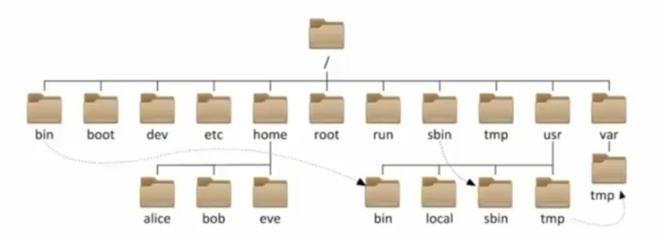
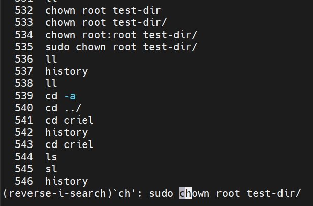
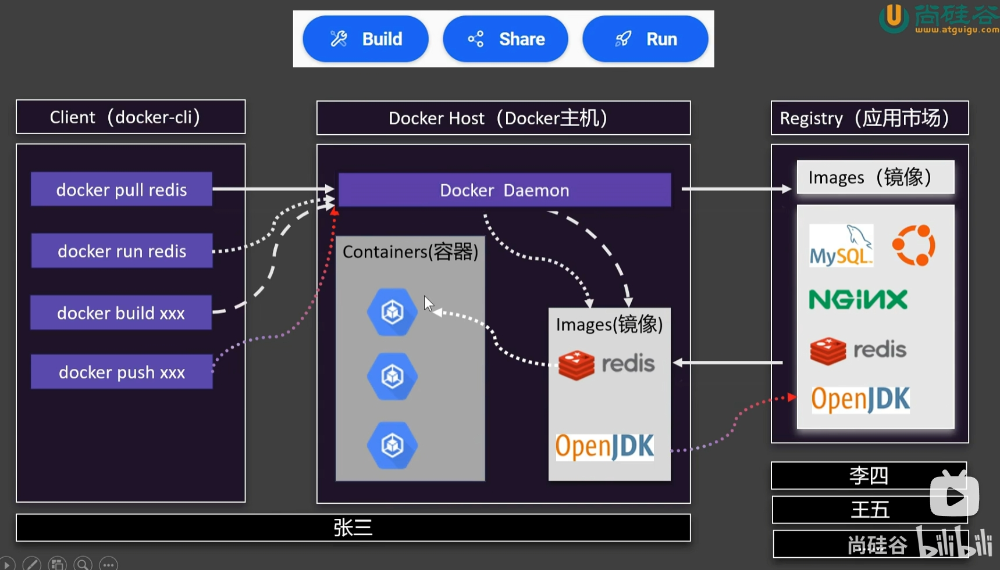

# Linux学习笔记

黑马2022年的教程： https://www.bilibili.com/video/BV1n84y1i7td/?p=16&share_source=copy_web&vd_source=184246d521185707999f94e18a91519f

教程使用的是centOS，我自己用的是ubuntu，部分命令有所区别

Docker教程来自尚硅谷：https://www.bilibili.com/video/BV1Zn4y1X7AZ/?spm_id_from=333.1387.favlist.content.click&vd_source=bcf74066f3a850447ee698d388e1d9e2


## 目录结构

Linux没有盘符的概念，只有一个根目录`/`，所有文件都在它下面；

路径：Windows一般用反斜杠`\`，Linux一般用斜杠`/`




## 命令通用格式

`command [-options] [parameter]`

即**命令，可选选项，可选参数**


## 基本命令

### `ls` 展示目录/文件

默认是平铺展示当前**工作目录**下的文件和路径；

工作目录默认是：`/home/username`

基本使用：

```
ls [-a -l -h] [路径]
```

- `-a`
  - 显示隐藏的内容，也即是名字以`.`开始的文件或路径
- `-l`
  - 默认平铺，加上后是竖向列表展示
  - 会展示更多信息，如权限信息、是路径还是文件等
- `-h`
  - 一定要和`-l`一起用，例如`ls -l -h`或`ls -lh`
  - 展示出文件/路径的大小，会显示出K，G等单位

例子：展示根目录

```powershell
ls -lh /
```

实际上可以具体到文件，例如要查看一个文件的大小：

```powershell
criel@CrielLaptop:~/myfiledir1$ ls -lh ./my-file1.txt
-rw-r--r-- 1 criel criel 42 May  8 20:38 ./my-file1.txt
```


### `cd` 更改工作目录

更改工作目录

基本使用：

```
cd [路径]
```

如果不写参数，表示回到用户的`home目录`

例子：到根目录

```
cd /
```


### `pwd` 查看工作目录

即**P**rint **W**ork **D**irectory查看当前的工作目录；

基本使用：

```
pwd
```

没有选项，没有参数；

例如默认情况下会输出：

```
/home/username
```


### 路径表示

- 绝对路径
  - 从`/`开始，例如`/home/username`
- 相对路径
  - 没有`/`开始，直接`home/username`

特殊标识

- 当前目录：`./xxx`
- 上一级目录：`../xxx`
- home目录：`~/xxx`


### `mkdir` 创建目录

即**m**a**k**e **dir**ectory，创建目录；

基本使用：

```
mkdir [-p] 路径
```

- 路径可以相对路径，也可以绝对路径
- `-p`表示自动创建不存在的父目录；如果不加上参数，若父目录不存在，则会报错

tip：修改路径涉及权限问题，一般在`home`目录下使用，在`home`之外则一般没有权限创建


### `touch`-`cat`-`more` 创建/查看文件

`touch`创建文件

```
touch 文件路径
```


`cat`查看文件，将内容全部展示

```
cat 选项 文件路径
```

有很多选项，常用的可能有

- `-n` 显示行号
- `-v`显示不可打印字符

`tac`反向查看文件，按行号反向，例如123行变成321行

```
tac 文件路径
```


`more`查看文件，支持翻页查看，适合大文件

```
more 文件路径
```

用`空格`显示下一页，用`Enter`显示下一行

翻页到最后或按`q`退出；


### `cp`-`mv`-`rm` 复制移动删除

`cp` 复制文件或路径

```
cp [-r] 源路径 目标路径
```

`-r`用于复制路径，表示递归，实际上只要复制的是路径，就需要加上`-r`

- 文件名称可以不同，例如：

```powershell
cp test1.txt test2.txt
```

- 文件放到文件夹中可以直接这样（不加`/`也可以）

```powershell
cp test1.txt new-dir/
```


`mv` 移动文件或路径

```
mv 原路径 目标路径
```

可以有改名的效果，其实和`cp`类似，例如：

```powershell
mv test1.txt test2.txt
```


`rm` 删除文件或路径

```
rm [-r -f] 路径1 路径2 ... 路径n
```

- `-r` 用于删除路径
- `-f` 表示强制删除，不显示提示
  - 实际上ubuntu默认并不会提示“确认删除”，可以通过`-i`选项来显示提示
  - 而centOS在root角色下，使用`rm`命令就默认会提示“确认删除”
  - 所以`-f`实际上并没有什么╮(╯▽╰)╭
- 可支持无限数量的参数，可以一次多次删除多个文件/路径

关于通配符 `*`

- 如果参数是 `路径名` 或 `路径名/` ，会删除路径及其里面的内容
- 如果参数是 `路径名/*` ，则只会删除路径里面的内容，不i会删除路径本身
- 对于名称，可以用于类似mysql中的`%`模糊匹配，例如匹配`test*`，`*test`，`*test*`等
  - 如果加上了`-r`，则匹配的文件和路径都会被删除
  - 如果没加`-r`，就会删除文件，保留路径

经典删库跑路命令：

```
rm -rf /*
```


### `which` - `find` 查找目录/文件

`which`查找命令程序

```
which 命令
```

Linux的命令实际上是一个个二进制可执行程序，通过`which`找到命令程序坐在的位置，例如

```powershell
criel@CrielLaptop:~$ which ls
/usr/bin/ls
```

查看`/usr/bin/`目录，可以看到超多命令


`find`查找文件

默认用法：

```
find 名称
```

会查找出当前工作目录下匹配对应名称的文件或路径

```powershell
criel@CrielLaptop:~$ ls
dockersh.sh  install-docker.sh  myfile1  myfile2  myfile3  myfiledir1  myfiledir2  test-docker
criel@CrielLaptop:~$ find myfile*
myfile1
myfile2
myfile3
myfiledir1
myfiledir2
```


指定参数，按**名称**查找：

```
find 起始路径 -name '名称'
```

- 名称需要**引号**，单引号或者双引号都可以
- 不加起始路径就是从当前路径，应该是默认的参数是`./`
  - 其实就是加了起始路径的话，显示的结果就会拼接上加的起始路径

```powershell
criel@CrielLaptop:~$ ls
dockersh.sh  install-docker.sh  myfile1  myfile2  myfile3  myfiledir1  myfiledir2  test-docker
criel@CrielLaptop:~$ find -name 'myfile*'
./myfiledir1
./myfile1
./myfile2
./myfiledir2
./myfile3
criel@CrielLaptop:~$ find ~/ -name "myfile*"
/home/criel/myfiledir1
/home/criel/myfile1
/home/criel/myfile2
/home/criel/myfiledir2
/home/criel/myfile3
```


指定参数，按**大小**查找：

```
find 起始路径 -size +|-n[ckMG]
```

- `+`号或`-`号表示大于或小于，不写表示精确匹配
- `n`是数字
- 最后是单位，注意大小写
  - 其中`c`表示字节
  - 其他的对应关系是：`k - kB, M - MB, G - GB`

如果不指定单位，是按“块”来查找的，1块是512B，示例：

```powershell
criel@CrielLaptop:~/myfiledir1$ ls -lh
total 16K
drwxr-xr-x 2 criel criel 4.0K May  8 20:37 my-dir-1
drwxr-xr-x 2 criel criel 4.0K May  8 20:37 my-dir-2
-rw-r--r-- 1 criel criel   42 May  8 20:38 my-file1.txt
-rw-r--r-- 1 criel criel   14 May  8 20:38 my-file2.txt
-rw-r--r-- 1 criel criel    0 May  8 20:49 my-file3.txt
criel@CrielLaptop:~/myfiledir1$ find . -size -1
./my-file3.txt
criel@CrielLaptop:~/myfiledir1$ find . -size -2
./my-file2.txt
./my-file1.txt
./my-file3.txt
```

> 对于“块”的定义，如果1个文件小于512B，那它占1块，如果是例如600B，则占2块；所以按照上面的例子，只有**大小为0**的文件才符合“**小于1块**”；

精确匹配示例：

```powershell
criel@CrielLaptop:~/myfiledir1$ find . -size 1
./my-file2.txt
./my-file1.txt
criel@CrielLaptop:~/myfiledir1$ find . -size 14c
./my-file2.txt
```


GPT给的复杂用法示例，可用于处理过期日志：

```powershell
find /var/log \
  -type f \
  \( -name "*.log" -o -name "*.txt" \) \
  -size +5M \
  -mtime +30 \
  -not -path "*/archive/*" \
  -exec gzip -v {} \;
```

- 命令解析：

  - `find /var/log`：在 `/var/log` 目录及其子目录中查找文件。

  - `-type f`：仅查找普通文件（不包括目录、符号链接等）。

  - `\( -name "*.log" -o -name "*.txt" \)`：匹配扩展名为 `.log` 或 `.txt` 的文件。
    - 这里使用的反斜杠的转义字符来表示括号

  - `-size +5M`：文件大小大于 5 兆字节（MiB）。

  - `-mtime +30`：文件最后修改时间在 30 天之前。

  - `-not -path "*/archive/*"`：排除路径中包含 `/archive/` 的文件。

  - `-exec gzip -v {} \;`：对符合条件的每个文件执行 `gzip -v` 命令进行压缩，`{}` 会被当前文件路径替换，`\;` 表示命令结束。

- 示例用途：
  - 此命令适用于系统管理员在清理日志文件时使用，特别是当需要压缩那些较旧且占用大量空间的日志文件，同时避免处理已归档的文件。

- 注意事项：

  - 使用 `\(` 和 `\)` 来组合多个条件，确保逻辑关系正确。

  - `-o` 表示逻辑“或”，`-not` 表示逻辑“非”。

  - `-exec` 后的命令会对每个匹配的文件执行一次，若处理大量文件，考虑使用 `-exec ... {} +` 或结合 `xargs` 提高效率


### `grep` 过滤文件行

**g**lobal **r**egular **e**x**p**ression

从文件中通过关键字过滤文件行

```
grep [-n] 关键字 文件路径
```

- `-n` 表示结果显示行号
- 关键字建议加上引号

```powershell
criel@CrielLaptop:~$ cat -n my-file1.txt
     1  #include <stdio.h>
     2
     3  int main(){
     4      int n = 10;
     5      int arr[] = {1, 2, 3, 4};
     6      int arr[] = {1, 2, 3, 4};
     7      printf("%f\n", n / 3.0);
     8      printf("abc");
     9      return 0;
    10  }
criel@CrielLaptop:~$ grep -n int my-file1.txt
3:int main(){
4:    int n = 10;
5:    int arr[] = {1, 2, 3, 4};
6:    int arr[] = {1, 2, 3, 4};
7:    printf("%f\n", n / 3.0);
8:    printf("abc");
criel@CrielLaptop:~$ grep -n "int " my-file1.txt
3:int main(){
4:    int n = 10;
5:    int arr[] = {1, 2, 3, 4};
6:    int arr[] = {1, 2, 3, 4};
```


### `wc` 文件统计

**w**ord **c**ount 统计文件的行数，字数等信息

```
wc [-l -w -c -m] 文件路径
```

- `-l` 统计行数
- `-w` 统计词数
- `-c` 统计字节数
- `-m` 统计字符数

不加参数，则按顺序显示：**行数、词数、字节数**

```powershell
criel@CrielLaptop:~$ wc my-file1.txt
 12  31 186 my-file1.txt
```


### `|` 管道符

进程通信，将管道左边命令的结果 作为 右边命令的输入

例如可以统计文件数量

```powershell
criel@CrielLaptop:~$ ll /usr/bin | wc -l
884
```


### `echo` 打印

```
echo 输出的内容
```

其实就是一个print方法，默认是打印在控制台

```powershell
criel@CrielLaptop:~$ echo hello world
hello world
criel@CrielLaptop:~$ echo "hello world"
hello world
```

通过**反引号 `` `命令` ``** 来执行命令，并输出

```powershell
criel@CrielLaptop:~$ echo ls
ls
criel@CrielLaptop:~$ echo `ls`
dockersh.sh install-docker.sh my-file1.txt test-docker
```

也可以用`$(命令)`

```powershell
criel@CrielLaptop:~$ echo $(ls) > 1.txt
criel@CrielLaptop:~$ cat 1.txt
1.txt dockersh.sh install-docker.sh jiayang.cpp my-link1 target-1 target-1.tar target-2.tar.gz target-3.tar target-5 target-5.zip test-dir test-docker
```


通过`>`重定向符，**覆盖**写入文件；通过`>>`重定向符，**追加**写入文件（追加新的一行）

```powershell
criel@CrielLaptop:~$ cat my-file2.txt
criel@CrielLaptop:~$ echo "Hello" > my-file2.txt
criel@CrielLaptop:~$ cat my-file2.txt
Hello
criel@CrielLaptop:~$ echo "Hello2" > my-file2.txt
criel@CrielLaptop:~$ cat my-file2.txt
Hello2
criel@CrielLaptop:~$ echo "Hello3" >> my-file2.txt
criel@CrielLaptop:~$ cat my-file2.txt
Hello2
Hello3
criel@CrielLaptop:~$ ls > my-file2.txt
criel@CrielLaptop:~$ cat my-file2.txt
dockersh.sh
install-docker.sh
my-file1.txt
my-file2.txt
test-docker
```


### `tail`追踪文件更改

查看文件尾部内容，或持续追踪文件更改

```
tail [-f -数字] 文件路径
```

- `-f` 表示持续追踪，**f**ollow
- `-数字`表示查看的行数，默认查看10行


### `getent` 查看数据库

即**get ent**ries的缩写

`getent` 命令用于从系统的**管理数据库**中获取条目，这些数据库包括：

- `passwd`（用户账号信息）
- `group`（用户组信息）
- `hosts`（主机名与 IP 映射）
- `services`（网络服务端口信息）
- 以及 `ahosts`、`protocols`、`networks`、`rpc` 等共十余种

例如：

```powershell
criel@CrielLaptop:~$ getent hosts
127.0.0.1       localhost
127.0.1.1       CrielLaptop. CrielLaptop
127.0.0.1       ip6-localhost ip6-loopback
criel@CrielLaptop:~$ getent passwd
root:x:0:0:root:/root:/bin/bash
daemon:x:1:1:daemon:/usr/sbin:/usr/sbin/nologin
bin:x:2:2:bin:/bin:/usr/sbin/nologin
sys:x:3:3:sys:/dev:/usr/sbin/nologin
（节选部分）
criel:x:1000:1000:,,,:/home/criel:/bin/bash
redis:x:105:108::/var/lib/redis:/usr/sbin/nologin
sshd:x:106:65534::/run/sshd:/usr/sbin/nologin
xiaoming:x:1001:1002::/home/xiaoming:/bin/bash
```


## 用户权限

### 基本权限

普通用户一般在自己的`home`目录下是没有限制的，但是在其他地方一般只有**只读**和**执行**的权限（可以看看下面的`test-docker`文件的权限信息）

看`ll`的结果：

```powershell
criel@CrielLaptop:~$ ll
total 84
drwxr-x--- 7 criel criel 4096 May 12 20:11 ./
drwxr-xr-x 4 root  root  4096 May 12 16:08 ../
-rw------- 1 criel criel   57 May 12 20:11 .Xauthority
-rw------- 1 criel criel 5985 May 12 20:11 .bash_history
-rw-r--r-- 1 criel criel  220 Dec  5 16:25 .bash_logout
-rw-r--r-- 1 criel criel  121 Apr 20 12:35 .bash_profile
-rw-r--r-- 1 criel criel 3922 May  8 17:22 .bashrc
-rw-r--r-- 1 criel criel  186 May 10 18:57 my-file1.txt
-rw-r--r-- 1 criel criel    0 May 10 17:32 my-file2.txt
drwxr-xr-x 7 criel criel 4096 Apr 24 13:53 test-docker/
（节选部分）
```

前面3项内容分别是：**权限控制信息，所属用户，所属用户组**

权限信息具体内容如下，其实就是：文件类型 + 读、写、执行权限，如果显示`-`就是没有这个权限


具体的权限：

- **读 read**
  - 文件：查看文件内容
  - 路径：查看路径下内容，如`ls`
- **写 write**
  - 文件：修改文件
  - 路径：对路径下的文件/路径做创建、删除、改名操作
- **执行 execute**
  - 文件：作为程序执行
  - 路径：可更改工作目录到该路径，即`cd`进入


用户操作时，内核会先匹配所属用户，然后匹配用户组，没有再列为“其他用户”，然后按照匹配的情况做权限判断；所以，如果所属用户和所属用户组并不匹配，其实也可以正常使用；


### 用户切换

即**s**witch **u**ser的缩写

```
su [-] 用户名
```

- `-`表示在切换用户后**加载环境变量**

- 不加用户名则默认切换到的`root`

- 切换后，通过 `exit` 或 `ctrl` + `d` 退回上一个用户

- 普通用户`A`切换到其他用户`B`，需要输入用户`B`的密码

- root用户切换到其他用户不需要输入密码

  - 所以有个骚操作，不需要知道别人的密码也可以切换到别人的账号

  - ```powershell
    sudo su - newUser
    ```

  - 然后输入自己的密码就可以了


临时获得root授权

```
sudo 其他命令
```

在root用户下输入`visudo`，会自动打开`/ect/sudoers`

如果在里面配置上下面的内容，则用户使用`sudo`命令不需要输入密码

```
username ALL=(ALL) NOPASSWD:ALL
```

在ubuntu中，`sudoers`中有这样的内容

```properties
# Allow members of group sudo to execute any command
%sudo   ALL=(ALL:ALL) ALL
```

在普通用户输入`id`查看用户组，可以看到里面有`sudo`，有就说明可以用，没有就不行

```powershell
criel@CrielLaptop:~$ id
uid=1000(criel) gid=1000(criel) groups=1000(criel),4(adm),20(dialout),24(cdrom),25(floppy),27(sudo),29(audio),30(dip),44(video),46(plugdev),100(users),107(netdev),1001(docker)
```

没权限则显示如下：

```powershell
xiaoming@CrielLaptop:~$ sudo mkdir /test
[sudo] password for xiaoming:
xiaoming is not in the sudoers file.
```


### 用户和用户组

创建用户组

```
groupadd 用户组名
```

删除用户组

```
groupdel 用户组名
```

创建用户

```
useradd [-g -d -m] 用户名
```

- `-g` 表示指定用户组，如果不加，则会自动创建一个同名的用户组并自动加入

- `-d` 表示指定用户的`home`目录

  - 在centOS中，不加则默认`/home/username`

  - 在ubuntu中，不加则不会创建`home`目录，需要通过`-m`选项来创建

    - 此外，默认创建的Shell是`/bin/sh`而不是`/bin/bash`，不会包含包含 `.bashrc`、`.profile` 等文件

    - 所以最佳的创建方式应该是：

    - ```powershell
      useradd -m -s /bin/bash <username>
      ```

- 还有很多其他的选项，例如`-p`设置密码，`-G`指定多个用户组

删除用户

```
userdel [-r] 用户名
```

- `-r` 表示顺便删除用户的`home`目录


查看所有用户信息，显示内容是`用户名:密码:用户ID:组ID:描述信息:home目录:执行终端`

```powershell
criel@CrielLaptop:~$ getent passwd
criel:x:1000:1000:,,,:/home/criel:/bin/bash
```

查看用户所属组

```
id [用户名]
```


修改用户信息

- 将某用户加入某用户组

  - ```
    usermod -aG 用户组 用户名
    ```

- 此外还有`-p`设置密码等


### `chmod` 修改权限

修改权限，只有所属用户或root用户可以做修改

```
chmod [-R] 权限信息 文件或路径
```

- `-R` 表示对路径下的全部内容做相同的操作
- 权限信息的表示，在`--help`中描述为：
  - 原文：`Each MODE is of the form '[ugoa]*([-+=]([rwxXst]*|[ugo]))+|[-+=][0-7]+'.`
    - 其中，`u, g, o, a` 分别代表 user（拥有者）、group（同组用户）、others（其他用户）、all（所有用户）
    - 操作符 `+`, `-`, `=` 用于添加、移除或直接设置权限
    - 权限位可以是 `r`（读）、`w`（写）、`x`（执行）、`X`（特殊执行）、`s`（setuid/setgid）、`t`（sticky），也可以使用 `u`, `g`, `o` 来复制某个类的当前权限
    - 数字模式则用一个或多个八进制数字直接指定权限位，前导零可省略
  - 具体看例子

```powershell
# 设置为rwxr-xr-x，即7 = 4 + 2 + 1, 5 = 4 + 1
chmod 755 file.txt
# 添加权限（所属用户）
chmod u+rwx file.txt
# 移除权限（用户组和其他用户）
chmod go-w file.txt
# 直接指定（以上都是可以同时指定多个的）
# 	这里指定并不能用横杠，例如 g=rw-，
#	可以不按顺序，例如可以 g=wr
chmod ug=rw,o=r file.txt
```

可以直接复制权限，例如复制`g`的权限到`o`

```powershell
criel@CrielLaptop:~$ ll my-file1.txt
-rw-rw-r-- 1 criel criel 186 May 10 18:57 my-file1.txt
criel@CrielLaptop:~$ chmod o=g my-file1.txt
criel@CrielLaptop:~$ ll my-file1.txt
-rw-rw-rw- 1 criel criel 186 May 10 18:57 my-file1.txt
```


### `chown` 修改所属

修改文件/路径所属的用户和用户组

然而普通用户并没有权限让其他用户来当新的所属，所以只有root可以用

```
chown [-R] [用户][:用户组] 文件或路径
```

- `-R` 表示对路径下的全部内容做相同的操作

- 如果只修改用户，只写 `username`
- 如果只修改用户组，写 `:group`


## vim

缩写前：visual interface


### 模式切换

- 打开时默认是**正常模式**（或命令模式）

- **编辑模式**下按下`esc`进入**正常模式**，可以输入命令进入**命令行模式**（或底线命令模式）

从正常模式进入编辑模式：

- 按下`i`或`Insert`使得光标在当前位置的前面，按下`a`则在后面（2个操作分别对应单词“insert”和“append”）
  - 例如 "ab**c**de"，在正常模式时，光标定位在c
  - 如果按下`i`，再输入1，就是 "ab1**c**d"
  - 如果按下`I`，再输入1，就是 "1abcd"
    - 实测会自动跳到第一个非空格的位置前面（或者说缩进的后面）
  - 如果按下`a`，再输入1，就是 "ab**c**1d"
  - 如果按下`A`，再输入1，就是 "ab**c**d1"
- 按下`o`或`O`，表示自动创建一行
  - 按下`o`，创建下一行，相当于在当前行的末尾按下回车
  - 按下`O`，创建上一行


### 光标移动

就是按`esc`后，在正常模式下移动光标

- 左下上右
  - 分别使用`h`, `j`, `k`, `l`表示
  - （虽然比较近，但是不习惯的话，可能用方向键更舒服一点）
- 按单词移动
  - 使用`w`，跳到下一个单词的开头
  - 使用`b`，跳到上一个单词的开头
  - 使用`e`，跳到下一个单词的末尾
  - （如果有很多符号，用起来有点怪）
- 使用`G`移动到文件最后，使用`gg`移动到文件最开始

- 向下移动n行
  - 使用`数字j`表示
  - 例如当前在第3行，要移动到第8行，需要移动5行，输入`5j`

- 移动到第n行的开头
  - 使用 `:行号` 表示
    - 例如要移动到第9行，输入`:9`回车
  - 或者使用 `行号G`
    - 例如要移动到第9行，输入`9G`


### 新建与退出

编辑或新建

```
vim test.txt
```

退出（会提示需要选择保存或者不保存）

```
:q
```

保存并退出（`w`就是保存的意思，不能反过来`qw`，这样的话语义是"退出再保存"）

```
:wq
```

所以也可以仅保存，就相当于按`ctrl` + `s`

```
:w
```

不保存，强制退出

```
:q!
```


### 显示/隐藏行号

显示行号

```
:set nu
```

隐藏行号

```
:set nonu
```


### 复制粘贴删除

复制当前行

```
yy
```

复制当前单词

```
yw
```


粘贴在当前行的下一行（新行）

>这和现在windows上的整行复制粘贴是相反的..

```
p
```

粘贴多行，例如粘贴在下3行，则是`3p`

```
行数p
```


删除当前行

```
dd
```

删除当前字符 delete a word

```
dw
```

删除当前字符并进入编辑模式 change a word

```
cw
```

删除括号中的内容，这里是会删除当前光标下面最近的一个对应类型的括号里的内容

```
di( 或 di[ 或 di{
```

删除并修改括号中的内容

```
ci( 或 ci[ 或 ci{
```


### 重复上次操作

英语的句号，点

```
.
```


### 撤回操作

英文单词是undo

```
u
```

可以用`ctrl` + `r`来撤销刚才的撤销，其实就是现在大多软件的`ctrl` + `shift` + `z` 或 `ctrl` + `y`


### 查找替换

```
/查找内容
```

按回车就开始定位

- 按`n`查找下一个
- 按`N`查找上一个

如果想忽略大小写，在后面加上`\c`

```
/查找内容\c
```


当前行替换，替换当前行的第一个匹配项

```
:s/旧文本/新文本/
```

全局替换，`%`表示文件范围，`g`表示global

```
:%s/旧文本/新文本/g
```

忽略大小写替换

```
:%s/旧文本/新文本/gi
```

指定5行到10行替换

```
:5,10s/旧文本/新文本/g
```

指定当前行到末尾替换

```
:.,$s/旧文本/新文本/g
```


### 自动补全

按`ctrl` + `n`，会有和力扣一样的补全；

就是写过的单词会出现的选择框中，例如写了"printf","println"，那么输入”pr“，再按`ctrl` + `n`，就有选择框，里面显示2个单词；


### 视觉模式

- 按`ctrl` + `v`，然后移动光标；
  - 效果类似在IDEA里按鼠标中键然后拖动，其实就是相当于增强版的鼠标左键拖动，不过可以上下选中中间一个部分；

- 按`shift` + `v`，上下移动光标
  - 选中整行

选中后，按下`d`，就可以删除选中的内容


## 常用操作

### 高亮终端

如果界面没有颜色高亮，例如`ls`命令区分文件和路径，可能是没有加载到`.bashrc`文件，通过以下命令解决：

```
source ~/.bashrc
```

注意`.bashrc`文件是在`home`下，如果已经在，就不用加上`~/`


### 查看系统版本

查看内核版本

```
uname -a
```

查看发行版本

```
lsb_release -a
```

查看详细系统信息（只能在启用了 systemd 的发行版（如较新的 RHEL、CentOS、Ubuntu）上）

```powershell
criel@CrielLaptop:~$ hostnamectl
 Static hostname: CrielLaptop
       Icon name: computer-container
         Chassis: container ☐
      Machine ID: 0f97aa820f594da78cdf23e89ad8e81e
         Boot ID: 821a2c0788e842ae9f752bcde849da58
  Virtualization: wsl
Operating System: Ubuntu 24.04.1 LTS
          Kernel: Linux 5.15.167.4-microsoft-standard-WSL2
    Architecture: x86-64
```


### 历史命令

查看历史命令，从上往下

```powershell
criel@CrielLaptop:~$ history
    1  ls -l
    2  ls -l /
   （省略中间部分）
  536  ll
  537  history
```

执行最近的前缀命令，使用`!` + `前缀`，例如在上面的基础上执行`!l`，就会执行`ll`

```powershell
criel@CrielLaptop:~$ !l
ll
total 88
drwxr-x--- 8 criel criel 4096 May 12 20:52 ./
drwxr-xr-x 4 root  root  4096 May 12 16:08 ../
-rw------- 1 criel criel   57 May 12 20:35 .Xauthority
-rw------- 1 criel criel 5948 May 12 20:35 .bash_history
-rw-r--r-- 1 criel criel  220 Dec  5 16:25 .bash_logout
```

会执行完整的命令，包括之前的参数，其实就是相当于按了很多次方向键`↑`，然后按回车执行

```powershell
  （省略上面的部分）
  541  cd criel
  542  history
criel@CrielLaptop:~$ !c
cd criel
```

也可以按`ctrl` + `r`搜索历史命令，例如搜索"ch"；搜索完再按左右方向键，就可以进入正常编辑命令的模式，其实也是相当于按了很多次方向键`↑`




### 软件安装

一般用包管理工具直接自动下载安装，需要root权限，需要联网

对于CentOS，软件安装包格式是 `.rpm`，包管理如下：

```
yum [-y] [install | remove | search] 软件名称
```

- 安装过程中需要手动确认，通过选项`-y`来自动确认，不再询问

对于Ubuntu，软件安装包格式是 `.deb`，包管理如下：

```
apt [-y] [install | remove | search] 软件名称
```


### `systemctl` 服务管理

```
systemctl start | stop | status | enable | disable 服务名
```

- start 启动
- stop 停止
- status 查看状态
- enbale 开机自启
- disable禁用开机自启

服务有例如

- 系统内置：例如firewalld防火墙服务，ssh服务等

> tip：ubuntu推荐安装**UFW**（Uncomplicated Firewall）防火墙
>
> ```
> sudo apt install ufw  
> ```

- 外部软件（如通过apt安装的）：例如docker等
  - 需要软件自己有集成`systemctl`


### `ln` 软/硬链接

**软连接**：类似windows中的“快捷方式”，是一个独立的特殊文件，内部存储目标文件的路径，当访问时再读取目标内容

```
ln -s 被链接的文件/路径 链接到的目的地
```

- `-s`表示symbolic，直译是“符号链接”


软链接示例：

```powershell
criel@CrielLaptop:~$ ln -s /etc/wsl.conf ~/wsl.conf
criel@CrielLaptop:~$ ll ~/wsl.conf
lrwxrwxrwx 1 criel criel 13 May 15 15:36 /home/criel/wsl.conf -> /etc/wsl.conf
criel@CrielLaptop:~$ ll /etc/wsl.conf
-rw-r--r-- 1 root root 20 Sep 28  2024 /etc/wsl.conf

criel@CrielLaptop:~$ echo "hello" >> ~/wsl.conf
-bash: /home/criel/wsl.conf: Permission denied
```

这里把`/etc/wsl.conf`软链接到`home`下，可以看到有完整的权限，而且所属、文件大小都不一样，但是当我们操作文件时，实际上是操作原本的文件，还是按照原本的权限来的，所以这修改不了；

```powershell
criel@CrielLaptop:~$ ln -s my-file1.txt my-link1
criel@CrielLaptop:~$ rm my-file1.txt
# 创建软链接后删除原本的文件

criel@CrielLaptop:~$ ll my-link1
lrwxrwxrwx 1 criel criel 12 May 15 15:51 my-link1 -> my-file1.txt
# 上面的内容在终端会显示成红色

criel@CrielLaptop:~$ echo "hello" >> my-file1.txt
criel@CrielLaptop:~$ ls
dockersh.sh  install-docker.sh  my-file1.txt  my-link1  test-dir  test-docker
# 对照组：用echo写入，这里会自动创建文件

criel@CrielLaptop:~$ rm my-file1.txt
criel@CrielLaptop:~$ echo "hello" >> my-link1
criel@CrielLaptop:~$ ls
dockersh.sh  install-docker.sh  my-file1.txt  my-link1  test-dir  test-docker
# 如果用echo写入软链接，则会自动创建一个原本的文件my-file1.txt
```


**硬链接**：是对同一 inode（索引节点）的“别名”，不同文件名共享相同的文件数据

```
ln 被链接的文件 链接到的目的地
```

- 不加参数则默认是硬链接
- 软链接允许目录链接，硬链接则不行

硬链接示例：

```powershell
criel@CrielLaptop:~$ ln /etc/wsl.conf ~/wsl.conf
ln: failed to create hard link '/home/criel/wsl.conf' => '/etc/wsl.conf': Operation not permitted
# 首先如果把上面的软链接示例直接改为硬链接，会没有权限，所以这里用别的文件示例；

criel@CrielLaptop:~$ ls
dockersh.sh  install-docker.sh  my-file1.txt  my-file2.txt  my-link1  test-dir  test-docker
criel@CrielLaptop:~$ ln my-file2.txt my-link2
criel@CrielLaptop:~$ ll my-file2.txt
-rw-r--r-- 2 criel criel 0 May 10 17:32 my-file2.txt
criel@CrielLaptop:~$ ll my-link2
-rw-r--r-- 2 criel criel 0 May 10 17:32 my-link2
criel@CrielLaptop:~$ echo "heloooo" >> my-link2
criel@CrielLaptop:~$ ll my-file2.txt
-rw-r--r-- 2 criel criel 8 May 15 15:43 my-file2.txt
criel@CrielLaptop:~$ ll my-link2
-rw-r--r-- 2 criel criel 8 May 15 15:43 my-link2
# 注意硬链接和文件本身，大小是一起变化的；

criel@CrielLaptop:~$ rm my-file2.txt
criel@CrielLaptop:~$ ll my-link2
-rw-r--r-- 1 criel criel 8 May 15 15:45 my-link2
# 如果删除了原本的文件，链接文件还是存在，还是正常的；
```


### 日期和时区

`date`查看系统时间

```
date [-d 日期变化参数] [+格式化字符串]
```

- `-d` 选项需要跟上日期变化参数，具体看示例

示例：

```powershell
criel@CrielLaptop:~$ date
Thu May 15 15:59:43 CST 2025
criel@CrielLaptop:~$ date '+%Y-%m-%d %H:%M:%S'
2025-05-15 16:04:07

criel@CrielLaptop:~$ date -d '+1day'  '+%Y-%m-%d %H:%M:%S'
2025-05-16 16:04:16
criel@CrielLaptop:~$ date -d '-1month'  '+%Y-%m-%d %H:%M:%S'
2025-04-15 16:04:22
criel@CrielLaptop:~$ date -d '-5year'  '+%Y-%m-%d %H:%M:%S'
2020-05-15 16:04:32
criel@CrielLaptop:~$ date -d '+10second'  '+%Y-%m-%d %H:%M:%S'
2025-05-15 16:04:53

# 还可以用 %s 显示时间戳
criel@CrielLaptop:~$ date -d '-100year'  '+%Y-%m-%d %H:%M:%S'
1925-05-15 16:06:59
criel@CrielLaptop:~$ date -d '-100year'  '+%s'
-1408463576
```


**修改系统时区**，实际上就是需要修改`/etc/localtime`的软链接指向，可以删掉重新创建软链接

```powershell
criel@CrielLaptop:~$ ll /etc/localtime
lrwxrwxrwx 1 root root 33 May 15 15:24 /etc/localtime -> /usr/share/zoneinfo/Asia/Shanghai
```

`/usr/share/zoneinfo`路径就有很多时区信息

```powershell
criel@CrielLaptop:~$ ls /usr/share/zoneinfo
Africa      Asia       CST6CDT  Etc      HST     MST7MDT  WET                localtime   zone1970.tab
America     Atlantic   EET      Europe   Indian  PST8PDT  iso3166.tab        posixrules  zonenow.tab
Antarctica  Australia  EST      Factory  MET     Pacific  leap-seconds.list  tzdata.zi
Arctic      CET        EST5EDT  GMT      MST     UTC      leapseconds        zone.tab
```

> 发现个好玩的，`Asia`路径下有一个`Shanghai`，还有一个`Chongqing`，结果这个`Chongqing`是一个软连接，然后指向`Shanghai`....


视频里使用`ntp`校准时间，需要安装ntp软件包，然后通过`systemctl`启动；

对于**ubuntu**：默认使用`systemd‐timesyncd` ，它是 systemd 随附的轻量级 SNTP 客户端，用于定期从配置的 NTP 服务器获取时间并校正本地时钟；**不支持作为 NTP 服务器**对外提供时间，只能作为客户端校时；

```powershell
criel@CrielLaptop:~$ timedatectl status
               Local time: Thu 2025-05-15 16:18:11 CST
           Universal time: Thu 2025-05-15 08:18:11 UTC
                 RTC time: Thu 2025-05-15 08:18:12
                Time zone: Asia/Shanghai (CST, +0800)
System clock synchronized: yes
              NTP service: active
          RTC in local TZ: no
```

GPT推荐使用`chrony`，**可用作 NTP 服务器**，也可作为客户端；对离线后重连后的大偏差校正更友好；

```powershell
criel@CrielLaptop:~$ sudo apt install chrony

# 可以查看详细信息
criel@CrielLaptop:~$ chronyc tracking
Reference ID    : 50484330 (PHC0)
Stratum         : 1
Ref time (UTC)  : Thu May 15 08:25:56 2025
System time     : 0.000001751 seconds slow of NTP time
Last offset     : -0.000003829 seconds
RMS offset      : 0.230808645 seconds
Frequency       : 0.194 ppm fast
Residual freq   : -0.089 ppm
Skew            : 0.634 ppm
Root delay      : 0.000000001 seconds
Root dispersion : 0.001591741 seconds
Update interval : 8.0 seconds
Leap status     : Normal
```


### IP地址与主机名

通过`ifconfig`查看IP地址；

还有一个命令是`ip a`，是`ip addr`的缩写，更加强大好用；


通过`hostname`查看主机名；

```powershell
criel@CrielLaptop:~$ hostname
CrielLaptop
```

通过`hostnamectl`可以修改主机名

```powershell
criel@CrielLaptop:~$ sudo hostnamectl set-hostname criel-laptop
[sudo] password for criel:

# 重启终端后
criel@criel-laptop:~$ hostname
criel-laptop
```


### 网络请求

`ping`命令检查网络连通状态

```
ping [-c 次数] ip或域名
```

- `-c` 用于指定次数，和windows的不同，linux的`ping`默认会无限进行下去

`wget`用于在命令行内下载网络文件

```
wget [-b] url地址
```

- `-b` 表示后台下载，会将日志写入到当前工作目录的wget-log文件

`curl`发送网络请求

```
curl [选项] url地址
```

- `-O` 选项用于下载文件，url是下载地址时，可以保存文件

- `-v` 查看详细的连接信息，如握手等
- `-I` 显示请求头内容

```powershell
# 下面的"https://”其实可以不写
criel@CrielLaptop:~$ curl -v https://www.bilibili.com
* Host www.bilibili.com:443 was resolved.
* IPv6: 240e:97d:2000:c0e::32, 240e:97d:10:1402:0:1:1:39, 240e:97d:10:1402:0:1:1:40, 240e:97d:2000:c0e::34, 240e:97d:10:1402:0:1:1:38, 240e:97d:2000:c0e::31, 240e:97d:2000:c0e::33, 240e:97d:2000:c0e::30
* IPv4: 121.194.11.73, 121.194.11.72
*   Trying 121.194.11.73:443...
* Connected to www.bilibili.com (121.194.11.73) port 443
* ALPN: curl offers h2,http/1.1
* TLSv1.3 (OUT), TLS handshake, Client hello (1):
*  CAfile: /etc/ssl/certs/ca-certificates.crt
*  CApath: /etc/ssl/certs
* TLSv1.3 (IN), TLS handshake, Server hello (2):
* TLSv1.3 (IN), TLS handshake, Encrypted Extensions (8):
...（节选）
```

可以向`cip.cc`发起请求，获取本机的公网地址等信息（应该只能国内用）

```powershell
criel@CrielLaptop:~$ curl cip.cc
IP      : 121.33.239.106
地址    : 中国 广东 广州
运营商  : 电信

数据二  : 中国广东广州 | 电信

数据三  : 中国广东省广州市 | 电信

URL     : http://www.cip.cc/121.33.239.106
```


### 端口

`nmap`可以查看某个ip的端口占用情况（非自带，需要apt安装）

```
nmap ip或域名
```

例如：

```powershell
criel@CrielLaptop:~$ nmap www.bilibili.com
Starting Nmap 7.94SVN ( https://nmap.org ) at 2025-05-15 19:56 CST
Nmap scan report for www.bilibili.com (121.194.11.73)
Host is up (0.037s latency).
Other addresses for www.bilibili.com (not scanned): 121.194.11.72 240e:97d:2000:c0e::32 240e:97d:2000:c0e::30 240e:97d:10:1402:0:1:1:38 240e:97d:10:1402:0:1:1:40 240e:97d:2000:c0e::33 240e:97d:2000:c0e::34 240e:97d:10:1402:0:1:1:39 240e:97d:2000:c0e::31
Not shown: 977 closed tcp ports (conn-refused)
PORT     STATE    SERVICE
21/tcp   filtered ftp
22/tcp   filtered ssh
23/tcp   filtered telnet
80/tcp   open     http
....（节选）
```

`netstat`可以查看端口被什么进程占用（实际上，`netstat`可以显示网络连接、路由表、接口状态以及各类网络统计信息）

可以通过`grep`过滤出想要的内容，例如端口号

```
netstat -anp | grep 端口号
```

- `-a`：显示所有连接和监听端口

- `-n`：数字格式输出

- `-p`：显示进程标识符（PID）和程序名称


### 进程管理

使用`ps`命令查看进程信息

```
ps [-e -f]
```

- `-e` 显示全部进程
- `-f` 格式化展示信息（即展示全部信息）
- 一般直接`-ef`连用

```powershell
criel@CrielLaptop:~$ ps -ef
UID          PID    PPID  C STIME TTY          TIME CMD
root           1       0  0 21:50 ?        00:00:00 /sbin/init
root           2       1  0 21:50 ?        00:00:00 /init
root           7       2  0 21:50 ?        00:00:00 plan9 --control-socket 7 --log-level 4 --server-fd
root          50       1  0 21:50 ?        00:00:00 /usr/lib/systemd/systemd-journald
root          95       1  0 21:50 ?        00:00:00 /usr/lib/systemd/systemd-udevd
systemd+     142       1  0 21:50 ?        00:00:00 /usr/lib/systemd/systemd-resolved
root         151       1  0 21:50 ?        00:00:00 /usr/sbin/cron -f -P
message+     152       1  0 21:50 ?        00:00:00 @dbus-daemon --system --address=systemd: --nofork -
root         156       1  0 21:50 ?        00:00:00 /usr/bin/python3 /usr/bin/networkd-dispatcher --run
redis        157       1  0 21:50 ?        00:00:00 /usr/bin/redis-server 127.0.0.1:6379
（节选部分）
```

显示内容分别是

- UID 进程所属用户ID
- PID 进程ID
- PPID 进程的父进程iD
- C 进程的CPU占用率
- STIME 进程的启动时间
- TTY 启动此进程的终端序号，显示`?`表示非终端启动
- TIME 进程占用的CPU时间（累计）
- CMD 进程的启动路径或启动命令


使用`kill`命令关闭进程；

```
kill 进程ID
```

实际上这个命令是向进程发起某种信号；常用的有：

- SIGTERM (15)
  - 默认信号，允许进程捕获并执行清理操作后退出
- SIGKILL (9)
  - 强制终止信号，不可捕获或忽略，进程立即被内核终止

- SIGHUP (1)
  - 挂起信号，常用于通知守护进程重新加载配置而不退出

- SIGINT (2)
  - 中断信号，通常由按 Ctrl+C 触发，可被进程捕获处理

`-l`查看所有信号：

```powershell
criel@CrielLaptop:~$ kill -l
 1) SIGHUP       2) SIGINT       3) SIGQUIT      4) SIGILL       5) SIGTRAP
 6) SIGABRT      7) SIGBUS       8) SIGFPE       9) SIGKILL     10) SIGUSR1
11) SIGSEGV     12) SIGUSR2     13) SIGPIPE     14) SIGALRM     15) SIGTERM
16) SIGSTKFLT   17) SIGCHLD     18) SIGCONT     19) SIGSTOP     20) SIGTSTP
21) SIGTTIN     22) SIGTTOU     23) SIGURG      24) SIGXCPU     25) SIGXFSZ
26) SIGVTALRM   27) SIGPROF     28) SIGWINCH    29) SIGIO       30) SIGPWR
31) SIGSYS      34) SIGRTMIN    35) SIGRTMIN+1  36) SIGRTMIN+2  37) SIGRTMIN+3
38) SIGRTMIN+4  39) SIGRTMIN+5  40) SIGRTMIN+6  41) SIGRTMIN+7  42) SIGRTMIN+8
43) SIGRTMIN+9  44) SIGRTMIN+10 45) SIGRTMIN+11 46) SIGRTMIN+12 47) SIGRTMIN+13
48) SIGRTMIN+14 49) SIGRTMIN+15 50) SIGRTMAX-14 51) SIGRTMAX-13 52) SIGRTMAX-12
53) SIGRTMAX-11 54) SIGRTMAX-10 55) SIGRTMAX-9  56) SIGRTMAX-8  57) SIGRTMAX-7
58) SIGRTMAX-6  59) SIGRTMAX-5  60) SIGRTMAX-4  61) SIGRTMAX-3  62) SIGRTMAX-2
63) SIGRTMAX-1  64) SIGRTMAX
```

通过`-数字`发起信号，例如强制终止进程123，用：

```
kill -9 123
```


### 主机状态监控

使用`top`命令查看CPU、内存等的占用情况，会持续输出，5s更新一次（下面的注释是自己加的，原本应该是输出的内容都是连在一起的）

```powershell
criel@CrielLaptop:~$ top
top - 08:03:04 up 2 min,  1 user,  load average: 0.00, 0.00, 0.00
# top当前时间，up系统启动时间，user当前用户数，1min,5min,15min的平均负载（负载为n表示有n颗CPU繁忙）
Tasks:  31 total,   1 running,  30 sleeping,   0 stopped,   0 zombie
# 总共31个进程，1个正常运行，30个正在睡眠，0个停止，0个僵尸进程
%Cpu(s):  0.1 us,  0.1 sy,  0.0 ni, 99.8 id,  0.0 wa,  0.0 hi,  0.0 si,  0.0 st
# us:用户的CPU使用率，sy:系统的CPU使用率，ni:高优先级进程占用CPU时间的百分比，id:空闲CPU率, wa:IO等待的CPU率，hi:CPU硬件中断率，si:CPU软件中断率，st:强制等待占用CPU率
MiB Mem :   7756.4 total,   6786.3 free,    712.5 used,    488.3 buff/cache
# 物理内存：total总量，free空闲，used使用，buff/cache缓存
MiB Swap:   2048.0 total,   2048.0 free,      0.0 used.   7043.8 avail Mem
# 虚拟内存：total总量，free空闲，used使用，avail可用

# PR和NI:进程优先级，VIRT:虚拟内存，RES:物理内存，SHR:共享内存,TIME:进程使用的累计CPU时间，COMMAND:进程的命令或程序路径
    PID USER      PR  NI    VIRT    RES    SHR S  %CPU  %MEM     TIME+ COMMAND
    210 root      20   0 2245700  50000  30048 S   0.3   0.6   0:00.14 containerd
    316 root      20   0 2193580  76776  50260 S   0.3   1.0   0:00.14 dockerd
      1 root      20   0   21752  12904   9556 S   0.0   0.2   0:00.24 systemd
      2 root      20   0    2776   1920   1796 S   0.0   0.0   0:00.00 init-systemd(Ub
      7 root      20   0    2776    132    132 S   0.0   0.0   0:00.00 init
     56 root      19  -1   50420  17476  16276 S   0.0   0.2   0:00.07 systemd-journal
（节选部分）
```

部分选项

- `-p` 只显示某个进程
- `-d` 设置刷新时间
- `-c` 显示详细的进程启动命令（即COMMAND项更详细）
- `-n` 指定刷新次数，如`top -n 3`
- `-u` 查找特定用户的进程

在top状态下可以按下快捷键实现切换显示内容、对某一项排序等等，按`h`查看帮助


使用`df`查看硬盘占用情况

```
df [-h]
```

- `-h` 更好地显示

使用`iostat`查看CPU和硬盘更详细的信息

```
iostat [-x] [刷新间隔] [刷新次数]
```

- `-x` 显示更多信息


### 环境变量

使用`env`命令查看当前系统中的环境变量，不同用户的是不同的，而且在不同的情况下内容可能不同，例如`PWD`项

```powershell
criel@CrielLaptop:~$ env
SHELL=/bin/bash
LIBGL_ALWAYS_INDIRECT=1
WSL2_GUI_APPS_ENABLED=1
WSL_DISTRO_NAME=Ubuntu
JAVA_HOME=/usr/lib/jvm/
JRE_HOME=/usr/lib/jvm//jre
NAME=CrielLaptop
PWD=/home/criel
（节选部分）
```

其中的`PATH`变量就是我们经常需要配置的，可以执行这些目录下的可执行程序，通过冒号`:`隔开

```powershell
PATH=/usr/lib/jvm//bin:/usr/local/sbin:/usr/local/bin:/usr/sbin:/usr/bin:/sbin:/bin:/usr/games:/usr/local/games:/usr/lib/wsl/lib:/mnt/c/Program Files/WindowsApps/MicrosoftCorporationII.WindowsSubsystemForLinux_2.4.13.0_x64__8wekyb3d8bbwe:/mnt/c/Users/12983/AppData/Local/Temp/Mxt252/mx86_64b/bin:/mnt/c/WINDOWS/:/mnt/c/WINDOWS/system32/:/mnt/c/Program Files/Python/Scripts/:/mnt/c/Program Files/Python/:/mnt/c/Program Files/PlasticSCM5/server:/mnt/c/Program Files/PlasticSCM5/client:/mnt/c/Program Files/NVIDIA GPU Computing Toolkit/CUDA/v12.1/bin:/mnt/c/Program Files/NVIDIA GPU Computing Toolkit/CUDA/v12.1/libnvvp:/mnt/c/Ruby32-x64/bin:/mnt/c/Program Files/Python310/Scripts/:/mnt/c/Program Files/Python310/:/mnt/c/Program Files/NVIDIA GPU Computing Toolkit/CUDA/v12.4/bin:/mnt/c/Program Files/NVIDIA GPU Computing Toolkit/CUDA/v12.4/libnvvp:/mnt/d/TOOL2/VMware/bin/:/mnt/c/Program Files (x86)/Common Files/Intel/Shared Libraries/redist/intel64/compiler:/mnt/c/Windows/system32:/mnt/c/Windows:/mnt/c/Windows/System32/Wbem:/mnt/c/Windows/System32/WindowsPowerShell/v1.0/:/mnt/c/Program Files (x86)/NVIDIA Corporation/PhysX/Common:/mnt/c/Program Files/NVIDIA Corporation/NVIDIA NvDLISR:/mnt/c/MinGW/mingw64/bin:/mnt/c/Program Files/Java/jdk-17/bin:/mnt/c/Program Files/Common Files/Oracle/Java/javapath:/mnt/c/Program Files/Microsoft SQL Server/150/Tools/Binn/:/mnt/c/TOOL1/Node/node_global/node_modules:/mnt/c/TOOL1/gradle-7.4/bin:/mnt/c/TOOL1/apache-maven-3.9.6/bin:/mnt/c/Program Files/MySQL/MySQL Server 8.0/bin:/mnt/d/TOOL2/Git/Git/cmd:/mnt/c/Program Files/dotnet/:/mnt/c/Program Files/NVIDIA Corporation/Nsight Compute 2023.1.1/:/mnt/c/TOOL1/Redis:/mnt/c/WINDOWS/system32:/mnt/c/WINDOWS:/mnt/c/WINDOWS/System32/Wbem:/mnt/c/WINDOWS/System32/WindowsPowerShell/v1.0/:/mnt/c/TOOL1/Node/:/mnt/c/ProgramData/chocolatey/bin:/mnt/c/TOOL1/Node/node_global:/mnt/d/TOOL2/mongosh-2.3.4-win32-x64/bin:/mnt/d/TOOL2/MongoDB/bin:/mnt/c/TOOL1/cursor/resources/app/bin:/mnt/c/Users/12983/AppData/Local/Microsoft/WindowsApps:/mnt/c/TOOL1/Microsoft VS Code/bin:/mnt/c/TOOL1/Node/node_global:/mnt/c/TOOL1/IDEA/IntelliJ IDEA 2023.3.4/bin:/mnt/c/Users/12983/AppData/Local/Microsoft/WinGet/Packages/Schniz.fnm_Microsoft.Winget.Source_8wekyb3d8bbwe:/mnt/c/TOOL1/PyCharm/PyCharm 2024.3.4/bin:/mnt/c/TOOL1/cursor/resources/app/bin:/mnt/c/WINDOWS/sysnative/:/snap/bin
```


通过`$`符获取环境变量的值，和其他内容混合在一起时，需要加上大括号`${变量的key值}`

```powershell
criel@CrielLaptop:~$ echo $PWD
/home/criel
criel@CrielLaptop:~$ echo ${PWD}2333
/home/criel2333
```


设置环境变量，分为临时设置和永久设置；

通过`export`命令来**临时设置环境变量**，**仅对当前 shell 会话及其子进程**有效。一旦关闭终端会话或重启系统，这些通过 `export` 设置的变量就会丢失；

```powershell
criel@CrielLaptop:~$ export MYNAME=xiaoming
criel@CrielLaptop:~$ echo $MYNAME
xiaoming
```

想要**永久生效**需要配置下面的文件，并用 `source 文件` 命令来生效

- 针对当前用户，配置`~/.bashrc`
- 针对所有用户，配置`/etc/profile`

文件里的格式如下，前面也需要`export`，后面跟上键值对

```bash
export JAVA_HOME=/usr/lib/jvm/
export JRE_HOME=${JAVA_HOME}/jre
export CLASSPATH=.:${JAVA_HOME}/lib:${JRE_HOME}/lib
export PATH=${JAVA_HOME}/bin:$PATH
```

注意最后的`$PATH`，如果新增新的`PATH`，可以用这种格式，即在原有的`PATH`上新增路径，

```bash
export PATH=$PATH:新的路径
```


### 压缩和解压

linux中常见的压缩格式：

- `tar`：简单地讲文件组装到同一个文件中做归档，只是简单的封装，文件体积并没有太多减少

- `gzip`：后缀常见为`.gz` 或 `.tar.gz`，使用gzip压缩算法，可以减小文件体积
- `zip`

针对于`tar` 和 `gzip`，使用如下命令

```
tar 选项 文件1 文件2 ... 文件3
```

- `-c` 压缩文件，默认使用`tar`格式（`--create`）
- `-z` 使用gzip模式压缩
- `-f` 跟上参数（如果连着使用选项，那么`f`放最后，刚好跟上参数）
  - 压缩模式：指定压缩成的目标文件
  - 解压模式：指定要解压的文件
- `-x` 解压文件（`--extract`）
- `-C` 指定解压的目的地，目录要**已有目录**，否则会报错（默认是解压到当前目录）
- `-v` 显示压缩/解压过程，查看进度


**tar压缩**例子如下，注意文件大小

```powershell
# 压缩文件的常用选项组合有 
# 	tar -cvf 文件名.tar
#   tar -zcvf 文件名.tar.gz 或 文件名.gz
criel@CrielLaptop:~$ ll *.txt
-rw-r--r-- 1 criel criel 272826 May 19 17:20 1.txt
-rw-r--r-- 1 criel criel 272826 May 19 17:20 2.txt
-rw-r--r-- 1 criel criel 272826 May 19 17:20 3.txt
criel@CrielLaptop:~$ tar -cvf target-1.tar 1.txt 2.txt 3.txt
1.txt
2.txt
3.txt
criel@CrielLaptop:~$ tar -zcvf target-2.tar.gz 1.txt 2.txt 3.txt
1.txt
2.txt
3.txt
criel@CrielLaptop:~$ ll target*
-rw-r--r-- 1 criel criel 829440 May 19 17:21 target-1.tar
-rw-r--r-- 1 criel criel 288808 May 19 17:21 target-2.tar.gz
```

`tar` 格式规定每个文件的头部（header）和数据都按 512 字节对齐，文件数据不足 512 字节时会补零至整块大小；归档结束时还需两个 512 字节的全零块作为结束标志；

因此，如果原文件过小，压缩后反而会变大`:)`

```powershell
criel@CrielLaptop:~$ ll 4.txt
-rw-r--r-- 1 criel criel 6 May 19 17:25 4.txt
criel@CrielLaptop:~$ tar -cvf target-3.tar 4.txt
4.txt
criel@CrielLaptop:~$ ll target-3.tar
-rw-r--r-- 1 criel criel 10240 May 19 17:25 target-3.tar
```


**tar解压**例子如下

```powershell
# 压缩文件的常用选项组合有
#	tar -xvf 文件名.tar -C 路径
#	tar -zxvf 文件名.tar.gz -C 路径
criel@CrielLaptop:~$ mkdir ./target-1
criel@CrielLaptop:~$ tar -xvf target-1.tar -C ./target-1
1.txt
2.txt
3.txt
criel@CrielLaptop:~$ ls ./target-1
1.txt  2.txt  3.txt
```


**zip压缩**

```
zip [-r] 目标文件.zip 文件1 文件2 ... 文件n
```

- `-r` 压缩包含文件夹时需要加上

```powershell
criel@CrielLaptop:~$ zip target-5.zip 1.txt 2.txt 3.txt
  adding: 1.txt (deflated 64%)
  adding: 2.txt (deflated 64%)
  adding: 3.txt (deflated 64%)
criel@CrielLaptop:~$ ll target-5.zip
-rw-r--r-- 1 criel criel 291103 May 19 18:36 target-5.zip
```

**unzip解压**

```
unzip [-d 解压到的位置] 文件.zip
```

- `-d` 需要加上参数，指定要解压到的位置；不加默认是当前目录

```powershell
# 这里和tar不一样，会自动创建路径
criel@CrielLaptop:~$ unzip -d ./target-5  target-5.zip
Archive:  target-5.zip
  inflating: ./target-5/1.txt
  inflating: ./target-5/2.txt
  inflating: ./target-5/3.txt
```


## 实战

### MySQL 80

以下命令在root用户进行

查看`apt`中的mysql版本

```powershell
root@CrielLaptop:~# apt-cache policy mysql-server
mysql-server:
  Installed: 8.0.42-0ubuntu0.24.04.1
  Candidate: 8.0.42-0ubuntu0.24.04.1
  Version table:
 *** 8.0.42-0ubuntu0.24.04.1 500
        500 http://archive.ubuntu.com/ubuntu noble-updates/main amd64 Packages
        500 http://security.ubuntu.com/ubuntu noble-security/main amd64 Packages
        100 /var/lib/dpkg/status
     8.0.36-2ubuntu3 500
        500 http://archive.ubuntu.com/ubuntu noble/main amd64 Packages
```

直接`apt`安装mysql80

```
apt update
apt install -y mysql-server
```

通过以下命令操作，实测直接用`systemctl`也是可以的

```
/etc/init.d/mysql start|stop|restart|reload|force-reload|status
```

示例：

```powershell
root@CrielLaptop:~# /etc/init.d/mysql status
● mysql.service - MySQL Community Server
     Loaded: loaded (/usr/lib/systemd/system/mysql.service; enabled; preset: enabled)
     Active: active (running) since Tue 2025-05-20 11:27:04 CST; 5min ago
   Main PID: 2757 (mysqld)
     Status: "Server is operational"
      Tasks: 37 (limit: 9299)
     Memory: 371.2M ()
     CGroup: /system.slice/mysql.service
             └─2757 /usr/sbin/mysqld

May 20 11:27:04 CrielLaptop systemd[1]: Starting mysql.service - MySQL Community Server...
May 20 11:27:04 CrielLaptop systemd[1]: Started mysql.service - MySQL Community Server.
```


接下来配置，首先登入mysql，直接输入

```
mysql
```

用SQL语句设置密码

```sql
ALTER USER 'root'@'localhost' IDENTIFIED WITH mysql_native_password by '123456';
```


设置完退出，准备初始化，运行mysql自带的安全安装程序

```
mysql_secure_installation
```

执行后输入设置的密码，如`123456`；然后有一系列的配置询问，按照提示操作即可；


初始化完成后，就可以正常使用mysql了

```
mysql -u root -p
然后输入密码
```


设置开机自启动，可以使用`systemctl`，会自动创建指向 MySQL 服务文件的软链接

```powershell
root@CrielLaptop:~# systemctl enable mysql
Synchronizing state of mysql.service with SysV service script with /usr/lib/systemd/systemd-sysv-install.
Executing: /usr/lib/systemd/systemd-sysv-install enable mysql
```


配置远程连接，需要配置：

- 监听地址
- 防火墙
- 用户

mysql默认只监听本机`127.0.0.1`，需要修改配置文件

```
sudo vim /etc/mysql/mysql.conf.d/mysqld.cnf
```

将文件中这一项：

```
bind-address = 127.0.0.1
```

修改成下面这样，或者修改为特定的IP

```
bind-address = 0.0.0.0
```

然后重启

```
sudo systemctl restart mysql
```


通过UFW放行3306端口

```
sudo ufw allow 3306/tcp
```

确认是否打开，注意保证启用了ufw

```powershell
criel@CrielLaptop:~$ sudo ufw enable
Firewall is active and enabled on system startup
criel@CrielLaptop:~$
criel@CrielLaptop:~$ sudo ufw status
Status: active

To                         Action      From
--                         ------      ----
3306/tcp                   ALLOW       Anywhere
3306/tcp (v6)              ALLOW       Anywhere (v6)
```


新增用户，允许该用户从任意IP远程连接

```sql
CREATE USER 'xiaoming'@'%' IDENTIFIED BY 'Chen123456!';
GRANT ALL PRIVILEGES ON *.* TO 'xiaoming'@'%' WITH GRANT OPTION;   
FLUSH PRIVILEGES;   
```

**`CREATE USER 'xiaoming'@'%' IDENTIFIED BY '123456';`**

- 使用 `CREATE USER` 创建新账户，`'%'` 表示允许从任意 IP 远程连接。

**`GRANT ALL PRIVILEGES ON *.* TO 'xiaoming'@'%' WITH GRANT OPTION;`**

- `ALL PRIVILEGES` 表示对所有数据库（`*.*`）的所有操作权限；
- `WITH GRANT OPTION` 允许该用户将自己拥有的权限再授予他人。

**`FLUSH PRIVILEGES;`**

- 通知 MySQL 立即重新加载权限表，使新增用户和授权立即生效


远程连接mysql

```powershell
C:\Users\12983>mysql -h 172.28.80.78 -u xiaoming -p
Enter password: 
```


## Docker

### 架构




### 安装

参考官方文档：https://docs.docker.com/engine/install/


### 镜像

**检索镜像**：不推荐，直接在官网搜更详细 https://hub.docker.com/

镜像名后面加`冒号`跟上版本号，不加默认是：`镜像名:latest`

```
docker search 镜像名:版本号
```

**下载镜像**

```
docker pull 镜像名:版本号
```

**查看本机镜像**

```
docker images
```

或

```
docker image ls
```

**删除镜像**

```
docker rmi 镜像名:版本号
```

或

```
docker rmi 镜像ID
```


**自制镜像**

将修改过后的容器保存为一个镜像

```
docker commit [-a -c -m -p] 容器名
```

保存镜像文件

```
docker save [-o] 镜像名
```

- `-o` 是将镜像输出为一个`tar`包，需要指定文件名

加载镜像`tar`包

```
docker load -i 压缩包路径
```


**上传镜像到官网**

登录

```
docker login
```

修改镜像的名字，格式为`用户名/镜像名:版本`

```
docker tag 原镜像名 新镜像名
```

推送到官网

```
docker push 镜像
```


### 容器

**运行镜像**（创建容器）

```
docker run 镜像
```

- 如果`run`时发现并没有指定的镜像，会自动下载
- `-d` 后台启动，不会占用当前控制台
- `--name 容器名` 给容器起名，不起名则会给个随机名字
- `-p 外部端口:内部端口` 端口映射，使外界可以通过主机访问容器
- `-v 外部路径:内部路径` 目录挂载，详细看[目录挂载与数据卷](#目录挂载与数据卷)
- `-e 环境变量key=环境变量value` 添加环境变量
- `--restart=always` 关机开机后，docker会自己启动，但是容器不会，需要加上这个参数使得容器开机自启动

例子：

```powershell
criel@CrielLaptop:~$ docker run -d -p 80:80 --name my-nginx nginx
d040d071d36b2f717c84fbd4539822be73b734322aaa1e4c3174d0cb4101c6fd
```


**查看容器**

```
docker ps
```

- 仅查看正在运行的容器
- `-a` 查看所有容器
- `-p` 仅显示**容器ID**

**查看容器详细信息**：包括IP等

```
docker container inspect 容器名
```


**停止容器**

```
docker stop 容器名/ID
```

**启动容器**

```
docker start 容器名/ID
```

**重启容器**

```
docker restart 容器名/ID
```

**状态容器**

```
docker stats 容器名/ID
```

**日志容器**

```
docker logs 容器名/ID
```

**删除容器**

```
docker rm 容器名/ID
```

- 删除前必须先`stop`
- 可以使用`-f`强制删除运行中的容器
- 对于容器ID，可以**只填前3位**及以上的位数，只要能做出区分就可以了

> 一键删除所有容器：
>
> ```
> docker rm -f ${docker ps -aq}
> ```


**进入容器**

```
docker exec 选项 容器名/ID 交互方式
```

完整例子：

```powershell
docker exec -it my-nginx /bin/bash
```

对于nginx，主页默认在容器中的这个路径：`/usr/share/nginx/html/index.html`

然而，**容器并没有安装`vi`或`vim`**，要在容器里直接修改文件只能用重定向符`>>`或`>`，不过一般不会这么做；


### 存储

#### 目录挂载

直接修改容器里的文件很麻烦，而且删除容器后就没了；通过目录挂载，将主机的一个目录与容器中的一个目录对应起来，在`run`命令里添加`-v`参数来实现挂载：

```powershell
docker run \
-d \
--name my-nginx \
-p 80:80 \
-v /app/nginx-html:/usr/share/nginx/html \
nginx:latest
```

这样一来，nginx的主页路径就**以外部的路径中的文件为准**，可以在里面创建`index.html`

tip：

- 其实也可以只挂载**文件**，不用整个目录
- 可以挂载多个目录，使用多个`-v`

- 如果指定的外部路径不存在，则会自动创建
- 将容器删除之后，外部的路径并不会自动删除，会保留


#### 数据卷

nginx容器的配置文件默认在`/etc/ngconf/nginx.conf`，如果直接把这个文件或路径挂载到主机的一个位置，那么一开始配置文件会**为空**，会出现问题；

这时候就要用数据卷，使得一开始挂载的时候，原来的目录有什么内容，外部的目录里也保持一致

```
-v 卷名:内部目录
```

卷名不以`/`或`./`等开头，docker会自动创建一个存储位置，统一放在路径：

```
/var/lib/docker/volumes/卷名
```

tip：

- 和目录挂载一样，删除容器后，数据卷并不会自动删除


查看数据卷

```
docker volume ls
```

查看详细信息

```
docker volume inspect 卷名
```


### 网络

用于容器间的相互访问；

#### 默认网络docker0

在安装docker时，docker就会自动创建一个网络，叫`docker0`

```powershell
criel@CrielLaptop:/app/nginx-html$ ip addr
...
3: docker0: <BROADCAST,MULTICAST,UP,LOWER_UP> mtu 1500 qdisc noqueue state UP group default
    link/ether a2:5c:c1:c2:15:ab brd ff:ff:ff:ff:ff:ff
    inet 172.17.0.1/16 brd 172.17.255.255 scope global docker0
       valid_lft forever preferred_lft forever
    inet6 fe80::a05c:c1ff:fec2:15ab/64 scope link
       valid_lft forever preferred_lft forever
...
```

在容器的详细信息中，可以看到如下内容：

```json
"Networks": {
    "bridge": {
        "IPAMConfig": null,
        "Links": null,
        "Aliases": null,
        "MacAddress": "e6:fc:d4:6a:e5:d6",
        "DriverOpts": null,
        "GwPriority": 0,
        "NetworkID": "983619e3782572082d30fbba2c34c885485b6b0b63ed2737ca5bb4ef2bb33fbf",
        "EndpointID": "f3b69cbb002ed36e8c92c4100259fdf5f98ca1a5f59281091960595f2a38860f",
        "Gateway": "172.17.0.1",
        "IPAddress": "172.17.0.2",
        "IPPrefixLen": 16,
        "IPv6Gateway": "",
        "GlobalIPv6Address": "",
        "GlobalIPv6PrefixLen": 0,
        "DNSNames": null
    }
}
```

其中，网关就是`docker0`，然后容器有自己的IP；

进入容器后，可以通过容器的这个IP相互访问，端口是**容器的端口**，而不是映射到主机的那个端口；

tip：

- `docker0`默认不会通过DNS为容器间进行域名解析，也就是容器无法通过域名相互访问，需要创建自定义网络来实现（这不是桥接模式的问题，是`docker0`自己的问题，下面我们自定义一个桥接网络是可以实现DNS解析的）


#### 自定义网络

创建自定义网络，例如：

```
docker network create my-net
```

- `-d` 指定driver，不指定默认是：`-d bridge`桥接模式
- 然而`host`网络并不能自己创建，只能有一个，只能是默认的那一个
- 再然而`none`网络就是没有网络的意思，让容器不可以联网

> 综上，`-d`参数没用:)

查看网络：可以看到docker默认创建了3个不同类型的网络，名字和类型相同

```powershell
criel@CrielLaptop:~$ docker network ls
NETWORK ID     NAME      DRIVER    SCOPE
983619e37825   bridge    bridge    local
07655ca4b22f   host      host      local
979caca66298   my-net    bridge    local
b84030641234   none      null      local
```

在`run`命令中，使用`--network 网络名`来指定加入的网络，例如：

```
docker run -d -p 80:80 --name my-nginx --network my-net nginx:latest
```

然后进入容器就可以通过**容器名**来访问了，例如：

```
curl my-nginx:80
```


#### 关于host网络

如果创建容器时，指定为**host网络**，则无法做端口映射，但也不需要做端口映射，可以直接访问主机的80端口就可以访问到nginx的内容；

实际上，host网络并没有自己的IP地址，其使得容器变成主机的一个应用了（至少看起来是这样，而且只有linux可以）

由于bridge模式中有发生NAT地址转换，而host并没有，所以host的**性能会更高**


#### 网络模式对比


### Docker Compose

根据当前目录下的`compose.yaml`文件来批量管理容器


#### 基本命令

批量创建容器（上线）：

```
docker compose up -d
```

批量关闭容器（下线）：

```
docker compose down
```

批量启动容器：

```
docker compose start 应用名1 应用名2 ...
```

批量停止：

```
docker compose stop 应用名1 应用名2 ...
```

扩容（启动多实例）：

```
docker compose 应用名=实例数量
```

例如启动3个redis容器（如果现在有1个，会自动再创建2个）：

```powershell
docker compose redis=3
```

tip：如果不用`compose.yaml`，可以通过`-f 文件名.yaml`来指定文件，即默认为：`-f compose.yaml`


#### compose.yaml

官方文档：https://docs.docker.com/reference/compose-file/services/

顶级元素一览：

- `name` 名字
- `services` 服务
- `networks` 网络
- `volumes` 数据卷
- `configs` 配置
- `secrets` 密钥


以安装一个wordpress博客为例

```yaml
# 应用名，下面启动的容器，容器名会变成：“应用名_容器名”
name: my-blog

services:
  mysql:
    container_name: blog-mysql
    image: mysql:8.0
    ports:
      - "3306:3306"
    environment:
      # 这里演示用数组写法
      - MYSQL_ROOT_PASSWORD=123456
      - MYSQL_DATABASE=wordpress
    volumes:
      # 数据卷，需要在volumes顶级元素下声明
      - mysql-data:/var/lib/mysql
      # 目录挂载
      - /app/myconf:/etc/mysql/conf.d
    restart: always
    networks:
      # 网络也需要在networks顶级元素下声明
      - my-blog-net
  wordpress:
    container_name: blog-wordpress
    image: wordpress
    ports:
      - "8080:80"
    environment:
      # 这里演示用键值对写法
      WORDPRESS_DB_HOST: mysql
      WORDPRESS_DB_USER: root
      WORDPRESS_DB_PASSWORD: 123456
      WORDPRESS_DB_NAME: wordpress
    volumes:
      - wordpress:/var/www/html
    restart: always
    networks:
      - my-blog-net
    depends_on:
      # 依赖于mysql，使wordpress在mysql启动后再启动
      - mysql

volumes:
  mysql-data:
  wordpress:

networks:
  blog:
```

