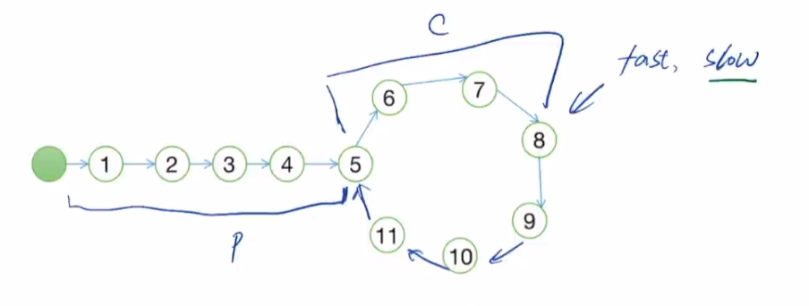

# Java版算法随笔


## ACM模式输入

### Scanner

用起来很简单，每次用`nextXxx()`获取一个想要的元素；

但是读取大量数据时速度很慢；

```java
import java.util.*; // Scanner所在的包

public class Main {
    public static void main(String[] args) {
        Scanner in = new Scanner(System.in);

        // 读数组
        int n = in.nextInt();
        int[] nums = new int[n];
        for (int i = 0; i < n; i++) {
            nums[i] = in.nextInt();
        }

        // 读字符串
        String s1 = in.next();
        // 读一行字符串
        String s2 = in.nextLine();
    }
}
```


### BufferedReader

需要抛出 `IOException` 异常；

- `readLine()`方法读取一行；
- `split("\\s+")`以一个或多个空白字符分割；
  - `\s`在正则表达式里表示空白字符：包括空格、制表符、换页符
  - `+`表示匹配一个或多个
  - 前面多一个`\`其实就是转义字符，为了Java能知道这是正则表达式，让字符串字面量真正包含一个 `\`
- `trim()`方法消除前后多余的空格；

```java
import java.io.*;

public class Main {
    public static void main(String[] args) throws IOException {
        BufferedReader br = new BufferedReader(new InputStreamReader(System.in));
        // 读数组
        int n = Integer.parseInt(br.readLine().trim());
        int[] nums = new int[n];
        String[] strings = br.readLine().trim().split("\\s+");
        for (int i = 0; i < n; i++) {
            nums[i] = Integer.parseInt(strings[i]);
        }
    }
}
```


## 字符串

### 最长回文字串

https://leetcode.cn/problems/longest-palindromic-substring/

题目：

​	给你一个字符串 `s`，找到 `s` 中最长的**回文子串**。

思路：

​	dp，复杂度O(n^2)，具体看注释；

​	马拉车算法Manacher，复杂度O(n)，太难了记不住，再见

```java
class Solution {
    public String longestPalindrome(String s) {
        // dp做法

        int n = s.length();
        char[] str = s.toCharArray();
        // dp[i][j]表示[i,j]范围内是否是回文字串，值是1/0
        int[][] dp = new int[n][n];
        // 存答案的左右遍历，闭区间，最后来substring
        int[] ansRange = new int[2];
        // 遍历长度
        for (int len = 1; len <= n; len++) {
            // 遍历左端点
            for (int l = 0; l <= n - len; l++) {
                // 右端点
                int r = l + len - 1;
                // 分类计算
                if (len == 1) {
                    dp[l][r] = 1;
                } else if (len == 2) {
                    dp[l][r] = str[l] == str[r] ? 1 : 0;
                } else {
                    if (str[l] == str[r]) {
                        dp[l][r] = dp[l + 1][r - 1];
                    }
                }
                // 更新答案
                if (dp[l][r] == 1 && len > ansRange[1] - ansRange[0] + 1) {
                    ansRange[0] = l;
                    ansRange[1] = r;
                }
            }
        }
        // 截取字符串
        return s.substring(ansRange[0], ansRange[1] + 1);
    }
}
```


### 重复的DNA序列（字符串哈希）

https://leetcode.cn/problems/repeated-dna-sequences/

记几个大质数：**`110503`, `9369319`**

题目：

​	**DNA序列** 由一系列核苷酸组成，缩写为 `'A'`, `'C'`, `'G'` 和 `'T'`.。

​	例如，`"ACGAATTCCG"` 是一个 **DNA序列** 。

​	在研究 **DNA** 时，识别 DNA 中的重复序列非常有用。

​	给定一个表示 **DNA序列** 的字符串 `s` ，返回所有在 DNA 分子中出现不止一次的 **长度为 `10`** 的序列(子字符串)。你可以按 **任意顺序** 返回答案。

思路：

​	直接用Map；字符串哈希

​	直接Map：复杂度主要是因为每次遍历都要`substring`，所以复杂度是**O(s.length() * 10)**

```java
// 直接用Map
class Solution {
    public List<String> findRepeatedDnaSequences(String s) {
        int len = 10;
        List<String> ans = new ArrayList<>();
        // Map<子串，子串出现的个数>
        Map<String, Integer> map = new HashMap<>();
        // 遍历子串
        for (int i = 0; i + len <= s.length(); i++) {
            String temp = s.substring(i, i + len);
            int count = map.getOrDefault(temp, 0);
            // 1的时候才add，如果>0就add会有重复
            if (count == 1){
                ans.add(temp);
            }
            map.put(temp, count + 1);
        }
        return ans;
    }
}
```

​	字符串哈希：为了能在**O(1)**时间获取一个字符串的信息（也就是其哈希后的结果），需要用到2个数组，一个是`power`，记录每一位的幂次，溢出没事，溢出相当于取模了；一个是`hash`，记录每一位的**哈希前缀和**；

​	可以这样理解：ATCG一共有4种字符（可以设为1234，或者直接按照ASCII码），按照**P进制**编码，例如8进制，对`"ACGAATTCCG"`就是，A * 8^0 + C * 8 ^ 1 + G ^ 8^2.....

​	然后前缀数组 + 幂数组，可以通过`hash[r] - hash[l - 1] * power[r - l + 1]`求出区间`[l, r]`子串的哈希；乘上power就是相当于补0

```java
// 字符串哈希
class Solution {
    public List<String> findRepeatedDnaSequences(String s) {
        int n = s.length();
        int LEN = 10;
        List<String> ans = new ArrayList<>();

        // 哈希数组hash和幂数组power
        long[] hash = new long[n + 1];
        long[] power = new long[n + 1];
        final int P = 110503;

        // 初始化hash和power，从1到n
        power[0] = 1;
        for (int i = 1; i <= n; i++) {
            hash[i] = hash[i - 1] * P + s.charAt(i - 1);
            power[i] = power[i - 1] * P;
        }

        // Map<哈希值，出现次数> 用字符串的哈希值代表字符串
        Map<Long, Integer> map = new HashMap<>();
        // 注意下标变成了[1, n]
        for (int l = 1; l + LEN - 1 <= n; l++) {
            int r = l + LEN - 1;
            // 计算字符串哈希
            long h = hash[r] - hash[l - 1] * power[r - l + 1];
            int count = map.getOrDefault(h, 0);
            if (count == 1) {
                ans.add(s.substring(l - 1, l - 1 + LEN));
            }
            map.put(h, count + 1);
        }

        return ans;
    }
}
```


### 最长重复子串

题目：

​	给你一个字符串 `s` ，考虑其所有 *重复子串* ：即 `s` 的（连续）子串，在 `s` 中出现 2 次或更多次。这些出现之间可能存在重叠。

​	返回 **任意一个** 可能具有最长长度的重复子串。如果 `s` 不含重复子串，那么答案为 `""` 。

思路：

​	二分长度，然后用字符串哈希判断固定长度的子串有没有重复，有则可以让长度变长，没有就变短；

```java
class Solution {
    private long[] hash;
    private long[] power;
    public String longestDupSubstring(String s) {
        // 二分 + 字符串哈希
        // 如果长度为l的字符串有重复了，可能有更长的，不需要查更短的

        int n = s.length();
        String ans = "";
        final long P = 110503;

        // 初始化hash和power
        hash = new long[n + 1];
        power = new long[n + 1];
        power[0] = 1;
        for (int i = 1; i <= n; i++) {
            hash[i] = hash[i - 1] * P + s.charAt(i - 1);
            power[i] = power[i - 1] * P;
        }

        // 二分长度
        int l = 0;
        int r = n;
        while (l <= r) {
            int mid = l + (r - l) / 2;
            String curString = check(s, mid);
            if (curString.isEmpty()) {
                r = mid - 1;
            } else {
                l = mid + 1;
            }
            ans = curString.length() > ans.length() ? curString : ans;
        }

        return ans;
    }

    // 检查字符串s的长度为len的子串，有重复则返回
    private String check(String s, int len) {
        Set<Long> set = new HashSet<>();
        for (int l = 1; l + len - 1 <= s.length(); l++) {
            int r = l + len - 1;
            long hashValue = hash[r] - hash[l - 1] * power[r - l + 1];
            if (set.contains(hashValue)) {
                return s.substring(l - 1, l - 1 + len);
            }
            set.add(hashValue);
        }
        return "";
    }
}
```


## 数学

### 快速幂

每次对`pow`折半，例如计算`quickPow(2, 10)`的过程如下：
$$
2^{10} = 4^5 = 4 ^ 4 \times 4 = 16 ^2 \times 4 = 256 \times 4 = 1024
$$

```java
// 基本写法
public long quickPow(long num, long pow) {
    long ans = 1;
    while (pow > 0) {
        // 奇数则需要额外乘一次
        if ((pow & 1) == 1) {
            ans *= num;
        }
        num *= num;
        pow >>= 1; // 也就是 pow /= 2;
    }
    return ans;
}

// 如果位数很大，需要取模，则在2个地方取模（注意这里不能用 *= ，必须乘完再取模，否则会溢出）
public long quickPow(long num, long pow, long mod) {
    long ans = 1;
    while (pow > 0) {
        // 奇数则需要额外乘一次
        if ((pow & 1) == 1) {
            ans = ans * num % mod;
        }
        num = num * num % mod;
        pow >>= 1; // 也就是 pow /= 2;
    }
    return ans;
}
```


## 位运算

### 只出现一次的数字

https://leetcode.cn/problems/single-number/

题目：

​	给你一个 **非空** 整数数组 `nums` ，除了某个元素只出现**一次**以外，其余每个元素均出现**两次**。找出那个只出现了一次的元素。

​	你必须设计并实现线性时间复杂度的算法来解决此问题，且该算法只使用常量额外空间。

思路：

​	题目要求时间 O(n), 空间 O(1)；

​	对于异或运算，有：2个相同的数`x`异或后为`0`，任意数`x`和`0`异或后为`x`；

```java
class Solution {
    public int singleNumber(int[] nums) {
     	int ans = 0;
        for (int num : nums) {
            ans ^= num;
        }
        return ans;
    }
}
```


### 或值至少为 K 的最短子数组 II

https://leetcode.cn/problems/shortest-subarray-with-or-at-least-k-ii/description/

<span id="bit-ques-1"></span>

题目：

​	给你一个 **非负** 整数数组 `nums` 和一个整数 `k` 。

​	如果一个数组中所有元素的按位或运算 `OR` 的值 **至少** 为 `k` ，那么我们称这个数组是 **特别的** 。

​	请你返回 `nums` 中 **最短特别非空** 子数组的长度，如果特别子数组不存在，那么返回 `-1` 。

解法：

​	所谓数组**按位或**，就是把数组每个元素都或起来：

```java
int ans = 0;
for (int i = 0; i < nums.length; i++) {
    ans |= nums[i];
}
```

​	根据**或**运算的性质可以知道，给定的元素 A 与任意元素 B 进行**或**运算的结果一定满足 **A∣B≥A**，由此可以知道对于任意子数组的长度**增加元素后**按位或运算的结果一定**大于等于增加前**的结果，满足**单调性**。

​	由于单调，当我们从长到短寻找子数组，发现一个子数组不满足条件时，其更短的子数组也不满足条件了，此时就不再缩短（即不再向右移动left），而直接向右移动right

​	其他的看注释；

​	包含了**滑动窗口**、**位运算**的知识；

```java
class Solution {
    // (看了题解)
    // 把按位或变成统计子数组中元素二进制每个位的1的个数，装入数组bits，如果为0，则or出来是0，否则为1；这样可以复用数据

    private int bitsLen = 30;
    private int[] bits = new int[bitsLen]; 

    public int minimumSubarrayLength(int[] nums, int k) {
        int n = nums.length;
        int res = Integer.MAX_VALUE;
        int left = 0;
        int right = 0;
        // 外层循环每次向右移动right指针
        for (; right < n; right++) { 
            // 移动right后将新元素添加进bits
            updateBits(nums[right], 1); 
            // 按位或结果不符合k 或 left要超过right就结束while
            while (left <= right && calc() >= k) {
                // 更新结果
                res = Math.min(res, right - left + 1);
                // 移动left前将原本的元素删去
                updateBits(nums[left], -1); 
                left++;
            }
        }
        return res == Integer.MAX_VALUE ? -1 : res;
    }

    // 处理bits数组，加(1)或减(-1)
    private void updateBits(int num, int op) {
        for (int i = 0; i < bitsLen; i++) {
            bits[i] += op * ((num >> i) & 1); 
            // (num >> i) & 1就是右移i位再and上000..0001，剩下最右边一位 → num的第i位为1则加1，为0则加0
        }
    }

    // 计算bits，即计算当前子数组按位或的结果
    private int calc() {
        int ans = 0;
        for (int i = 0; i < bitsLen; i++) {
            // 如果bits[i] > 0，则将ans的第i位置为1
            if (bits[i] > 0) {
                ans |= 1 << i;
            }
        }
        return ans;
    }
}
```


## 哈希

### 最长连续序列

https://leetcode.cn/problems/longest-consecutive-sequence/

题目：

​	给定一个未排序的整数数组 `nums` ，找出数字连续的最长序列（不要求序列元素在原数组中连续）的长度。

​	请你设计并实现时间复杂度为 `O(n)` 的算法解决此问题。

思路：

​	先将数组放入集合中，遍历集合，如果当前元素num是所在的连续序列的最小值，则查找num+1,num+2...是否在集合中，统计长度

```java
class Solution {
    public int longestConsecutive(int[] nums) {
        int ans = 0;
        // 将数组放入Set
        Set<Integer> set = new HashSet<>();
        for (int num : nums) {
            set.add(num);
        }
        for (int num : set) {
            // 如果num不是其所在序列中的最小值，则continue
            if (set.contains(num - 1)) {
                continue;
            }
            int cnt = 1;
            while (set.contains(num + cnt)) {
                cnt++;
            }
            ans = Math.max(ans, cnt);
        }
        return ans;
    }
}
```


### 缺失的第一个正数

https://leetcode.cn/problems/first-missing-positive/

题目：

​	给你一个未排序的整数数组 `nums` ，请你找出其中没有出现的最小的正整数。例如[3,4,-1,1]答案是2

​	请你实现时间复杂度为 `O(n)` 并且只使用常数级别额外空间的解决方案。

思路：

​	哈希，但是题目要求**只使用常数级别额外空间**，需要原地哈希，规定数值`val`需要在原始数组索引为`val - 1`的位置上，所以需要遍历和交换；处理完后再遍历一遍，哪个位置对不上，答案就是哪个；

​	另外，由于数组有`n`个数，根据题目可以知道答案的范围是`[1, n + 1]`

```java
class Solution {
    public int firstMissingPositive(int[] nums) {
        // 原地哈希
        int n = nums.length;
        // 数组只有n个数，那么答案一定是在[1, n + 1]的范围中
        for (int i = 0; i < n; i++) {
            // 通过交换，使得数值为val的数在nums[val - 1]的位置上
            // 由于有重复数字，需要判断当前的数nums[i]应该在的位置nums[nums[i] - 1]上的数是否正确
            // 如果是判断当前位置num[i]的数是否为i + 1，则会有无限循环的情况
            while (nums[i] > 0 && nums[i] <= n && nums[nums[i] - 1] != nums[i]) {
                swap(nums, nums[i] - 1, i);
            }
        }

        // 哪一位对不上就是答案
        for (int i = 0; i < n; i++) {
            if (nums[i] != i + 1) {
                return i + 1;
            }
        }
        // 全对上，则答案是n + 1
        return n + 1;
    }

    private void swap(int[] nums, int index1, int index2) {
        int temp = nums[index1];
        nums[index1] = nums[index2];
        nums[index2] = temp;
    }
}
```


## 组合数

### 组合

https://leetcode.cn/problems/uUsW3B/

题目：

​	给定两个整数 `n` 和 `k`，返回 `1 ... n` 中所有可能的 `k` 个数的组合。

```java
class Solution {
    private List<List<Integer>> resList = new ArrayList<>();

    public List<List<Integer>> combine(int n, int k) {
        List<Integer> curList = new ArrayList<>();
        dfs(curList, 1, n, k);
        return resList;
    }

    private void dfs(List<Integer> curList, int curNum, int n, int k) {
        if (curList.size() == k) {
            resList.add(new ArrayList<>(curList));
            return;
        }
        // 剪枝的点在curList.size() + n - curNum + 1 < k，剩余的长度加上当前长度 无法达到 长度k
        if (curNum > n || curList.size() + n - curNum + 1 < k) {
            return;
        }

        // 选择当前数
        curList.add(curNum);
        dfs(curList, curNum + 1, n, k);
        curList.remove(Integer.valueOf(curNum));
        // 不选择当前数
        dfs(curList, curNum + 1, n, k);
    }
}
```


## 双指针

### 删除有序数组中的重复项

https://leetcode.cn/problems/remove-duplicates-from-sorted-array/

题目：

​	给你一个 **非严格递增排列** 的数组 `nums` ，请你**[ 原地](http://baike.baidu.com/item/原地算法)** 删除重复出现的元素，使每个元素 **只出现一次** ，返回删除后数组的新长度。元素的 **相对顺序** 应该保持 **一致** 。然后返回 `nums` 中唯一元素的个数。

​	考虑 `nums` 的唯一元素的数量为 `k` ，你需要做以下事情确保你的题解可以被通过：

- 更改数组 `nums` ，使 `nums` 的前 `k` 个元素包含唯一元素，并按照它们最初在 `nums` 中出现的顺序排列。`nums` 的其余元素与 `nums` 的大小不重要。
- 返回 `k` 。

思路：

​	快慢指针（直接看题解里的演示动画）

```java
class Solution {
    public int removeDuplicates(int[] nums) {
        int n = nums.length;
        if (n == 1) {
            return 1;
        }
        int l = 1;
        int r = 1;
        while (r < n) {
            if (nums[l - 1] != nums[r]) {
                nums[l] = nums[r];
                l++;
            }
            r++;
        }
        return l;
    }
}
```


### 盛最多水的容器

https://leetcode.cn/problems/container-with-most-water/

题目：

​	给定一个长度为 `n` 的整数数组 `height` 。有 `n` 条垂线，第 `i` 条线的两个端点是 `(i, 0)` 和 `(i, height[i])` 。

​	找出其中的两条线，使得它们与 `x` 轴共同构成的容器可以容纳最多的水。

​	返回容器可以储存的最大水量。

​	**说明：**你不能倾斜容器。

思路：

​	2个指针从0和n-1开始往里缩小，每次只移动高度较低的那个


```java
class Solution {
    public int maxArea(int[] height) {
        int n = height.length;
        int res = 0;
        int l = 0;
        int r = n - 1;
        while (l < r) {
            res = Math.max(res, Math.min(height[l], height[r]) * (r - l));
            if (height[l] <= height[r]) {
                l++;
            } else {
                r--;
            }
        }
        return res;
    }
}
```


### 接雨水

https://leetcode.cn/problems/trapping-rain-water/

题目：

​	给定 `n` 个非负整数表示每个宽度为 `1` 的柱子的高度图，计算按此排列的柱子，下雨之后能接多少雨水。


思路：

​	前后缀解法/双指针解法，看注释

```java
class Solution {
    public int trap(int[] height) {
        // 前后缀写法
        // 统计前i项[0, i]和后j项[n - 1 - j, n - 1]的最大值
        int n = height.length;
        int[] preMax = new int[n];
        int[] sufMax = new int[n];
        preMax[0] = height[0];
        sufMax[n - 1] = height[n - 1];
        for (int i = 1; i < n; i++) {
            preMax[i] = Math.max(preMax[i - 1], height[i]);
            sufMax[n - 1 - i] = Math.max(sufMax[n - i], height[n - 1 - i]);
        }

        int ans = 0;
        for (int i = 1; i < n - 1; i++) {
            // 细分到每一根柱子，只关注每根柱子上面能接的雨水
            // 每一根柱子上能够接的雨水是min(左边的最大，右边的最大) - 柱子高度
            // ans += Math.max(0, Math.min(preMax[i - 1], sufMax[i + 1]) - height[i]);
            ans += Math.min(preMax[i], sufMax[i]) - height[i];
        }
        return ans;
    }
}
```

```java
class Solution {
    public int trap(int[] height) {
        // 双指针写法
        // 左右指针向中间移动，统计[0, l]和[r, n - 1]的高度最大值
        int n = height.length;
        int l = 0;
        int r = n - 1;
        int preMax = height[0];
        int sufMax = height[n - 1];
        int ans = 0;
        while (l <= r) {
            // 如果左边的最大高度已经小于等于右边了，那么左边这个柱子能接的水就确定了
            if (preMax <= sufMax) {
                preMax = Math.max(preMax, height[l]);
                ans += preMax - height[l];
                l++;
            } else {
                sufMax = Math.max(sufMax, height[r]);
                ans += sufMax - height[r];
                r--;
            }
        }
        return ans;
    }
}
```


## 二分

关于二分答案：如果题目要求「最大化最小值」或者「最小化最大值」，一般是二分答案


### 在排序数组中查找元素的第一个和最后一个位置

https://leetcode.cn/problems/find-first-and-last-position-of-element-in-sorted-array/

题目：

​	给你一个按照非递减顺序排列的整数数组 `nums`，和一个目标值 `target`。请你找出给定目标值在数组中的开始位置和结束位置。

​	如果数组中不存在目标值 `target`，返回 `[-1, -1]`。

​	你必须设计并实现时间复杂度为 `O(log n)` 的算法解决此问题。

思路：

​	经典二分，找到第一个>=target的数，以及第一个>=(target+1)的数的前一个

​	熟悉一下二分的基本写法，这里是闭区间，在写`if (nums[mid] < target)`的时候用例子思考一下，为了找到第一个大于等于的数，这里需要用<

```java
class Solution {
    public int[] searchRange(int[] nums, int target) {
        // 查找第一个>= target的数
        int start = binarySearch(nums, target);
        System.out.println(start);
        if (start >= nums.length || nums[start] != target) {
            return new int[]{-1, -1};
        }
        int end = binarySearch(nums, target + 1) - 1;
        return new int[]{start, end};
    }

    // 二分查找
    private int binarySearch(int[] nums, int target) {
        // 写个闭区间的
        int left = 0;
        int right = nums.length - 1;
        while (left <= right) {
            int mid = left + (right - left) / 2;
            if (nums[mid] < target) {
                left = mid + 1;
            } else {
                right = mid - 1;
            }
        }
        return left;
    }
}
```


### 袋子里最少数目的球

https://leetcode.cn/problems/minimum-limit-of-balls-in-a-bag/

题目：

​	给你一个整数数组 `nums` ，其中 `nums[i]` 表示第 `i` 个袋子里球的数目。同时给你一个整数 `maxOperations` 。

你可以进行如下操作至多 `maxOperations` 次：

​	选择任意一个袋子，并将袋子里的球分到 2 个新的袋子中，每个袋子里都有正整数个球。

​	比方说，一个袋子里有 `5` 个球，你可以把它们分到两个新袋子里，分别有 `1` 个和 `4` 个球，或者分别有 `2` 个和 `3` 个球。你的开销是单个袋子里球数目的 **最大值** ，你想要 **最小化** 开销。

​	请你返回进行上述操作后的最小开销。

示例：

```
输入：nums = [9], maxOperations = 2
输出：3
解释：
- 将装有 9 个球的袋子分成装有 6 个和 3 个球的袋子。[9] -> [6,3] 。
- 将装有 6 个球的袋子分成装有 3 个和 3 个球的袋子。[6,3] -> [3,3,3] 。
装有最多球的袋子里装有 3 个球，所以开销为 3 并返回 3 。
```

思路：

​	二分答案：假设最终每个袋子的球数都**至多**为 *m*，那么 *m* 越小，操作次数就越多；*m* 越大，操作次数就越少，有单调性，可以**二分答案**

​	具体思路写在注释里了

```java
class Solution {
    public int minimumSize(int[] nums, int maxOperations) {
        // 二分答案
        // 答案res的范围是[0, nums中的最大值]
        // 若已知res，则操作数为：使得nums中每个元素变成<=res 的操作数之和
        // 使得x变成res，至少需要：[x/res](向上取整) - 1 次分割
        //   也就是(x - 1) / res

        int left = 1; // 从1开始，不然后面可能有除0异常
        int right = Arrays.stream(nums).max().getAsInt();
        while (left <= right) {
            int mid = left + (right - left) / 2;
            // 检查中间点
            // 如果所需操作数小于等于maxOperations，则答案可以更小，选择左区间
            if (check(nums, maxOperations, mid)) {
                right = mid - 1;
            } else {
                left = mid + 1;
            }
        }
        return left;
    }

    // 检查在当前答案下所需的操作数，小于等于则返回true
    private boolean check(int[] nums, int maxOperations, int curRes) {
        int opCount = 0;
        for (int x :  nums) {
            opCount += (x - 1) / curRes;
        }
        return opCount <= maxOperations;
    }
}
```


### 寻找两个正序数组的中位数

https://leetcode.cn/problems/median-of-two-sorted-arrays/

给定两个大小分别为 `m` 和 `n` 的正序（从小到大）数组 `nums1` 和 `nums2`。请你找出并返回这两个正序数组的 **中位数** 。

算法的时间复杂度应该为 `O(log (m+n))` 。

```java
class Solution {
    public double findMedianSortedArrays(int[] nums1, int[] nums2) {
        // 按照官解的思路来做
        // 判断奇偶
        int n = nums1.length;
        int m = nums2.length;
        if ((n + m) % 2 == 0) {
            int mid1 = getKthElement(nums1, nums2, (n + m) / 2, n, m);
            int mid2 = getKthElement(nums1, nums2, (n + m) / 2 + 1, n, m);
            return (mid1 + mid2) / 2.0;
        } else {
            return (double)getKthElement(nums1, nums2, (n + m) / 2 + 1, n, m);
        }
    }

    // O(logn)找到2个数组合并后的第kth小的元素（第kth小是从1开始的）
    private int getKthElement(int[] nums1, int[] nums2, int kth, int n, int m) {
        int offset1 = 0;
        int offset2 = 0;
        // k表示当前还差k个到第kth小
        int k = kth;
        while (true) {
            // nums1到最后了，则选择nums2从offset2开始的第k小元素
            if (offset1 == n) {
                return nums2[offset2 + k - 1];
            }
            // nums2到最后了，则选择nums1从offset1开始的第k小元素
            if (offset2 == m) {
                return nums1[offset1 + k - 1];
            }
            // 还差1个到第kth小
            if (k == 1) {
                return Math.min(nums1[offset1], nums2[offset2]);
            }

            // 比较两个数组从offset开始的第 k / 2 - 1项的大小
            // 然后小的那一方排除，同时更新k
            int index1 = Math.min(nums1.length - 1, offset1 + k / 2 - 1);
            int index2 = Math.min(nums2.length - 1, offset2 + k / 2 - 1);
            if (nums1[index1] <= nums2[index2]) {
                k = k - (index1 - offset1 + 1); 
                offset1 = index1 + 1;
            } else {
                k = k - (index2 - offset2 + 1); 
                offset2 = index2 + 1;
            }
        }
    }
}
```


## 滑动窗口

滑动窗口模板（变长）：

```java
// 外层循环扩展右边界，内层循环扩展左边界
for (int l = 0, r = 0 ; r < n ; r++) {
	// 当前考虑的元素
	while (l <= r && check()) { // 区间[left,right]不符合题意
        // 扩展左边界
    }
    // 区间[left,right]符合题意，统计相关信息
}
```

笔记里位运算的例题也是一道滑动窗口[位运算例题1](#bit-ques-1)


### 无重复字符的最长子串

https://leetcode.cn/problems/longest-substring-without-repeating-characters/

题目：

​	给定一个字符串 `s` ，请你找出其中不含有重复字符的 **最长 子串** 的长度。

示例:

```
输入: s = "pwwkew"
输出: 3
解释: 因为无重复字符的最长子串是 "wke"，所以其长度为 3。
     请注意，你的答案必须是 子串 的长度，"pwke" 是一个子序列，不是子串。
```

思路：

​	滑动窗口 + 哈希表：哈希表用来存储当前子串的所有字符，用于判断字符是否重复；每次向右扩展右边界，判断s[r]是否存在于子串中，不存在则继续向右扩展，存在则缩短左边界，缩短至子串中不存在与s[r]相同的字符；每次循环更新res

```java
class Solution {
    public int lengthOfLongestSubstring(String s) {
        Set<Character> set = new HashSet<>();
        int res = 0;
        // 外层扩展右边界
        for (int l = 0, r = 0; r < s.length(); r++) {
            // 右边界遇到重复，则缩短左边界
            while (set.contains(s.charAt(r))) {
                set.remove(s.charAt(l));
                l++;
            }
            set.add(s.charAt(r));
            res = Math.max(res, r - l + 1);
        }
        return res;
    }
}
```


## LRU

### 面试题 16.25. LRU 缓存

https://leetcode.cn/problems/lru-cache-lcci/

题目：

​	设计和构建一个“最近最少使用”缓存，该缓存会删除最近最少使用的项目。缓存应该从键映射到值(允许你插入和检索特定键对应的值)，并在初始化时指定最大容量。当缓存被填满时，它应该删除最近最少使用的项目。

​	它应该支持以下操作： 获取数据 `get` 和 写入数据 `put` 。

​	获取数据 `get(key)` - 如果密钥 (key) 存在于缓存中，则获取密钥的值（总是正数），否则返回 -1。
​	写入数据 `put(key, value)` - 如果密钥不存在，则写入其数据值。当缓存容量达到上限时，它应该在写入新数据之前删除最近最少使用的数据值，从而为新的数据值留出空间。

思路：

​	主要的数据结构是链表和哈希表，将数据存在链表中，有O(1)复杂度的移动；用哈希表\<Integer, Node>使得有O(1)复杂度的查找

```java
class LRUCache {
    // 用哈希表做到O(1)查找，用双向链表做到O(1)操作的优先级队列
    // 对于Java自带的LinkedHashMap，可以直接重写removeEldestEntry方法来替换
    // 本题自己手搓

    class Node {
        int key;
        int value;
        Node prev;
        Node next;

        public Node() {
        }

        public Node(int key, int value) {
            this.key = key;
            this.value = value;
        }
    }

    // 哈希表<key, node>
    private Map<Integer, Node> cache;
    // 头尾结点
    private Node head;
    private Node tail;
    // 容量
    private int capacity;

    public LRUCache(int capacity) {
        this.capacity = capacity;
        head = new Node();
        tail = new Node();
        head.next = tail;
        tail.prev = head;
        cache = new HashMap<>();
    }

    public int get(int key) {
        Node node = cache.get(key);
        if (node != null) {
            moveToHead(node);
            return node.value;
        } else {
            return -1;
        }
    }

    public void put(int key, int value) {
        Node node = cache.get(key);
        if (node != null) { // node存在，则修改值
            node.value = value;
            moveToHead(node);
        } else { // node不存在
            Node newNode = new Node(key, value);
            addNodeToHead(newNode);
            cache.put(key, newNode);
            // 容量不足，发生替换
            if (cache.size() > capacity) {
                Node lastNode = tail.prev;
                cache.remove(lastNode.key);
                removeNode(lastNode);
            }
        }
    }

    // 链表相关操作
    // 删除结点
    private void removeNode(Node node) {
        node.prev.next = node.next;
        node.next.prev = node.prev;
    }
    // 添加新结点，到头部
    private void addNodeToHead(Node node) {
        node.prev = head;
        node.next = head.next;
        node.next.prev = node;
        head.next = node;
    }
    // 移动到头部
    private void moveToHead(Node node) {
        removeNode(node);
        addNodeToHead(node);
    }
}
```

直接使用库LinkedHashMap的写法：

```java
class LRUCache extends LinkedHashMap<Integer, Integer>{
    private int capacity;
    
    public LRUCache(int capacity) {
        super(capacity, 0.75F, true);
        this.capacity = capacity;
    }

    public int get(int key) {
        return super.getOrDefault(key, -1);
    }

    public void put(int key, int value) {
        super.put(key, value);
    }

    @Override
    protected boolean removeEldestEntry(Map.Entry<Integer, Integer> eldest) {
        return size() > capacity; 
    }
}
```


## 排序

### 快速排序模板

```java
/**
 * 参数说明：对数组arr的[lo,hi]闭区间做快速排序（升序）
 */

// do-while版本（Hoare分区法）：可能更好记一点
private void quickSort(int[] arr, int lo, int hi) {
    if (lo >= hi) {
        return;
    }
    // 基准
    int x = arr[lo];
    // 注意初始值
    int l = lo - 1;
    int r = hi + 1;
    while (l < r) {
        do { l++; } while (arr[l] < x);
        do { r--; } while (arr[r] > x);
        // 交换
        if (l < r) {
            int temp = arr[l];
            arr[l] = arr[r];
            arr[r] = temp;
        }
    }
    // 区间分界点是r
    quickSort(arr, lo, r); // 区间[lo, r]
    quickSort(arr, r + 1, hi); // 区间[r + 1, hi]
}

// 三路划分版本：适合重复元素多的场景
private void quickSort(int[] arr, int lo, int hi) {
    if (lo >= hi) {
        return;
    }
    int l = lo, i = lo, r = hi;
    int x = arr[lo];
    while (i <= r) {
        if (arr[i] < x) {
            swap(arr, l++, i++);
        } else if (arr[i] > x) {
            swap(arr, i, r--);
        } else {
            i++;
        }
    }
    quickSort(arr, lo, l - 1); // 小于基准的区间[lo, l - 1]
    quickSort(arr, r + 1, hi); // 大于基准的区间[r + 1, hi]
    // 等于基准的区间[l, r]
}
```


### 数组中第k大的元素

https://leetcode.cn/problems/kth-largest-element-in-an-array/

问题：

​	给定整数数组 `nums` 和整数 `k`，请返回数组中第 `**k**` 个最大的元素。

​	请注意，你需要找的是数组排序后的第 `k` 个最大的元素，而不是第 `k` 个不同的元素。

​	你必须设计并实现时间复杂度为 `O(n)` 的算法解决此问题。

思路：

​	快速排序或堆排序；

​	**快排：**降序排序，每次递归执行后有一个分界点的位置，如果分界点位置`r`就是第`r`大的数，所以如果`k <= r`，则递归左边，反之递归右边；

```java
class Solution {
    public int findKthLargest(int[] nums, int k) {
        return quickSort(nums, 0, nums.length - 1, k - 1);
    }

    // 降序
    private int quickSort(int[] nums, int lo, int hi, int k) {
        if (lo >= hi) {
            return nums[k];
        }
        int x = nums[lo];
        int l = lo - 1;
        int r = hi + 1;
        while (l < r) {
            do { l++; } while (nums[l] > x);
            do { r--; } while (nums[r] < x);
            if (l < r) {
                int temp = nums[l];
                nums[l] = nums[r];
                nums[r] = temp;
            }
        }
        // 区间分界点是r
        if (k <= r) {
            return quickSort(nums, lo, r, k);
        } else {
            return quickSort(nums, r + 1, hi, k);
        }
    }
}
```

​	**堆排**：将原始数组构造成大根堆，然后将对顶元素和最后一个元素交换，减小堆大小`heapSize--`，再调整堆，调整k次后就是了；其实就是原地堆排，但是只排一点；

```java
class Solution {
    public int findKthLargest(int[] nums, int k) {
        int heapSize = nums.length;
        // 建大根堆
        buildHeap(nums, heapSize);
        // 调整 k - 1 次
        for (int i = 0; i < k - 1; i++) {
            int temp = nums[0];
            nums[0] = nums[heapSize - 1];
            nums[heapSize - 1] = temp;

            heapSize--;

            heapify(nums, 0, heapSize);
        }

        return nums[0];
    }

    private void buildHeap(int[] nums, int heapSize) {
        for (int i = (heapSize - 1 - 1) / 2; i >= 0; i--) {
            heapify(nums, i, heapSize);
        }
    }

    private void heapify(int[] nums, int i, int heapSize) {
        int l = i * 2 + 1;
        int r = i * 2 + 2;
        int maxIndex = i;
        if (l < heapSize && nums[l] > nums[maxIndex]) {
            maxIndex = l;
        }
        if (r < heapSize && nums[r] > nums[maxIndex]) {
            maxIndex = r;
        }
        if (maxIndex != i) {
            int temp = nums[i];
            nums[i] = nums[maxIndex];
            nums[maxIndex] = temp;
            heapify(nums, maxIndex, heapSize);
        }
    }
}
```


### 字典序排数

https://leetcode.cn/problems/lexicographical-numbers/

题目：

​	给你一个整数 `n` ，按字典序返回范围 `[1, n]` 内所有整数。

思路：

​	主要是要充分理解字典序，核心就是`x*10 + i`

```java
class Solution {

    public List<Integer> ans = new ArrayList<>();

    public List<Integer> lexicalOrder(int n) {
        for (int i = 1; i <= 9; i++) {
            dfs(i, n);
        }
        return ans;
    }

    private void dfs(int cur, int n) {
        if (cur > n) {
            return;
        }
        ans.add(cur);
        for (int i = 0; i <= 9; i++) {
            dfs(cur * 10 + i, n);
        }
    }
}
```


## 跳表

https://leetcode.cn/problems/design-skiplist/

直接看题解


## 堆

优先队列

```java
// 默认小根堆
PriorityQueue<Integer> minHeap = new PriorityQueue<>();

// 大根堆
PriorityQueue<Integer> maxHeap = new PriorityQueue<>(Comparator.reverseOrder());
// 或
PriorityQueue<Integer> maxHeap = new PriorityQueue<>(
	(num1, num2) -> Integer.compare(num2, num1)	
);
```


### 堆模板

```java
public class TestJava {
    public static void main(String[] args) {
        // 堆的索引从0开始，节点i的左子节点是i * 2 + 1，右子节点是i * 2 + 2，父节点是(i - 1) / 2

        // 假设有数据nums
        int[] nums = new int[20];
        Random rd = new Random();
        for (int i = 0; i < 20; i++) {
            nums[i] = rd.nextInt(100);
        }

        // 调整nums为大根堆
        buildHeap(nums, nums.length);
        
        // 其他使用...
    }

    /**
     * 建堆，将nums数组调整成一个堆
     */
    private static void buildHeap(int[] nums, int heapSize) {
        // 从最后一个非叶子节点开始倒着建堆
        for (int i = (heapSize - 1 - 1) / 2; i >= 0; i--) {
            heapify(nums, i, heapSize);
        }
    }

    /**
     * 调整大根堆的节点i，即nums[i]
     */
    private static void heapify(int[] nums, int i, int heapSize) {
        // 左右子节点
        int l = i * 2 + 1;
        int r = i * 2 + 2;

        // 找到子节点最大值
        int maxNode = i;
        if (l < heapSize && nums[l] > nums[maxNode]) {
            maxNode = l;
        }
        if (r < heapSize && nums[r] > nums[maxNode]) {
            maxNode = r;
        }

        // 根最大不用调整，否则要调整
        if (maxNode != i) {
            int temp = nums[i];
            nums[i] = nums[maxNode];
            nums[maxNode] = temp;
            heapify(nums, maxNode ,heapSize);
        }
    }
}
```


### 前k个高频元素

https://leetcode.cn/problems/top-k-frequent-elements/

题目：

​	给你一个整数数组 `nums` 和一个整数 `k` ，请你返回其中出现频率前 `k` 高的元素。你可以按 **任意顺序** 返回答案。

示例：

```
输入: nums = [1,1,1,2,2,3], k = 2
输出: [1,2]
```

思路：

​	先用Map统计<元素，元素出现的个数>，然后建小根堆<int[元素，元素出现的个数]>，然后遍历Map，把Entry存入小根堆，如果小根堆未满，则直接放入，如果满了，则比较堆顶元素的出现个数，如果比当前Entry要少，则弹出堆顶后，Entry入堆，否则不做处理；

```java
class Solution {
    public int[] topKFrequent(int[] nums, int k) {
        // 先统计每个元素出现的次数
        Map<Integer, Integer> map = new HashMap<>();
        for (int num : nums) {
            map.put(num, map.getOrDefault(num, 0) + 1);
        }
        
        // 小根堆，存数组[num, num出现次数]
        PriorityQueue<int[]> pq = new PriorityQueue<>((a, b) -> a[1] - b[1]); 
        for (Map.Entry<Integer, Integer> entry : map.entrySet()) {
            int num = entry.getKey();
            int count = entry.getValue();
            if (pq.size() < k) {
                pq.offer(new int[]{num, count});
            } else {
                int[] top = pq.peek();
                if (count > top[1]) {
                    pq.poll();
                    pq.offer(new int[]{num, count});
                }
            }
        }

        int[] ans = new int[k];
        for (int i = 0; i < k; i++) {
            ans[i] = pq.poll()[0];
        }

        return ans;
    }
}
```


### 数组中第k大的元素

同**排序**专题里的[数组中第k大的元素](#数组中第k大的元素)


## 链表

### 排序链表

https://leetcode.cn/problems/sort-list/

题目：

​	给你链表的头结点 `head` ，请将其按 **升序** 排列并返回 **排序后的链表** 。

思路：

​	归并排序：递归传入的链表，拆分成2条后排序合并；

```java
class Solution {
    public ListNode sortList(ListNode head) {
        return mergeSort(head);
    }

    // 归并排序，返回排序好后的head
    private ListNode mergeSort(ListNode head) {
        // head只有1个结点或head为空，则返回
        if (head == null || head.next == null) {
            return head;
        }

        // 拆成2条链表
        ListNode head1 = cutMiddle(head);
        // 递归
        head = mergeSort(head);
        head1 = mergeSort(head1);

        // 合并
        return mergeLists(head, head1);
    }

    // 查找中间节点，并断开2条链表
    private ListNode cutMiddle(ListNode head) {
        // 快慢指针
        ListNode slow = head;
        ListNode fast = head;
        // 要断开，则需要记录最终中间节点的前一个结点
        ListNode preMid = head;
        while (fast != null && fast.next != null) {
            preMid = slow;
            slow = slow.next;
            fast = fast.next.next;
        }
        // 断开结点
        preMid.next = null;
        return slow;
    }

    // 有序合并2条链表
    private ListNode mergeLists(ListNode head1, ListNode head2) {
        // 双指针
        // dummy.next = 新链表的头节点
        ListNode dummy = new ListNode();
        ListNode cur = dummy;
        ListNode node1 = head1;
        ListNode node2 = head2;

        while (node1 != null && node2 != null) {
            if (node1.val < node2.val) {
                cur.next = node1;
                node1 = node1.next;
            } else {
                cur.next = node2;
                node2 = node2.next;
            }
            cur = cur.next;
        }
        // 剩下的部分
        if (node1 != null) {
            cur.next = node1;
        } else if (node2 != null) {
            cur.next = node2;
        }

        return dummy.next;
    }
}
```


### K 个一组翻转链表

https://leetcode.cn/problems/reverse-nodes-in-k-group/

题目：

​	给你链表的头节点 `head` ，每 `k` 个节点一组进行翻转，请你返回修改后的链表。

​	`k` 是一个正整数，它的值小于或等于链表的长度。如果节点总数不是 `k` 的整数倍，那么请将最后剩余的节点保持原有顺序。

​	你不能只是单纯的改变节点内部的值，而是需要实际进行节点交换。

**示例 1：**


```
输入：head = [1,2,3,4,5], k = 2
输出：[2,1,4,3,5]
```

思路：

​	递归函数接收当前头节点，返回反转后的头节点；

​	函数里，从头节点`node`开始遍历，遍历k个，将第k+1个节点作为`nextGroupHead`，用三指针反转前k个节点，原本的头结点就是反转后的尾结点，所以将`node.next = 递归`；

```java
class Solution {
    public ListNode reverseKGroup(ListNode head, int k) {
        return reverseList(head, k);
    }

    // 递归(当前区间的头节点，k)
    private ListNode reverseList(ListNode node, int k) {
        // 特判
        if (k == 1) {
            return node;
        }

        // 遍历一遍区间，判断长度?
        int cnt = 0;
        ListNode temp = node;
        ListNode nextGroupHead = null;
        while (temp != null) {
            cnt++;
            temp = temp.next;
            if (cnt >= k) {
                nextGroupHead = temp;
                break;
            }
        }
        if (cnt < k) {
            return node;
        }

        // 三指针反转区间
        ListNode node0 = node;
        ListNode node1 = node0.next;
        ListNode node2 = node1.next;
        while (node2 != nextGroupHead) {
            node1.next = node0;
            node0 = node1;
            node1 = node2;
            node2 = node2.next;
        }
        node1.next = node0;
        
        // 反转后的尾结点赋值next
        node.next = reverseList(nextGroupHead, k);
        // 返回反转后的头节点（反转前的最后一个结点）
        return node1;
    }
}
```


## 栈

### 最小栈

https://leetcode.cn/problems/min-stack/

题目：

​	设计一个支持 `push` ，`pop` ，`top` 操作，并能在常数时间内检索到最小元素的栈。

​	实现 `MinStack` 类:

- `MinStack()` 初始化堆栈对象。
- `void push(int val)` 将元素val推入堆栈。
- `void pop()` 删除堆栈顶部的元素。
- `int top()` 获取堆栈顶部的元素。
- `int getMin()` 获取堆栈中的最小元素。

思路：

​	每个栈元素是一个`int[2]`，保存当前元素的值 和 从栈底到当前元素的值中的最小值

​	tip：栈和队列用`ArrayDeque`比用`LinkedList`效率高

```java
class MinStack {
    // 保存值和前缀最小值
    private Deque<int[]> stack;

    public MinStack() {
        stack = new ArrayDeque<>();
    }
    
    public void push(int val) {
        int lastMin = stack.size() > 0 ? stack.peek()[1] : Integer.MAX_VALUE;
        stack.push(new int[]{val, Math.min(val, lastMin)});
    }
    
    public void pop() {
        stack.pop();
    }
    
    public int top() {
        return stack.peek()[0];
    }
    
    public int getMin() {
        return stack.peek()[1];
    }
}
```


### 柱状图中最大的矩形

https://leetcode.cn/problems/largest-rectangle-in-histogram/

题目：

​	给定 *n* 个非负整数，用来表示柱状图中各个柱子的高度。每个柱子彼此相邻，且宽度为 1 。

​	求在该柱状图中，能够勾勒出来的矩形的最大面积。


思路：

​	首先，**最大矩形的高度一定是heights中的元素**；对于`i`，求出`i`左边第一个小于`height[i]`的下标，记为`l[i]`，同理右边的第一个记为`r[i]`；

​	所以，以`heights[i]`为高的矩形的最大面积 = `height[i] * (r[i] - l[i] - 1)`；其中，**最大宽度**就是`l[i]`的下一个到`r[i]`的前一个，有可能左边/右边没有比`heights[i]`小的，所以**初始化`l[i] = -1`, `r[i] = n`**

​	最后遍历`i`更新答案即可

​	看了官解和灵神题解，都是用两次单调栈，一次正一次逆，分别计算`l`和`r`，我这里直接一次性计算了

```java
class Solution {
    public int largestRectangleArea(int[] heights) {
        // 最大矩形的高度一定是heights中的元素
        // 用单调栈求出：对于柱子h，左右两边第一个低于x的柱子的下标l和r
        // 答案就是：max(h * (r - l - 1))

        int n = heights.length;
        // 栈中存下标
        Deque<Integer> stack = new ArrayDeque<>();
        // indexs[i][0]就是l，index[i][1]就是r
        int[][] indexs = new int[n][2]; 
        // 初始化l为-1, r为n
        for (int i = 0; i < n; i++) {
            indexs[i][0] = -1;
            indexs[i][1] = n;
        }

        // 单调递增栈
        for (int i = 0; i < n; i++) {
            while (!stack.isEmpty() && heights[stack.peek()] > heights[i]) {
                int index = stack.pop();
                // 求r
                indexs[index][1] = i;
            }
            // 求l
            if (!stack.isEmpty()) {
                indexs[i][0] = stack.peek();
            }
            // 入栈
            stack.push(i);
        }

        for (int i = 0; i < n; i++) {
            System.out.println(i + ": " + indexs[i][0] + "," + indexs[i][1]);
        }


        // 计算答案
        int ans = 0;
        for (int i = 0; i < n; i++) {
            ans = Math.max(ans, heights[i] * (indexs[i][1] - indexs[i][0] - 1));
        }
        return ans;
    }
}
```


## 队列

### 滑动窗口的最大值

https://leetcode.cn/problems/sliding-window-maximum/

题目：

​	给你一个整数数组 `nums`，有一个大小为 `k` 的滑动窗口从数组的最左侧移动到数组的最右侧。你只可以看到在滑动窗口内的 `k` 个数字。滑动窗口每次只向右移动一位。

​	返回 *滑动窗口中的最大值* 。

示例：

```
输入：nums = [1,3,-1,-3,5,3,6,7], k = 3
输出：[3,3,5,5,6,7]
解释：
滑动窗口的位置                最大值
---------------               -----
[1  3  -1] -3  5  3  6  7       3
 1 [3  -1  -3] 5  3  6  7       3
 1  3 [-1  -3  5] 3  6  7       5
 1  3  -1 [-3  5  3] 6  7       5
 1  3  -1  -3 [5  3  6] 7       6
 1  3  -1  -3  5 [3  6  7]      7
```

思路：

​	用优先队列PriorityQueue是O(nlogn)，用双端队列是O(n)

​	从左往右遍历，通过操作，保证队列是单调递减：对于值x，比队尾小则直接添加进来 / 弹出队尾比x大的数后再添加进来；

​	意思就是：随着往右遍历，当前窗口内最大值前面的数不可能成为最大值，而最大值后面的数有可能成为最大值；同时需要及时弹出已经离开窗口范围的值

```java
class Solution {
    public int[] maxSlidingWindow(int[] nums, int k) {
        int n = nums.length;
        int[] ans = new int[n - k + 1];
        // 双端队列：可以从左右两侧操作
        // 队列存的是下标
        // 队列中的元素是单调递减的，队首一定是最大值
        Deque<Integer> q = new ArrayDeque<>();
        // 遍历nums
        for (int i = 0; i < n; i++) {
            // 入队列：
            // 手动保证单调：如果nums[i]小于队尾，则直接入；如果大于，则弹出队尾所有比nums[i]小的数
            while (!q.isEmpty() && nums[q.getLast()] <= nums[i]) {
                q.removeLast();
            }
            q.addLast(i);
            // 出队列：
            // 队列里记录的是下标，那么可以计算其队首元素是否在滑动窗口内，不在则弹出
            if (i - q.getFirst() >= k) {
                q.removeFirst();
            }
            // 记录答案
            if (i >= k - 1) {
                ans[i - k + 1] = nums[q.getFirst()];
            }
        }
        return ans;
    }
}
```


## 树

### 将有序数组转换为二叉搜索树

https://leetcode.cn/problems/convert-sorted-array-to-binary-search-tree/

题目：

​	给你一个整数数组 `nums` ，其中元素已经按 **升序** 排列，请你将其转换为一棵 平衡 二叉搜索树。

思路：

​	二分

```java
class Solution {
    public TreeNode sortedArrayToBST(int[] nums) {
        // 数组是有序的，直接用类似二分的方法做
        return change(nums, 0, nums.length - 1);
    }

    // 将一定区间内的元素转为平衡二叉搜索树
    private TreeNode change(int[] nums, int left, int right) {
        if (left > right) {
            return null;
        }
        // 取中点
        int mid = left + (right - left) / 2;
        TreeNode midNode = new TreeNode(nums[mid]);
        // 递归创建左右子树
        midNode.left = change(nums, left, mid - 1);
        midNode.right = change(nums, mid + 1, right);
        return midNode;
    }
}
```


### 验证二叉搜索树

https://leetcode.cn/problems/validate-binary-search-tree/

给你一个二叉树的根节点 `root` ，判断其是否是一个有效的二叉搜索树。

**有效** 二叉搜索树定义如下：

- 节点的左子树只包含 **小于** 当前节点的数。
- 节点的右子树只包含 **大于** 当前节点的数。
- 所有左子树和右子树自身必须也是二叉搜索树。

前序遍历做法：

```java
class Solution {
    public boolean isValidBST(TreeNode root) {
        // 节点值最大最小可以取到int的最值，所以要用long
        return dfs(root, Long.MIN_VALUE, Long.MAX_VALUE);
    }

    // 前序遍历来做，参数是：当前节点，当前节点的左右范围
    private boolean dfs(TreeNode node, long l, long r) {
        if (node == null) {
            return true;
        }
        // 返回当前节点是否在范围内，以及左右子树是否在范围内
        return node.val > l && node.val < r 
                && dfs(node.left, l, node.val)
                && dfs(node.right, node.val, r); 
    }
}
```

中序遍历做法：

```java
class Solution {
    private long pre = Long.MIN_VALUE;

    public boolean isValidBST(TreeNode root) {
        return dfs(root);
    }

    // 中序遍历，从左到右遍历
    public boolean dfs(TreeNode node) {
        if (node == null) {
            return true;
        }
        // 左子树
        if (!dfs(node.left)) {
            return false;
        }
        // 节点
        if (node.val <= pre) {
            return false;
        }
        pre = node.val;
        // 右子树
        return dfs(node.right);
    }
}
```

 

### 二叉搜索树中第 K 小的元素

https://leetcode.cn/problems/kth-smallest-element-in-a-bst/

题目：

​	给定一个二叉搜索树的根节点 `root` ，和一个整数 `k` ，请你设计一个算法查找其中第 `k` 小的元素（从 1 开始计数）

思路：

​	用[验证二叉搜索树](#验证二叉搜索树)的中序遍历方法，实际上就是从左到右遍历，遍历到第k个就是题目要的答案了

```java
class Solution {
    // m表示还差多少个找到第k小
    private int m;

    public int kthSmallest(TreeNode root, int k) {
        m = k;
        return dfs(root);
    }

    // 中序遍历，-1表示没找到，m==0的时候说明当前是第k个
    private int dfs(TreeNode node) {
        if (node == null) {
            return -1;
        }
        // 左子树
        int leftRes = dfs(node.left);
        if (leftRes != -1) {
            return leftRes;
        }
        // 节点
        m--;
        if (m == 0) {
            return node.val;
        }
        // 右子树
        return dfs(node.right);
    }
}
```


### 从前序与中序遍历序列构造二叉树

https://leetcode.cn/problems/construct-binary-tree-from-preorder-and-inorder-traversal/

给定两个整数数组 `preorder` 和 `inorder` ，其中 `preorder` 是二叉树的**先序遍历**， `inorder` 是同一棵树的**中序遍历**，请构造二叉树并返回其根节点。

```java
class Solution {
    public TreeNode buildTree(int[] preorder, int[] inorder) {
        // 看了灵神的题解
        return build(preorder, inorder);
    }

    // 递归，每次用Arrays.copyOfRange（左闭右开）截取数组
    private TreeNode build(int[] preorder, int[] inorder) {
        int n = preorder.length;
        if (n == 0) {
            return null;
        }
        // 找到当前根节点
        int root = preorder[0];
        // 在中序遍历中查找根节点的位置（左子树的大小）
        int leftSize = 0;
        for (int i = 0; i < n; i++) {
            if (inorder[i] == root) {
                leftSize = i;
                break;
            }
        }
        // 截取数组，截取出左子树部分和右子树部分
        int[] preorderLeft = Arrays.copyOfRange(preorder, 1, leftSize + 1);
        int[] preorderRight = Arrays.copyOfRange(preorder, leftSize + 1, n);
        int[] inorderLeft = Arrays.copyOfRange(inorder, 0, leftSize);
        int[] inorderRight = Arrays.copyOfRange(inorder, leftSize + 1, n);
        // 递归构造左右子树
        TreeNode left = build(preorderLeft, inorderLeft);
        TreeNode right = build(preorderRight, inorderRight);
        return new TreeNode(root, left, right);
    }
}
```


### 实现 Trie (字典树/前缀树)

https://leetcode.cn/problems/implement-trie-prefix-tree/

题目：

​	**[Trie](https://baike.baidu.com/item/字典树/9825209?fr=aladdin)**（发音类似 "try"）或者说 **前缀树（字典树）** 是一种树形数据结构，用于高效地存储和检索字符串数据集中的键。这一数据结构有相当多的应用情景，例如自动补全和拼写检查。

请你实现 Trie 类：

- `Trie()` 初始化前缀树对象。
- `void insert(String word)` 向前缀树中插入字符串 `word` 。
- `boolean search(String word)` 如果字符串 `word` 在前缀树中，返回 `true`（即，在检索之前已经插入）；否则，返回 `false` 。
- `boolean startsWith(String prefix)` 如果之前已经插入的字符串 `word` 的前缀之一为 `prefix` ，返回 `true` ；否则，返回 `false` 。

思路：

​	假设字符串里面只有 a 和 b 两种字符。

- **insert：**例如插入字符串 aab，相当于生成了一条移动方向为「左-左-右」的路径。标记最后一个节点为终止节点。再插入字符串 aabb，相当于生成了一条移动方向为「左-左-右-右」的路径。标记最后一个节点为终止节点。
- **search：**例如查找字符串 aab，相当于查找二叉树中是否存在一条移动方向为「左-左-右」的路径，且最后一个节点是终止节点。
- **startsWith：**例如查找前缀 aa，相当于查找二叉树中是否存在一条移动方向为「左-左」的路径，无其他要求。

​	推广到 26 种字母，其实就是一棵 26 叉树，对于 26 叉树的每个节点，可以用哈希表，或者长为 26 的数组来存储子节点。

​	从根节点出发，它的第一个孩子就是第一个字母，以此类推，**不需要在任何节点存储信息**，只要**存在**这个节点，就表示有这个字母

```java
class Trie {
    // 节点，有26叉
    class Node {
        public Node[] sons = new Node[26];
        public boolean isEnd;
    }

    // 根节点
    private Node root;

    public Trie() {
        // 根节点不表示信息
        root = new Node();
    }
    
    public void insert(String word) {
        Node node = root;
        for (char ch : word.toCharArray()) {
            int index = ch - 'a';
            // 如果不存在则新增节点
            if (node.sons[index] == null) {
                node.sons[index] = new Node();
            }
            node = node.sons[index];
            // 不用置为false，因为原本有的true就表示从root到这里是一个单词
            // node.isEnd = false;
        }
        node.isEnd = true;
    }
    
    public boolean search(String word) {
        Node node = find(word);
        // 查到的最后一个字母是end才为true
        if (node != null && node.isEnd) {
            return true;
        }
        return false;
    }
    
    public boolean startsWith(String prefix) {
        Node node = find(prefix);
        // 查找到了就为true
        if (node != null) {
            return true;
        }
        return false;
    }

    // 返回最后一个字母的Node，找不到则返回null
    public Node find(String str) {
        Node node = root;
        for (char ch : str.toCharArray()) {
            int index = ch - 'a';
            if (node.sons[index] == null) {
                return null;
            }
            node = node.sons[index];
        }
        return node;
    }
}
```


## 图

### 网络延迟时间（Dijkstra）

https://leetcode.cn/problems/network-delay-time/

题目：

​	有 `n` 个网络节点，标记为 `1` 到 `n`。

​	给你一个列表 `times`，表示信号经过 **有向** 边的传递时间。 `times[i] = (ui, vi, wi)`，其中 `ui` 是源节点，`vi` 是目标节点， `wi` 是一个信号从源节点传递到目标节点的时间。

​	现在，从某个节点 `K` 发出一个信号。需要多久才能使所有节点都收到信号？如果不能使所有节点收到信号，返回 `-1` 。

示例 ：


```
输入：times = [[2,1,1],[2,3,1],[3,4,1]], n = 4, k = 2
输出：2
```

思路：

​	获取从节点k出发，到所有节点的最短距离dist数组，答案就是dist中的最大值

​	**Dijkstra算法**：邻接矩阵 → dist数组 → dist[起点] = 0 → 遍历n次 → 找到未被访问的，dist中的最小点 → 找不到则跳过，找到则标记已被访问 → 更新dist，从当前最小值的点出发，更新其能经过的点

```java
class Solution {
    public int networkDelayTime(int[][] times, int n, int k) {
        // 无限远Integer.MAX_VALUE / 2 防止加法溢出
        final int inf = Integer.MAX_VALUE / 2;

        // 需要邻接矩阵
        int[][] neighbors = new int[n][n];
        // 初始化为无限远
        for (int[] neighbor : neighbors) {
            Arrays.fill(neighbor, inf);
        }
        // 初始化邻接矩阵
        for (int[] time : times) {
            // 下标改成从0开始
            neighbors[time[0] - 1][time[1] - 1] = time[2];
        }

        // dist[i]表示从节点k到节点i的距离（下标从0开始） 初始化为无限远
        int[] dist = new int[n];
        Arrays.fill(dist, inf);
        dist[k - 1] = 0;
        // 访问数组
        boolean[] visited = new boolean[n];
        // 遍历所有节点
        for (int i = 0; i < n; i++) {
            // 找到未被访问的，dist中的最小点
            int minVal = inf;
            int minNode = -1;
            for (int j = 0; j < n; j++) {
                if (!visited[j] && dist[j] < minVal) {
                    minVal = dist[j];
                    minNode = j;
                }
            }
            // 找不到则跳过，找到则标记
            if (minNode == -1) {
                continue;
            } else {
                visited[minNode] = true;
            }
            // 更新dist，从当前最小值的点出发，更新其能经过的点
            for (int j = 0; j < n; j++) {
                dist[j] = Math.min(dist[j], dist[minNode] + neighbors[minNode][j]);
            }
        }

        // 查找dist中的最大值（最远距离）
        int ans = -1;
        for (int i = 0; i < n; i++) {
            if (dist[i] > ans) {
                ans = dist[i];
            }
        }
        return ans == inf ? -1 : ans;
    }
}
```


### 课程表（判断环）

https://leetcode.cn/problems/course-schedule/

题目：

​	你这个学期必须选修 `numCourses` 门课程，记为 `0` 到 `numCourses - 1` 。

​	在选修某些课程之前需要一些先修课程。 先修课程按数组 `prerequisites` 给出，其中 `prerequisites[i] = [ai, bi]` ，表示如果要学习课程 `ai` 则 **必须** 先学习课程 `bi` 。

​	例如，先修课程对 `[0, 1]` 表示：想要学习课程 `0` ，你需要先完成课程 `1` 。

​	请你判断是否可能完成所有课程的学习？如果可以，返回 `true` ；否则，返回 `false` 。

思路：

​	本质上就是判断有向图中是否有环。使用**三色标记法**：未访问：0；正在访问：1；访问完毕：2，dfs过程中遇到`正在访问`就说明有环.

​	实际上双色标记就可以判断是否有环了，dfs的最后改为`visited[curNode] = 0`理论上也可以，只不过这样就会重复遍历，导致超时

```java
class Solution {
    public boolean canFinish(int numCourses, int[][] prerequisites) {
        // 判断有向图中是否有环
        // 邻接表
        List<Integer>[] neighbors = new ArrayList[numCourses];
        Arrays.setAll(neighbors, i -> new ArrayList<>());
        for (int[] pre : prerequisites) {
            neighbors[pre[1]].add(pre[0]);
        }
        // 未访问：0；正在访问：1；访问完毕：2
        int[] visited = new int[numCourses];

        for (int i = 0; i < numCourses; i++) {
            if (visited[i] == 0 && dfs(visited, i, neighbors)) {
                return false;
            }
        }
        return true;
    }

    // 返回是否存在环
    private boolean dfs(int[] visited, int curNode, List<Integer>[] neighbors) {
        // 标记curNode正在被访问
        visited[curNode] = 1;
        // 检查curNode的邻居
        for (int neighbor : neighbors[curNode]) {
            if (visited[neighbor] == 1
                    || visited[neighbor] == 0 && dfs(visited, neighbor, neighbors)) {
                return true;
            }
        }
        visited[curNode] = 2;
        return false;
    }
}
```


### 寻找重复数（找到环的入口）

https://leetcode.cn/problems/find-the-duplicate-number/

题目：

​	给定一个包含 `n + 1` 个整数的数组 `nums` ，其数字都在 `[1, n]` 范围内（包括 `1` 和 `n`），可知至少存在一个重复的整数。

​	假设 `nums` 只有 **一个重复的整数** ，返回 **这个重复的数** 。

​	你设计的解决方案必须 **不修改** 数组 `nums` 且只用常量级 `O(1)` 的额外空间。

思路：

​	为了在规定的复杂度内求解，需要将输入的数据当成一个图，数组`nums[i] = num`可以当作是：`结点i -> 结点num`，也就是说，1个结点指向另1个结点，不过1个结点可能被多个结点指向（实际上只有1个结点会被2个结点指向，其余的结点都只会被一个结点指向）

​	所以需要找到那个被2个结点指向的结点，展开成图可以发现，其实就是要找到环的入口；

​	按照题目，对于结点0，没有任何结点指向它，所以从0索引开始，定义**快慢指针**，分别是`slow`和`fast`，`slow`每次走1步，`fast`每次走2步；

​	按照题目，一定存在如下图这样的结构，一定有环，所以在遍历的过程中`slow`和`fast`一定会**在环中相遇**，接下来就是怎么找到环的入口的问题了；

​	设从结点0到入口经过的长度（边数）是`p`，从入口到相遇点经过的长度是`c`，设环的长度是`L`，则在它们相遇时，一共走了`n`步，有：

- 对于`slow`，走过的距离`n = p + c`
- 对于`fast`，走过的距离`2n = p + c + k*L`，多走了`k`圈
- 可得`n = p + c = k*L`

​	现在，让`slow`重新从结点0出发，这时`slow`和`fast`都每次只前进1步；这样，它们**一定能够再次在原本的相遇点相遇**；（这样理解：`slow`走了`p + c`的距离到达了相遇点，`fast`刚好完整绕了`k`圈也到达了相遇点）

​	重点来了：由于二者步调相同，也就是说，在环的入口开始，它们其实就已经相遇了；所以第二次遍历的时候，第一次相遇的位置就是环的入口；



​	另外，题目的图有可能不止一个环，但是这种情况的话这个图一定就不是连通图了，而由于结点0没有结点指向，它又一定指向某个结点，所以答案那个环一定跟结点0在同一个连通分量中；

```java
class Solution {
    public int findDuplicate(int[] nums) {
        // 要求：时间O(n)，空间O(1)，不修改数组元素

        // 可以当成一个图，查找图中是否有环
        // 数组nums[i] = num可以当作是：结点i -> 结点num
        int slow = 0;
        int fast = 0;
        while (true) {
            slow = nums[slow];
            fast = nums[nums[fast]];
            if (slow == fast) {
                // 相遇，但是相遇点不一定是答案，要找到环的入口
                break;
            }
        }

        // System.out.println("相遇位置：" + fast);

        // 找到环的入口
        slow = 0;
        while (slow != fast) {
            slow = nums[slow];
            fast = nums[fast];
        }
        return slow;
    }
}
```


### 并查集模板

```java
class UnionFind {

    // roots[i]表示节点i的最根的根
    private int[] roots;

    public UnionFind(int n) {
        roots = new int[n];
        // 每个节点的根初始化为自己
        for (int i = 0; i < n; i++) {
            roots[i] = i;
        }
    }

    public int find(int i) {
        if (roots[i] == i) {
            return i;
        }
        // 路径压缩，将每个节点的根节点置为其当前根节点的根节点
        roots[i] = find(roots[i]);
        return roots[i];
    }

    public boolean isConnected(int p, int q) {
        return find(p) == find(q);
    }

    public void union(int p, int q) {
        int findP = find(p);
        int findQ = find(q);
        if (findP != findQ) {
            // 将p的根节点的根节点 变为 q的根节点
            roots[findP] = findQ;
        }
    }
}
```


### 判断二分图

https://leetcode.cn/problems/is-graph-bipartite/

题目：

​	存在一个 **无向图** ，图中有 `n` 个节点。其中每个节点都有一个介于 `0` 到 `n - 1` 之间的唯一编号。给你一个二维数组 `graph` ，其中 `graph[u]` 是一个节点数组，由节点 `u` 的邻接节点组成。形式上，对于 `graph[u]` 中的每个 `v` ，都存在一条位于节点 `u` 和节点 `v` 之间的无向边。该无向图同时具有以下属性：

- 不存在自环（`graph[u]` 不包含 `u`）。
- 不存在平行边（`graph[u]` 不包含重复值）。
- 如果 `v` 在 `graph[u]` 内，那么 `u` 也应该在 `graph[v]` 内（该图是无向图）
- 这个图可能不是连通图，也就是说两个节点 `u` 和 `v` 之间可能不存在一条连通彼此的路径。

​	**二分图** 定义：如果能将一个图的节点集合分割成两个独立的子集 `A` 和 `B` ，并使图中的每一条边的两个节点一个来自 `A` 集合，一个来自 `B` 集合，就将这个图称为 **二分图** 。

​	如果图是二分图，返回 `true` ；否则，返回 `false` 。

​	**注意：非连通图也可以是二分图**

思路：

​	dfs：从每个节点出发一次，染色，然后其相邻节点染成另一种颜色，然后继续dfs其相邻节点...

​	并查集：每个节点的所有邻接点应该都在同一个集合中，遍历每个几点，若邻接点和当前节点在一个集合中，则false；不在则合并当前节点的邻接点（这里并查集就不写了，跟[模板](#并查集模板)一样）

```java
class Solution {
    public boolean isBipartite(int[][] graph) {
        // dfs做法
        int n = graph.length;
        // 给节点染色，未染色：0；染色：1或-1
        int[] colors = new int[n];
        // 从节点0开始遍历
        for (int i = 0; i < n; i++) {
            if (colors[i] == 0 && !dfs(graph, colors, i, 1)) {
                return false;
            }
        }
        return true;
    }

    // node被染色完后才会进来dfs
    // color：node本来需要染的颜色
    private boolean dfs(int[][] graph, int[] colors, int node, int color) {
        // 如果node的颜色和要染的颜色不同
        if (colors[node] == -color) {
            return false;
        }
        // 如果已经染色了
        if (colors[node] == color) {
            return true;
        }
        // 染色
        colors[node] = color;
        // 遍历node的邻居
        for (int neighbor : graph[node]) {
            if (!dfs(graph, colors, neighbor, -color)) {
                return false;
            }
        }
        return true;
    }
}
```

```java
class Solution {
    public boolean isBipartite(int[][] graph) {
        // 并查集做法
        int n = graph.length;
        UnionFind unionFind = new UnionFind(n);
        // 遍历每个节点的邻居
        for (int i = 0; i < n; i++) {
            int[] neighbors = graph[i];
            for (int neighbor : neighbors) {
                // 如果邻居和自己在同一个集合，则false
                if (unionFind.isConnected(i, neighbor)) {
                    return false;
                }
                // 把邻居们加入同一个集合
                unionFind.union(neighbors[0], neighbor);
            }
        }
        return true;
    }
}
```


## 特殊算法

### 多数元素

https://leetcode.cn/problems/majority-element/

题目：

​	给定一个大小为 `n` 的数组 `nums` ，返回其中的多数元素。多数元素是指在数组中出现次数 **大于** `⌊ n/2 ⌋` 的元素。

​	你可以假设数组是非空的，并且给定的数组总是存在多数元素。

思路：

​	用投票算法：在线性时间内找到数量大于[n/2]的元素；

​	过程如下：①初始化数量`count`和侯选数`candidate`；②遍历数组，假设当前为`num`，如果此时`count`为0，则赋值`candidate = num`，然后，如果`num == candidate`，则`count++`，如果`num != candidate`，则`count--`；

​	可以这样理解，`count`是统计某个数`x`出现的数量，如果`x`就是答案，那么遍历到最后，`count`一定大于0；如果`x`不是答案，那当遍历超过一定次数后，`count`必然会重新减为`0`；

```java
class Solution {
    public int majorityElement(int[] nums) {
        // 投票算法：时间复杂度为 O(n), 空间复杂度为 O(1) 
        
        // 表示数量
        int count = 0;
        // 候选数(初始化时任取)
        int candidate = 0;

        for (int num : nums) {
            if (count == 0) {
                candidate = num;
            }
            if (candidate == num) {
                count++;
            } else {
                count--;
            }
        }
        
        return candidate;
    }
}
```

